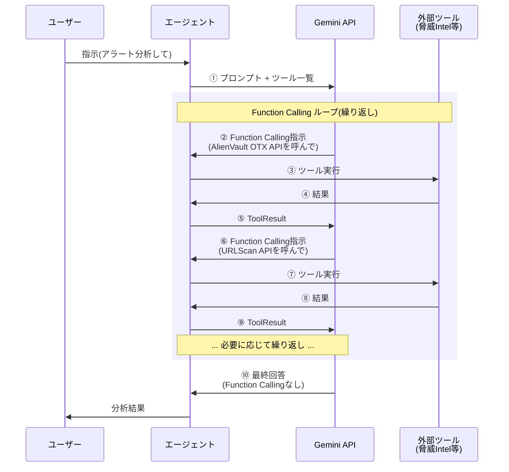

この記事はアドベントカレンダー「[Goで作るセキュリティ分析LLMエージェント](https://adventar.org/calendars/11354)」の8日目です。今回はLLMエージェントがもつ重要な機能の1つである、外部ツール連携についての基礎を説明します。今回のコードは https://github.com/m-mizutani/leveret の [day08-function-calling](https://github.com/m-mizutani/leveret/tree/day08-function-calling) ブランチに格納されていますので適宜参照してください。

# Function Callingとは

Function Callingは、LLMの応答時に「外部ツール呼び出し」という特殊な応答を返す仕組みです。OpenAIやGoogleではFunction Callingという名称を使っていますが、他のプロバイダではTool UseやTool Callingなどと呼ばれることもあります。いずれも外部ツールの呼び出しを明確に制御するための技術という点では共通しています。

外部ツール呼び出しとは、LLMに対して何らかの機能を提供することを指します。プログラミングの視点で考えると、LLMに関数を提供するのと同じです。これにより生成AIの機能を拡張できます。

提供する関数の内容には特に制限はありません。ランタイムの内部で完結するタイプとしては、複雑な数値計算やランタイム内にもつデータの読み書きなどが挙げられます。一方、ランタイム外部にアクセスするタイプとしては、外部データベースの参照や変更、外部サービス(SaaS)の利用などがあります。

Function Callingの基本的な動作フローは次のようになります。まず `GenerateContent` を呼び出すと、通常のテキスト応答ではなく、Function Callingという特殊な応答が返ってくることがあります(Gemini APIの場合は `Parts` の中に格納されます)。この応答を受け取ったら、指定された外部ツールを実際に呼び出し、その結果を再び `GenerateContent` の入力として渡します。多くの場合、Function Callingの指示が無くなるまでこの処理を繰り返し、最終的にテキストなどの通常の応答をユーザーに返します。このフローには様々な発展形がありますが、本日は最もシンプルな構成を扱います。

3日目で示したFunction Callingのフロー図を改めて示します。



## なぜFunction Callingが必要か

Function Callingが必要となる理由は大きく分けて3つあります。ただし、これらの理由があるからといってFunction Callingに頼りすぎるのは良くありません。LLM呼び出しのワークフロー(コード内)で外部サービスと連携した方が適切なユースケースも多く存在します。Function Callingは強力な機能ですが、コードによるワークフロー制御との使い分けをケースバイケースで判断する必要があります。

### (1) 必要に応じたデータの読込

1つ目の理由は、生成AIの処理において事前にどのようなデータが必要かわからない場合です。コンテキストウィンドウの都合で全てのデータを事前に与えておくわけにはいきません。ユーザーの指示などに応じて必要なデータを選択する必要があります。ツールを使うことで選択的にコンテキストへデータを挿入できます。また、データの取り出しに制限がある場合も該当します。コンテキストウィンドウに収まるとしても、データ呼び出しにコストがかかるなどの理由で全部取得できない場合があります。例えば外部サービスのAPI呼び出しにrate limitがかかっている場合や、取得回数に応じて課金が発生する仕組みなどです。必要最低限のデータ読込をするためにLLMに判断させることができます。

### (2) 複雑・特殊な処理が必要な場合

生成AIはどのような処理でもできそうに見えますが、2025年現在では苦手な処理も多く存在します。例えば正確な数式処理、数値計算、統計処理などです。また特殊なアルゴリズムに基づく処理(クラスタリング、最適化問題など)や大容量データに対する処理も苦手としています。これらを外部ツールに移譲することで、より正確な処理が可能になります。

### (3) 外部データストアの書き換えや干渉が必要な場合

データベースの書き換えのようなプリミティブな処理だけでなく、外部SaaSのデータ作成や変更なども該当します。例えば結果の出力としてドキュメントの生成、チケットの作成、データの整理などが挙げられます。また通知なども含まれます。生成AIの外部という意味ではローカルのファイル操作などもこれに該当します。生成AIのコーディングエージェントでよく見られるコマンド呼び出しなどもこの範疇です。

# Function Callingの構造

先述した通り、Function Callingには専用のフォーマットが存在します。各LLMプロバイダごとにフォーマットは異なりますが、SDKに従えば問題ありません。ただし概念は同じでも、細かい制約や入力値などは結構違うので注意が必要です。

## Gemini APIでの定義方法

Gemini APIのコードを見ていきます。まずは[FunctionDeclaration](https://github.com/googleapis/go-genai/blob/v1.32.0/types.go#L1287-L1321)の構造です。以下は説明に必要なフィールドのみ抽出しています。詳細は本体のコードを参照してください。

```go
type FunctionDeclaration struct {
    Description string `json:"description,omitempty"`

    Name string `json:"name,omitempty"`

    Parameters *Schema `json:"parameters,omitempty"`
}
```

これを外部ツールの定義として `GenerateContent` 時に渡してあげる必要があります。重要なのは `Name`、`Description`、そして `Parameters` の3つです。

**`Name`**: 外部ツールのIDです。これがどれくらいその外部ツールを適切に表現した名前かどうかで、LLMがそれをうまく選択し、使ってくれるかが大きく変わります。注意点としてLLMに複数ツールを渡す場合はユニークな名前にする必要があります。さらに使える文字種に制限があるので注意してください。

**`Description`**: Optional扱いになっていますが、必ず書くべきです。`Name` に加えてそのツールの機能や責務などを明確化することで、LLMから適切に使われるかどうかに関わります。

**`Parameters`**: JSONスキーマのように定義する方法です。これもしっかり定義する必要があります。あまり複雑な構造にするとLLMが解釈できません。なるべく一般的な引数名や役割にしてあげることが重要です。また各パラメータの `Description` も重要です。どのような入力を許容するかや、実際の引数のサンプルを提示したりすると、スムーズに利用されます。

次に[FunctionCall](https://github.com/googleapis/go-genai/blob/v1.32.0/types.go#L827-L837)です。これがLLMから返ってくる構造です。

```go
type FunctionCall struct {
	// Optional. The unique ID of the function call. If populated, the client to execute
	// the
	// `function_call` and return the response with the matching `id`.
	ID string `json:"id,omitempty"`
	// Optional. The function parameters and values in JSON object format. See [FunctionDeclaration.parameters]
	// for parameter details.
	Args map[string]any `json:"args,omitempty"`
	// Required. The name of the function to call. Matches [FunctionDeclaration.Name].
	Name string `json:"name,omitempty"`
}
```

これがテキストの代わりに返ってきたらそのツールを呼び出します。`ID` はGemini側が採番したIDです。もしあったらこれを付与して応答を返します。`Name` はこちらが定義したツール名です。

## 構造化出力との違い

6日目で扱った構造化出力と本質的にはあまり違いません。実際、Function Callingという概念がちゃんと確立する2023年前半くらいまでは、JSON形式の応答をそのまま使っていました。

Function Callingを使うメリットとしては、細かに指示を出さなくても指定したフォーマットが返ってくる点です。実際に使ってみるとわかりますが、JSON形式の応答を得るために細かな指示を出すのは結構面倒なので、そこを担保してくれるのは楽です。また「ツール呼び出し指示とその応答」というコンテキストをサービス側が勝手に解釈してくれるので、いちいち指示を出さないでよいのも利点です。

一方でFunction Callingを使わない場合もあります。単純な外部ツール呼び出しだけではないパターンです。例えばワークフローに分岐を入れたかったり、行動制御を伴うものなどです。このあたりはまだベストプラクティスが固まりきっていないと思います。

# ツールの実装(アラート検索ツール)

実際にツールを実装してみます。まずもっとも簡単な例としてアラートを自由に検索できるツールを実装します。Firestoreの制約を踏まえて簡単に実装するために、単一フィールドを対象とした検索とします。

## ツールの仕様整理

順を追って説明するため、まず仕様を整理します。

アラートのデータベースから特定の条件に合致するアラートを検索したいというのが基本要求です。具体的には以下のような機能が必要です。

- 元のアラートデータ(JSON)の任意のフィールドを検索対象にする。GuardDutyであれば `Type` や `Severity`、ネストしたフィールドであれば `Service.Action.ActionType` のようなパスで指定できるようにする
- 比較演算子(等号、不等号、範囲など)を使って柔軟な条件指定ができるようにする
- 検索結果は人間が読みやすい形式で取得できるようにする
- 大量の結果がある場合はページネーションで取得できるようにする

## ツール定義

上記の要求と制約を踏まえ、アラート検索ツールを以下のように定義します。

- **Name**: `search_alerts`
- **Description**: `Search alerts by querying fields in the original alert data. Field paths are automatically prefixed with "Data."`

複数のツールがある場合はより詳細な名前にすることもありますが、今回はこれで十分機能します。`Description` には、このツールは何をして何が得られるのかがわかるようにしておくとよいでしょう。

パラメータは以下のようになります。

| パラメータ名 | 型 | 必須 | 説明 | 制約・備考 |
|------------|-----|------|------|-----------|
| `field` | string | ○ | 検索対象のフィールドパス(ドット記法)<br/>例: `"Type"`, `"Severity"`, `"Service.Action.ActionType"` | `Data.`プレフィックスは自動付与 |
| `operator` | string | ○ | 比較演算子 | `==`, `!=`, `<`, `<=`, `>`, `>=`, `array-contains`, `array-contains-any`, `in`, `not-in` のいずれか |
| `value` | string | ○ | 比較する値 | - |
| `value_type` | string | - | 値の型 | `string`(デフォルト), `number`, `boolean`, `array` のいずれか |
| `limit` | integer | - | 最大取得件数 | デフォルト: 10, 最大: 100 |
| `offset` | integer | - | ページネーション用オフセット | デフォルト: 0 |

## ツールのコード実装

このツールをコードにすると次のようになります。

```go:pkg/tool/alert/search.go
// NewSearchAlerts creates a new search_alerts tool
func NewSearchAlerts(repo repository.Repository) *SearchAlerts {
	return &SearchAlerts{
		repo: repo,
	}
}
```

今回は [pkg/tool/alert/search.go](https://github.com/m-mizutani/leveret/blob/day08-function-calling/pkg/tool/alert/search.go) にこの機能を実装します。アラートの検索はリポジトリから行うので、`repository.Repository` インターフェイスを渡します。本来はツール定義もstaticでよいのですが、たまにツールの状態によって呼び出しフィールドや説明を変更する必要のあるものもあるので、`struct` でメソッドを提供する形にしています。これは後日さらに拡張していきます。

次に `FunctionDeclaration` を返すメソッドを実装します。

```go:pkg/tool/alert/search.go
// FunctionDeclaration returns the function declaration for Gemini API
func (s *SearchAlerts) FunctionDeclaration() *genai.FunctionDeclaration {
	return &genai.FunctionDeclaration{
		Name:        "search_alerts",
		Description: `Search alerts by querying fields in the original alert data. Field paths are automatically prefixed with "Data."`,
		Parameters: &genai.Schema{
			Type: genai.TypeObject,
			Properties: map[string]*genai.Schema{
				"field": {
					Type:        genai.TypeString,
					Description: `Field path in alert data (auto-prefixed with "Data."). Use dot notation for nested fields. The field path must exactly match the structure in the Data field of the alert. Examples: "Type", "Severity", "Service.Action.ActionType", "Resource.InstanceDetails.InstanceId"`,
				},
				"operator": {
					Type:        genai.TypeString,
					Description: "Firestore comparison operator",
					Enum:        []string{"==", "!=", "<", "<=", ">", ">=", "array-contains", "array-contains-any", "in", "not-in"},
				},
				"value": {
					Type:        genai.TypeString,
					Description: "Value to compare",
				},
				"value_type": {
					Type:        genai.TypeString,
					Description: "Type of the value (default: string)",
					Enum:        []string{"string", "number", "boolean", "array"},
				},
				"limit": {
					Type:        genai.TypeInteger,
					Description: "Max results (default: 10, max: 100)",
				},
				"offset": {
					Type:        genai.TypeInteger,
					Description: "Skip count for pagination (default: 0)",
				},
			},
			Required: []string{"field", "operator", "value"},
		},
	}
}
```

少し解説します。

`field` はどういう値が入るかを細かく説明する必要があります。今回はパスを入力しないといけませんが、LLMがパスをどのように認識するかにはブレがあります。例えばネストされたフィールドの最後のフィールド名だけで指定されるのを勝手に想像することもあります(実際そういうシステムもあります)。そのため何ができて何が駄目かをちゃんと説明します。

`operator` は種類が限定されています。こういうときはちゃんと `Enum` で指定可能な値を限定させます。

`value` はstringにしていますが、実際は数値だったりbooleanだったりします。本来のシステムならtimestampなどもあります(今回はありません)。そこで `value_type` というのを用意し、型を指定させます。これも `Enum` で種類を縛ります(そうでないと好きなように入力されます)。

`limit` や `offset` はそのままですが、一般的なAPI呼び出しで使われる名前にしておくことで生成AIの理解を得やすくします。

# ツール実行ループと制御

## ツール定義の設定

今回は `search_alerts` のみを対象とします。事前に `Session` オブジェクトの中に `searchAlert` を仕込んでおきます。`searchAlert` が存在したら、このように `GenerateContent` の `config` に入れ込みます。これによって定義が生成AI側に伝わります。

```go:pkg/usecase/chat/session.go
// Add tool if available
if s.searchAlert != nil {
    config.Tools = []*genai.Tool{{
        FunctionDeclarations: []*genai.FunctionDeclaration{
            s.searchAlert.FunctionDeclaration(),
        },
    }}
}
```

## 複数回のツール呼び出し

ツール呼び出しは一度で終わるとは限りません。そのため何度かループをかけるようにします。`hasFunctionCall` ではFunction Callingの命令がないかを確認し、もしなければそのままループを抜けます。無限実行を防ぐため、max iterationのようなサーキットブレーカーを用意しておく必要があります。

```go:pkg/usecase/chat/session.go
	// Tool Call loop: keep generating until no more function calls
	const maxIterations = 10
	var finalResp *genai.GenerateContentResponse

	for i := 0; i < maxIterations; i++ {
		resp, err := s.gemini.GenerateContent(ctx, s.history.Contents, config)
		if err != nil {
			return nil, goerr.Wrap(err, "failed to generate content")
		}

		finalResp = resp

		// Check if response contains function calls
		if !hasFunctionCall(resp) {
			// No function call, this is the final response
			if len(resp.Candidates) > 0 && resp.Candidates[0].Content != nil {
				s.history.Contents = append(s.history.Contents, resp.Candidates[0].Content)
			}
			break
		}
```

## エラーハンドリング

ツールは何らかの一時的な事情(例えば一時的な通信環境の悪化)などで失敗するケースもあります。従来のプログラミングではエラーが起きたらすぐ中断するということがありますが、エージェント的動作ではそのエラーをどう捌くかもLLMに判定させます。

方法としてはエラーが返ってきたらそのエラーを結果としてそのまま伝えます。その結果をもとに次の行動を決めさせます。ただし無限ループされると困るので、max iterationあるいはエラーリトライの上限のような仕組みでサーキットブレーカーを用意しておきます。

```go:pkg/usecase/chat/session.go
// Execute the tool
result, err := s.executeTool(ctx, funcCall)
if err != nil {
    result = "Error: " + err.Error()
}

// Add function response to history
funcResp := &genai.FunctionResponse{
    Name:     funcCall.Name,
    Response: map[string]any{"result": result},
}
funcRespContent := &genai.Content{
    Role:  genai.RoleUser,
    Parts: []*genai.Part{{FunctionResponse: funcResp}},
}
s.history.Contents = append(s.history.Contents, funcRespContent)
```

## 実行例

これを実際に動かしてみると次のような結果になります。今回はデータ構造をシンプルにしたかったので、`alert new` するときに [examples/alert/guardduty-finding.json](https://github.com/m-mizutani/leveret/blob/day08-function-calling/examples/alert/guardduty-finding.json) を使いました。詳しくはGitHubを参照してください。

```shell
zenv go run . chat -i baa7823c-7ea2-4352-a06b-bda92a53103a

Chat session started. Type 'exit' to quit.

> このアラートと似たようなアラートを探して

⠼ searching...
🔧 Calling tool: search_alerts
   value: Trojan:EC2/DropPoint!DNS
   field: Type
   operator: ==
✅ Tool result:
Found 2 alert(s):

1. ID: abff9f2d-d38c-4710-8801-c18fb2c68173
   Title: EC2 Instance Queries Malicious DropPoint Domain
   Created: 2025-10-26 01:38:24
   Description: An EC2 instance has initiated a...

このアラートと類似したアラートを2件見つけました。

1. **ID**: abff9f2d-d38c-4710-8801-c18fb2c68173
   **タイトル**: EC2 Instance Queries Malicious DropPoint Domain
   **説明**: EC2インスタンスが、マルウェア操作に関連し、特に盗まれた認証情報やデータのドロップポイントとして知られているドメインへのDNSリクエストを開始しました。この活動は、EC2インスタンスが侵害されている可能性を示しており、潜在的なデータ流出やコマンド＆コントロール通信の試みを示唆しています。脅威を封じ込め、さらなる影響を防ぐために、直ちに調査が必要です。

2. **ID**: baa7823c-7ea2-4352-a06b-bda92a53103a
   **タイトル**: EC2 instance queried known malware drop point domain
   **説明**: EC2インスタンスが、マルウェアの既知のドロップポイントであり、盗まれた認証情報のホストとして識別されているドメイン「3322.org」へのDNSリクエストを開始しました。この活動は、EC2インスタンスが侵害されている可能性があり、コマンド＆コントロール通信またはデータ流出に関与している可能性を示唆しています。脅威を封じ込めるために、直ちの調査が必要です。
```

この実行例では検索結果に検索対象のアラート自身も含まれています。現在の実装では検索対象を除外する仕組みがないため、同じ `Type` を持つアラートを全て取得してしまいます。実運用では検索時に対象アラートのIDを除外するフィルタを追加することを検討すべきです。

# まとめ

本日はFunction Callingの基礎を学びました。重要なポイントは3つです。

1つ目は、Function Callingはコードによる制御との適切な使い分けが必要だということです。Function Callingは強力な機能ですが、全てをFunction Callingで解決しようとするのではなく、ワークフロー内でのコード制御と組み合わせることで真価を発揮します。LLMに判断を委ねるべき部分と、コードで確実に制御すべき部分を見極める目が重要です。

2つ目は、ツール定義における `Name` と `Description` の重要性です。LLMがツールを適切に選択し使用できるかどうかは、これらの定義の質に大きく依存します。一般的な命名規則に従い、明確で具体的な説明を提供することで、生成AIの判断精度が向上します。

3つ目は、エラーハンドリングをエージェント的に扱うという考え方です。従来のプログラミングでは即座にエラーを返して処理を中断しますが、エージェントではエラーもLLMへのフィードバックとして扱い、次の行動を判断させます。ただしサーキットブレーカーによる安全装置は必須です。

今回実装したアラート検索ツールは単一のツールですが、実際のエージェントでは複数のツールを組み合わせることで、より複雑な分析を自律的に実行できるようになります。次回以降は、脅威インテリジェンスAPIとの連携など、より実践的なツールの実装を扱っていきます。
