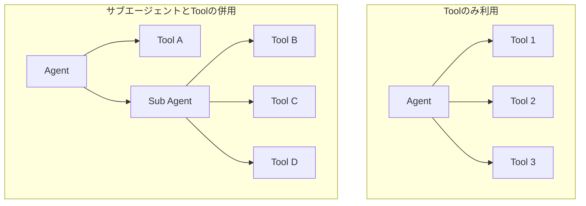

この記事はアドベントカレンダー「[Goで作るセキュリティ分析LLMエージェント](https://adventar.org/calendars/11354)」の14日目です。本日はメインのLLMエージェントが複数のサブエージェントを利用する、サブエージェントアーキテクチャについて解説します。

今回のコードは https://github.com/m-mizutani/leveret の [day14-sub-agent](https://github.com/m-mizutani/leveret/tree/day14-sub-agent) ブランチに格納されていますので適宜参照してください。

# サブエージェントの概念と必要性

サブエージェントとは、メインで動作するエージェントが、さらに別のエージェントを呼び出すという設計パターンです。呼び出される側のエージェントも通常のエージェントと同様にツールを使用するため、本質的にやっていることは大きく変わりません。しかし、サブエージェントに特定の問題領域を委譲することで、モジュール化やカプセル化と同様の設計上の利点を得ることができる**場合があります**。

一方で、この構成は当然ながらシステムを複雑化させます。そのため、何でもかんでもエージェント化すれば良いというわけではありません。サブエージェントアーキテクチャが効果を発揮するのは、明確に切り出せるタスクが存在し、そのタスクが独立して実行可能な場合に限られます。

サブエージェントの構成を図で表すと以下のようになります。基本的にはツールと並列にエージェントが存在するという考え方で問題ありません。エージェントの先にさらにエージェントがいるような多段階の構成も考えられますが、本記事では階層が一段階のみのシンプルな構成を扱います。



上図の「Toolのみ利用」では、エージェントが直接各ツールを呼び出しています。一方「サブエージェントとToolの併用」では、エージェントがTool Aを直接呼び出す一方で、Tool B、C、Dに関してはサブエージェントを介して利用する構成になっています。この構成により、Tool B、C、Dに関連する処理はサブエージェント内で完結し、メインエージェントはその結果のみを受け取ることができます。

# サブエージェントの利点と欠点

サブエージェントアーキテクチャを採用するかどうかは、利点と欠点を天秤にかけて判断する必要があります。以下では、それぞれについて詳しく解説します。

## 利点

### コンテキスト消費の抑制

サブエージェントアーキテクチャの最も大きな利点は、コンテキスト消費を抑制できることです。例えば「ログデータを調査する」というタスクを投げる場合を考えてみましょう。最終的に必要なのは調査結果だけです。しかし、実際の調査過程では様々な試行錯誤が発生します。SQLクエリを試してみたり、結果を確認して条件を変更したり、スキーマを確認したりといった作業が繰り返されます。この試行錯誤ができることこそがLLMエージェントの強みですが、その過程はメインエージェントのコンテキストとしては無駄になります。すべての中間結果を保持し続けると、コンテキストウィンドウを圧迫してしまうからです。

サブエージェントを使用すると、タスクが完了した後にこの過程を不要なものとして破棄できます。メインエージェントに返されるのは最終的な調査結果のみであり、途中のSQLクエリやその実行結果、エラーとリトライの記録などは保持されません。これにより、メインエージェントのコンテキスト増加を大幅に抑制することができます。

### モデル切り替えが容易

サブエージェントを使用すると、処理の途中でLLMモデルを差し替えることが非常に簡単になります。現在利用可能なLLMモデルには、それぞれ異なる特徴があります。例えば、あるモデルは論理的推論に強いがコストが高い、別のモデルは大量データの読み込みに強いがツール呼び出しの精度が低い、といった違いがあります。

もちろん、ツールとして実装している場合でも力技でモデルを差し替えることは可能です。しかし、その場合はモデル間の互換性を考慮する必要があります。同じプロバイダのモデル間でも、トークン上限の違いや利用可能な機能の違いが問題になることがあります。これが異なるプロバイダのモデルをまたぐ場合はさらに複雑になり、会話履歴の互換性を維持するのは非常に困難です。

エージェントとして分離していれば、「このタスクを処理するエージェントにはこのモデルを使用する」という割り当てが非常に容易になります。BigQuery調査用のエージェントにはデータ処理に特化したモデル、脅威分析用のエージェントには推論能力の高いモデル、といった使い分けが自然にできるようになります。

### 並列化が可能

タスク間に依存関係がなく相互干渉がない場合、複数のサブエージェントに一度にタスクを投げて並列実行することで、応答時間を短縮できます。例えば、あるアラートに対してIPアドレスの調査と関連ログの検索を同時に行うような場合、これらを並列に実行できます。

ただし、この並列化にはスケジューリングの概念が必要になります。複数タスクの依存関係を明確に推定した上で実行順序を決定する必要があるためです。これはエージェントの実行計画問題として知られており、高度な実装が必要になります。

また、並列化によって応答時間は圧縮できますが、LLMエージェントにおける主要な課題は応答時間ではないことが多い点に注意が必要です。コスト、精度、制御可能性といった他の要素の方が重要な場合も多く、並列化の効果は限定的です。

### 問題領域の限定化

サブエージェントを使用すると、各エージェントが扱う問題領域を絞ることができ、それに伴い対応も特化できます。具体的には、サブエージェントごとに詳細なシステムプロンプトを設定できるようになります。

以前の記事で解説したように、LLMには「知らないものは探さない」という特性があります。そのため、ツールやデータソースについて適切な情報を提供する必要があります。しかし、ツールが多くなってくると、システムプロンプトに記載する情報が膨大になり、混乱を招く可能性があります。また、多くの文脈が混在していると、個別の状況に対する具体的な指示を与えにくくなります。

サブエージェントとして問題領域を分離すると、「こういう場合はやり直せ」「こういう状況ではこの可能性を疑え」といった細かい指示を入れやすくなります。また、一度に呼び出されるツール群も限定されるため、デバッグや制御が容易になります。これは一般的なプログラミングにおけるモジュール化と同じ発想です。適切な粒度で責務を分離することで、システム全体の保守性と品質が向上します。

## 欠点

### コンテキストの欠落

サブエージェントの最大の欠点は、コンテキストが欠落することです。サブエージェントに渡される情報は、メインエージェントが持つ全コンテキストの一部に過ぎません。インターフェースの設計によりますが、例えば自然言語でタスクを渡すような場合、かなりの情報が削られることになります。

そのため、「これまでの情報をもとに総合的に判断する」ような、全コンテキストを必要とする処理には向いていません。サブエージェントが活用できるのは、仕事として明確に切り出せるタスク、つまり短い命令で期待する結果が得られる移譲可能なタスクに限られます。例えば「このIPアドレスの脅威情報を調べて」「このログを検索して」といった、入力と出力が明確に定義できるタスクが適しています。

### 設計がかなり難しい

サブエージェントの設計は、コンテキストの欠落問題と密接に関連しており、非常に難しい課題です。APIをラップするだけのシンプルなFunction CallingやMCPツールとは根本的に異なります。

サブエージェントを設計する際には、常に「このユースケースでは、どの程度のコンテキストを受け取ってタスクを委譲すればうまく機能するか」を考える必要があります。コンテキストが少なすぎればサブエージェントは適切に動作できませんし、多すぎればサブエージェントの利点が薄れます。また、どのようなインターフェースにすればよいか（自然言語で指示するのか、構造化されたパラメータを渡すのか）といった設計判断にもセンスが問われます。

### コントロールが難しい

LLMエージェントは、単体でも制御が難しいものです。ツールの呼び出し順序、判断ロジック、エラー時の振る舞いなど、不確定な要素が多く存在します。サブエージェントにタスクを委譲するだけでも、この複雑性は一気に増大します。

さらに複数のエージェントを協調させようとすると、複雑性は指数関数的に増加します。筆者の視点では、この分野はまだ成熟しておらず、ベストプラクティスも確立されていません。そのため、サブエージェントを導入する際には、システム全体の複雑性増加を十分に考慮する必要があります。

## 考慮点

### 権限の移譲

サブエージェントをプロセス分離する場合（リモートからアクセスできるエージェントを含む）、1つのエージェントに権限を集中させなくて良いという利点が生まれるとされています。しかし、この場合「そのエージェントはどのような認可を持つべきか」という新たな問題が生じます。

様々な場所から多様な用途でアクセスされるエージェントは、非常に強力な権限を持つ必要があります。そのエージェントが危殆化すると、結局影響範囲は大きくなります。一方、利用者の権限を伝搬させる方式（例えばOAuth2やOIDCトークンの伝搬）のような仕組みを持たせるなら、エージェントを分けようが分けなかろうがあまり変わらなくなります。

そのため、認可・権限周りについてはアーキテクチャを含めて十分に検討する必要があります。本記事ではプロセス統合型（メインエージェントとサブエージェントが同一プロセス内で動作する）を採用するため、権限の分離については扱いません。

### サブエージェントの制御

サブエージェントの制御も重要な考慮点です。特にサブエージェントに複雑なタスクを任せると、処理時間が長くなる傾向があります。深く調査させたいタスクであれば問題ありませんが、メインエージェント自体の処理時間が既に長い場合、全体の応答時間が許容範囲を超えてしまう可能性があります。

この問題に対処するためには、タイムアウトの設定やイテレーション数の制限が重要になります。例えば、サブエージェントは最大で10回のツール呼び出しまで、または30秒以内で応答を返すように設定するなどの制約を設けます。

また、サブエージェントの進捗状況をメインエージェント側に伝える仕組みも検討が必要です。ストリーミングで途中経過を返すか、完了まで待つかは、ユースケースによって異なります。さらに、エラーハンドリングも複雑化します。サブエージェントが失敗した場合、メインエージェントがどのようにリカバリするか（リトライするか、別の方法を試すか、ユーザに報告するか）を設計しておく必要があります。

### コストの考慮

サブエージェントを呼び出すたびに新たなLLM APIコールが発生します。メインエージェントのコンテキストは節約できますが、サブエージェント側で別途コンテキストを消費するため、全体としての総コストが増える可能性があります。

ただし、コンテキスト圧縮の効果が大きい場合（例えば、サブエージェントが100回の試行錯誤を経て得た結果を1つの要約として返す場合）は、トータルコストが安くなることもあります。コスト最適化のためには、サブエージェントに委譲するタスクの粒度設計が重要です。小さすぎるタスクをサブエージェント化するとオーバーヘッドが大きくなり、大きすぎるタスクは制御が困難になります。

# エージェントの設計と通信パターン

サブエージェントも本質的にはツール呼び出しと変わりません。メインエージェントからツールを呼び出すのと同じインターフェースで、サブエージェントを呼び出すことができます。違いは、ツールが単純な関数実行であるのに対し、サブエージェントは内部で独自にLLMとのやり取りを行う点だけです。外部プロセスのエージェント呼び出しに特化したプロトコルとして、A2A（Agent-to-Agent Protocol）が存在します。これはGoogleが提案したもので、MCP（Model Context Protocol）よりもエージェント間の通信に最適化されています。しかし、この文章を執筆している2025年現在では、活用事例はあまり聞きません。これはおそらく、複数エージェントを協調的に使うというユースケースがまだ一般的ではないためです。そもそも1つのエージェントを適切に制御するだけでも十分に難しい課題であり、複数エージェントの協調はさらに高度な技術を要求します。

本記事では、Tool呼び出し（Function Calling）の延長としてサブエージェントの呼び出しを実装します。この方法を選択する理由はいくつかあります。まず、実装が統合されていた方がデバッグがしやすくなります。次に、今回のユースケースではサブエージェントをリモートプロセスとして分離する必要がないためです。将来的に要件が変わった場合は、MCPやA2Aを使った分離構成に移行することも可能です。

# サブエージェントの実装例

本記事では、BigQueryの検索タスクをサブエージェント化します。以前の記事で実装したBigQuery関連のツール群を、サブエージェントとして再構成します。具体的には、`pkg/tool/bigquery`パッケージを廃止し、[pkg/agent/bigquery](https://github.com/m-mizutani/leveret/tree/day14-sub-agent/pkg/agent/bigquery)としてツールごと引っ越しを行います。

前述の通り、サブエージェントのインターフェースはToolと同じにします。そのため、他のツールと同じように並べて登録するだけで利用できます。

```go:pkg/cli/chat.go
	// Create tool registry early to get flags
	registry := tool.New(
		alert.NewSearchAlerts(),
		otx.New(),
		bigquery.New(),
	)
```

このコードでは、`alert.NewSearchAlerts()`や`otx.New()`といった通常のツールと並んで、`bigquery.New()`（これがサブエージェント）を登録しています。外から見ると、これらは全て同じToolインターフェース（以前の記事で定義した`Spec()`や`Run()`メソッドを持つインターフェース）を実装しているため、メインエージェントは違いを意識する必要がありません。

一方、Toolとしてのインターフェースは`bigquery_run`という非常にシンプルなFunction Declarationに統一されます。このツールの説明には、自然言語で指示を出すよう促す内容を記載します。

```go:pkg/agent/bigquery/tool.go
// Spec returns the tool specification for Gemini function calling
func (t *Tool) Spec() *genai.Tool {
	return &genai.Tool{
		FunctionDeclarations: []*genai.FunctionDeclaration{
			{
				Name:        "bigquery_run",
				Description: "Execute BigQuery analysis using natural language. This tool translates your request into SQL queries, executes them, and returns analysis results. Use this for log analysis, security investigation, and data exploration.",
				Parameters: &genai.Schema{
					Type: genai.TypeObject,
					Properties: map[string]*genai.Schema{
						"query": {
							Type:        genai.TypeString,
							Description: "Natural language description of what you want to analyze or query from BigQuery",
						},
					},
					Required: []string{"query"},
				},
			},
		},
	}
}
```

ここで重要なのは、メインエージェントからサブエージェントへの指示が自然言語で行われるという点です。構造化されたパラメータではなく自然言語を選択した理由は、サブエージェントに高い柔軟性を持たせるためです。メインエージェントは具体的なSQLの構造を知る必要がなく、「このIPアドレスに関連するログを過去24時間分検索してください」といった自然言語の指示を`query`パラメータに渡すだけで済みます。サブエージェント側がこの指示を解釈し、適切なSQLクエリを生成・実行します。

また、サブエージェントが利用可能なBigQueryテーブルの情報は、メインエージェント側のシステムプロンプトに追加されます。これにより、メインエージェントはどのようなデータが検索可能かを把握した上で、適切にサブエージェントを呼び出すことができます。

```go:pkg/agent/bigquery/tool.go
// Prompt returns additional information to be added to the system prompt
func (t *Tool) Prompt(ctx context.Context) string {
	if !t.enabled || t.agent == nil {
		return ""
	}

	// Only expose table list to main agent (not runbooks)
	if len(t.agent.tables) == 0 {
		return ""
	}

	var sb strings.Builder
	sb.WriteString("### BigQuery Tables\n\n")
	for _, table := range t.agent.tables {
		sb.WriteString(fmt.Sprintf("- **%s**", table.FullName()))
		if table.Description != "" {
			sb.WriteString(fmt.Sprintf(": %s", table.Description))
		}
		sb.WriteString("\n")
	}

	return sb.String()
}
```

このコードでは、テーブル名と説明のみを提供しています。ただし、この情報量が適切かどうかはユースケースによります。場合によっては、テーブルのスキーマ情報を詳細に含めた方が良いかもしれませんし、逆にテーブルが多数ある場合は生成AIで要約した内容を付与した方が効果的かもしれません。この部分は扱うテーブルの数や用途に合わせて調整してください。

サブエージェントの実行ロジックは以下の通りです。メインエージェントと同様に、繰り返し処理を行います。

```go:pkg/agent/bigquery/agent.go
// Execute processes a natural language query and returns the result
func (a *Agent) Execute(ctx context.Context, query string) (string, error) {
	// Build system prompt with context
	systemPrompt := a.buildSystemPrompt()

	// Create initial user message
	contents := []*genai.Content{
		genai.NewContentFromText(query, genai.RoleUser),
	}

	// Build config with tools
	config := &genai.GenerateContentConfig{
		SystemInstruction: genai.NewContentFromText(systemPrompt, ""),
		Tools:             []*genai.Tool{a.internalToolSpec()},
	}

	// Tool Call loop
	const maxIterations = 16
	var finalResponse string

	for i := 0; i < maxIterations; i++ {
		resp, err := a.gemini.GenerateContent(ctx, contents, config)
		if err != nil {
			return "", goerr.Wrap(err, "failed to generate content")
		}

		if len(resp.Candidates) == 0 || resp.Candidates[0].Content == nil {
			return "", goerr.New("empty response from Gemini")
		}

		candidate := resp.Candidates[0]
		contents = append(contents, candidate.Content)

		// Check for function calls
		hasFuncCall := false
		for _, part := range candidate.Content.Parts {
			if part.FunctionCall != nil {
				hasFuncCall = true
				// Execute the internal tool
				funcResp := a.executeInternalTool(ctx, *part.FunctionCall)

				// Add function response to contents
				funcRespContent := &genai.Content{
					Role:  genai.RoleUser,
					Parts: []*genai.Part{{FunctionResponse: funcResp}},
				}
				contents = append(contents, funcRespContent)
			}
		}

		// If no function call, extract final text response
		if !hasFuncCall {
			var textParts []string
			for _, part := range candidate.Content.Parts {
				if part.Text != "" {
					textParts = append(textParts, part.Text)
				}
			}
			finalResponse = strings.Join(textParts, "\n")
			break
		}
	}

	return finalResponse, nil
}
```

このコードの構造は、メインエージェントの実装とほぼ同じです。イテレーションごとに`GenerateContent`を呼び出し、Function Callが返ってきたらそれに従ってツールを実行します。ここで使用されるツールは、以前実装したBigQuery用のツール群（スキーマ取得、クエリ実行、結果取得など）です。

重要なポイントとして、`maxIterations`を指定して無限ループを防止しています。イテレーション制限の設定は難しい問題で、どの程度複雑なタスクをエージェントに任せるかによって調整が必要です。今回は16回としていますが、より複雑なタスクであれば増やす必要があるかもしれません。

また、このコードには含まれていませんが、処理の途中結果をなるべくユーザーに表示することが推奨されます。今回のようなCLIベースのシンプルなチャットであれば、標準出力に直接出力するだけでも十分です。より複雑なアプリケーションではコールバック関数やチャネルを使った通知の仕組みを検討してください。途中経過を表示することで、ユーザーは処理が進行していることを確認でき、安心感が得られます。また、エージェントが想定外の方向に進んでいる場合、早期に中断することも可能になります。

Function Callがなかった場合は、サブエージェントが結論に達したとみなし、テキストレスポンスを抽出してメインエージェントに返します。この結果には、調査で得られた情報と分析結果が含まれます。

## サブエージェント専用のシステムプロンプト

サブエージェントには専用のシステムプロンプトを設定します。これにより、そのタスクに特化した詳細なガイドラインを提供できます。完全なプロンプトは[こちら](https://github.com/m-mizutani/leveret/blob/day14-sub-agent/pkg/agent/bigquery/prompt/system.md)を参照してください。以下では重要な部分を抜粋して解説します。

まず、基本的なワークフローを定義します。

```md
## Workflow

1. Understand the user's analysis request
2. If a suitable runbook exists, use `bigquery_runbook` to get the pre-defined query
3. Get table schema using `bigquery_schema` if needed to understand the data structure
4. Execute SQL queries using `bigquery_query`
5. Retrieve and analyze results using `bigquery_get_result`
6. Provide insights based on the query results
```

このワークフローを明記することで、例えばエージェントがいきなり推測でクエリを作成するのを防ぐことができます。まずスキーマを確認し、既存のランブックを参照するという手順を踏むことが促されます。このような指示は、全てのツールが横並びになっている状態では書きにくいものです。問題領域がサブエージェントとして分離されているからこそ、このような詳細なワークフローを記述しやすくなります。

次に、ツール使用上の重要なガイドラインを提供します。

```md
## Important Guidelines

- Always validate table existence before querying
- Use LIMIT clauses to avoid excessive data scans
- Consider time ranges to narrow down results
- When query results are large, use pagination with offset
- Explain your findings in the context of security analysis
- If the scan limit is exceeded, modify the query to reduce data scanned
```

ここでは、LIMIT句を必ず使用すること、時間範囲を考慮すること、スキャン制限を超えた場合の対処法などを指示しています。LIMIT句の使用は課金問題の防止だけでなく、大量データが返ってコンテキストを圧迫するのを防ぐ役割もあります。

さらに重要なのは、予期しない結果に対するリカバリ戦略です。

```md
## Unexpected Result Recovery

**CRITICAL**: When query results are unexpected (0 rows, missing expected data, strange values), DO NOT immediately trust the result. Instead:

1. **Question the search criteria** - The field values may not match your expectations
   - Field format might be different (e.g., IP as string vs integer, timestamps in different formats)
   - Field names might be different from what you assumed
   - Values might use different conventions (e.g., "ERROR" vs "error" vs "ERR")
   - Data might be in nested or repeated fields

2. **Verify field values** - Issue a separate query to check what values actually exist:
   -- Check distinct values in a field
   SELECT DISTINCT field_name FROM table LIMIT 100

   -- Check value patterns
   SELECT field_name, COUNT(*) as cnt
   FROM table
   GROUP BY field_name
   ORDER BY cnt DESC
   LIMIT 20
```

結果が見つからなかったり予期しない値が返ってきたりした場合、すぐに「データがない」と結論づけるのではなく、フィールドのフォーマットや命名規則を疑うよう指示しています。例えば、IPアドレスが文字列として格納されているか整数として格納されているか、タイムスタンプのフォーマットが想定と異なるか、といった点を確認させます。

これは実際に人間がBigQueryを使用する際にも行う確認作業です。しかし、生成AIはこのような指示を明示的に与えないと、勝手に推測してクエリを作成し、「結果がありませんでした」と報告してしまうことがあります。そのため、「こういう状況ではこうしろ」というプラクティスを明確に渡す必要があります。

このような詳細なガイドラインも、全てのツールが混在した状態では記述しにくいものです。サブエージェントとして問題領域を分割したことで、文脈が限定され、このような具体的な指示を書きやすくなっています。

## 実行結果の例

これらの実装を用いた実際の実行結果を以下に示します。この例では、Google Cloud Security Command Centerからのアラート（leveretリポジトリの`examples/alert/scc.json`のデータ）に対して、関連するインスタンスの変更履歴を調査するよう指示しています。

:::details 実際の実行結果 ( examples/alert/scc.json のデータを投入したAlertに対する問い合わせ)

```bash
$ go run . chat -i 81aa9921-3dea-4365-ac18-5967596933ac
Enabled tools: [search_alerts query_otx bigquery_run]

Chat session started. Type 'exit' to quit.

> このアラートに関連するインスタンスが直近で変更された形跡があるかを調査し、結果を報告せよ

⠸ thinking...
💭 インスタンス「web-server-prod-01」の最近の変更履歴を調査します。アラートのイベント時刻（2025-11-08T05:23:47.891Z）の24時間前までのCloud Audit Logsを確認し、関連するアクティビティを探します。

🔧 Calling tool: bigquery_run
   Args:
{
     "query": "Compute Engineインスタンス 'web-server-prod-01' (プロジェクト 'production-project-12345') のCloud Audit Logsを、2025-11-07T05:23:47.891Zから2025-11-08T05:23:47.891Zまでの期間で表示してください。タイムスタンプ、メソッド名、プリンシパルメール、発信元IPアドレスを含めてください。"
   }
⠙ thinking...  📊 BigQuery: 0 rows, 0 MB scanned
  Query: SELECT
  timestamp,
  protopayload_auditlog.methodName,
  protopayload_auditlog.authenticationInfo.principalEmail,
  protopayload_auditlog.requestMetadata.callerIp
FROM
  `mztn-audit.google_cloud_audit.cloudaudit_googleapis_com_activity`
WHERE
  resource.type = 'gce_instance'
  AND resource.labels.project_id = 'production-project-12345'
  AND protopayload_auditlog.resourceName LIKE '%web-server-prod-01%'
  AND timestamp BETWEEN '2025-11-07 05:23:47.891Z' AND '2025-11-08 05:23:47.891Z'
LIMIT 100
⠴ thinking...  📊 BigQuery: 13 rows, 2 MB scanned
  Query: SELECT DISTINCT resource.type FROM `mztn-audit.google_cloud_audit.cloudaudit_googleapis_com_activity` LIMIT 100
⠸ thinking...  📊 BigQuery: 20 rows, 42 MB scanned
  Query: SELECT DISTINCT resource.type FROM `mztn-audit.google_cloud_audit.cloudaudit_googleapis_com_data_access` LIMIT 100
⠴ thinking...  📊 BigQuery: 5 rows, 0 MB scanned
  Query: SELECT DISTINCT resource.type FROM `mztn-audit.google_cloud_audit.cloudaudit_googleapis_com_system_event` LIMIT 100
⠼ thinking...  📊 BigQuery: 5 rows, 0 MB scanned
  Query: SELECT DISTINCT resource.type FROM `mztn-audit.google_cloud_audit.cloudaudit_googleapis_com_system_event` LIMIT 100
⠙ thinking...  📊 BigQuery: 0 rows, 0 MB scanned
  Query: SELECT
  timestamp,
  protopayload_auditlog.methodName,
  protopayload_auditlog.authenticationInfo.principalEmail,
  protopayload_auditlog.requestMetadata.callerIp
FROM
  `mztn-audit.google_cloud_audit.cloudaudit_googleapis_com_activity`
WHERE
  protopayload_auditlog.serviceName = 'compute.googleapis.com'
  AND resource.labels.project_id = 'production-project-12345'
  AND protopayload_auditlog.resourceName LIKE '%web-server-prod-01%'
  AND timestamp BETWEEN '2025-11-07 05:23:47.891Z' AND '2025-11-08 05:23:47.891Z'
LIMIT 100
⠼ thinking...  📊 BigQuery: 0 rows, 0 MB scanned
  Query: SELECT DISTINCT protopayload_auditlog.resourceName FROM `mztn-audit.google_cloud_audit.cloudaudit_googleapis_com_activity` WHERE protopayload_auditlog.serviceName = 'compute.googleapis.com' AND resource.labels.project_id = 'production-project-12345' AND timestamp BETWEEN '2025-11-07 05:23:47.891Z' AND '2025-11-08 05:23:47.891Z' LIMIT 100
⠙ thinking...  📊 BigQuery: 0 rows, 13 MB scanned
  Query: SELECT DISTINCT protopayload_auditlog.resourceName
FROM
  `mztn-audit.google_cloud_audit.cloudaudit_googleapis_com_activity`
WHERE
  protopayload_auditlog.serviceName = 'compute.googleapis.com'
  AND resource.labels.project_id = 'production-project-12345'
LIMIT 100
⠦ thinking...  📊 BigQuery: 0 rows, 0 MB scanned
  Query: SELECT
  timestamp,
  protopayload_auditlog.methodName,
  protopayload_auditlog.authenticationInfo.principalEmail,
  protopayload_auditlog.requestMetadata.callerIp
FROM
  `mztn-audit.google_cloud_audit.cloudaudit_googleapis_com_system_event`
WHERE
  protopayload_auditlog.serviceName = 'compute.googleapis.com'
  AND resource.labels.project_id = 'production-project-12345'
  AND protopayload_auditlog.resourceName LIKE '%web-server-prod-01%'
  AND timestamp BETWEEN '2025-11-07 05:23:47.891Z' AND '2025-11-08 05:23:47.891Z'
LIMIT 100
✅ Tool result:


このインスタンス「web-server-prod-01」に関連する最近の変更履歴について、BigQueryで監査ログを検索しましたが、結果は返されませんでした。これは、指定された期間内にBigQueryがこのインスタンスに対する明示的な変更ログを見つけられなかったことを意味しま
す。

### 所見
*   BigQueryでインスタンス「web-server-prod-01」（プロジェクト「production-project-12345」）のCloud Audit Logsを、アラートのイベント時刻（2025-11-08T05:23:47.891Z）の24時間前からその時刻までの期間で検索しましたが、検索結果は空でした。

### 評価
*   検索結果が空であることから、このインスタンスに対して指定された期間内で、監査ログに記録されるような明示的な変更操作や管理操作は確認できませんでした。
*   ただし、これは、特定のログエントリが存在しないことのみを示しており、他の種類のログ（例えば、OSレベルのシステムログやアプリケーションログ）には活動があった可能性は排除できません。
*   また、アラートの`access.methodName`に`v1.compute.instances.start`とあり、`principalEmail`が`attacker@external-domain.com`となっていることから、外部からの不正なインスタンス起動、または設定変更が行われた可能性が示唆されています。BigQueryの検索でこれらがヒットしなかったのは、検索条件が完全ではなかったか、またはこれらのイベントが異なるログソースに記録されている可能性が考えられます。

### 知識のギャップ
*   `bigquery_run`の結果が空であったため、明示的な変更履歴は確認できませんでした。
*   インスタンス起動に関するログがCloud Audit Logsに含まれていないか、検索条件がより詳細である必要がある可能性があります。
*   インスタンスのOS内部での変更（ファイルのダウンロード、実行など）は、Cloud Audit Logsには直接記録されません。

### 推奨されるアクション
1.  **より広範な期間でCloud Audit Logsを再調査する**: 不正アクセスやインスタンス起動のイベントが、指定した24時間よりも前に発生した可能性を考慮し、調査期間をさらに広げてみてください。
2.  **`access.methodName`を具体的に指定してCloud Audit Logsを検索する**: `v1.compute.instances.start`などの具体的なAPI呼び出し名を指定して、関連するログエントリを直接検索してみてください。
3.  **VMインスタンス内部のログを確認する**: `web-server-prod-01`のシステムログ（例: `auth.log`, `syslog`, `bash history`など）を取得し、不正なコマンド実行やファイル変更の痕跡がないか調査してください。
4.  **Cloud Loggingで他のログタイプを調査する**: Cloud Audit Logsだけでなく、VPC Flow Logsやその他のCompute Engine関連ログなど、他の利用可能なログタイプも確認してください。

### 結論
インスタンス「web-server-prod-01」について、アラートイベント時刻の24時間前までのCloud Audit Logsを調査しましたが、明示的な変更履歴は確認できませんでした。この結果は、より詳細なログ検索や、インスタンス内部のログ、および他のログソースの調査が必要であることを示唆しています。特に、アラートが示す不正なインスタンス起動や設定変更に関する詳細を把握するためには、さらなる調査が必要です。
```
:::

この実行結果から、サブエージェントの動作がよく分かります。メインエージェントは自然言語で「Compute Engineインスタンスの監査ログを調査してください」と指示を出しています。サブエージェントはこの指示を受けて、適切なSQLクエリを生成し実行しています。

注目すべきは、最初のクエリで結果が0件だった後の挙動です。サブエージェントは即座に「データがない」と結論づけるのではなく、システムプロンプトで指示されたリカバリ戦略に従っています。具体的には、`resource.type`の実際の値を確認したり、異なるテーブルを試したり、検索条件を変更したりしています。このような試行錯誤の過程がサブエージェント内で完結し、メインエージェントのコンテキストには最終的な結果のみが返されます。

この調査過程でサブエージェントは合計8回のBigQueryクエリを実行しています。これらの中間結果はサブエージェントのタスク完了後に破棄されるため、メインエージェントのコンテキストを無駄に消費しません。もしこれらの処理をメインエージェントが直接行っていた場合、8回分のクエリとその結果がすべてコンテキストに蓄積され、大幅なトークン消費につながっていたでしょう。

# まとめ

サブエージェントアーキテクチャは、単にエージェントを階層化するだけでなく、問題領域をモジュール化する設計パターンです。その本質は「どのタスクを切り出せば、短い命令で期待する結果を得られるか」という見極めにあります。

重要なのは、サブエージェントが銀の弾丸ではない、という点です。コンテキストの欠落は避けられず、設計の複雑化も伴います。しかし、BigQueryの調査のような試行錯誤が必要だが最終結果だけが重要なタスクには非常に効果的です。中間過程を捨てられることでコンテキスト消費を抑制し、問題領域が限定されることで詳細なガイドライン（リカバリ戦略やベストプラクティス）を埋め込みやすくなります。

サブエージェントの導入では、まず「このタスクは移譲可能か？」をよく検討するべきです。全てのコンテキストを必要とする処理や、メインエージェントとの密な連携が必要なタスクには向きません。一方で、独立した調査や変換処理のように、入力と出力が明確に定義できるタスクは良い候補です。

実装面では、Tool呼び出しと同じインターフェースを保つことで既存システムへの統合が容易になります。また、サブエージェント専用のシステムプロンプトを設けることで、そのタスクに特化した指示や注意事項を詳細に記述できるようになります。これは一般的なプログラミングにおけるモジュール化と同じ発想であり、適切な粒度で責務を分離することがシステム全体の品質向上につながります。
