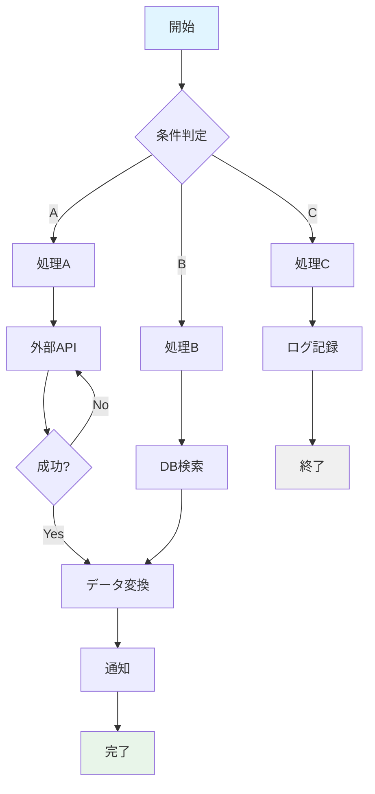
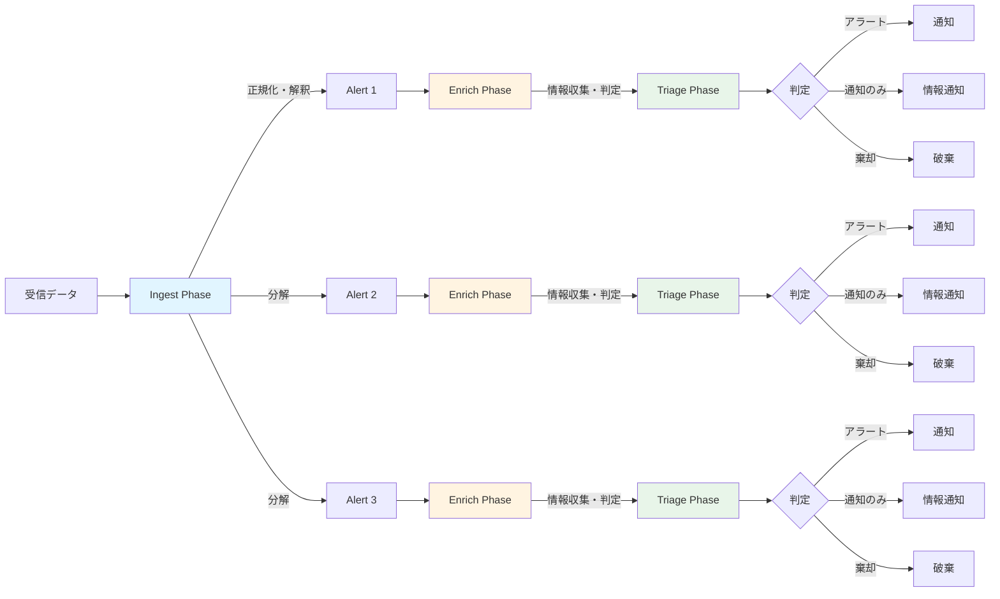

この記事はアドベントカレンダー「[Goで作るセキュリティ分析LLMエージェント](https://adventar.org/calendars/11354)」の16日目です。

# AIワークフローとは

本記事では、AIワークフローを一般的なワークフローエンジン・管理ツールにLLM機能を組み込んだものと定義します。ワークフローエンジンは処理、入出力、条件分岐などを接続して一連の手続きや業務を表現・実行する仕組みです。処理や入出力には外部サービスとの連携も含まれますが、むしろ外部システムとの連携こそがワークフローの主要な用途と言えます。

以下は一般的なワークフローの例です。このように処理、分岐、遷移が複雑に組み合わさり、自由な状態遷移を表現できます。

AIが組み込まれたワークフローは、AIアプリケーションビルダー、LLMオーケストレーション、AIエージェントフローなど、さまざまな呼び方で呼ばれています。OSSではn8nやDifyなどが代表例として挙げられます。これらのツールの特徴は、直接コードを書くよりも簡単に処理を表現できる点にあります。DSL（Domain Specific Language）で記述したり、GUI上で設定することで、コーディングができない人や、コーディングよりも手軽に処理を組み立てたい人にとって有用な選択肢となります。

## AIワークフローにおけるAIの役割

AIワークフローにおいてLLMが担う役割は、大きく分けて3つあります。

**データの加工**: 雑多な自然言語を構造化データに変換したり、特定のキーワードを抽出したり、なんらかの法則に基づいてデータを変換する処理が該当します。従来のワークフローでは、ルール記述によって決定性のある処理を実現できていました。しかし曖昧なデータを扱う場合、ルールを記述するのは困難になります。特に自然言語のような非構造化データは、ルールベースでの処理が極めて難しくなります。たとえば、セキュリティアラートのメッセージから「誰が」「どこで」「何をした」という情報を抽出する場合、アラートの書式が統一されていないとルールでの対応は困難になります。生成AIを利用することで、このような曖昧なデータを構造化データへと変換できます。また自然言語から自然言語への変換も可能で、通知文面の作成などに活用できます。

**条件分岐判定**: 処理の内容としてはデータ加工と本質的には同じですが、目的が異なります。従来は個別にルールを記述する必要がありましたが、生成AIを使うことで曖昧な判定を実現できます。もちろんクリティカルな業務判断には使えませんが、ある程度の柔軟性が許容される判定であれば有用になります。たとえば、アラートの緊急度を4段階で判定したり、特定の条件に該当するかを柔軟に判断したりする用途に向いています。

**エージェント処理**: 他システムにアクセスする処理が該当します。具体的には、データ収集や収集対象の判断を自律的に行う調査タスク、ドキュメント作成、チケット作成、スケジュール作成などの作成・変更タスクが含まれます。

# セキュリティ分析で利用するワークフロー

セキュリティ分析におけるワークフローは、SOAR（Security Orchestration, Automation and Response）と呼ばれるものに相当します。従来のSOARは、アラートの種類ごとに詳細なルールを記述する必要があり、アラートが増えるほど運用コストが爆発的に増大するという課題がありました。この課題については以前の記事で解説した通りです。そこでSOARにLLM機能を組み込むことで、従来の課題がさまざまな形で軽減されます。

しかしSOARに生成AIを組み込んだだけで全てが解決するわけではありません。依然としてルールを書くのは大変です。そもそもルールを書かなくても、エージェントに命令するだけでだいたいのことはよしなにやってくれます。エージェントは人間に伴走する存在です。一方でSOARはそういった性質のツールではありません。

## それでもワークフローが必要な理由

それでもワークフローが必要な理由は2つあります。第一は、決定性のある処理は決定性をもって実行したほうがよいという点です。たとえばLLMに特定条件を無視させることも概ねうまくいきますが、一抹の不安が残ります。確実性をもって処理するための仕組みは欲しいところです。ルールをLLMに書かせて人間がレビューする方法もあります。それによって基本の動作は保証できます。第二は、セキュリティ分析ではアラートの事前処理を行いたいという点です。具体的には初期トリアージのような処理が該当します。人間が介入する前に、明らかに棄却すべきアラートをフィルタリングしたり、逆に緊急度の高いアラートを優先的にエスカレーションしたりします。このような仕組みがあると運用負荷を大きく軽減できます。

# ワークフローを独立して実装する必要があるのか？

ここまでワークフローについて解説してきましたが、そもそもワークフロー機能として独立させずに普通にコードで表現すればいいのではないかという疑問もあります。その指摘はもっともで、だいたいのユースケースや要件はソースコードでの実装で充足します。しかしワークフローとして分離しておいたほうが良いケースもあります。

ワークフローを別の系で実装したほうがよい理由は主に2つあります。第一は、ロジックを平易に表現できる点です。たとえば「特定のIPアドレスからのアクセスは常に棄却する」というルールを、Goのコードで書くと条件分岐やデータ取得処理が複雑になりますが、DSLなら数行で表現できます（次回の実装編で具体例を示します）。第二は、ランタイムとロジックを分離できる点です。実装分離が明確化されていると、コード上の整理としては良い状態になり、リファクタリングなどがしやすくなります。また、ランタイム実装者とロジック実装者を切り分けられるため、より運用寄りの人がロジックをいじりやすくなります。たとえば開発チームはランタイムの性能改善やバグ修正に集中し、セキュリティオペレーションチームは業務ロジックの調整に集中するといった役割分担が可能になります。実際にはソースコードでの実装で十分な場合もありますが、今回はあえてワークフローを別で実装してみます。

# セキュリティアラートに対応するワークフローの設計のための整理

汎用的なワークフローエンジンを作ろうとすると非常に大変で、自由度を高めるために大量の機能を作る必要があります。しかし今回はユースケースがはっきりしているので、それに応じたワークフローを作ります。

## ユースケースの整理

今回実装するワークフローは、外部システムからアラートを受け取るたびに実行されるものとします。本来はアラートが発生したらそれを受信し、処理するためのサービスとして実装するのがよいでしょう。今回はあくまで学習のため実装しやすさを優先してCLIチャットとして実装していますが、実用上はアラートが発生するたびに自動的に何かしらの処理を実行したいというのがユースケースです。

逆に、ワークフローが実行されるのはアラート到着時だけで構いません。SOARでは人間が任意のタイミングでトリガするようなユースケースも組むことができます。しかし人間が指示するなら、AIエージェントで十分ではないかという考え方もあります。実装するとしても、あらかじめ用意しておいたプロンプトを実行するようなもの、AIコーディングエージェントで用意されているカスタムコマンドに近い概念で十分ではないかと考えます。これについては今回のアドベントカレンダーでは実装しませんが、実装する価値があることだけは言及しておきます。

もちろん定型業務がバチッと決まっているような場合は、ワークフローを実装する価値はあります。ただしその場合は、セキュリティ分析エージェント内に実装するのではなく、フローを外部に用意して叩く方法も検討しうるでしょう。なぜなら、そういうタイプのワークフローはだいたい外部干渉系のワークフローだからです。具体例としては、ファイアウォールのルールを変更する、インスタンスを停止する、EDRの機能で端末に干渉するといった処理が挙げられます。

このようなワークフローは強い権限を持つため、セキュリティ分析エージェントとは切り離し、実行アカウントの権限を分離しておいたほうがよいでしょう。これは単純に最小権限化という観点もありますが、セキュリティ分析エージェントはさまざまなツールを使う際に誤って強い権限が発動されると危険です。そのためエージェントの実行アカウントは読込系を中心にしておいたほうが安全です。こういった機能の発火トリガ機能は作ってもよいかもしれませんが、むしろ一発指令を飛ばすだけにするみたいな設計のほうがよいかもしれません。また、破壊的変更を伴うワークフローにLLM機能を織り交ぜるのは危険です。いずれにせよ、今回はそういうタイプのワークフローは扱いません。

## 具体的なワークフローに必要な機能

セキュリティ分析において、アラート受信時に実行するタスクの機能は主に3つ考えられます。実装をきれいに分離できるわけではありませんが、まずは機能として整理します。

### (1) アラートの解釈

第一の機能は、取得したアラートの内容を解釈することです。これは分析云々ではなく、アラート本文データ内にある項目を変換したり、共通の項目へ置き換える正規化などを指します。アラートの要約を作成させるのもこれにあたり、タイトルや要約作成は以前の記事で解説しました。また、受信したものをアラートとして扱うかどうか（無視してもいいか）という判断も含まれます。たとえば開発環境からのテストアクセスによるアラートや、既知の誤検知パターンに該当するアラートを事前に除外する処理です。

アラートの抑制については、送信する側で抑制すべきという考え方と、受信した側で制御するべきという考え方があります。個人的にはなるべく送信する側で制御したいところですが、現実問題としてそもそも制御できないような検知機構も多く存在します。またルールを統合的に管理できるという意味では、受信側で管理したほうがよいという観点もあります。このように、分析まで行かずともアラートの理解をして整理をするというフェーズがまず必要になります。

### (2) 関連情報の収集

第二の機能は、関連情報の収集です。これはSOARなどでユースケースが多いもので、enrichと呼ばれることが多い処理です。各所からそのアラートに関連しそうな情報を収集して付与します。検索する内容については「セキュリティ分析のためのツール・サブエージェント」の回を参照してください。ここまでで解説したものはエージェントに依頼して情報を集めるというのを主眼においていましたが、「この種類のアラートなら必ずこの調査をする」というのが決まっているなら、人間が介入する前に先手を打って調査したほうがよいでしょう。

これは従来型の決定性ルールのSOARのフローでもやりうることですが、生成AIベースだと次のような強い利点があります。第一は、IoC調査などに使うデータの取り出しに関するルールを明確に記述しなくてもよい点です。SOARでやる場合、どの種類のアラートのどのパスのどのフィールドにどういう値が入っているかを明確に定義する必要があります。たとえばAWS GuardDutyのアラートなら`finding.resource.instanceDetails.networkInterfaces[0].privateIpAddress`、CloudTrailのアラートなら`detail.sourceIPAddress`といった具合に、アラートごとに異なるパスを指定します。これはアラートの種類が増えると本当に辛い作業で、しかもたまに急にアラートのスキーマが変わることがあり、そのたびに対応が必要になります。しかし生成AIの場合、値の抽出のパートでも解説したとおりある程度はよしなに関連しそうな値を抽出してくれます。真に重要なIndicatorが入っているフィールドはちゃんとルールで指定すればよい一方で、関連情報として入ってくるようなものについては雑に抽出し、それについて調べよという指示で済みます。

第二は、手順を厳格に指示しなくてもある程度エージェント的に処理してくれる点です。SOARの場合、ワークフローに関して「こうだったらこうしろ」みたいな分岐を大量に書く必要があります。たとえば脅威DB(a)で情報が見つかったら脅威DB(b)で深堀りしろ、みたいな指示です。しかしこれもアラートの種類やスキーマが増えるとルールが爆発的に増えます。LLMエージェントの指示は自然言語でできるため融通がきき、大量のルールを管理する必要がありません。もちろんクリティカルな処理ならルールで決定的な処理をすべきですが、ちょっとした例外にも強くなるというのは非常に助かります。このようなことから、生成AIを使った関連情報の収集は、LLMエージェントに直接問い合わせてもよいですし、ワークフローとして事前にやっておく場合でも非常に有用です。

### (3) 初動処理

第三の機能は、初動処理です。最終的にそのアラートを初動でどう扱うかを決めます。具体的にはseverityを決めてそれに応じて通知を行ったり、場合によっては通知しない、通知だけはするが対応不要としておく、あるいはアラートとして棄却するといった判断を行います。また通知先を決めたり、誰が担当するかといった判断も含まれます。SOARでは決定性のあるルールでこの処理を行いますが、再三言っているとおりアラートの数が増えてくると非常にしんどくなります。最終的にだいたい全部同じseverityになってしまい、せいぜい棄却 or escalationの2択になることが多いです。

これも生成AIベースでseverity判定などをして、それに基づいて初動処理を変更することができます。ただしLLMにいきなり「severity判定して」と投げかけても難しいため、enrichで取得した情報を利用したり、コンテキストをちゃんと与えることが重要になります。enrich情報はそのまま必要な情報として使えます。コンテキストとは自組織の独自の情報で、これをいかにうまく与えるかで判定の精度は大きく異なります。具体的には次のような情報が該当します。

- 使っているインフラ、サービス、ソフトウェアの情報
- 開発スタイル、ソフトウェアの開発・管理スタイル
- インフラ変更に関する手順やどういう方針で変更しているか
- その他独自に決めているルール
- セキュリティポリシーや体制の情報
- 具体的なアラート処理の事例（few-shot prompting的に与える）

コンテキストが足りないと適当なことしか言いませんが、逆にこれが足りているとある程度論理的な回答をします。ただし当然ハルシネーションなどは一定起こりうるため、防御的な判断にしつつ人間のレビューを入れることが現段階では適切と考えられます。たとえばseverityが低いと判断されたものも1日1度目だけ通すようにするといった対策が考えられます。

# ワークフローのアーキテクチャ設計

今回は、あくまで「定常的にセキュリティアラートを受け付けるサービスの初動対応ワークフローの一例」という観点で見てください。他のやり方もありますが、ここでは設計や実装のポイントなどを解説していきます。

## 基本方針

今回のワークフローでは、冒頭で示したような複雑な分岐やループを持つ自由な状態遷移をするワークフローは不要とします。やることがある程度限られているため、自由度をもたせる必要はありません。

各タスクの表現には[OPA](https://github.com/open-policy-agent/opa)（Open Policy Agent）と[Rego](https://www.openpolicyagent.org/docs/policy-language)を使います。OPA/Regoは、コードから分離された判定のロジックを記述するのに便利です。Regoはポリシー記述に特化した宣言的な言語で、複雑な条件判定を簡潔に表現できます。特にOPA/Regoに拘る理由はなく、他の処理系などでももちろん構いません。ただし、独自にJSONやYAMLでワークフロー機能を作ろうとするのはあまりおすすめしません。判定のロジックでちょっと複雑なこと（たとえば配列のフィルタリングやネストした条件判定）をしようとすると、途端にソースコード側の実装がややこしくなるためです。既存の何かを使うことを勧めます。

## 全体構成

今回実装するワークフローは、`ingest`, `enrich`, `triage` という3つのフェーズをもつ構成にします。各フェーズの役割は次のとおりです。

**`ingest` フェーズ**: 受信したアラートを解釈・正規化します。具体的には、タイトルや要約、抽出する属性値などを決めます。また一度の受信に複数アラートが含まれる場合もあります（たとえばAWS GuardDutyのfindingsは、1回のAPIレスポンスに複数の検知結果が含まれるスキーマです）。このような場合、アラートを分解します。分解されたらそれは別のアラートとして扱われ、以降は異なるスレッドに分岐して処理するイメージです。なお、LLMによるタイトル、要約の生成や属性値抽出は自動で行うため、ワークフロー定義では明示的に記述しません。

**`enrich` フェーズ**: データ取得を行います。より正確には、LLMへの問い合わせやLLMエージェントを走らせるフェーズと言えます。たとえば、アラートに含まれるIPアドレスの評判情報を外部サービスから取得したり、関連するログを検索したりする処理です。生成AIでなんらか判定させたり、情報を収集させるエージェントを走らせたりします。「情報を取得したうえで判定をだす」というようなユースケースも、エージェントにそういうプロンプトを渡せば実現できます。

**`triage` フェーズ**: 最終的にどうするのかを決定します。今回はとりあえず、アラートとして扱う、通知だけする、棄却、の3パターンの判定だけを行います。この他にも、自動アサインだったり、`enrich` の結果から属性値を追加したりといった処理もここで行うとよいでしょう。

以下に3フェーズ構成のワークフロー図を示します。冒頭で示した一般的なワークフローと比べて、状態遷移が単純で直線的な構造になっていることがわかります。

# まとめ

セキュリティアラート分析における生成AI活用のワークフローについて、設計の観点から解説しました。従来のSOARが抱えていた「ルール管理の複雑化」という課題に対し、生成AIを組み込むことで柔軟性と実用性を両立させるアプローチを示しました。

今回提案した `ingest` → `enrich` → `triage` の3フェーズ構成は、決定性が必要な処理とAIの柔軟な判断を適切に使い分けるための設計です。特に重要なのは、enrichフェーズで収集した情報とコンテキストを組み合わせてtriageフェーズの判定精度を高めるという流れです。自組織固有の情報（インフラ構成、開発スタイル、セキュリティポリシーなど）を適切に与えることで、生成AIは単なる一般論ではなく、実運用に耐える判断を下せるようになります。

ワークフローをコードから分離する意義は、ランタイムとロジックの責任分離にあります。OPA/Regoのような既存のポリシーエンジンを活用することで、運用担当者がロジックを調整しやすくなり、開発者はランタイムの改善に集中できます。

次回は、この設計に基づいた具体的な実装を見ていきます。Regoでのルール記述や、各フェーズでの生成AI活用の実例を通じて、設計を実際に動くシステムへと落とし込んでいきます。
