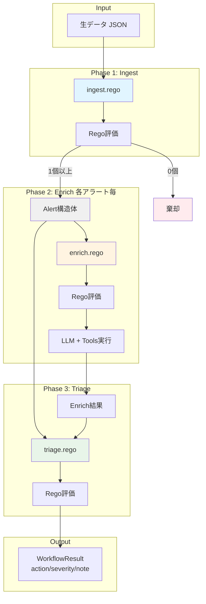
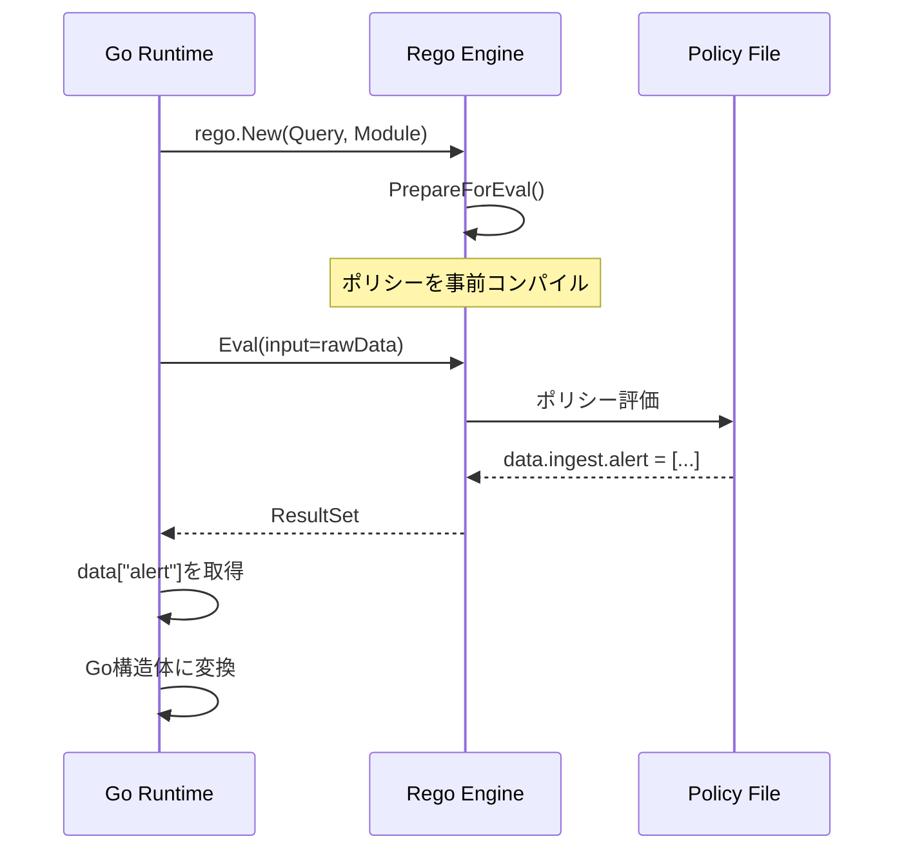
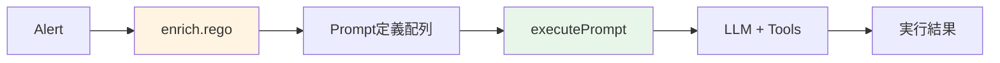

この記事はアドベントカレンダー「[Goで作るセキュリティ分析LLMエージェント](https://adventar.org/calendars/11354)」の17日目です。

今回のコードは https://github.com/m-mizutani/leveret の [day17-workflow](https://github.com/m-mizutani/leveret/tree/day17-workflow) ブランチに格納されていますので適宜参照してください。

前回（Day16）では、セキュリティアラート分析のためのAIワークフローを設計しました。`ingest` → `enrich` → `triage` という3フェーズ構成で、決定性のある処理と生成AIの柔軟な判断を組み合わせるアプローチを提案しました。

本記事では、Day16で提案した `ingest` → `enrich` → `triage` の3フェーズ構成を、GoのワークフローエンジンとOPA/Regoポリシーで実装していきます。OPA/Regoを選択した理由は、Day16で述べたように、宣言的なポリシー記述によってコードとロジックを明確に分離できる点にあります。既存のツールを活用することで、独自のDSLを作るよりもメンテナンス負担を大幅に軽減できます。今回はあくまで実装例という位置づけなので、必要に応じて他のルールエンジン、あるいはワークフローエンジンを利用してください。

OPA/Regoの概念、文法などについて知りたい方は[公式ドキュメント](https://www.openpolicyagent.org/docs/policy-language)意外にも、拙著[OPA/Rego入門](https://zenn.dev/mizutani/books/d2f1440cfbba94)もご参考いただければと思います。

# 全体アーキテクチャ

ワークフロー機能は `pkg/workflow/` パッケージに実装します。UseCaseレイヤーに密着した形で実装する手もありますが、今回はわかりやすさを重視してパッケージとして分離しました。実装コード全体は長いため、本記事では要点を抽出して解説します。全体のコードはリポジトリを参照してください。

以下の図は、1つのアラートが生成された場合のデータフローを示したものです。実際には、Ingestフェーズで複数のアラートが生成されることもあり、その場合は各アラートに対してEnrich→Triageが独立して実行されます。各フェーズでRegoポリシーの評価を実施し、その結果に応じて必要な処理や分岐を入れています。**Ingestフェーズ**は1回の入力から0個以上のアラートを生成し（0個の場合は棄却）、**EnrichフェーズとTriageフェーズ**は生成された各アラートに対して個別に実行されます



# Regoの基本

本格的な実装に入る前に、Regoの基本概念を簡単に説明します。

Regoはポリシー記述に特化した宣言的言語で、「条件を満たすものをセットに追加する」というスタイルで記述します。今回のワークフローでは、`package` キーワードで名前空間を宣言し、`ingest`, `enrich`, `triage` という3つのパッケージに分けています。

基本構文は以下の通りです。

- **`if` ブロック**: 複数の条件をAND条件として評価します
- **`contains`**: 条件を満たす場合、指定された内容をセット型の変数に追加します
- **セット型変数**: 0個以上のデータを格納し、次のフェーズへ渡します

例えば `alert contains { ... } if { 条件 }` という記述は、「条件を満たす場合に `alert` セットへデータを追加する」という意味になります。条件を満たさない場合は何も追加されず、結果として0個のアラートが生成されます（棄却）。

# Ingestフェーズの実装

Ingestフェーズは生データを受け取り、アラートとして処理すべきものを抽出する最初のゲートです。アラートとして処理しない場合は棄却（破棄）されます。

## 実装の設計方針

Ingestフェーズが解決する課題は主に3つあります。第一は、データ形式の正規化です。様々な形式の入力データを統一的なAlert構造体に変換します。第二は、複数アラートへの分解です。1つのJSONに複数の検知結果が含まれる場合（例：GuardDutyのfindings配列）、これらを個別のアラートとして分離します。第三は、事前フィルタリングです。明らかに不要なアラート（開発環境のテストなど）を早期に棄却します。

これらの処理をRegoポリシーで宣言的に記述することで、運用中のルール調整が容易になります。

## Regoポリシーの実装パターン

Ingestフェーズのポリシーは `ingest.rego` に記述します。以下に3つの典型的なパターンを示します

```rego
package ingest

# パターン1: 単一アラートの生成
alert contains {
    "title": input.title,
    "description": input.description,
    "attributes": [
        {"key": "severity", "value": input.severity, "type": "string"},
    ],
} if {
    # 本番環境かつseverityがHIGHの場合のみアラートを生成
    input.environment == "production"
    input.severity == "HIGH"
}

# パターン2: 配列を複数アラートに展開
alert contains {
    "title": sprintf("Finding: %s", [finding.title]),
    "description": finding.description,
    "attributes": [
        {"key": "source_ip", "value": finding.resource.instanceDetails.networkInterfaces[0].publicIp, "type": "ipaddr"},
        {"key": "finding_id", "value": finding.id, "type": "string"},
    ],
} if {
    # findings配列の各要素を展開
    some finding in input.findings
    finding.severity >= 4  # severity 4以上のみ
    finding.resource.instanceDetails.networkInterfaces[0].publicIp != null
}

# パターン3: 複合条件による判定
# 本番環境かつタイトルが空でない場合のみ通す
alert contains {
    "title": input.title,
    "description": input.description,
    "attributes": [],
} if {
    input.environment == "production"
    input.title != ""
}
```

## Goランタイムでの評価

Regoポリシーを評価するGoの実装を見ていきます。実装のポイントは以下の3つです。

1. **事前コンパイル**: `PreparedEvalQuery`を使って初期化時にポリシーを事前コンパイルしておくことで、実行時のオーバーヘッドを削減します。毎回Regoファイルをパースする必要がなくなり、評価のたびに実行すべきルールを探索する処理も省略できます。
2. **型変換**: 評価結果は`map[string]any`型として取得されるため、型アサーションを使ってGo構造体に変換します。`json.Marshal/Unmarshal`でも同様のことができますが、Regoの評価結果は型が保証されているため、型アサーションを使うことで不要なエラーハンドリングを避けています。実際の実装では、型アサーションの失敗に備えてエラーハンドリングを追加する必要があります（例: `alertMap, ok := a.(map[string]any)` でチェック）。
3. **空結果の扱い**: `alert`セットが空の場合は棄却を意味し、これはエラーではなく正常な動作です


```go
func (e *Engine) runIngest(ctx context.Context, rawData any) (*IngestResult, error) {
    // 1. Regoポリシーを評価（inputとしてrawDataを渡す）
    rs, err := e.ingestPolicy.Eval(ctx, rego.EvalInput(rawData))
    if err != nil {
        return nil, err
    }

    // 2. 評価結果から"alert"セットを取得
    data := rs[0].Expressions[0].Value.(map[string]any)
    alertData := data["alert"]  // Regoのalertセット
    alerts := alertData.([]any)

    // 3. Go構造体に変換
    result := &IngestResult{Alert: make([]*IngestedAlert, 0, len(alerts))}
    for _, a := range alerts {
        alertMap := a.(map[string]any)
        result.Alert = append(result.Alert, &IngestedAlert{
            Title:       alertMap["title"].(string),
            Description: alertMap["description"].(string),
            Attributes:  parseAttributes(alertMap["attributes"]),
        })
    }
    return result, nil
}
```

上記の実装は、実際には初期化フェーズと実行フェーズに分かれます。初期化フェーズでは`rego.New()`でRegoエンジンを生成し、`PrepareForEval()`でポリシーを事前コンパイルします。実行フェーズでは、`Eval()`で生データを入力として評価し、結果セットから`alert`を取り出してGo構造体に変換します。以下の図は、この一連の流れを示したものです。




# Enrichフェーズの実装

Enrichフェーズは、アラートに対する追加調査をLLMエージェントに実行させるフェーズです。Enrichフェーズの特徴は、**プロンプトの定義**と**プロンプトの実行**を分離している点です。Regoはポリシー評価に特化しているため、LLMとのやり取りはGoランタイム側で実装する必要があります。



この分離により、以下の役割分担が実現されます。

- **Regoポリシー**：「何を調査するか」を宣言的に記述
- **Goランタイム**：「どう実行するか」を手続き的に処理

## Regoポリシーでのプロンプト定義

`enrich.rego` では、アラートの内容に応じて実行すべきプロンプトを動的に生成します。`prompt` セットに格納されたオブジェクトがそれぞれ1つのタスクとして扱われます。

各プロンプトオブジェクトには以下の3つのフィールドがあります。

- **`id`**: 調査タスクの識別子。例えば、Triageフェーズで `result.id == "check_ip_reputation"` のように特定の調査結果を参照する際に使用します。
- **`content`**: LLMに発行する具体的なプロンプト内容。元アラートの情報はデフォルトでプロンプトに含まれるため、追加で必要な調査内容や観点を指示します。
- **`format`**: 応答形式（`text` または `json`）。`json`を指定すると構造化データとして取得でき、後続のTriageフェーズでの解析が容易になります

```rego
package enrich

# パターン1: 属性値に基づく調査
prompt contains {
    "id": "check_ip_reputation",
    "content": "Check the reputation of IP addresses found in the alert using threat intelligence tools. Summarize any malicious indicators.",
    "format": "text",
} if {
    # IPアドレス属性が存在する場合のみ
    some attr in input.attributes
    attr.type == "ipaddr"
}

# パターン2: JSON形式での構造化応答
prompt contains {
    "id": "domain_analysis",
    "content": "Analyze the domain using threat intelligence. Return JSON with keys: domain, threat_score (0-10), categories (array).",
    "format": "json",
} if {
    some attr in input.attributes
    attr.type == "domain"
}

# パターン3: アラート内容に応じた調査
prompt contains {
    "id": "assess_urgency",
    "content": "Assess the urgency of this unauthorized access. Consider: 1) Time of day, 2) Affected resource, 3) Access pattern.",
    "format": "text",
} if {
    contains(input.title, "unauthorized")
    not contains(input.title, "test")  # テストアラートは除外
}
```

## プロンプトの実行

Regoで定義されたプロンプトをLLMで実行します。Function Callingの詳細は別の回で解説済みなので、ここではEnrichフェーズでの利用方法に焦点を当てます。

```go
func (e *Engine) executePrompt(ctx context.Context, prompt AgentPrompt, alert *model.Alert) (string, error) {
    // 1. プロンプトテンプレートでシステム指示を構築
    systemInstruction := buildInstructionFromTemplate(prompt, alert)

    // 2. ツール付きでLLMを設定
    config := &genai.GenerateContentConfig{
        SystemInstruction: genai.NewContentFromText(systemInstruction, ""),
        Tools:             e.registry.Specs(),
    }

    // 3. Function Callingループで調査（詳細は別回で解説済み）
    result := runFunctionCallingLoop(ctx, config)

    // 4. format="json"の場合はクリーニング
    if prompt.Format == "json" {
        result = cleanJSONResponse(result)
    }

    return result, nil
}
```

`cleanJSONResponse`は、LLMがMarkdownのコードブロック記法（```json）で囲んで返した場合にそれを除去し、純粋なJSON文字列に整形する処理です。

### プロンプトテンプレート（`prompt/enrich.md`）

プロンプトはMarkdownファイルとして管理し、Go標準の`embed`パッケージで埋め込んで `text/template` パッケージで構築すると、メンテナンス性が向上します。テンプレート内の `.PromptContent` にRegoで定義したタスク内容を差し込み、アラート情報を構造化して提供することで、LLMが必要な情報にアクセスできるようにします

```markdown
You are a security analyst assistant. Execute the following task:

{{ .PromptContent }}

## Alert Information
**Title:** {{ .Alert.Title }}
**Description:** {{ .Alert.Description }}

## Attributes
{{- range .Alert.Attributes }}
- **{{ .Key }}:** {{ .Value }} (type: {{ .Type }})
{{- end }}
```

# Triageフェーズの実装

Triageフェーズは、Enrichの結果を踏まえて最終判定を行います。

## Regoポリシーの実装

`triage.rego`では、Enrichフェーズの調査結果（`input.enrich`）を参照しながら最終判定を行います。

ポリシーの書き方の基本はIngestやEnrichと同じですが、IngestやEnrichと異なり、Triageフェーズで扱う `action`, `severity`, `note` はセット型ではなく、単一の文字列値を持つ点に注意が必要です。Regoでは同じ変数に複数の異なる値を代入すると評価エラーになります（変数は一度束縛されると変更できません）。`default` キーワードで指定したデフォルト値は例外で、他のルールで上書きされない場合にのみ使用されます。もし複数のルールで評価した結果から最も重大度の高い値を選択したい場合は、セット型にしてGoのランタイム側で判定処理を実装するという手もあります。

Triageフェーズでは2つの入力データにアクセスできます。`input.alert` にはアラート自体の情報（title、description、attributes）が含まれています。

`input.enrich` にはEnrichフェーズの実行結果が配列形式（`[]{ "id": "...", "result": "..." }`）で格納されています。Enrich結果の中身はテキストまたはJSON文字列なので、`contains` 関数で文字列検索したり、`json.unmarshal` でパースして構造化データとして扱ったりできます

```rego
package triage

default action = "accept"
default severity = "medium"
default note = ""

# パターン1: アラート内容による判定
action = "discard" if {
    contains(input.alert.title, "maintenance")
}

# パターン2: Enrich結果を参照した判定
severity = "critical" if {
    some result in input.enrich
    result.id == "check_ip_reputation"
    contains(result.result, "malicious")  # Enrichで"malicious"が見つかった
}

severity = "high" if {
    contains(input.alert.title, "unauthorized")
    not contains(input.alert.title, "test")
}
```


Goでの評価は、IngestやEnrichと同様に`Eval()`で評価し、結果から`action`/`severity`/`note`を取得します。

# ワークフローエンジンの統合

## ポリシーの読み込みと事前コンパイル

ワークフローエンジンは、起動時に3つのフェーズに対応するRegoファイルを読み込んで事前コンパイルします。

Regoはファイル名やファイルパスに依存しない設計になっているため、指定したディレクトリ以下から全てのRegoファイルを読み込み、クエリだけを事前に各フェーズに振り分けます。`PrepareForEval()` メソッドで事前コンパイルすることで、実行時のオーバーヘッドを削減できます。ポリシーファイルが存在しない場合は `nil` を返しますが、これはエラーではなく正常な動作です。この場合、該当フェーズの評価はスキップされ、デフォルトの動作（例: 全アラートを通過させる）が実行されます。クエリは `data.<package名>` という形式で指定します。これはRegoの評価モデルで、`data`名前空間以下に各パッケージの評価結果が格納されるためです（例：`data.ingest.alert`、`data.enrich.prompt`、`data.triage.action`）

```go
// loadPolicies loads all Rego files from policyDir and prepares queries for each phase
func loadPolicies(ctx context.Context, policyDir string) (ingest, enrich, triage *rego.PreparedEvalQuery, err error) {
	// Read all .rego files from the directory
	files, err := filepath.Glob(filepath.Join(policyDir, "*.rego"))
	if err != nil {
		return nil, nil, nil, goerr.Wrap(err, "failed to glob policy files")
	}

	if len(files) == 0 {
		// No policy files found, return nil for all phases
		return nil, nil, nil, nil
	}

	// Load all policy files as modules
	modules := make([]func(*rego.Rego), 0, len(files))
	for _, file := range files {
		data, err := os.ReadFile(file)
		if err != nil {
			return nil, nil, nil, goerr.Wrap(err, "failed to read policy file", goerr.Value("path", file))
		}
		modules = append(modules, rego.Module(file, string(data)))
	}

	// Prepare query for ingest phase
	ingest, err = prepareQuery(ctx, modules, "data.ingest")
	if err != nil {
		return nil, nil, nil, goerr.Wrap(err, "failed to prepare ingest query")
	}

	// Prepare query for enrich phase
	enrich, err = prepareQuery(ctx, modules, "data.enrich")
	if err != nil {
		return nil, nil, nil, goerr.Wrap(err, "failed to prepare enrich query")
	}

	// Prepare query for triage phase
	triage, err = prepareQuery(ctx, modules, "data.triage")
	if err != nil {
		return nil, nil, nil, goerr.Wrap(err, "failed to prepare triage query")
	}

	return ingest, enrich, triage, nil
}

// prepareQuery prepares a Rego query with all loaded modules
func prepareQuery(ctx context.Context, modules []func(*rego.Rego), query string) (*rego.PreparedEvalQuery, error) {
	// Build Rego options
	options := make([]func(*rego.Rego), 0, len(modules)+1)
	options = append(options, rego.Query(query))
	options = append(options, modules...)

	r := rego.New(options...)

	prepared, err := r.PrepareForEval(ctx)
	if err != nil {
		return nil, goerr.Wrap(err, "failed to prepare query", goerr.Value("query", query))
	}

	return &prepared, nil
}
```


## Execute関数：3フェーズの実行

`Execute` 関数は、ワークフロー全体を制御する関数です。Ingestフェーズは1回だけ実行し、0個以上のアラートを生成します。EnrichフェーズとTriageフェーズは、生成された各アラートに対して独立して実行されます。今回の実装では各アラートを順次処理していますが、実運用では `go` キーワードで並列実行し、処理速度を向上させることも可能です。各フェーズの結果は最終的に `WorkflowResult` 構造体に集約されます

```go
func (e *Engine) Execute(ctx context.Context, rawData any) ([]*WorkflowResult, error) {
    // Phase 1: Ingest（生データ → Alert配列）
    ingestResult, _ := e.runIngest(ctx, rawData)
    if len(ingestResult.Alert) == 0 {
        return nil, nil  // 棄却された
    }

    // 各アラートに対してEnrich + Triageを実行
    results := []*WorkflowResult{}
    for _, alert := range ingestResult.Alert {
        // Phase 2: Enrich（Alert → 調査結果）
        enrichResult, enrichExecution, _ := e.runEnrich(ctx, alert)

        // Phase 3: Triage（Alert + 調査結果 → 判定）
        triageResult, _ := e.runTriage(ctx, alert, enrichExecution)

        results = append(results, &WorkflowResult{
            Alert:           alert,
            EnrichResult:    enrichResult,
            EnrichExecution: enrichExecution,
            Triage:          triageResult,
        })
    }
    return results, nil
}
```


# 実践：サンプルワークフローの実行

## 実行フローの例

以下の例では、アラートを事前検査し、関連ログが見つからなかった場合にTriageフェーズで `discard` として棄却するように設定しています。実運用ではここまで厳格な判定は行わないケースも多いですが、動作確認用としてこのようなポリシーを定義しています

```bash
$ go run . new -i examples/alert/scc.json --policy-dir examples/policy-scc

━━━━━━━━━━━━━━━━━━━━━━━━━━━━━━━━━━━━━━━━━━━━━━━━━━━━━
📥 INGEST PHASE
━━━━━━━━━━━━━━━━━━━━━━━━━━━━━━━━━━━━━━━━━━━━━━━━━━━━━
✅ Generated 1 alert(s)
   1. SCC: Execution: Cryptocurrency Mining Hash Match

━━━━━━━━━━━━━━━━━━━━━━━━━━━━━━━━━━━━━━━━━━━━━━━━━━━━━
📋 ALERT 1/1: SCC: Execution: Cryptocurrency Mining Hash Match
━━━━━━━━━━━━━━━━━━━━━━━━━━━━━━━━━━━━━━━━━━━━━━━━━━━━━

🔍 ENRICH PHASE
   🤖 Task 1/1: bigquery_impact_analysis
      🔧 Tool: bigquery_run
  📊 BigQuery: 0 rows, 0 MB scanned

#######（BigQueryでログを検索し、該当ログが0件だったことを確認）#########

   ✅ Executed 1 enrichment task(s)
      1. bigquery_impact_analysis: {
  "result": "false_positive",
  "reasoning": "BigQuery ret...

⚖️  TRIAGE PHASE
   🗑️ Action: discard
   ℹ️ Severity: info
   📝 Note: False positive: BigQuery returned 0 matching logs for the specified resource and time frame (2025-11-08 04:23:47 UTC to 2025-11-08 06:23:47 UTC) containing keywords 'xmrig', 'pool.minexmr.com', or '185.220.101.42'. This strongly suggests that the activity described in the alert did not actually occur or was not logged within the specified period, leading to a false positive verdict based on the log evidence.

Alert: SCC: Execution: Cryptocurrency Mining Hash Match
  Action: discard, Severity: info
  Note: False positive: BigQuery returned 0 matching logs for the specified resource and time frame (2025-11-08 04:23:47 UTC to 2025-11-08 06:23:47 UTC) containing keywords 'xmrig', 'pool.minexmr.com', or '185.220.101.42'. This strongly suggests that the activity described in the alert did not actually occur or was not logged within the specified period, leading to a false positive verdict based on the log evidence.
  → Discarded (not saving to database)
```

各フェーズが順次実行され、最終的にアラートが保存されます。

# 実装のポイントと拡張

## Regoテスト（`opa test`）

Regoポリシー自体の単体テストは`opa test`コマンドで実行できます。例えば`ingest_test.rego`として以下のようなテストを記述します。

```rego
package ingest_test

import data.ingest

# テストケース: GuardDutyアラートが正しく処理される
test_guardduty_alert {
    result := ingest.alert with input as {
        "type": "Trojan:EC2/DropPoint!DNS",
        "severity": 8,
        "region": "ap-northeast-1",
        "accountId": "123456789012",
        "service": {"serviceName": "guardduty"},
        "resource": {"resourceType": "Instance"},
    }

    result.title == "GuardDuty: Trojan:EC2/DropPoint!DNS"
    count(result.attributes) == 4
}

# テストケース: テストアラートは除外される
test_test_alert_filtered {
    result := ingest.alert with input as {
        "environment": "development",
        "test": true,
        "service": {"serviceName": "guardduty"},
    }

    count(result) == 0  # ルールにマッチしない
}
```

実行方法は以下の通りです。

```bash
opa test examples/policy/
```

このテストにより、ポリシーロジックをGoランタイムから独立してテストできます。


## 運用のポイント

ワークフローを実運用で活用する際には、いくつかの重要なポイントがあります。

### プロンプトの調整

プロンプトは期待通りの動作を実現するために、十分な調整が必要です。実際に運用してみると、LLMが思ったとおりに動いてくれないケースが多々あります。これはモデル自体の性能の問題もありますが、多くの場合はプロンプトに含まれるコンテキスト情報が不足していることが原因です。アラートの背景情報や期待する調査の観点を明確に記述することで、精度が向上します。

### Gitでのポリシー管理

Regoファイルはバージョン管理システム（VCS）で管理し、変更履歴を追跡できるようにしておくべきです。ポリシーをコードと同様にGitで管理することで、変更の理由や影響範囲を追跡でき、問題が発生した際のロールバックも容易になります。これも、ワークフローの実装とビジネスロジックを分離する理由の一つです。

### ログとモニタリング

どのルールでマッチしたかを記録し、どのようなプロンプトが生成され、それに対してどのような応答があったかをログとして残すことが重要です。このデータが蓄積されていれば、あとからプロンプトやポリシーをチューニングする際の貴重な参考情報になります。特に、誤検知や見逃しが発生した際の原因分析に役立ちます。

### ポリシーのチューニングへの生成AI活用

ポリシーのチューニング作業自体にも生成AIを活用できます。ポリシーのスキーマやルールを事前にLLMに入力し、かつ具体的な事例を提示すると、適切なルール修正案を提案してくれます。ただし、Regoは比較的マイナーな言語であるため、完全に独自のDSL言語を使う場合に比べれば有利ですが、それでも生成AIの対応精度には限界がある点に注意が必要です。


# まとめ

Day16で設計したAIワークフローをGoとOPA/Regoで実装しました。実装の核心は、Ingest/Enrich/Triageの3フェーズ処理と、**RegoによるロジックとGoによる実行基盤の分離**にあります。この分離により、開発者はエンジンの改善に集中でき、運用担当者はRegoファイルの編集だけでビジネスロジックを調整できます。再コンパイル不要でポリシーを更新できるため、アラート分析ルールの改善サイクルを高速化できます。

「入力の正規化」→「外部情報による拡充」→「最終判定」という処理パターンは、セキュリティ以外の定型業務にも応用可能です。例えばカスタマーサポートでは、Ingestで問い合わせチケットから製品名・エラー内容・契約プランを抽出し、Enrichでナレッジベースから類似事例を検索したりシステムログで障害状況を確認したりして、Triageで緊急度・対応部署・エスカレーション要否を判定するといった流れが考えられます。LLMによる柔軟な調査が必要な業務であれば、このアーキテクチャの恩恵を受けられます。

実運用では、最初から完璧を目指さず、小さく始めて運用データをもとに改善していくアプローチが効果的です。
