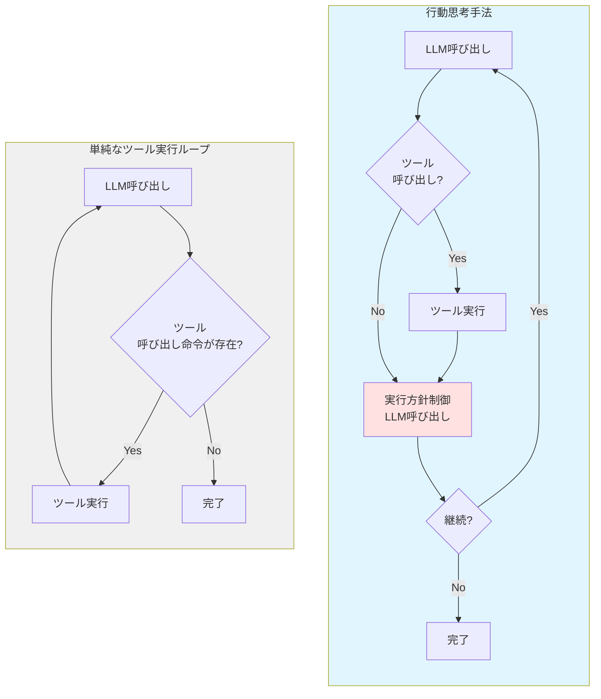
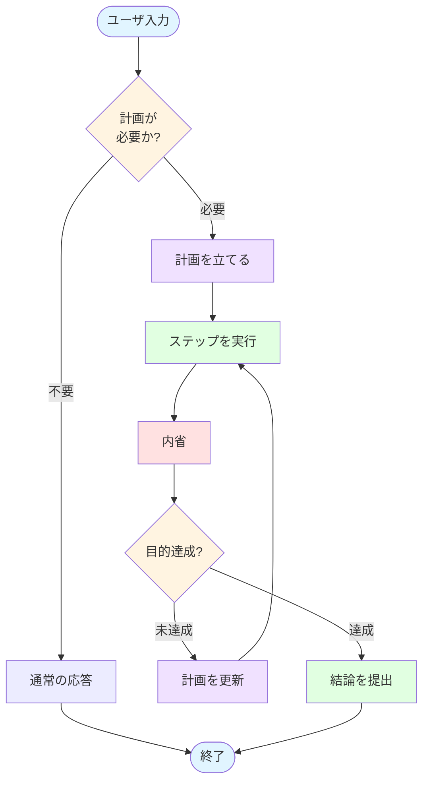

この記事はアドベントカレンダー「[Goで作るセキュリティ分析LLMエージェント](https://adventar.org/calendars/11354)」の18日目です。

# LLMエージェントの実行における迷走

これまで実装してきたFunction Callingのループは、短く明確なタスクであれば問題なく完了します。しかし、やや複雑な処理や複数の要件が絡むタスクになると、エージェントが迷走を始めることがあります。具体的には、本来の目的から横道にそれて関係ない処理を始めたり、何かを頑張っているようには見えるものの、よくわからない作業を延々と続けたりする現象です。このような目的からの逸脱や非効率な探索が発生すると、タスクの完了に時間がかかったり、期待した結果が得られなくなったりします。

## 迷走が発生する原因

このような迷走が発生する原因はいくつか考えられます。

まず「Lost in the middle」と呼ばれる現象があります。これは入力データが大きくなりすぎると、コンテキストの真ん中あたりにある情報の優先度が低くなってしまう現象です。LLMは一般的にコンテキストの最初と最後の情報に注意を向けやすく、中間部分の情報を見落としやすい傾向があります。これは注意機構(Attention Mechanism)における位置バイアスとして知られる特性です。プロンプトに目的が含まれていても、大量のツール実行結果やログデータなど他の情報に埋もれて部分的に忘れられてしまうことがあります。

次に、会話履歴が長くなりすぎた場合の問題があります。多くのLLMにはコンテキストウィンドウの上限(例えば128Kトークンなど)があり、その制限に対処するため履歴を圧縮する必要があります。この圧縮過程で本来の目的が見失われてしまうケースがあります。要約によって適切に目的を残すよう指示しても、大量のデータを要約する際には重要な文脈が失われやすくなります。単純なトリミング(古い履歴を削除する方式)を採用した場合は、タスクの目的そのものが削除されてしまうなど、さらに深刻な問題が発生する可能性があります。

また、LLMは直近の履歴に強く影響される傾向があります。これは「Recency Bias(新近性バイアス)」として知られる現象で、最新の情報に過度に重みを置いてしまう特性です。そのため、一度おかしな推論をしたり誤った仮説を立てたりすると、その誤った方向性が直近の履歴に記録され、それに基づいてさらに誤った推論を重ねていってしまいます。最悪の場合、本来の目的から完全に外れたまま戻ってこなくなることもあります。

# LLMエージェントの行動思考手法

こうした迷走を防ぐために、LLMエージェントの行動を制御する手法がいくつか存在します。これらは「LLM Agent Architectures」や「Reasoning Strategies」などと英語では呼ばれています。本アドベントカレンダーでは、これらを総称して「行動思考手法」と呼ぶことにします。

行動思考手法の基本的なアイデアは、単純にツール実行を繰り返すのではなく、ツール実行の合間にさらにLLMによるコンテンツ生成を挟み込むというものです。その生成結果によって次の行動を選択していきます。具体的には、ここまでの要約を与えたり、フルヒストリを与えたりなど様々な手法がありますが、共通するポイントは「タスクの実行とは別に、実行方針の制御も生成AIで行う」という点です。下記の図が単純なループと行動思考手法を組み込んだループの違いのイメージ図です(実際にはより詳細な制御が発生します)。

## 代表的な行動思考手法

筆者が知る範囲では、メジャーな行動思考手法として以下のようなものがあります。

**ReAct (Reason + Act)** は、思考と実行を繰り返す汎用的な手法です。各アクションの前に「なぜそのアクションを実行するのか」という思考過程を明示的に生成させます。Function Callingと比較すると、ReActでは思考過程をテキストとして履歴に明示的に含められます。これにより、エージェントの意思決定プロセスがよりクリアになり、デバッグやトラブルシューティングが容易になります。一方、Function Callingは最新のLLM機能を活用しており構造化されたJSON形式で確実にツールを呼び出せるという利点があります。ReActの本質は、推論ステップを明示的にプロンプトに示して制御することにありますが、これは履歴管理の一種とも言えます。

**Reflexion** は、自己評価と改善を繰り返すループ型の手法です。実行するたびに「結果が目的を達成したか」を自己評価し、達成できていなければ何が問題だったのかを内省します。その内省結果(例えば「データベースクエリの条件が狭すぎた」など)を次の試行に反映させて再実行を繰り返していきます。この試行錯誤のプロセスにより、正解が明確でない探索的な処理に適しています。

**Plan & Execute** は、計画フェーズと実行フェーズを分離することで、計画に沿ったタスクをこなす手法です。最初に全体の実行計画を立て、その計画に従って順次タスクを実行していきます。安定的に動作する反面、探索的なタスクには弱いという特徴があります。初期計画が基本的に静的なため、実行中に予期しない状況が発生した場合の適応が困難です。またタスクが順次実行されるため、独立したタスクを並列実行して高速化するといった最適化も難しくなります。

研究分野も含めると、より多様な手法が存在します。ただし、本記事では実装の詳細に集中するため、理論的な詳細には立ち入りません。また、最新の研究成果についても追随できていません(そもそも、ここに書いてもあっという間に陳腐化してしまいます)。興味がある方は、arXivやHugging Faceのブログなどで最新の研究動向を追うことをお勧めします。

## 手法の組み合わせ

2025年現在の最新のエージェントでは、これらの手法を組み合わせたり、必要に応じて切り替えたりしながら利用しています。例えば、「明確な目標があるタスクにはPlan & Execute、試行錯誤が必要なタスクにはReflexionを使う」といったタスクの性質による使い分けや、「Plan & Executeで分解した個別のステップの実行にReflexionを使う」といった階層的な組み合わせなどが考えられます。万能な行動思考手法は存在せず、タスクやユースケースに応じた最適手法に関しての研究が進んでいる状況です。

# Plan & Executeパターンの利用

今回のアドベントカレンダーではLLMエージェントにPlan & Executeの手法を組み込んでいきます。

## セキュリティアラートの分析と Plan & Execute パターン

### Plan & Executeを採用する理由

今回のLLMエージェントでは、事前に計画を立てて遂行していくPlan & Executeパターンを採用します。この選択は、対象とする「セキュリティアラートの分析」というユースケースの性質に依存しています。セキュリティアラート分析の典型的なフローは以下のようになります。

1. **アラートの受信と初期分析**: セキュリティアラートが飛んでくると、その時点で何らかの問題が発生している可能性が示唆されています。アラートには問題の種類に関する情報が含まれており、問題に関する手がかり(IPアドレス、ユーザー名、ファイルハッシュなど)が記されています。

2. **影響の有無を確認**: その手がかりをもとに、アラートが実際に影響を及ぼしたのかを調査します。これには関連するログやシステムの状態を調べることや、問題のリソースに関する社内のアクティビティを調べることが含まれます。

3. **影響範囲の特定**: もし影響があると判断された場合は、影響の範囲を調べます。アラートに関連するリソースや主体がどのような行動をしていたかを調査します。

ここで重要なのは、この作業は実はあまり探索的ではないという点です。ここでいう「探索的」とは、「新しい情報を取得してそれを元に次の行動を変更・決定する、というのを連続してやるもの」という意味です。アラートを見た時点で、アクセス可能なデータソースから調査すべき情報は概ね定まっています。

もちろん、何か見つけた際に深堀りが必要になったり、期待していたデータが発見されなかったので調査方針を修正したりすることはあります。しかし、まず初手として以下のような方針は、熟練のアナリストであればおおむねあたりをつけられると筆者は考えています。例えば、GuardDutyのUnauthorizedAccess検知が発生した場合、まずVPCフローログとCloudTrailを確認するといった具合です。

- 実際のアクセスログを確認する
- 脅威インテリジェンスでIPアドレスの評判を調べる
- 該当ユーザーの直近の行動履歴を確認する

この性質から、まず計画を立てることが重要です。むしろ、一つの事象に囚われてあちこちで余計な深堀りを始めるほうが、調査の方向性を見失いやすく効率的ではありません。また、影響範囲の特定についても、最初に探すべきキー(検索条件)とデータベースは容易に推定できるため、事前計画と相性が良いのです。

なお、個別のタスクについてはさらに深堀りする可能性があります。ただし、ポイントはタスク全体ではなく個別のタスクの中で深堀りしていくという点です。この場合、Plan & ExecuteとReflexionを組み合わせるという手法も考えられますが、複雑になるため、今回はPlan & Executeだけに集中します。

### Plan & Execute が適さないユースケース

一方で、Plan & Execute では難しいユースケースもあります。例えば全く無の状態から始めるタイプの脅威ハンティングでは、全く違った戦略が必要になります。この場合、そもそも大量のデータからどうやって分析するかの取っ掛かりをいかに作るかが問題となります。

こういうケースでは、少なくとも初手では生成AIを使わない方が良いかもしれません。例えば、従来の機械学習手法(クラスタリング、異常検知アルゴリズムなど)を使い、怪しい点にまず目星をつけるというアプローチが考えられます。これは、生成AI・LLMが大量データの処理に弱いという特徴があるためです。

具体的には、まずコンテキストウィンドウの制約により、数千行以上の大量のログを一度に見ることができません(例えば128Kトークンのモデルでは、1トークンあたり平均4文字として約50万文字分のテキストが限界です)。また、「異常検知」のようなタスクにも弱い傾向があります。LLMは個別のデータに対する推論は得意ですが、複数データ全体を俯瞰して統計的に異常を見つけたり、類似パターンをグルーピングしたりすることは苦手です。具体的に「不正なログイン試行のような挙動」といった形でパターンを定義し、順次ログを与えていくと検知してくれる場合もありますが、大量のログを処理する際の時間とAPIコストが問題になることが多いのです。このように、LLMエージェントを使った問題解決では、依然としてデータをどう扱うのが最適なのか人間がしっかり考える必要があります。

## 全体の流れ

Plan & Executeパターンの全体の流れは、大まかに以下のステップで構成されます。計画必要有無の判定、計画、実行、内省、最終結果の提出という流れです。実行と内省をループし、タスクが完了したと判断されたら最終結果提出へ遷移します。

### (0) まず計画が必要かどうか判定する

本来はPlan & Executeの範疇ではありませんが、計画が必要かどうかを事前に判定するのは重要なテクニックです。Plan & Executeは計画→実行→反省というループを繰り返すため、一ラウンドだけでも最低3〜4回のLLMクエリが発生します(計画作成、ステップ実行、内省、結果提出)。そのため、「今日の天気は?」のような非常に単純な質問や、ツールを使わなくて良いような質問でも、なんでもかんでもPlan & Executeにすると応答時間が数倍かかってしまいます。

APIコストの問題もありますが、それ以上にユーザ体験が悪化します。単純な質問に数十秒待たされるのは、ユーザにとってストレスです。そこで、一番最初にそもそもPlan & Executeを実施する必要があるかを判定します。もし必要無ければ通常のFunction Callingループで良いことになります。この判定は(1)の計画立案と同時にやっても構いません(「計画が必要ならその計画を返し、不要ならnullを返す」といった形式)。ポイントとしては、現在のユーザ入力だけでなく、過去の会話履歴などの文脈も見て判断する必要があるという点です。

### (1) 計画をたてる

ユーザーからの入力をもとに計画を立てます。この1度のユーザの入力によって起きる一連の作業を、今回は説明のため「タスク」と呼ぶことにします(異なる命令は異なるタスクとして扱います)。

計画を立てる際には、なるべくシステムプロンプトで豊富なコンテキストを与えてあげると良いでしょう。具体的には、AIのロール(「あなたはセキュリティアナリストをサポートするアシスタントです」など)、分析の方針(「疑わしい活動を見逃さないことを優先する」など)、組織やインフラ・環境に関する情報(「AWSとGCPを利用している」など。これらは設定ファイルや環境変数で管理することが多いです)、ログのDBなどのデータソースに関する情報(「BigQueryに過去90日分のログがある」など)、利用可能なツールのリスト、そして分析対象のアラートのデータなどです。

また、計画を立てる方針も明示的に指示する必要があります。どういうタスクの分解が良く、どういうものが悪いかという説明(「1ステップは1つの具体的な調査に対応すること」など)、実際の具体例をいくつか示すFew-shot学習、あまり細かく分類しすぎないようにという注意(「10ステップ以内を目安にする」など)、ユーザの目的を達成することを最優先するという指示、そして存在するツールしか使わないという制約などです。この最後の制約を与えないと、LLMが存在しない「check_malware」のような架空のツールをでっち上げ始めることがあります。LLMが架空のツールを作り出すと、無駄な工程を続けたり誤った分析結果を出力したりする原因になります。

計画の生成はLLMに行わせます。計画に必要な要素は目的と手順の一覧です。まず `goal` フィールドでユーザの意図を解釈させます。例えば、ユーザが単に「このアラートを調査して」と言った場合でも、LLMに「不正アクセスの可能性を確認し、影響範囲を特定する」といった具体的な目的を解釈させるわけです。この目的の明確化が、計画全体の方向性を定めます。

次に `steps` フィールドでタスクを分解した作業を定義します。例えば「BigQueryから送信元IPアドレスに関連するアクセスログを抽出する」「AlienVault OTXでIPアドレス x.123.4.56の脅威情報を調べる」といった具体的な粒度で分解します。各ステップには以下の要素を含めます。

- `id`: ステップの識別子(例: "step1", "step2")。これは後の内省フェーズで「step2をキャンセルする」といった操作を指定するために利用します
- `description`: 具体的にどういうステップかの説明。実行者(人間またはエージェント)が何をすべきか明確にわかる記述にします
- `tools`: 利用を期待するツールのリスト。これは入れるのが良い場合と悪い場合があります。明確に使うツールを限定したい場合(「BigQueryツールだけを使う」など)は有効ですが、逆に探索要素が入り込む場合は縛りになってしまうことがあります(「どのツールを使うかは状況次第」という場合)。これはプロンプトとのバランスで調整します
- `expected`: どのような結果を期待するかの情報をあらかじめ設定させます(「該当するログが1件以上見つかる」「IPアドレスの評判スコアが取得できる」など)。これによって、そのタスクが目的を達成したのか、それとも失敗したのかを判定する指標にします。これは後の計画見直しフェーズで、「期待した結果が得られなかったので別のアプローチを試す」といった判断に利用されます

### (2) ステップを実行する

ステップ実行は、これまで実装してきたエージェントのループと基本的に同じです。ただし、ポイントとして履歴の扱いをどうするかという議論があります。主に以下の3つの選択肢が考えられます。

**(a) 全履歴を取り込んで残す方式**では、エージェントがコンテキストを十分に理解できるという利点があります。過去のステップで得られた情報をすべて参照できるため、情報の重複取得を避けたり、過去の失敗から学んだりできます。一方で、過去に変な行動をした場合(誤ったツールを呼び出したなど)の影響を引きずることになります。またコンテキスト消費が激しくなり、ステップ数が増えるとコンテキストウィンドウを圧迫します。さらに前のタスク(別のユーザ命令)での影響も受けやすくなります。これには良い面と悪い面があり、「前回のタスクでこのIPアドレスは調査済み」という情報を活用できる反面、前回の誤った判断を引きずる可能性もあります。

**(b) そのタスク内の他の実行結果を要約して渡す方式**では、各ステップのdescription、実行結果、得られた重要な情報などを構造化して要約し、それを次のステップに提供します。例えば「step1: BigQueryから3件のログを取得。送信元IPは x.123.4.56」といった形です。この方式では、すでに保持している情報を改めて探すという無駄が発生しなくなります。一方で、細かいコンテキスト(ツール呼び出しの詳細な経緯など)までは引き継がれません。失敗した処理の詳細が引き継がれないため、同じ失敗を繰り返す可能性があります。

**(c) まったく履歴を引き継がない方式**では、各ステップが完全に独立した作業になります。過去のステップの影響をまったく受けないため、各ステップを並列実行できる可能性があります。しかし、タスクの記述がかなり具体的で自己完結的でないとうまく動きません(「step1で取得したIPアドレスを使う」といった依存関係が表現できない)。

諸説ありますが、今回は折衷案の(b)を採用します。ただし、タスクによっては(a)や(c)、あるいはもっと別の手段を取ることも可能です。

### (3) 内省をする

ステップ実行によって得られた結果とこれまでの履歴、そしてこのタスクの目的を持ち寄って内省を行います。この反省・内省ステップをPlan & Executeに含めるべきかという議論はあります(Plan & Execute & Reflectionと呼ぶこともあります)が、実際にはやはり内省を挟んだ方が良いでしょう。

内省を行うことで、調査によって新たにわかったことをもとにステップを追加したり(これはそれほど多くない想定ですが)、すでに明らかになって不要になった未完了ステップをキャンセルしたり、タスクの目的がすでに達成されていたら早期終了したりできます。一度のクエリを挟むので応答時間が長くなります(通常数秒から数十秒追加されます)が、やる価値は大きいと言えます。

基本的に内省に必要なのは以下の情報です。まず `achieved` フィールド(真偽値)で、今回完了したステップによってすでに全体の目的を達成したかを判定します。例えば、5ステップ中3ステップ目まで完了した時点で「すでに不正アクセスではないことが確認できた」という場合、残りのステップを実行せずに早期終了できます。

次に `plan_updates` フィールドで計画をどう更新するかを定義します。これには既存ステップの修正、あるいは新規ステップの追加が含まれます。ここでどのステップを操作するのかを指定するために、各ステップの `id` が必要になります。更新の仕方は「追加」(新しいステップを挿入)と「変更」(既存ステップの内容を更新)を設けます。ステップのキャンセルも「変更」として扱い、ステップ自体はリストに残しておくようにします(status: "cancelled" のようなフラグを立てる)。そうすると、「step2をキャンセルしたのにまたstep2を追加する」といった無駄な往復を防げます。

内省フェーズにおけるポイントとして、タスクの更新についてもちゃんとポリシーを与える必要があります。例えば、「データソースに対象が見つからない場合、3つまで別のデータソースを試したら諦める」といった形で、どのくらいまで深追いするかを明示しておきます。また、「失敗したステップと同じアプローチを二度試さない」「ただし、異なるパラメータであれば再試行してもよい」といった指示も与えておいた方が良いでしょう。さらに、プラン作成時の指示・制約(「10ステップ以内」など)と平仄をそろえておくことも重要です。これによって、初期計画と内省フェーズで追加されるステップの粒度や品質が一貫します。

### (4) 結論の提出

`achieved` が `true` になったら、そこで完了してユーザに報告する結論をまとめます。これは要するに、一連の思考プロセスを経て得られた結論となります。これまでの各ステップの実行結果をもとに、最終的な分析結果を生成します。

## 発展的なトピック

### 並列実行

Plan & Executeの利点として並列実行がよく挙げられますが、今回扱いません。ステップ分解することのメリットの一つは、独立したステップを並列に実行できることですが、これをやるためには依存関係を扱う必要があります。

依存関係にもとづく並列実行は、単純に実装ロジックがそれなりに複雑です。また、競合関係のステップがないかどうかも考慮しなければなりません。これがLLMに正しく判定できるのかは疑わしいところがあります。今回はPlan & Executeの方式を学ぶことに集中するため、並列実行は対象外とします。ただし、今回のユースケースは主に参照系で競合も発生しないため、興味のある人は実装してみても良いと思います。

# まとめ

Plan & Executeのような高度な制御手法は、方法論としては確立されていますが、実際には細かい調整をする余地が様々あります。例えば、履歴をどう扱うか、内省フェーズをどの粒度で挟むか、計画の更新をどこまで許容するかなど、設計上の選択肢が多数存在します。またこれらのプロンプトもユースケースやステップによって異なるため、意外と簡単な話ではありません。

さらに難しいのは、利用するユーザのメンタルモデルにも依存するという点です。ユーザが「エージェントは自律的に判断してほしい」と期待しているのか、「明確な計画を示して承認を求めてほしい」と期待しているのかで、適切な実装が変わってきます。ユーザの期待とエージェントの機能や動作がうまく合致していないと、たとえ技術的に優れていても効果が期待できません。このあたりはまだベストプラクティスが完全に確立しているわけではなく、効果的なエージェントを作るには実際に使ってみて様々な調整を繰り返していくしかないというのが現状です。

次回の実装編では、これらの設計判断を具体的なコードに落とし込んでいきます。