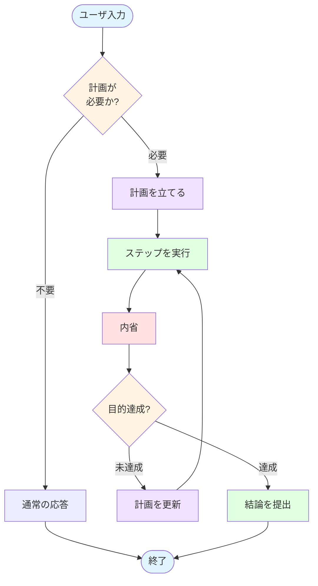

この記事はアドベントカレンダー「[Goで作るセキュリティ分析LLMエージェント](https://adventar.org/calendars/11354)」の19日目です。

今回のコードは https://github.com/m-mizutani/leveret の [day19-plan-execute](https://github.com/m-mizutani/leveret/tree/day19-plan-execute-impl) ブランチに格納されていますので適宜参照してください。また今回は前日の設計に基づいた実装となっているため、先にそちらの記事を閲覧されることをおすすめします。

# Plan & Executeの実装の大まかな流れ

Plan & Executeパターンの実装を理解するため、まず具体的な処理の流れを見ていきます。前日の記事で提示した以下のフローチャートを、実際のコードでどのように表現しているのかを確認していきましょう。



このフローの中核を担うのが `sendWithPlanExecute` という関数です。この関数は既存の `Send` メソッドとは別に実装されており、従来の通常ループを壊すことなくPlan & Executeパターンを導入できるようになっています。

```go:pkg/usecase/chat/session.go
// sendWithPlanExecute executes the plan & execute mode
func (s *Session) sendWithPlanExecute(ctx context.Context, message string) (*PlanExecuteResult, error) {

	// Initialize plan & execute components
	planGen := newPlanGenerator(s.gemini, s.registry)
	conclusionGen := newConclusionGenerator(s.gemini)

	// Step 1: Generate plan
	fmt.Printf("\n📋 計画を生成中...\n")
	plan, err := planGen.Generate(ctx, message, s.alert)
	if err != nil {
		return nil, goerr.Wrap(err, "failed to generate plan")
	}
	displayPlan(plan)
```

この段階でまず実行計画を作成し、ユーザに提示します。計画生成には専用の `planGen` ジェネレーターを使用しており、ユーザからのメッセージとアラート情報を入力として受け取っています。

```go
	// Step 2-4: Execute plan with reflection loop
	results, reflections, err := executeStepsWithReflection(ctx, s.gemini, s.registry, plan)
	if err != nil {
		return nil, err
	}
```

計画の提示が完了したら、次は `executeStepsWithReflection` 関数によるツール実行と計画修正(Reflection)のループに入ります。このループでは、各ステップを1つずつ実行し、そのたびに結果を振り返って計画の調整が必要かどうかを判断していきます。

```go
	// Step 5: Generate conclusion
	fmt.Printf("\n━━━━━━━━━━━━━━━━━━━━━━━━━━━━━━━━━━━━━━━━━━━━━━━━━━━━━\n")
	fmt.Printf("📝 結論を生成中...\n")
	fmt.Printf("━━━━━━━━━━━━━━━━━━━━━━━━━━━━━━━━━━━━━━━━━━━━━━━━━━━━━\n\n")

	conclusion, err := conclusionGen.Generate(ctx, plan, results, reflections)
	if err != nil {
		return nil, goerr.Wrap(err, "failed to generate conclusion")
	}
```

すべてのステップの実行が完了したら、最後にループから得られた情報をもとに結論を生成します。結論生成では、元の計画、各ステップの実行結果、そして内省の結果をすべて統合して、ユーザに提示する最終的な回答を作成します。

ここまでが計画から結論までの流れですが、前日の設計で触れた(0)の「Plan & Executeを使うかどうかの判定」については、`sendWithPlanExecute` ではなく元の `Send` メソッド側に実装しています。具体的には、`Send` メソッドの冒頭でLLMに問い合わせることで、通常のループで処理するかPlan & Executeで処理するかを自動的に選択しています。なお、この判定にはLLMへのAPI呼び出しが必要なため、メッセージ送信ごとに若干のコストとレイテンシが発生します。実運用で問題になる場合は、ユーザに明示的にモード選択させる実装も検討できます。

```go
func (s *Session) Send(ctx context.Context, message string) (*genai.GenerateContentResponse, error) {
	// Check if plan & execute mode should be used
	if shouldUsePlanExecuteMode(ctx, s.gemini, message, s.history.Contents) {
		// Use plan & execute mode
		result, err := s.SendWithPlanExecute(ctx, message)
		if err != nil {
			return nil, goerr.Wrap(err, "Plan & Execute mode failed")
		}
		// Plan & Execute mode succeeded
		// Convert to response format (create a synthetic response)
		return s.createResponseFromPlanExecute(result), nil
	}
```

この判定には以下のようなプロンプトを送ります。シンプルに "yes" または "no" で回答させる形式になっていますが、もちろん構造化出力でboolean型として答えさせることも可能です(今回はシンプルさを優先してテキスト判定としています)。重要なのは、どういう処理がPlan & Executeに適していて、どういうものが通常の会話ループに適しているのかという事例を示して判断させている点です。この判定でyesが返ってきた場合はPlan & Executeで実行し、そうでなければ通常のループへ分岐します。

```go
// shouldUsePlanExecuteMode determines if plan & execute mode should be used
func shouldUsePlanExecuteMode(ctx context.Context, gemini adapter.Gemini, message string, history []*genai.Content) bool {
	// Use LLM to judge if the message requires systematic multi-step execution
	systemPrompt := `You are evaluating whether a user's request requires systematic multi-step execution (Plan & Execute mode) or can be handled with direct conversation.

Plan & Execute mode is needed when:
- Multi-step tasks or operations are required
- Complex tasks combining multiple tools or actions
- User requests deep or thorough work ("in detail", "thoroughly", "investigate", "analyze")
- Systematic data collection or processing is necessary

Plan & Execute mode is NOT needed when:
- Simple questions or confirmations
- Questions about already displayed information
- Simple viewing or checking
- Single-step operations
- Follow-up questions in an ongoing conversation

Respond with ONLY "yes" or "no".`
```

ここまでが全体の処理の流れです。以降では、各フェーズの実装を詳しく見ていきます。

# 履歴の管理

それぞれの処理の各論に入る前に、履歴の管理について整理しておきます。ここまでは実行ループだけが存在し、全ての行動と処理が一つのセッションで継続していました。履歴もそのセッションに紐づけられ永続化されてきました。では今回のPlan & Executeのような行動思考手法の場合はどうでしょうか？

行動思考手法を実装する際、履歴をどう管理するかは非常に重要なポイントです。ここまで見てきた通り、履歴は文脈を伝えるための重要な手段ですが、同時にいくつかのデメリットも存在します。過去の判断に引きずられて誤った方向に進んでしまったり、APIコストが増加したり、プロンプト全体が長くなることでコンテンツ生成の精度がぼやけたりする問題があります。そのため、すべての処理に履歴を渡すのではなく、必要なところでのみ履歴を投入すべきです。

Plan & Executeパターンでは、計画生成、処理実行、内省、結論生成という各フェーズでそれぞれ異なるアプローチを取ります。履歴管理においては、以下の2つの観点から考慮する必要があります。

まず1つ目は、処理実行時にこれまでの履歴を利用するかどうかです。すべての履歴を使うか、一部の履歴だけ(例えばそのタスク内で生成されたものだけ)を使うか、あるいは履歴をまったく使わないかという選択があります。

2つ目は、処理完了時にその履歴を引き継ぐかどうかです。次のフェーズや次のタスクで参照する必要がある場合は履歴を保持しますが、残す必要がなければそのまま履歴を捨ててしまうこともできます。

これらの調整方法には様々なアプローチがあり一概には正解がありませんが、おおよその方向性を持つことは重要です。以下の表に本実装での方針をまとめました。これはあくまで一例であり、異なる実装方法も十分にありえます。

| フェーズ | 履歴利用 | 履歴引き継ぎ | 理由 | 実装での対応 |
|---------|---------|------------|------|------------|
| (1) 計画をたてる | ✅ YES | ❌ NO | 過去の文脈から重複調査を避けるため履歴を参照するが、計画生成は内部的な分析プロセスなので引き継がない | `plan_generator.go`: `planGen.Generate(ctx, message, s.alert, s.history.Contents)` で履歴を渡すが、計画生成後は履歴に追加しない |
| (2) ステップを実行する | ✅ YES | ✅ YES | ツール実行結果を保持し、後続のステップで参照できるようにする | `step_executor.go`: ツール呼び出しとその結果を `contents` に追加し、次のツール呼び出しに引き継ぐ。`previousResults` として参照可能 |
| (3) 内省をする | ❌ NO | ❌ NO | 現在のステップの結果のみに基づいて内省を行い、履歴は引き継がない | `reflector.go`: ステップ結果と計画のみを使用し、新しいセッションで内省を実行 |
| (4) 結論の提出 | ❌ NO | ✅ YES | タスクの実行結果のみで結論を生成するが、最終的な回答として履歴に残す | `session.go`: 結論生成後、ユーザメッセージと結論を `s.history.Contents` に追加 |

(3) 内省で履歴利用を「NO」としているのは、全体の会話履歴は使わず、その時点でのステップ実行結果のみを使うという意味です。同様に (4) 結論の提出も、全体の会話履歴ではなくそのタスクで得られた結果だけを利用します。

(2) のステップ実行での履歴の取り扱いは以下のような実装になっています。

```go:pkg/usecase/chat/step_executor.go
// Create initial user message
userMessage := fmt.Sprintf("Execute this step: %s", step.Description)
contents := []*genai.Content{
	genai.NewContentFromText(userMessage, genai.RoleUser),
}

// Tool Call loop
for i := 0; i < maxIterations; i++ {
	// ... LLM呼び出し ...
	resp, err := gemini.GenerateContent(ctx, contents, config)

	for _, candidate := range resp.Candidates {
		// Add assistant response to history
		contents = append(contents, candidate.Content)

		for _, part := range candidate.Content.Parts {
			if part.FunctionCall != nil {
				// ツール実行...
				funcResp, execErr := executeTool(ctx, registry, *part.FunctionCall)
				// ...
				functionResponses = append(functionResponses, &genai.Part{FunctionResponse: funcResp})
			}
		}
	}

	// Add all function responses as a single Content
	if len(functionResponses) > 0 {
		funcRespContent := &genai.Content{
			Role:  genai.RoleUser,
			Parts: functionResponses,
		}
		contents = append(contents, funcRespContent)
	}
}
```

各ステップの実行内では、ツール呼び出しとその結果が `contents` に追加されていき、それが次のツール呼び出しに引き継がれます。この履歴は1つのステップの実行が終われば破棄されず、同じタスク内の次のステップ実行にも渡されます (`previousResults` として参照可能)。これにより、「前のステップでこのIPアドレスを調査済み」といった文脈を保持しながら処理を進められます。


# Plan & Execute の各処理の実装

## 計画生成

計画生成のプロンプトは、LLMにどのような振る舞いを期待しているのかを明確にすることから始まります。

```md
# Plan Generation

## Your Role

You are a security analyst assistant. Your role is to support security alert analysis and create systematic plans for various tasks.
```

ここでは分析者そのものではなく、「サポートする立場」「プランを立てるもの」という役割を与えています。実際にツールを実行するわけではないので、そこは明確に分けておく必要があります。このセッションは計画作成のみを実施し、その後そのまま破棄されます。続いてユーザのリクエストおよびアラートに関する情報を記載します。ユーザのリクエストは他の情報に埋もれてはいけないので、専用のセクションを設けるなどして強調しておく必要があります。アラートについては構造体をそのまま掲載してもよいのですが、ある程度の説明を加えておくとさらに精度が向上します。

```md
## Task Philosophy

When the user requests analysis or investigation, typical goals include:

1. **Alert Validation**: Determine if it's a false positive or true positive (actual threat)
2. **Impact Assessment**: Identify affected resources and users
3. **Evidence Collection**: Gather supporting evidence from logs and external sources
4. **Action Recommendation**: Provide clear next steps

However, adapt your plan to match the user's specific request - not all tasks are investigations.
```

タスク実行のための方針もプロンプトに含めておきます。どういう行動を優先してほしいのか、何を知ろうとしているのかなどを事前に定義しておくことで、LLMの計画生成の精度が向上します。汎用的なPlan & Executeエンジンであればこのセクションは異なる形になりますが、今回のようにタスクがセキュリティ分析という領域にある程度絞れているからこそ、期待する行動を具体的に指示できるというメリットがあります。

```md
## Available Tools

You must only use tools from this list. Do not reference or plan to use any tools not listed below.

Available tools:

{{range .Tools}}
{{.}}
{{end}}
```

ツールの一覧もプロンプトで与えます。ここで重要なのは、Function Callingを設定しないという点です。なぜなら、このフェーズではツールを実行しないからです。しかし、ツールの情報がなければLLMは何ができるかわからず、実行計画を立てることができません。場合によっては存在しないツールを使おうとして処理が失敗することもあります。適切な計画を練らせるためには、ツールに限らず必要な事前情報を過不足なく伝えることが重要です。

```md
### Example Patterns

**Vague Request** ("investigate this alert"):
→ 2-3 steps: IOC checks, log review, pattern search
→ Include ALL investigation angles you think might be useful - you won't get a second chance

**Specific Question** ("is this IP bad?"):
→ 1 step: Direct query to available threat intel tool
```

計画を立てるパターンもいくつか例示しておくことで、利用者が想定する計画の建て方とLLMの生成する計画との齟齬を小さくできます。例えば、色々調べてほしいのに狭い範囲しか探索しようとしなかったり、あるいは些細な質問に対してめちゃくちゃ長い計画を立ててしまったりといった問題を防ぐことができます。このあたりは利用者のメンタルモデルとの調整でもあります。例えば、コーディングエージェントの動きを知っている利用者は、エージェントにいろいろよしなにやってほしいと期待するかもしれません。逆に、各LLMサービスのWebチャットに慣れている利用者は一問一答形式を想定するため、なるべく短い計画を期待すると思われます。

```json
{
  "objective": "Clear statement of investigation goal",
  "steps": [
    {
      "id": "step_1",
      "description": "Specific action to take",
      "tools": ["tool_name_1", "tool_name_2"],
      "expected": "What this step should achieve"
    }
  ]
}
```

最後に出力形式を例示しておきます。この後スキーマでも形式を定義するため必須ではありませんが、例を入れておくことでさらに精度が向上します。特に `description` や `expected` のように入力が自由形式のフィールドは、例を示すことでLLMにイメージさせやすくなります。別途、この例にのっとったスキーマも定義します。スキーマは Required/Optional や型を明示的に示すという役割があり、例示とスキーマの両方を組み合わせることで、最も安定した構造化出力が得られます。

```go:pkg/usecase/chat/plan_generator.go
ResponseSchema: &genai.Schema{
	Type: genai.TypeObject,
	Properties: map[string]*genai.Schema{
		"objective": {
			Type:        genai.TypeString,
			Description: "Investigation objective",
		},
		"steps": {
			Type:        genai.TypeArray,
			Description: "List of investigation steps",
			Items: &genai.Schema{
				Type: genai.TypeObject,
				Properties: map[string]*genai.Schema{
					"id": {
						Type:        genai.TypeString,
						Description: "Step ID (e.g., step_1)",
					},
					"description": {
						Type:        genai.TypeString,
						Description: "Step description",
					},
					"tools": {
						Type:        genai.TypeArray,
						Description: "List of tools to use",
						Items: &genai.Schema{
							Type: genai.TypeString,
						},
					},
					"expected": {
						Type:        genai.TypeString,
						Description: "Expected outcome",
					},
				},
				Required: []string{"id", "description", "tools", "expected"},
			},
		},
	},
	Required: []string{"objective", "steps"},
},
```

このスキーマは、前述のJSON例と対応しています。`steps` の各要素に対して `id`、`description`、`tools`、`expected` をすべて必須フィールドとして定義しており、これによりLLMが不完全な計画を生成することを防いでいます。

出力に含まれる `objective` フィールドも重要です。ユーザの発言は非常に曖昧なことも多いため、まずそのセッションにおけるタスクを明確化します。この目的を使って、各ステップ終了時に「目的が達成できたか」を確認することで、セッションが長くなっても迷走しなくなります。

```go
// Create content with history + new request
contents := make([]*genai.Content, 0, len(history)+1)
contents = append(contents, history...)
contents = append(contents, genai.NewContentFromText(buf.String(), genai.RoleUser))

// Generate plan
resp, err := p.gemini.GenerateContent(ctx, contents, config)
if err != nil {
	return nil, goerr.Wrap(err, "failed to generate plan")
}
```

この計画生成では、これまでの履歴を与えることが重要です。なぜなら、履歴がないと、すでに調査して判明している情報を再度探しにいくことになってしまうからです。過去の会話でIPアドレスの評判を確認済みであれば、それを再度確認する必要はありません。場合によっては、追加調査なしで履歴の情報だけから回答できることもあります。

一方で、この計画生成セッションの履歴は引き継ぐ必要がありません。計画の生成は内部的な分析プロセスであり、その思考過程を後続の処理に残しておく必要はないためです。

## 内省

ツールの実行に関してはこれまでの記事でも扱ってきたので割愛します。ここでは実行結果を得た後に、それに基づいて計画を修正させる内省(Reflection)のプロセスを見ていきます。

内省のプロンプトでは、まず最初の目的を示します。これをもとに、現在のステップで目的が達成されたかどうかを判定します。また、以下のようにこれまで完了したステップとその結果、まだ未完了のステップを提示します。これらの情報をもとに、LLMに計画の修正を提案させます。重要なのは、既に完了したステップと未実行のステップを明示することで、重複したステップの追加を防ぐという点です。

```md
# Step Reflection

You need to reflect on the execution of an investigation step and determine if plan adjustments are needed.

## Investigation Objective

**Goal**: {{.Objective}}

## Step Information

**Step ID**: {{.StepID}}
**Description**: {{.StepDescription}}
**Expected Outcome**: {{.StepExpected}}

## Current Plan Status

**Already Completed Steps**:
{{if .CompletedSteps}}
{{range $index, $step := .CompletedSteps}}
{{add $index 1}}. {{$step}}
{{end}}
{{else}}
(None yet)
{{end}}

**Pending Steps**:
{{if .PendingSteps}}
{{range $index, $step := .PendingSteps}}
{{add $index 1}}. {{$step}}
{{end}}
{{else}}
(None)
{{end}}

Do not add steps that duplicate already completed or pending steps. Always check the lists above before adding new steps.
```

内省の回答は以下のような構造になります。

```json
{
  "achieved": true/false,
  "insights": [
    "New insight or discovery 1",
    "New insight or discovery 2"
  ],
  "plan_updates": [
    {
      "type": "add_step",
      "step": {
        "id": "step_2a",
        "description": "Description of additional investigation",
        "tools": ["tool_name"],
        "expected": "Expected outcome"
      }
    }
  ]
}
```

- `achieved` フィールドでは、すでに目的を達成したかどうかを判定します。ステップの途中であっても、すでに目的が達成されていれば無駄に実行を重ねる必要はないため、この判定が重要になります。
- `insights` フィールドには、全体の実行計画には影響しないものの、最終的な結論を出すときに利用する発見や解釈を記録します。例えば、データに関する解釈や、調査で判明した事実などがここに入ります。
- `plan_updates` フィールドでは、プランの更新を指示します。ステップの追加・更新・削除を選択でき、さらにどのように変更するべきかの具体的な指示も表記します。

この結果に基づいてデータ構造内の計画を更新し、それに応じて次の実行を行います。もし `achieved` が true になっていたり、計画がすべて実行済みだったりした場合は、結論提出のフェーズに移行します。

実装では、内省ループは以下のような流れで動作します。

```go:pkg/usecase/chat/plan_execute_helpers.go
func executeStepsWithReflection(
	ctx context.Context,
	gemini adapter.Gemini,
	registry *tool.Registry,
	plan *Plan,
) ([]*StepResult, []*Reflection, error) {
	results := make([]*StepResult, 0)
	reflections := make([]*Reflection, 0)

	// Execute steps dynamically - find next pending step each iteration
	for {
		// Find next pending step
		currentStepIndex := findNextPendingStep(plan)
		if currentStepIndex < 0 {
			break
		}

		// Execute the step
		result, err := executeStep(ctx, gemini, registry, plan, currentStepIndex, results)
		// ...
		results = append(results, result)
		plan.Steps[currentStepIndex].Status = StepStatusCompleted

		// Reflect and potentially update plan
		reflection, err := reflectAndUpdatePlan(ctx, gemini, registry, plan, currentStepIndex, result)
		// ...
		reflections = append(reflections, reflection)
	}

	return results, reflections, nil
}
```

各ステップの実行後、`reflectAndUpdatePlan` 関数が呼ばれ、内省の結果に基づいて計画を更新します。計画の更新処理は以下のように実装されています。

```go:pkg/usecase/chat/reflector.go
func applyUpdates(plan *Plan, reflection *Reflection) error {
	for _, update := range reflection.PlanUpdates {
		switch update.Type {
		case UpdateTypeAddStep:
			// Add step to the end
			plan.Steps = append(plan.Steps, update.Step)

		case UpdateTypeUpdateStep:
			// Find and replace step
			for i, step := range plan.Steps {
				if step.ID == update.Step.ID {
					plan.Steps[i] = update.Step
					break
				}
			}

		case UpdateTypeCancelStep:
			// Find and mark step as canceled
			for i, step := range plan.Steps {
				if step.ID == update.StepID {
					plan.Steps[i].Status = StepStatusCanceled
					break
				}
			}
		}
	}
	return nil
}
```

この仕組みにより、内省で得られた `plan_updates` が計画のデータ構造に反映され、次のループで新しく追加されたステップや更新されたステップが実行されるようになります。

## 結論提出

すべてのステップが完了したら、最終的な結論をユーザにフィードバックします。調査系のタスクであれば調査結果を、変更系のタスクであれば実施内容の報告を返すことになります。今回のセキュリティ分析の文脈では調査系のタスクが多いため、そちらに最適化したプロンプトチューニングを行っています。

結論生成で与えるべき情報は、今回のタスクで得られた一連の情報です。具体的には以下の要素が含まれます。

まず、タスクの目的です。これはユーザからの直接のクエリではなく、計画生成フェーズでLLMが整理した明確な目的を使います。次に、各ステップと実行結果、およびそのステータスです。ステータスには「実行しなかった」といった情報も含まれるため、なぜそのステップをスキップしたのかという文脈を提供できます。最後に、内省の結果、特に `insights` フィールドに記録された発見や、目的が達成されたと判定されたかどうかといった情報を含めます。

```md
# Conclusion

You have completed all steps of the task. Now synthesize the findings into a comprehensive conclusion.

## Objective

{{.Objective}}

## Steps Executed

{{range $index, $step := .Steps}}
### Step {{add $index 1}}: {{$step.ID}}
**Description**: {{$step.Description}}
**Status**: {{$step.Status}}
{{end}}

## Step Results

{{range .Results}}
### {{.StepID}}
**Success**: {{.Success}}
**Findings**:
{{.Findings}}

{{end}}

## Reflections

{{range .Reflections}}
### {{.StepID}}
**Achieved**: {{.Achieved}}
**Insights**:
{{range .Insights}}
- {{.}}
{{end}}
{{end}}
```

これらの情報をもとに最終的な結論を生成させます。今回の実装では以下のようにマークダウン形式で出力させていますが、これは出力形式の一例にすぎません。

```md
## Response Format

Respond directly with markdown-formatted text in Japanese. Do not wrap it in JSON.

**Example**:
\`\`\`
# 結論

## サマリー
このアラートは...

## 主要な発見
- 発見1
- 発見2

## 評価
...
```

セキュリティ分析の調査結果とある程度割り切ってしまえば、このようにフォーマットを指定するのも有効です。一方、より汎用的なシステムにするのであればフォーマットは指定しない方が柔軟性が高まります。あるいは、プログラマティックに処理したいという要望があるなら構造化出力にするという選択もあります。いずれにせよ、システムの特性や利用シーンに合わせて調整するのがよいでしょう。

結論が生成されたら、それを会話履歴に統合します。この統合処理により、Plan & Executeで得られた結果が次の会話で参照できるようになります。

```go:pkg/usecase/chat/session.go
// Add to history
// User message
userContent := &genai.Content{
	Role:  genai.RoleUser,
	Parts: []*genai.Part{{Text: message}},
}
s.history.Contents = append(s.history.Contents, userContent)

// Assistant response (conclusion)
assistantText := fmt.Sprintf("## 完了\n\n**目的**: %s\n\n%s", plan.Objective, conclusion.Content)

assistantContent := &genai.Content{
	Role:  genai.RoleModel,
	Parts: []*genai.Part{{Text: assistantText}},
}
s.history.Contents = append(s.history.Contents, assistantContent)
```

ユーザのメッセージと、生成された結論をアシスタントの応答として履歴に追加しています。このとき、計画の `objective` と結論の `content` を組み合わせた形で保存することで、後から「何を目的として何がわかったか」が明確にわかるようになっています。

ここで重要なのは、計画生成や内省の過程で生じた中間的なやりとり(どういう計画を立てたか、どう修正したか)は履歴に含めないという点です。履歴には最終的な結果だけを残すことで、履歴が無駄に肥大化するのを防ぎ、次の会話で参照する際の精度を保っています。

# 実行例

実際にPlan & Executeを動かした例を見てみましょう。以下は [examples/alert/scc_mini.json](https://github.com/m-mizutani/leveret/blob/day19-plan-execute-impl/examples/alert/scc_mini.json) のアラートに対して「Alertの脅威に関して調査して」というユーザ入力を与えた実行例です。

まず計画が生成されます。

```
📋 計画を生成中...
━━━━━━━━━━━━━━━━━━━━━━━━━━━━━━━━━━━━━━━━━━━━━━━━━━━━━
📌 計画
━━━━━━━━━━━━━━━━━━━━━━━━━━━━━━━━━━━━━━━━━━━━━━━━━━━━━

目的: 仮想通貨マイナーアラートの脅威を調査し、影響範囲と感染経路を特定する。

ステップ:
  1. アラートで検出されたIPアドレスとドメインについて、AlienVault OTXで脅威インテリジェンス情報を検索し、悪性度と関連する脅威活動を確認する。
     期待: IPアドレス (185.220.101.42) とドメイン (pool.minexmr.com) のレピュテーション、マルウェア関連情報、過去の活動履歴、および地理的位置情報を取得する。これにより、マイニングプールの悪性度と攻撃者の活動拠点に関する洞察を得る。
  2. 影響を受けたインスタンス (web-server-prod-01) のCompute Engineインスタンス関連ログ（Cloud Audit Logsなど）をBigQueryで検索し、マイナーが起動された時刻前後の不審なアクティビティ（ログイン履歴、コマンド実行、ファイル変更、設定変更など）を特定する。
     期待: インスタンスへの不正なアクセス、マイナーのデプロイ、または設定変更など、感染経路を示す可能性のあるログエントリを特定する。
  3. 過去のセキュリティアラートを検索し、今回のアラートと類似する仮想通貨マイニング活動や、同じ攻撃者（IPアドレス、ドメイン、プリンシパルメールなど）からのアラートが存在するか確認する。
     期待: 過去の同様の攻撃パターンや、今回の攻撃に関与している可能性のある他のリソースやアカウントを特定する。
```

曖昧な「調査して」という指示から、3つのステップからなる具体的な調査計画が生成されました。各ステップには明確な期待値も定義されています。

ステップ実行後、内省によって計画が動的に更新されます。

```
🔍 ステップ 2/3 (完了: 1): step_2
━━━━━━━━━━━━━━━━━━━━━━━━━━━━━━━━━━━━━━━━━━━━━━━━━━━━━
影響を受けたインスタンス (web-server-prod-01) のCompute Engineインスタンス関連ログ（Cloud Audit Logsなど）をBigQueryで検索し、マイナーが起動された時刻前後の不審なアクティビティ（ログイン履歴、コマンド実行、ファイル変更、設定変更など）を特定する。

   (... ツール実行 ...)

🤔 振り返り中...

💡 新たな洞察:
  - web-server-prod-01インスタンスのCompute Engine関連ログをCloud Audit LogsからBigQueryで検索しましたが、マイナーが起動された時刻前後の不審なアクティビティ（principal_email: attacker@external-domain.comに関連するアクティビティ、またはcurl/7.68.0のUser-Agentを持つイベントを含む）は見つかりませんでした。
  - 不審なアクティビティが見つからなかったため、現在のログソースと検索条件では感染経路を特定できませんでした。

📝 計画を更新中...
   1件の更新を適用しました

   ✅ 完了済み:
      1. アラートで検出されたIPアドレスとドメインについて、AlienVault OTXで脅威インテリジェンス情報を検索し、悪性度と関連する脅威活動を確認する。
      2. 影響を受けたインスタンス (web-server-prod-01) のCompute Engineインスタンス関連ログ（Cloud Audit Logsなど）をBigQueryで検索し、マイナーが起動された時刻前後の不審なアクティビティ（ログイン履歴、コマンド実行、ファイル変更、設定変更など）を特定する。

   📋 未実行:
      3. 過去のセキュリティアラートを検索し、今回のアラートと類似する仮想通貨マイニング活動や、同じ攻撃者（IPアドレス、ドメイン、プリンシパルメールなど）からのアラートが存在するか確認する。
      4. Cloud Audit Logsだけでなく、web-server-prod-01インスタンスのシステムログ（Syslog, journalctlなど）やアプリケーションログに不審なプロセス起動、ファイル作成、ネットワーク接続に関するログがないか確認する。
```

内省の結果、Cloud Audit Logsだけでは不十分だと判断され、新しいステップ4が動的に追加されました。このように、実行中の状況に応じて計画を調整しながら進めることができます。

最後に、全ステップの結果を統合した結論が生成されます。

```
━━━━━━━━━━━━━━━━━━━━━━━━━━━━━━━━━━━━━━━━━━━━━━━━━━━━━
📝 結論を生成中...
━━━━━━━━━━━━━━━━━━━━━━━━━━━━━━━━━━━━━━━━━━━━━━━━━━━━━

## 完了

**目的**: 仮想通貨マイナーアラートの脅威を調査し、影響範囲と感染経路を特定する。

# 結論

## サマリー

今回の仮想通貨マイナーアラートの調査を通じて、`web-server-prod-01` インスタンスが仮想通貨マイニングの脅威に晒されていることが確認されました。主要な脅威指標であるIPアドレス (`185.220.101.42`) とドメイン (`pool.minexmr.com`) は、それぞれマルウェア配布元および不正マイニング活動に悪用される正規のマイニングプールとして特定されました。しかし、Cloud Audit Logsや過去のアラート検索では直接的な侵入経路や類似の攻撃履歴は特定されず、インスタンスのシステムログへのアクセス制限により、詳細な感染経路の特定には課題が残りました。

## 主要な発見

1.  **脅威インテリジェンス情報**
    *   **IPアドレス (185.220.101.42):** ドイツに位置し、AlienVault OTXにて「Win32:Filecoder-AD」「Win.Malware.Cabby」などのトロイの木馬やファイルコーダーといった18件のマルウェア検知に関連付けられていることが判明しました。
    *   **ドメイン (pool.minexmr.com):** Monero (XMR) の正規のマイニングプールであり、Alexaランキングも高く、OTXではホワイトリストに登録されています。しかし、ClamAVで「Multios.Trojan.CryptocoinMiner」など多数のクリプトマイナーとして1688件ものマルウェア検知が関連付けられており、Microsoft Defenderでも「Trojan:Linux/CoinMiner」が検出されています。

## 評価

今回の仮想通貨マイナーアラートは、`pool.minexmr.com` という正規のマイニングプールを悪用した、既存の脅威キャンペーンの一部である可能性が極めて高いと評価されます。攻撃者は、まず `185.220.101.42` に関連するマルウェア（トロイの木馬やファイルコーダーなど）を利用して `web-server-prod-01` に侵入し、その後にシステムのリソースを不正に利用してMoneroのマイニングを行っていると考えられます。

(... 以下、不確実性と推奨事項 ...)
```

複数のステップで得られた情報が統合され、サマリー、主要な発見、評価、不確実性、推奨事項という構造化された形で調査結果が提示されています。このように、Plan & Executeによって一貫性のある深い調査結果を得られることがわかります。


# まとめ

Plan & Executeパターンの実装で最も重要なのは、**想定するタスクの性質に応じて、各フェーズで与える情報や指示を調整する**ことです。計画生成では「セキュリティアラート分析」という文脈を明示し調査の方針を示す一方で、Function Callingは設定せずツール一覧だけをテキストで与えます。内省では全体の履歴ではなく現在のステップ結果のみを見せます。このように、そのフェーズで本当に必要な情報だけを渡すことで、LLMの判断精度が向上します。

ここで難しいのが、想定タスクの抽象化と具体化のバランスです。今回は「セキュリティアラート分析」という具体的なユースケースに絞ったからこそ、計画生成で「Alert Validation」「Impact Assessment」といった典型的な目標を示せました。汎用的なPlan & Executeエンジンを目指すとこうした具体的な方針は書けませんが、その分LLMへの依存度が上がり精度が落ちます。逆に具体化しすぎると適用範囲が狭くなります。あなたのユースケースがどの程度の抽象度を持つのかを見極め、それに応じてプロンプトの具体性を調整することが実装の鍵になります。

もう1つ覚えておくべきは、`objective` フィールドによる目的の明確化です。ユーザの曖昧な指示を最初に明確な目的として定義し直し、それを各ステップの判断基準として使い続けることで、処理が長くなっても迷走を防げます。この「最初に目的を固める」というパターンは、Plan & Executeに限らず複数ステップを要する処理全般で有効です。
