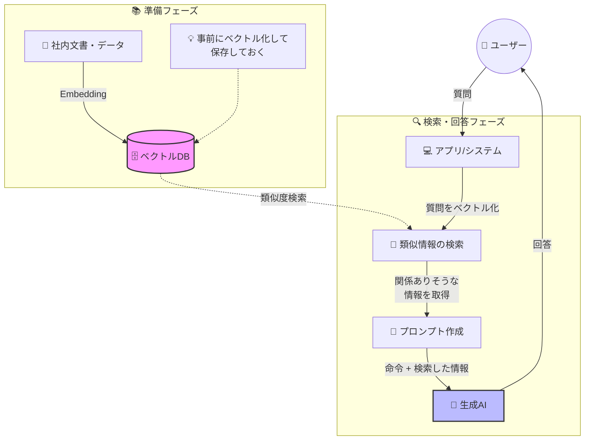

この記事はアドベントカレンダー「[Goで作るセキュリティ分析LLMエージェント](https://adventar.org/calendars/11354)」の20日目です。

今回のコードは https://github.com/m-mizutani/leveret の [day20-embedding](https://github.com/m-mizutani/leveret/tree/day20-embedding) ブランチに格納されていますので適宜参照してください。

# Embeddingについて

## Embeddingとはなにか

Embeddingとは、一言で言えば「言葉や文章の意味をベクトル化する技術」です。似た意味を持つ言葉や文章同士が、ベクトル空間上で近い位置に配置されるように計算される仕組みとなっています。たとえば「ペット」と「犬」は意味的に近いためベクトルの距離も近く、「犬」と「宇宙」は意味が離れているためベクトルの距離も遠くなります。同様に「ペット」と「宇宙」も遠い関係となります。こうした単語や文章のベクトル化技術は、生成AIが登場する以前から長く研究されてきました。初期のEmbedding技術であるword2vecやGloVeなどは、単語単位のベクトル化を中心としていましたが、文脈によって意味が変わる多義語への対応が弱く、文全体のベクトル化も苦手という制約がありました。その後、文章の流れ（文脈）を捉えるためにRNNやLSTMといったモデルが登場し、文全体の意味を扱えるようになりました。しかし長文になると精度が落ちるという課題が残っていました。

この状況を大きく変えたのがTransformerの登場です。Transformerによって文中の意味のつながりを効率良く理解できるようになり、文脈を考慮した高精度なEmbeddingが実現されました。TransformerはBERTやGPTなどの大規模言語モデルにも採用されている現在のLLMにおける重要な基礎技術の一つです。このため、LLMサービスと一緒にEmbedding機能が提供されることが多くなっています。たとえばGeminiやOpenAIはそれぞれEmbedding機能を提供しています。一方、Claudeは2025年現在ではEmbedding機能を直接提供しておらず、[Voyage AI](https://www.voyageai.com/)を利用することを推奨しています。

詳しい理論についてはこのアドベントカレンダーの範囲を超えるため扱いませんが、興味がある方は調べてみてください。

## RAG（Retrieval Augmented Generation）とはなにか

RAG(Retrieval Augmented Generation)とは、Embedding機能を活用してLLMへのプロンプトに必要な情報を検索・拡充する技術です。検索にはEmbeddingによる類似度検索が多く使われ、最終的にプロンプトを拡充するのがポイントです。

LLMにはコンテキスト限界の問題があるため、関連する情報を事前にすべて入力するのは困難です。そこで質問文から意味の近いデータを検索して、必要な知識を拡充したプロンプトを組み上げて回答させる、という一連の処理がRAGと呼ばれています。

RAGは一時期、コンテキスト限界の問題を一挙に解決する技術のようにもてはやされていました。しかしLLMの利用範囲がさらに拡大した結果、実際には適用範囲が限られることが判明しました。ユーザの質問に対して知識や事実情報を直接返す一問一答形式では有効ですが、複雑なタスク処理では必ずしも有用ではありません。たとえば今回のセキュリティ分析でも、ログやデータをAPI経由で取得する必要があるため、ユーザの入力にもとづいて知識や事実情報を補完したプロンプトを組み上げることが有用ではないケースも多くあります。

そのため、RAGそのものについてはLLMエージェントの目的に応じて使ったり使わなかったりということになります。今回のセキュリティ分析では従来のRAGはあまりそぐわないと考えられます。ユーザの入力から汲み取れる補完情報があまりないためです。しかしEmbeddingの技術自体は活用のしがいがあるため、それは有効活用していきます。



# セキュリティ分析におけるEmbeddingの利活用

## いわゆるRAGとしての活用は難しい

先述した通り、セキュリティ分析ではユーザ入力を起点としたプロンプト拡充というRAGの典型的なユースケースは適用しにくい状況です。プロンプトに拡充すべき知識が明確でないことや、組織内ドキュメントを事前ベクトル化するといった典型的な活用方法も適さないためです。

組織ポリシーやサービス環境の情報であれば、それほど大量のデータにはならず、事前にプロンプトに入れておけば十分な範囲です。もし大量の知識があって適宜与えたい場合でも、ユーザの入力から適切な情報を導出するのは難易度が高く、ツールとして検索システムを提供する方が現実的です。ただし、これはEmbeddingベースの検索である必要性は特になく、例えばドキュメント管理SaaSの検索機能で十分です。既存の検索機能が不十分な場合に、代替としてEmbeddingを活用するのは有効な選択肢となります。

また、IoC（Indicator of Compromise：侵害指標）のように1文字違いで意味が変わるデータが多く、完全一致検索を要する情報については、曖昧検索は不向きです。このような情報を扱う場合は、Embeddingベースの検索ではなく、ツールとしてSQLやAPIベースの検索システムを提供する方が現実的です。

これらの理由から、セキュリティ分析のために、プロンプト生成にEmbeddingを利用するユースケースは筆者の経験上ほとんどありません。もし有効な活用方法があればぜひ教えてください。

## 類似情報の検索機能としては有用

一方で、Embeddingを使った類似検索自体はかなり有用性の幅が広いと言えます。主な用途として、過去に発生した類似アラートの検索が挙げられます。アラートは構造化データですが、JSONに変換したものは普通にEmbeddingでベクトル化できます。これにより、たとえば「時刻やIPアドレスなどのパラメータが少しズレているが概ね似たようなアラート」というものを手軽に検索できるようになります。

### ユースケース1: ツールとして機能提供しエージェントに検索させる

エージェントが必要に応じて類似アラートを検索できるようにしておくことで、例えばそのアラートの影響を分析する際に、過去に発生した類似アラートの処理状況を容易に確認できるようになります。

パラメータを条件として検索させる方法も考えられますが、実装コストが高くなりがちです。ログ検索と同様に、スキーマやフィールドのメタ情報、サンプル値などを詳細に伝える必要があります。また一部のフィールドのみが一致し他の要素が大きく異なる結果を取得してしまう可能性もあります。もちろん意図的にこのような厳密な検索を実装することも有用です。

しかし「類似アラートを検索できる」という機能をツールとして提供することで、実装の手間に対して得られる価値が大きくなります。注意点としては、過去のアラートが適切に処理されている必要があります。処理が不適切な場合、検索結果から得られる情報も限定的になります。アラートをCloseする際に理由を記載するようにしておくと、その情報を有効活用できるようになります。

### ユースケース2: 類似するアラートを一括で処理する、あるいは統合する

実はこちらのユースケースのほうが実運用では非常に強力です。セキュリティアラート監視を運用していると、アラートが大量発生する場面に遭遇することがあります。よくあるパターンとしては以下のようなケースです。

- 検知設定が間違っていてアラートが暴発する
- たまたま何らかの攻撃にさらされてアラートが大量発生する
- 検知システム側のロジックが変更された影響でアラートが暴発する

こうした何らかの要因で大量発生した（しかし影響がないと確信できる）アラートを全て処理しなければならない状況になります。ひどいときは数千件になることもあり、これを1件ずつ確認してクローズするのは非現実的です。それでは一括でクローズすればよいかというと、それも難しい問題があります。まず「しれっと1件全然関係ないアラートが混ざっていないか？」という懸念があります。似たようなアラートであれば一括処理しても大丈夫と考えられますが、キーワード検索で絞り込もうとすると、同じ種類のアラートであってもまったく異なる状況のものが混ざってしまう可能性があります。このような処理の煩雑さがセキュリティ監視の滞りにつながることも珍しくありません（筆者もよく経験していました）。

この課題をEmbeddingを使って解決することができます。具体的には、一括クローズ対象のアラートを以下のような手順で検索します。まず類似度の閾値を設けて足切りします。例えば閾値を0.1以下に設定すると、非常に類似したアラートのみが抽出されます。次に、抽出されたアラートに対してさらにキーワードでフィルタをかけます。これは「似てはいるが、意図していないアラートが紛れていないか」を確認するためです。もちろんそれでも紛れ込む可能性は0ではありませんが、作業量を大幅に緩和できます。

このように類似度の閾値とキーワードフィルタを組み合わせることで、概ね意図した関連アラート一覧を抽出できます。これをクローズするなり、別のアラートにマージするなりすればシステム上まとめて処理できます。この方法は作業時間の削減だけでなく、精神的負担の軽減という観点でも大きな効率化になります。

# Embeddingの実装

今回はユースケース2として、類似アラートを検索する機能を実装します。検索後のクローズやマージといった処理は、本記事では扱いませんが、同様のアプローチで実装できます。ツールとして検索機能を提供する場合も基本的には同じ実装になるため、今回は説明を割愛します。

## Firestoreのindex作成

まずFirestoreでベクトル検索を使う場合、Indexを作成する必要があります。以下のコマンドを実行してください。なお、フィールド名とベクトルの次元数はこの時点で決定しておく必要があります。

また重要なポイントとして、そのフィールドが存在しない、あるいは0ベクトルのレコードが存在すると、Firestoreでは検索に失敗する点に注意してください。そのため、Embeddingを導入する際は新しいcollectionを使うか、既存レコードに後からEmbeddingを追加する処理が必要です。

```bash
gcloud firestore indexes composite create \
    --project=your-project \
    --database=your-database \
    --collection-group=alerts \
    --query-scope=COLLECTION \
    --field-config=vector-config='{"dimension":"768","flat": "{}"}',field-path=Embedding
```

## Embeddingの生成

Embeddingの生成は非常に簡単です。Geminiの場合は `EmbedContent` を呼び出すだけで完了します。注意すべきポイントは次元数の設定です。これはFirestore側で設定した次元数に合わせる必要があります。次元数を増やすほど細かい意味の違いを表現できますが、計算コストやストレージも増加します。一般的に512〜768次元で十分な精度が得られるため、今回は768次元を採用しています。

```go:pkg/adapter/gemini.go
func (g *GeminiClient) Embedding(ctx context.Context, text string, dimensions int) (firestore.Vector32, error) {
	config := &genai.EmbedContentConfig{}
	if dimensions > 0 {
		d := int32(dimensions)
		config.OutputDimensionality = &d
	}

	resp, err := g.client.Models.EmbedContent(ctx, g.embeddingModel, genai.Text(text), config)
	if err != nil {
		return nil, goerr.Wrap(err, "failed to embed content")
	}

	if len(resp.Embeddings) == 0 {
		return nil, goerr.New("no embeddings returned")
	}

	return firestore.Vector32(resp.Embeddings[0].Values), nil
}
```

## Alertへの埋め込み

次に、アラートデータにEmbeddingを埋め込みます。実装は以下のようにシンプルで、`PutAlert` する直前にEmbeddingを生成して格納しているだけです。

```go
// Generate embedding vector from original alert data
embedding, err := u.gemini.Embedding(ctx, string(jsonData), 768)
if err != nil {
    return nil, goerr.Wrap(err, "failed to generate embedding")
}
alert.Embedding = embedding

if err := u.repo.PutAlert(ctx, alert); err != nil {
    return nil, err
}
```

Go実装におけるポイントは、`firestore.Vector32` あるいは `Vector64` を使うことです。これを使わないとベクトル検索用のフィールドとして正しく認識されません。

```go
type Alert struct {
	ID          AlertID
	Title       string
	Description string
	Data        any
	Attributes  []*Attribute
	Embedding   firestore.Vector32
```

## Alertの検索

次に、類似アラートを検索する実装です。Firestoreのベクトル検索機能を使って、以下のように実装します。

```go:pkg/repository/firestore.go
func (r *Firestore) SearchSimilarAlerts(ctx context.Context, embedding []float64, threshold float64) ([]*model.Alert, error) {
	client, err := r.getClient(ctx)
	if err != nil {
		return nil, err
	}

	// Convert []float64 to firestore.Vector32
	vector32 := make(firestore.Vector32, len(embedding))
	for i, v := range embedding {
		vector32[i] = float32(v)
	}

	// Build vector query with distance threshold
	query := client.Collection(alertCollection).
		FindNearest("Embedding", vector32, 1000, firestore.DistanceMeasureCosine, &firestore.FindNearestOptions{
			DistanceThreshold: &threshold,
		})

	// Execute query
	iter := query.Documents(ctx)
	defer iter.Stop()
```

ここでは `FindNearest` メソッドを使ってベクトル検索を実行しています。第3引数の1000は、最大1000件の類似アラートを取得することを意味します。ベクトルの距離の計算にはユークリッド距離、コサイン類似度、ドット積が選択できますが、Embeddingベクトルは正規化されているため、コサイン類似度が最も適切な距離指標とされています。詳しい理論的背景については関心がある方は調べてみてください。

## CLIコマンドの実装

次に、`similar` コマンドを実装して類似アラートを表示できるようにします。指定されたIDのアラートを取得し、そのEmbeddingの値を使って類似するものを検索します。取得した結果からさらにキーワードでフィルタすることで、意図しないアラートが混入するのを防ぎます。

```go:pkg/cli/similar.go
// Get the source alert
sourceAlert, err := repo.GetAlert(ctx, model.AlertID(alertID))
if err != nil {
    return goerr.Wrap(err, "failed to get source alert")
}

if len(sourceAlert.Embedding) == 0 {
    return goerr.New("source alert does not have an embedding vector")
}

// Search for similar alerts with threshold
similarAlerts, err := repo.SearchSimilarAlerts(ctx, sourceAlert.Embedding, threshold)
if err != nil {
    return goerr.Wrap(err, "failed to search similar alerts")
}

// Filter alerts
var filtered []*model.Alert

for _, alert := range similarAlerts {
    // Skip the source alert itself
    if alert.ID == sourceAlert.ID {
        continue
    }

    // Apply keyword filters (AND condition) on alert data
    if len(filters) > 0 {
        // Marshal alert data to JSON for filtering
        dataJSON, err := json.Marshal(alert.Data)
        if err != nil {
            return goerr.Wrap(err, "failed to marshal alert data", goerr.Value("alert_id", alert.ID))
        }
        dataStr := string(dataJSON)

        allMatch := true
        for _, filter := range filters {
            if !strings.Contains(dataStr, filter) {
                allMatch = false
                break
            }
        }
        if !allMatch {
            continue
        }
    }

    filtered = append(filtered, alert)
}
```

## 実行例

以下は、あるアラート（暗号通貨マイニング検出）に対して類似アラートを検索した実行例です。

### 閾値0.1の場合

```bash
$ go run . similar -i 69a6df97-b36f-49d4-87bb-3643246b4a4c -t 0.1
Found 2 similar alerts for 69a6df97-b36f-49d4-87bb-3643246b4a4c (Cryptocurrency Miner (XMRig) Detected on 'web-server-prod-01' due to CVE-2023-32784):

1. 8344452d-bdb9-4e64-9121-b1b2b0d14744 (distance: 0.0000)
   Title: Cryptominer (XMRig) Detected on Instance 'web-server-prod-01'
   Description: A cryptocurrency mining software (XMRig) has been detected running on Compute Engine instance 'web-server-prod-01'. This instance is connecting to known Monero mining pools and consuming significant CPU resources, indicating a potential compromise via CVE-2023-32784 from an attacker in Romania. Immediate investigation and remediation are required to prevent further resource abuse and potential data exposure.

2. a859cb2f-9392-4ceb-9420-c554f9b63766 (distance: 0.0120)
   Title: Cryptocurrency Mining Detected on Compute Engine Instance
   Description: Cryptocurrency mining software (XMRig) has been detected running on the 'web-server-prod-01' instance, consuming 98.5% CPU resources. The instance is connecting to a known Monero mining pool, indicating a potential compromise and resource abuse.
```

閾値を0.1に設定した場合、2件の類似アラートが見つかりました。1件目（`examples/alert/scc.json`）はdistanceが0.0000でほぼ完全一致の内容、2件目（`examples/alert/scc_mini.json`）はdistanceが0.0120で非常に類似した内容となっています。

### 閾値0.01の場合

```bash
$ go run . similar -i 69a6df97-b36f-49d4-87bb-3643246b4a4c -t 0.01
Found 1 similar alerts for 69a6df97-b36f-49d4-87bb-3643246b4a4c (Cryptocurrency Miner (XMRig) Detected on 'web-server-prod-01' due to CVE-2023-32784):

1. 8344452d-bdb9-4e64-9121-b1b2b0d14744 (distance: 0.0000)
   Title: Cryptominer (XMRig) Detected on Instance 'web-server-prod-01'
   Description: A cryptocurrency mining software (XMRig) has been detected running on Compute Engine instance 'web-server-prod-01'. This instance is connecting to known Monero mining pools and consuming significant CPU resources, indicating a potential compromise via CVE-2023-32784 from an attacker in Romania. Immediate investigation and remediation are required to prevent further resource abuse and potential data exposure.
```

閾値を0.01に下げると、より厳密な類似度判定となり、ほぼ同一の内容のアラート（`examples/alert/scc.json`）のみが抽出されました。実際の運用では、誤検知を避けたい場合は0.01のような低い閾値を、より多くの候補を見たい場合は0.1程度の閾値を使うなど、目的に応じて調整します。

# まとめ

Embeddingに関するポイントの一つは、EmbeddingはRAGだけのものではないということです。Embeddingは一般的にRAGの文脈で語られることが多いですが、RAGなしでも強力に活用できます。セキュリティ分析はその代表例です。ユーザの入力に対してプロンプトを拡充すべき知識が明確に存在しないため、RAGとしては効果が限定的ですが、類似アラート検索やクラスタリング、異常検知といった用途では、Embeddingの価値が直接発揮されます。特にアラートのようにスキーマが多様な構造化データから類似事例を探す場合、従来のキーワード検索や条件指定では実現困難だった柔軟な検索が可能になります。

もう一つ重要なのは、Embeddingによる類似度検索だけでは不十分であり、ユースケースに合わせた工夫が必要だということです。RAGにおいてもrerankingなどの仕組みが存在するように、単純な類似度検索の結果をそのまま使うのではなく、目的に応じた後処理や追加のフィルタリングを組み込むべきです。今回の実装では、類似度の閾値とキーワードフィルタを組み合わせることで、意図しないアラートの混入を防ぎつつ、柔軟な検索を実現しました。

「意味的に似たものを見つけたい」というニーズに対してLLMサービスが提供しているEmbeddingは強力な武器になると思います。これは様々なユースケースで活用できると考えられ、うまく応用することで実用的なシステムを構築が期待できます。

