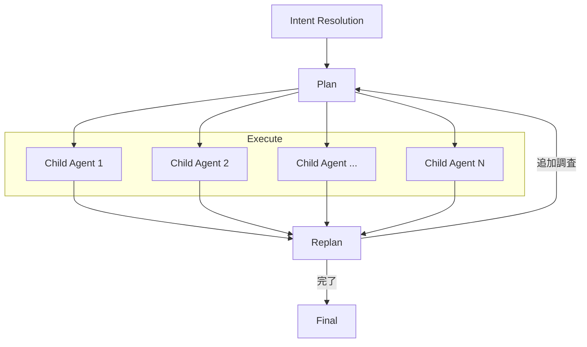

先日、[zennの記事](https://zenn.dev/ubie_dev/articles/ai-sec-alert-ops)にて紹介したセキュリティアラートに関する分析を担うAIエージェント [Warren](https://github.com/secmon-lab/warren) のハーネスエンジニアリングについて社内で共有したところ、思いの外盛り上がったので記事にしてみました。

# 前提：ハーネスエンジニアリングとは

## 一般的な定義

- 2026年2月のMitchell Hashimoto氏の[記事](https://mitchellh.com/writing/my-ai-adoption-journey#step-5-engineer-the-harness)を契機に広まった単語
  - Mitchell氏は「エージェントが一度したミスを、次からは繰り返さないように仕組み化すること」としている
  - プロンプトの修正と手順のツール化の2つを示している
- 現状バズワード的な立ち位置をまだ脱していない
  - 実際、各社で言っていること、定義がばらばら[^harness-def]
- イメージとしてはコンテキストエンジニアリング、プロンプトエンジニアリングを包含する概念
  - AIエージェントの挙動を「モデル以外の部分でいい感じにする」ためのエンジニアリング全般
  - プロンプト単体ではなく、リポジトリ知識、評価系、観測性、アーキテクチャ制約、継続的な掃除と改善ループなどなどが含まれそう
  - さらにClaude Codeのような既成AIエージェントの利用や、AIエージェントそのものの開発の話も混ざっている

[^harness-def]: https://zenn.dev/kenimo49/articles/harness-engineering-interpretations-2026

## 本記事におけるハーネスエンジニアリング

- 今回はAIエージェントを実装する際に、効率的に目的を達成するための工夫全般について
  - ツール呼び出しをするだけの原始的なAIエージェントはSDKなどを使えば10秒ぐらいで作れる
  - しかし実際にそれだけで実践投入するのはかなり難しい
  - そこから目的を「効率的に」実行するためのエージェント実装上の仕組みを紹介する
- AIエージェント実装における目的とはおおよそ以下のようなものがあると考えられる

**1. 計測観点**: エージェントの挙動を把握・評価できるようにする
  - **可観測性の向上**: エージェントが何をしているか、どこで詰まっているかを追跡できるようにする
  - **評価容易性の向上**: エージェントの出力品質を定量的・定性的に評価できる仕組みを整える

**2. 実行設計観点**: 1回のrunを「ちゃんとした形で動かす」ための設計
  - **コンテキスト効率化**: 長い履歴、過剰なツール説明、ノイズの多い出力によって性能が落ちないようにする
  - **制御性・決定性の向上**: system promptだけでなく、tool choice、execution flow、hooksなどで挙動を制御する
  - **権限・実行安全性の確保**: 危険なコマンド実行や信頼できない外部接続を防ぎ、意図しない操作をさせない。実行中のエージェントを安全に中断できるようにする
  - **永続性・耐障害性の確保**: セッション状態や会話履歴を永続化し、障害時にもデータを失わない。過去の調査を引き継いで継続できるようにする

**3. 実行最適化観点**: 1回のrunの品質・速さ・安さを改善する
  - **エージェント性能の最適化**: 同じモデルでも、ハーネス設計によってtask performanceを上げる
  - **レイテンシ・スループットの改善**: 1タスクの完了時間を短くし、複数タスクを並列かつ継続的に回せるようにする
  - **コスト効率化**: モデルの使い分けやサブエージェント分割で、1タスクあたりの推論コストを下げる

- このような仕組みは1年前にWarrenの実装を始めたときからやっていた
- したがってハーネスエンジニアリングという単語自体が適切かの確証はないが（数ヶ月経ったら全く別の単語に置き換えられている可能性も考えられる）、現時点では便利な単語なのでそのまま使わせてもらう

# Warrenにおけるハーネスエンジニアリング

## ハーネスエンジニアリングに対する思想

- Warrenの主な役割はセキュリティアラートに関する分析をすること
- セキュリティ分析AIエージェントのハーネスを設計するにあたって、根底にある考え方は以下の3つ
- LLMの不確実性をアーキテクチャで制御する
  - LLMには確証バイアス、事実と推測の混同、冗長な出力といった系統的な弱点がある
  - 「気をつけて」とプロンプトで指示するだけでは信頼性が足りない
  - フェーズ分割やツール制限など、構造的にその弱点が発現しにくい設計にする
  - プロンプトは「望ましい振る舞いの指示」ではなく「アーキテクチャの隙間を埋める最後の手段」としてあつかう。原則としてプロンプトに頼らない
- 入力は寛容に、出力は厳格に
  - 基本機能が分析なのでいろいろなデータを入力させる必要がある
  - そのため確実に安全と言いきれないデータ（例えばWeb上のデータ）も取り込む
  - 一方で出力は厳格に制御し、破壊的な処理やデータ漏洩などができないようにする
- 実行コストを最適化する
  - 資源は有限。時間もコストも適切な量を費やす必要がある
  - セキュリティ調査はいくらでも深掘りできるため、制約なしに動かすとコストや時間が際限なく膨らむ
    - ここがコーディングエージェントと異なるポイント
  - そのため適切なゴール設定やコスト・実行時間をいい塩梅に落とし込む必要がある

## 1. 計測観点

### 可観測性の向上

- トレース記録: エージェントの実行全体をスパンとして記録し、GCSに永続化している
  - ルートスパン（実行全体）→ 子スパン（計画フェーズ、各タスク、リプランフェーズ）という階層構造
  - 各スパンにはツール呼び出しの入出力、LLMの応答、エラー情報が含まれる
  - 後から「なぜエージェントがこの判断をしたか」を追跡できる
  - パフォーマンスの改善などにも役に立つ
    - この記録をして開発ツールに食わせるだけで問題の分析や改善をしてくれる
- [gollem](https://github.com/m-mizutani/gollem) というSDKを使っており、こいつでトレースの記録と表示ができる
  - 以下のような表示が可能

### 評価容易性の向上

- 構造化された計画出力: 計画フェーズの出力をJSONスキーマで強制し、タスク一覧・メッセージ・質問を構造化データとして取得
  - 「何を調べようとしたか」「どういう判断でタスクを分割したか」が機械的に解析可能
- Acceptance Criteriaの明示: 各タスクに完了条件を必須で設定させ、リプラン時に「達成できたか」を評価
  - 例：「送信元IPが悪意あるものか正常なものかを判定する」という具体的な基準
- これらの情報をトレースにも記録させており、何が達成できたのか・できなかったのか、どこで迷ったのかなどを後から追跡しやすくしている
- 詳しくは実行計画のところで説明

## 2. 実行設計観点

### コンテキスト効率化

- Compaction Middleware: 会話履歴が長くなりすぎた場合、古い70%を自動的にLLMで要約圧縮する
  - `gollem/middleware/compacter` を利用し、コンテキストウィンドウの溢れを防止
  - 圧縮前後のトークン数もトレースに記録される
- サブエージェントによるデータ取得の分離: BigQuery・Falcon・Slackなどのデータ取得はサブエージェントとして独立
  - サブエージェントのプロンプト（`base.md`）で「結果を解釈せず生データのみ返す」と強制しており、親エージェントに返るデータからノイズを排除
  - 「最小限のクエリで目的を達成せよ」「1000行上限」「LIMIT必須」などクエリの効率化もプロンプトで制約
- タスクプロンプトでの出力制限: タスクエージェントに対して「生データのみ返せ、解釈・推測・推奨は一切禁止」と厳格に制約
  - これにより中間結果のトークン数を抑え、最終合成フェーズに渡すデータの質を高めている

### 制御性・決定性の向上

- 事前計画を作成してからの実行
  - Intent Resolution → Plan → Execute → Replan → Final の5フェーズを分けている
  - これによって目的を見失わずに作業を継続できるようになる

  - Intent Resolution: ユーザーの発言とアラートデータからXY Problem[^xy-problem]を検出し、調査の方向性を決定する。ユーザーが「このIPは悪意があるか？」と聞いていても、アラートデータがデータ流出を示唆していれば、実際の問題（Y）に基づいて調査方針を生成する
  - Plan: 解決されたIntentに基づいて調査計画を作成。タスク分割、ツール割り当て、完了条件を構造化JSONで出力。計画時もナレッジ検索が可能で、過去の類似調査を参照してから計画を立てる
  - Execute: 計画されたタスクを並列実行。各タスクは独立したサブエージェントとして動作し、それぞれが専用のツールセットを持つ
  - Replan: タスク結果を見て追加調査が必要か判断。追加タスクがあればPlanに戻る。情報が不足している場合はユーザに質問することもできる
  - Final: 全タスク結果を統合し、最終的なセキュリティ評価を生成
- ユーザー定義プロンプトによる調査戦略の切り替え: YAML frontmatter付きのMarkdownファイルで調査戦略を定義し、Intent Resolution時にアラートの内容に応じて最適な戦略を自動選択する
  - 例：「Exfiltration Detection」「Credential Abuse」など、シナリオ別の調査アプローチを事前に用意できる
- タスクごとのツールセット分離: 計画フェーズで各タスクに必要なツールセットを指定し、実行時にはそのツールのみを渡す
  - 例：BigQueryだけ使うタスクにはBigQueryツールだけ、Slack検索タスクにはSlackツールだけ
  - 不要なツールを与えないことで目的に対して一直線に進むようにする
- プロンプトによる思考フレームの制御:
  - 「事実と仮説を明確に区別せよ」「複数の解釈を考慮せよ」「反証を積極的に探せ」という分析姿勢の強制
  - 「最悪のシナリオではなく、最も蓋然性の高いシナリオに基づいて深刻度を評価せよ」という判断基準の指定
  - Anti-Patternsセクションで「やってはいけないこと」を具体例付きで列挙（確証バイアスの抑止、調査報告書スタイルの禁止など）
  - 本質的にはあまりプロンプトを使いたくないが、LLMの応答そのものに対してはプロンプトでチューニングせざるをえない
- 決定的な制御は決定的なルールを定義して実施する
  - アラート受信時の初動パイプラインはRegoポリシーによって制御されている
  - アラートの取り込み・エンリッチ・トリアージの各段階
  - どのアラートを処理するか、どんなエンリッチタスクを実行するか、最終的な分類をどうするかをコードとして定義
  - エージェントの判断に依存せず、決定論的に制御したい部分をポリシーに切り出している

[^xy-problem]: https://xyproblem.info/

### 権限・実行安全性の確保

- HITL（Human-in-the-Loop）: 特定のツール呼び出しに対して人間の承認を必須にできる
  - Slackの対話的ボタン（Approve / Deny）で承認フロー
  - Presenterが未設定の場合はツール実行自体をブロックし、承認ポリシーのバイパスを防止
  - 今のところおもにWebFetchツールで利用
- リプランフェーズでのオペレーターへの質問: ツールだけでは情報が不足する場合、リプランフェーズでオペレーターに質問できる
  - 質問には選択肢と理由を必須で付与し、オペレーターが判断しやすい形式にする
  - 質問の回答は次のリプランに引き継がれ、調査方針の修正に使われる
- BigQueryクエリの安全装置: エージェントが発行するクエリに対して多層的な制限を設けている
  - ドライランによるスキャンサイズ検証: 全クエリを実行前にドライランし、設定されたスキャンサイズ上限を超える場合は実行をブロック
    - これはBigQueryスキャン破産防止用
  - 結果行数の上限: 最大1000行で切り捨て。超過時は「OFFSETでページネーションするな、GROUP BYで集約せよ」とエージェントに指示
    - こっちはどちらかというとコンテキスト消費を効率化するための工夫
  - クエリタイムアウト: デフォルト5分でジョブをキャンセル
  - プロンプトでも `SELECT *` 禁止、`OFFSET` 禁止などのアンチパターンを明示し、構造的制約とプロンプト制約の両面で防御している
- エージェントの中断機能: Slackコマンドでエージェントの実行を中断できる
  - 中断要求はセッションのステータス変更（`running` → `aborted`）としてFirestoreに記録される
  - エージェントはツール呼び出しの境界でステータスをチェックし、中断を検知すると実行を停止する
  - 対象チケットに紐づくすべての実行中セッションが一括で中断される
  - 即座に停止するのではなく「次のチェックポイントで停止」する設計のため、実行中のツール呼び出しは安全に完了する
- Regoポリシーによるアクセス制御: Slackユーザーベースの認可ポリシーで、誰がエージェントを操作できるかを制御
  - 社内サービスのアクセスログやEDRの監視ログなど機微な情報が含まれる可能性があるデータを利用するため、実行権限を持つユーザを制限
  - いざとなったらSlackメッセージ削除コマンドも実装されているので、それで一通り関連メッセージを消去できる

### 永続性・耐障害性の確保

- セッション状態の永続化: セッションの状態（実行中・完了・中断）、実行したクエリ、Intent、ユーザー情報をFirestoreに記録
  - セッションに紐づくメッセージ（トレース・計画・応答・警告）もサブコレクションとして永続化される
  - 過去のセッションを後から参照でき、どのような調査が行われたかを追跡できる
- 会話履歴の二重永続化: LLMとの会話履歴をGCS（本体）とFirestore（メタデータ）の二層で保存
  - 同一チケットへの追加の問い合わせ時に過去の会話履歴をリロードし、文脈を引き継いで調査を継続できる
  - 最新のスナップショットを `latest.json` として保持し、高速な読み込みを実現
- ナレッジの永続化と変更ログ: ナレッジの作成・更新・削除の全操作をFirestoreのサブコレクションに追記型で記録
  - 削除されたナレッジのログも保持されるため、なぜそのナレッジが不要になったかを後から追跡できる

## 3. 実行最適化観点

### エージェント性能の最適化

- Knowledge Baseによる過去知見の活用
  -  ナレッジサービスは必須コンポーネントとして組み込まれており、計画フェーズ・タスク実行フェーズの両方でナレッジ検索を実施
  - BM25 + コサイン類似度 + RRF（Reciprocal Rank Fusion）によるハイブリッド検索
  - 「以前同様のアラートでどう調査したか」「このテーブルのこのフィールドは使えない」といったナレッジを自動で参照
  - ナレッジだけで回答できる場合はタスクを生成せず直接回答する（不要な調査の回避）
  - 計画フェーズではエージェントモードで動作し、計画を立てる前にナレッジを能動的に検索できる
  - タスク実行時にはナレッジ検索ツールが全タスクに自動注入される（計画でツール指定がなくても常に利用可能）
- Knowledge Reflectionで自動的に記憶を生成
  - タスク完了後とセッション終了後にバックグラウンドで2カテゴリのナレッジ抽出を実行
  - 技法ナレッジ（タスク単位）：効果的だったクエリパターン、失敗したアプローチとその理由、データソースの所在
  - 事実ナレッジ（セッション単位）：特定ホストの役割、既知の誤検知パターン、インフラの構成情報
  - 「失敗の知識は成功の知識より価値がある」という方針で、同じ失敗を繰り返さない仕組み
  - LLMの内部知識ではなく、実際にツール実行で観測された結果のみを記録するよう厳格に制約
  - 既存エントリの検索→更新・削除も行い、矛盾する古い知識を自動的に整理する
- BigQueryエージェントのクエリ最適化ガイダンス: プロンプト内でBigQuery特有の最適化パターンを指示
  - パーティションカラムでのフィルタリング優先、SELECT *禁止、OFFSETによるページネーション禁止
  - ログの種類が多い＆スキーマが膨大というセキュリティ関連ログの特徴に応じた探索方法を指示しておく
  - ゼロ件結果時の段階的な検証手順もあらかじめ指示に入れておく（データ存在確認→時間範囲拡大→実際の値確認→生データサンプル）
- Runbookによる調査パターンの提供: 組織固有の調査クエリをSQLファイルとして定義し、BigQueryエージェントのシステムプロンプトに動的注入
  - Runbookのメタデータ（ID・タイトル・説明）のみをプロンプトに含め、SQL本文はエージェントが `get_runbook` ツールで必要に応じて取得する（コンテキストの節約）
  - エージェントはRunbookをそのまま使うのではなく、調査対象に合わせてSQLを適応・修正して使う
  - 複数ディレクトリからの読み込みに対応し、チーム横断でRunbookを共有・拡張できる

### レイテンシ・スループットの改善

- フェーズ内タスクの完全並列実行: 同一フェーズ内のタスクは `sync.WaitGroup` で並列実行し、待ち時間を最小化
  - タスクメッセージを事前に一括作成（「Waiting...」表示）し、各タスク完了時に即座に結果を投稿
- Knowledge Reflectionの非同期実行: ナレッジの抽出・保存はメインの実行フローとは別のgoroutineで実行
  - ユーザーへの応答を遅らせることなく、バックグラウンドで知識を蓄積
- アラートパイプラインによる継続的処理: Ingest → Tag変換 → メタデータ生成 → Enrich → Triage の5段階パイプラインでアラートを自動処理
  - 各段階でイベントを発行し、外部からの監視が可能
  - Regoポリシーで処理の要否を制御するため、不要なアラートはエージェント呼び出し前にフィルタリングされる

### コスト効率化

- バジェット戦略によるタスクの打ち切り: 各タスクにバジェット（デフォルト100ポイント）を設定し、ツール種別ごとのコスト（BigQueryクエリ=15、汎用ツール=6.25）と時間コスト（経過秒数ベース）で消費する
  - ソフトリミット（バジェット枯渇）で警告、ハードリミット（ソフトリミット後3回超過）で強制終了の二段構え
  - 強制終了時はハンドオーバー情報（ツール履歴、経過時間、消費割合）を生成し、リプランフェーズでより小さなタスクに分割される
- サブエージェントのコスト分離: BigQuery・Falcon・Slackのサブエージェント呼び出しは親タスクのバジェットから除外（内部で個別に追跡）
- 軽量モデルの採用: Gemini Flashモデルを使用し、コストと速度のバランスを取っている
