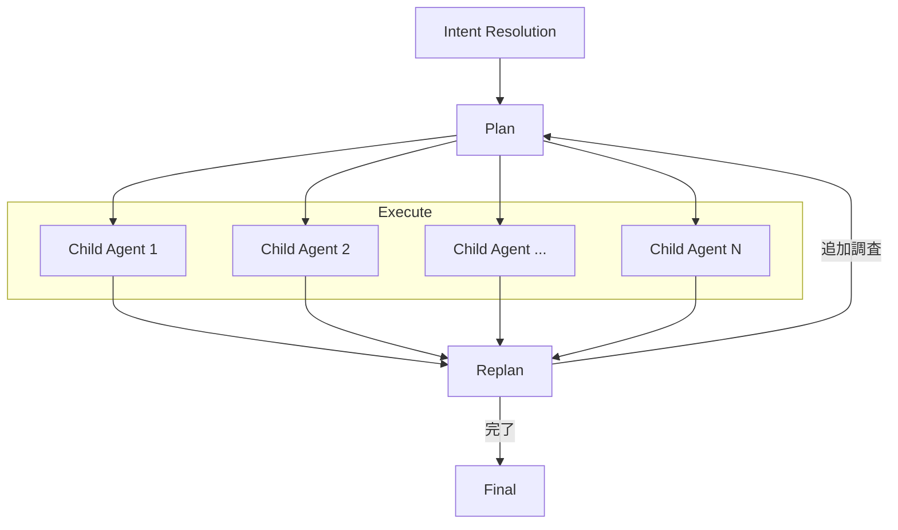

先日、[zennの記事](https://zenn.dev/ubie_dev/articles/ai-sec-alert-ops)にて紹介したセキュリティアラートに関する分析を担うAIエージェント [Warren](https://github.com/secmon-lab/warren) のハーネスエンジニアリングについて社内で共有したところ、思いの外盛り上がったので記事にしてみました。一般的な生成AIエージェントの話だけでなくセキュリティ分析に特化した話も織り交ぜていますが、何かのご参考になれば幸いです。

# 前提：ハーネスエンジニアリングとは

## 一般的な定義

ハーネスエンジニアリングという言葉は、2026年2月のMitchell Hashimoto氏の[記事](https://mitchellh.com/writing/my-ai-adoption-journey#step-5-engineer-the-harness)を契機に広まりました。Mitchell氏はこれを「エージェントが一度したミスを、次からは繰り返さないように仕組み化すること」と定義しており、具体的にはプロンプトの修正と手順のツール化の2つを示しています。

ただし、現状ではまだバズワード的な立ち位置を脱していません。実際、各社で言っていることや定義がばらばらです[^harness-def]。個人的なイメージとしてはコンテキストエンジニアリングやプロンプトエンジニアリングを包含する概念で、AIエージェントの挙動を「モデル以外の部分でいい感じにする」ためのエンジニアリング全般を指しています。プロンプト単体にとどまらず、リポジトリ知識、評価系、観測性、アーキテクチャ制約、継続的な情報整理と改善ループなどが含まれると考えられます。さらにClaude Codeのような既成AIエージェントの利用と、AIエージェントそのものの開発の話も混在している状況です。

[^harness-def]: https://zenn.dev/kenimo49/articles/harness-engineering-interpretations-2026

## 本記事におけるハーネスエンジニアリング

本記事では**AIエージェントを実装**する際に、効率的に目的を達成するための工夫全般について紹介します。ツール呼び出しをするだけの原始的なAIエージェントはSDKなどを使えば10秒ぐらいで作れます。しかし実際にそれだけで実践投入するのはかなり難しく、そこから目的を「効率的に」実行するためのエージェント実装上の仕組みが必要になります。

AIエージェント実装における目的はおおよそ以下の3つの観点に分類できると考えています。

1つ目は「**計測観点**」で、エージェントの挙動を把握・評価できるようにすることです。これにはエージェントが何をしているか・どこで詰まっているかを追跡できるようにする可観測性の向上と、エージェントの出力品質を定量的・定性的に評価できる仕組みを整える評価容易性の向上が含まれます。

2つ目は「**実行設計観点**」で、1回の実行を「ちゃんとした形で動かす」ための設計です。長い履歴や過剰なツール説明、ノイズの多い出力によって性能が落ちないようにするコンテキスト効率化、system promptだけでなくツール選択・実行フロー・hooksなどで挙動を制御する制御性・決定性の向上、危険なコマンド実行や信頼できない外部接続を防ぎ意図しない操作をさせない権限・実行安全性の確保、そしてセッション状態や会話履歴を永続化し障害時にもデータを失わず過去の調査を引き継いで継続できるようにする永続性・耐障害性の確保が含まれます。

3つ目は「**実行最適化観点**」で、1回の実行の品質・速さ・安さを改善することです。同じモデルでもハーネス設計によってtask performanceを上げるエージェント性能の最適化、1タスクの完了時間を短くし複数タスクを並列かつ継続的に回せるようにするレイテンシ・スループットの改善、子エージェント分割で1タスクあたりの推論コストを下げるコスト効率化が含まれます。

このような仕組みは1年前にWarrenの実装を始めたときからやっていました。したがってハーネスエンジニアリングという単語自体が適切かの確証はありません[^wording]が、現時点では便利な単語なのでそのまま使わせてもらいます。

[^wording]: そもそもこのあたりは分野の移り変わりが激しく、数ヶ月経ったら全く別の単語に置き換えられている可能性も考えられます

# Warrenにおけるハーネスエンジニアリング

Warrenの主な役割はセキュリティアラートに関する分析をすることです。セキュリティ分析AIエージェントのハーネスを設計するにあたって、根底にある考え方は以下の3つです。

1つ目は**LLMの不確実性をアーキテクチャで制御する**ということです。LLMには確証バイアス、事実と推測の混同、冗長な出力といった系統的な弱点があります。「気をつけて」とプロンプトで指示するだけでは信頼性が足りません。そこでフェーズ分割やツール制限など、構造的にその弱点が発現しにくい設計にしています。プロンプトは「望ましい振る舞いの指示」ではなく「アーキテクチャの隙間を埋める最後の手段」としてあつかい、原則としてプロンプトに頼らないようにしています。

2つ目は**入力は寛容に、出力は厳格に**という方針です。基本機能が分析なのでいろいろなデータを入力させる必要があり、そのため確実に安全と言いきれないデータ（例えばWeb上のデータ）も取り込みます。一方で出力は厳格に制御し、破壊的な処理やデータ漏洩などができないようにしています。

3つ目は**実行コストを最適化する**ことです。資源は有限であり、時間もコストも適切な量を費やす必要があります。セキュリティ調査はいくらでも深掘りできるため、制約なしに動かすとコストや時間が際限なく膨らんでしまいます。ここがコーディングエージェントと異なるポイントです。そのため適切なゴール設定やコスト・実行時間をいい塩梅に落とし込む必要があります。

## 1. 計測観点

### 可観測性の向上

エージェントの実行全体をスパンとして記録し、GCSに永続化しています。ルートスパン（実行全体）から子スパン（計画フェーズ、各タスク、リプランフェーズ）という階層構造になっており、各スパンにはツール呼び出しの入出力、LLMの応答、エラー情報が含まれます。これにより後から「なぜエージェントがこの判断をしたか」を追跡でき、パフォーマンスの改善にも役に立ちます。この記録を開発ツールに食わせるだけで問題の分析や改善をしてくれます。

トレースの記録と表示には [gollem](https://github.com/m-mizutani/gollem) というSDKを使っており、以下のような表示が可能です。


### 評価容易性の向上

計画フェーズの出力をJSONスキーマで強制し、タスク一覧・メッセージ・質問を構造化データとして取得しています。これにより「何を調べようとしたか」「どういう判断でタスクを分割したか」が機械的に解析可能になります。また、各タスクにはAcceptance Criteria（完了条件）を必須で設定させ、リプラン時に「達成できたか」を評価できるようにしています。例えば「送信元IPが悪意あるものか正常なものかを判定する」という具体的な基準です。

_計画フェーズで生成されるタスク一覧の例_
```json
{
  "message": "GKEポッド上の不審なプロセスに関する調査を開始します。まずは、Security Command Centerの検出内容に含まれるプロセス名、通信先IP、バイナリのハッシュ値などの詳細情報を、脅威インテリジェンスと照らし合わせて分析します。",
  "tasks": [
    {
      "description": "Security Command Centerの所見に含まれる通信先IPアドレス、ドメイン、およびプロセスに関連するファイルハッシュ値（SHA-256など）について、VirusTotal、AlienVault OTX、AbuseIPDB、WHOISを用いて脅威インテリジェンスの情報を収集し、それらの評判や既知のマルウェアとの関連性を評価してください。",
      "acceptance_criteria": "検出された各インジケーター（IP、ドメイン、ハッシュ）の悪性度および関連する脅威名が特定されていること。",
      "tools": [
        "vt",
        "otx",
        "ipdb",
        "whois"
      ],
      "id": "indicator-reputation-check",
      "title": "インジケーターの評判分析"
    },
    {
      "description": "不審なプロセスが通信しているドメインや、関連するURLについて、urlscan.ioやwebfetchを用いて詳細な情報を収集し、フィッシングサイトやC2サーバーとしての特徴がないか分析してください。",
      "acceptance_criteria": "通信先URLのコンテンツやリダイレクト先から、その目的（C2通信、ダウンロード等）が推定されていること。",
      "tools": [
        "urlscan",
        "webfetch"
      ],
      "id": "url-domain-analysis",
      "title": "通信先ドメイン・URLの分析"
    }
  ]
}
```

これらの情報はトレースにも記録されており、何が達成できたのか・できなかったのか、どこで迷ったのかなどを後から追跡しやすくしています。詳しくは実行計画のところで説明します。

## 2. 実行設計観点

### コンテキスト効率化

LLMエージェントの性能はコンテキストの質に大きく依存します。会話履歴が膨らんだり、ツール出力にノイズが混じったりすると、本来の目的を見失いやすくなります。Warrenではこの問題に対して、会話履歴・データ取得・タスク出力の3層でコンテキストを制御しています。

まず会話履歴については、トークンサイズが限界を超えてエラーになった場合に、古い70%を自動的にLLMで要約圧縮するという戦略をとっています。LLMツールによっては過去の履歴を全て圧縮してしまうものもありますが、経験上では圧縮直後の会話でLLMが急に記憶喪失になってしまい、しばらく迷走するという傾向がありました。これを防ぐため、Warrenでは過去の履歴は圧縮しつつ直前の会話は残すという方法を取っています。

次にデータ取得の層では、データアクセスを子エージェントとして独立させて必要な情報のみを親エージェントに返すという構造をとっています。特にBigQuery・CrowdStrike Falcon・Slackからのデータ取得は探索的にすることが多く、データの探索部分でトークンを消費してしまい履歴を圧迫します。そこで子エージェントのプロンプトでは「結果を解釈せず生データのみ返す」と強制することで、親エージェントに返るデータからノイズを排除しています。さらにデータ探索の過程においてもコンテキストが溢れないよう、「最小限のクエリで目的を達成せよ」「1000行上限」「LIMIT必須」など、探索方法の効率化もプロンプトで指示するようにしています。

最後にタスク出力の層でも、タスクエージェントに対して「生データのみ返せ、解釈・推測・推奨は一切禁止」と厳格に制限しています。中間結果のトークン数を抑えることで、最終合成フェーズに渡すデータの質を高めています。

### 制御性・決定性の向上

エージェントの挙動を制御するアプローチは、大きく「エージェント実行フローによる制御」「プロンプトによる制御」「決定的ルールによる制御」の3種類に分かれます。Warrenではこれらを組み合わせて、エージェントが目的から逸れず、かつ一貫した品質で調査を遂行できるようにしています。

#### エージェント実行フローによる制御：フェーズ分割とツール分離

最も強力な制御手段は、実行フローそのものを構造化することです。Warrenでは処理全体をIntent Resolution → Plan → Execute → Replan → Final の5フェーズに分けています。



まずIntent Resolutionではユーザーの発言とアラートデータからXY Problem[^xy-problem]を検出し、調査の方向性を決定します。ユーザーが「このIPは悪意があるか？」と聞いていても、アラートデータがデータ流出を示唆していれば、実際の問題（Y）に基づいて調査方針を生成します。このフェーズではさらに、YAML frontmatter付きのMarkdownファイルで定義されたユーザー定義の調査戦略を自動選択する機能もあります。例えば「Exfiltration Detection」「Credential Abuse」など、シナリオ別の調査アプローチを事前に用意しておき、アラートの内容に応じて最適なものが選ばれます。

次にPlanでは解決されたIntentに基づいて調査計画を作成し、タスク分割・ツール割り当て・完了条件を構造化JSONで出力します。計画時もナレッジ検索が可能で、過去の類似調査を参照してから計画を立てます。ここで重要なのがタスクごとのツールセット分離です。計画フェーズで各タスクに必要なツールセットを指定し、実行時にはそのツールのみを渡します。例えばBigQueryだけ使うタスクにはBigQueryツールだけ、Slack検索タスクにはSlackツールだけという具合です。不要なツールを与えないことで、目的に対して一直線に進むようにしています。

Executeでは計画されたタスクを並列実行します。各タスクは独立した子エージェントとして動作し、それぞれが専用のツールセットを持ちます。Replanではタスク結果を見て追加調査が必要か判断し、追加タスクがあればPlanに戻ります。情報が不足している場合はユーザに質問することもできます。Finalでは全タスク結果を統合し、最終的なセキュリティ評価を生成します。

#### プロンプトによる制御：思考フレームの矯正

構造だけでは制御しきれないのが、LLMの応答そのものの品質です。本質的にはあまりプロンプトに頼りたくないのですが、LLMの思考の癖を矯正するにはプロンプトでチューニングせざるをえません。

具体的には「事実と仮説を明確に区別せよ」「複数の解釈を考慮せよ」「反証を積極的に探せ」という分析姿勢の強制や、「最悪のシナリオではなく、最も蓋然性の高いシナリオに基づいて深刻度を評価せよ」という判断基準の指定をしています。Anti-Patternsセクションでは「やってはいけないこと」を具体例付きで列挙しており、確証バイアスの抑止や調査報告書スタイルの禁止などが含まれます。

例えば分析に関する戦略として、具体的には以下のようなプロンプトを与えています（[全文](https://github.com/secmon-lab/warren/blob/main/pkg/usecase/chat/bluebell/prompt/system.md)）
> Your analysis must clearly distinguish between what is known and what is inferred.
>
> - Facts: Data directly observed in logs, tool outputs, alert data, or confirmed by users
> - Hypotheses: Inferences or assumptions derived from facts — always uncertain
>
> Rules:
> - Never state a hypothesis as a confirmed fact. Use language that reflects uncertainty ("this suggests", "one possible explanation is") for hypotheses.
> - When a conclusion depends on unverified assumptions, state those assumptions explicitly.
> - When new information contradicts a previous hypothesis, update or discard it immediately.
> - Consider multiple explanations: For any security event, generate at least two plausible interpretations.
> - Seek disconfirming evidence: Actively look for facts that contradict your leading hypothesis.
> - Avoid anchoring: Your first impression is not necessarily correct. Treat it as one hypothesis among several.

#### 決定的ルールによる制御：Regoポリシー

エージェントの判断に委ねるべきでない部分は、そもそもLLMを介さず決定的なルールで処理します。アラート受信時の初動パイプラインはRegoポリシーによって制御されており、アラートの取り込み・エンリッチ・トリアージの各段階で、どのアラートを処理するか、どんなエンリッチタスクを実行するか、最終的な分類をどうするかをコードとして定義しています。決定論的に制御したい部分をポリシーに切り出すことで、エージェントの判断のブレに左右されない堅牢なパイプラインを実現しています。また、自明で無視してよいアラートであれば、わざわざLLMで処理させないことによってコストを抑制することにもつながります。

```rego
package ingest.scc

alerts contains {} if {
  not ignore
}

# Log4j の脆弱性は対処済みなので問題なし
ignore if {
  input.finding.category == "Initial Access: Log4j Compromise Attempt"
}
```
_例えば対処が不要であることが自明なアラートについては、ルール側で決定性のある除外処理をする_

[^xy-problem]: https://xyproblem.info/

### 権限・実行安全性の確保

前述の思想で述べたとおり、Warrenは入力に対しては寛容である一方、出力や実行に対しては厳格に制御する方針をとっています。エージェントが自律的に動く以上、意図しない操作や暴走に対する安全装置は不可欠です。

その前提として、そもそもツール実行のアーキテクチャ自体がクレデンシャルをLLMから隔離する設計になっています。Warrenでは各外部サービス（BigQuery、Slack、CrowdStrike Falconなど）へのアクセスをFactory パターンで構成しており、Factoryがクレデンシャルを受け取ってクライアントを生成し、LLMに公開されるToolSetインターフェースにはパラメータの仕様と実行エントリポイントしか含まれません。LLMが指定できるのはSQLクエリや検索キーワードなどのパラメータだけであり、APIキーやサービスアカウント、OAuthトークンといったクレデンシャルはGoの構造体フィールドに閉じ込められてLLMのコンテキストには一切現れません。つまりプロンプトインジェクションなどでLLMの挙動が操作されたとしても、クレデンシャルそのものを窃取・漏洩させることはアーキテクチャ上不可能となっています。

この土台の上に、人間による監視、自動的なガードレール、運用上の制御という3つの観点でさらに安全性を担保しています。

人間による監視としては、まずHITL（Human-in-the-Loop）の仕組みがあります。特定のツール呼び出しに対して人間の承認を必須にでき、Slackの対話的ボタン（Approve / Deny）で承認フローを実現しています。Presenterが未設定の場合はツール実行自体をブロックし、承認ポリシーのバイパスを防止します。今のところおもにWebFetchツールで利用しています。さらにリプランフェーズでは、ツールだけでは情報が不足する場合にオペレーターに質問を投げかけることもできます。質問には選択肢と理由を必須で付与してオペレーターが判断しやすい形式にしており、回答は次のリプランに引き継がれて調査方針の修正に使われます。

自動的なガードレールの代表例はBigQueryクエリに対する多層的な安全装置です。全クエリを実行前にドライランし、設定されたスキャンサイズ上限を超える場合は実行をブロックします。これはBigQueryスキャン破産防止用です。結果行数も最大1000行で切り捨てており、超過時は「OFFSETでページネーションするな、GROUP BYで集約せよ」とエージェントに指示します。こちらはどちらかというとコンテキスト消費を効率化するための工夫です。クエリタイムアウトはデフォルト5分でジョブをキャンセルします。さらにプロンプトでも `SELECT *` 禁止、`OFFSET` 禁止などのアンチパターンを明示し、構造的制約とプロンプト制約の両面で防御しています。

運用上の制御としては、エージェントの中断機能とアクセス制御があります。Slackコマンドでエージェントの実行を中断でき、中断要求はセッションのステータス変更（`running` → `aborted`）としてFirestoreに記録されます。エージェントはツール呼び出しの境界でステータスをチェックし、中断を検知すると実行を停止します。対象チケットに紐づくすべての実行中セッションが一括で中断されますが、即座に停止するのではなく「次のチェックポイントで停止」する設計のため、実行中のツール呼び出しは安全に完了します。アクセス制御についてはRegoポリシーによるSlackユーザーベースの認可を導入しており、社内サービスのアクセスログやEDRの監視ログなど機微な情報が含まれる可能性があるデータを利用するため、実行権限を持つユーザを制限しています。いざとなったらSlackメッセージ削除コマンドで一通り関連メッセージを消去できる機能も搭載しています。

### 永続性・耐障害性の確保

エージェントの調査は一度で完結するとは限りません。追加の問い合わせが発生したり、過去の調査を振り返ったりする場面は頻繁にあります。そのため、セッション・会話履歴・ナレッジの3種類のデータをそれぞれ永続化しています。セッションの状態（実行中・完了・中断）、実行したクエリ、Intent、ユーザー情報はFirestoreに記録しています。セッションに紐づくメッセージ（トレース・計画・応答・警告）も永続化されており、過去のセッションを後から参照してどのような調査が行われたかを追跡できます。

LLMとの会話履歴はCloud Storage（履歴本文）とFirestore（メタデータ）の二層で保存しています。これにより同一チケットへの追加の問い合わせ時に過去の会話履歴をリロードし、文脈を引き継いで調査を継続できます。会話はLLM呼び出しが起きるたびに保存するようにしているため、途中で中断されても復旧できるのが特徴です。

## 3. 実行最適化観点

### エージェント性能の最適化

同じモデルを使っていても、エージェントに与える知識やガイダンスによってタスクの遂行品質は大きく変わります。Warrenでは「過去の経験から学ぶ仕組み」と「ドメイン固有のガイダンス」の2軸でエージェントの性能を引き上げています。

#### 記憶の管理：Knowledgeの記録とKnowledge Reflection

記憶管理のためのナレッジ機能はWarrenの必須コンポーネントとして組み込まれており、計画フェーズ・タスク実行フェーズの両方でナレッジ検索を実施します。検索にはBM25 + コサイン類似度 + RRF（Reciprocal Rank Fusion）によるハイブリッド検索を採用しており、「以前同様のアラートでどう調査したか」「このテーブルのこのフィールドは使えない」といったナレッジを自動で参照します。ナレッジだけで回答できる場合はタスクを生成せず直接回答することで、不要な調査を回避します。計画フェーズではエージェントモードで動作し、計画を立てる前にナレッジを能動的に検索できます。タスク実行時にはナレッジ検索ツールが全タスクに自動注入されるため、計画でツール指定がなくても常に利用可能です。

では、このKnowledgeはどこから来るのか。人手で登録もできるのですが、Warrenでは主にKnowledge Reflectionによって自動生成しています。タスク完了後とセッション終了後にバックグラウンドでTechnique, Factという2つのカテゴリのナレッジ抽出を実行します。Technical Knowledge（タスク単位）では効果的だったクエリパターン、失敗したアプローチとその理由、データソースの所在を記録します。一方、Fact Knowledge（セッション単位）では特定ホストの役割、既知の誤検知パターン、インフラの構成情報を記録します。「失敗の知識は成功の知識より価値がある」という方針で、同じ失敗を繰り返さない仕組みになっています。言語モデルの内部知識ではなく、実際にツール実行で観測された結果のみを記録するよう指示しており、既存エントリの検索・更新・削除も行って矛盾する古い知識を自動的に整理します。


_蓄積されたナレッジの例。すべてエージェントが自動的に記録したもの_

#### ドメイン固有の知識：クエリ最適化とRunbook

セキュリティ分析ではBigQueryを多用しますが、セキュリティ関連ログはログの種類が多くスキーマが膨大という特徴があります。何も指示しなければエージェントが非効率なクエリを発行しがちなので、プロンプト内でBigQuery特有の最適化パターンを指示しています。パーティションカラムでのフィルタリング優先、`SELECT *` 禁止、`OFFSET` によるページネーション禁止などのほか、ゼロ件結果時の段階的な検証手順（データ存在確認→時間範囲拡大→実際の値確認→生データサンプル）もあらかじめ指示に入れています。

さらに一歩進んで、組織固有の調査クエリをRunbookとして提供しています。調査パターンをSQLファイルとして定義し、BigQueryエージェントのシステムプロンプトに動的注入します。Runbookのメタデータ（ID・タイトル・説明）のみをプロンプトに含め、SQL本文はエージェントが `get_runbook` ツールで必要に応じて取得する形にしてコンテキストを節約しています。エージェントはRunbookをそのまま使うのではなく、調査対象に合わせてSQLを適応・修正して使います。

```sql
-- title: 特定のユーザのGoogle Workspace Drive 利用ログ（タイトル、ユーザー、利用していたアプリケーション情報、公開範囲を調査可能）
-- description: ダウンロードについて調べる場合は event_name = "download" を条件につける

SELECT
    time_usec_timestamp,
    event_name,
    event_type,
    email,
    drive.originating_app_id,
    drive.doc_id,
    drive.doc_title,
    drive.doc_type,
    drive.visibility,
    drive.owner,
    has_sensitive_content,
    actor_application_info,
FROM
    actual-my-project.if_google_workspace_audit.activity
WHERE
    partition_time BETWEEN TIMESTAMP("2025-06-24") AND TIMESTAMP("2025-06-26")
    AND email = "xxx@xxx.com"
LIMIT
    1000
```
_こうしたSQLの参考例を事前に用意しておくことで、エージェントがスムーズに検索できるようになります_

### レイテンシ・スループットの改善

セキュリティアラートの分析では応答速度も重要です。Warrenでは「クリティカルパス上の処理を並列化する」「クリティカルパスに載せない処理はバックグラウンドに逃がす」「エージェントに到達する前に不要な処理を省く」という方針でレイテンシを改善しています。

まず、同一フェーズ内のタスクは完全に並列実行し、待ち時間を最小化しています。タスクメッセージを事前に一括作成し、各タスク完了時に即座に結果を投稿します。前述のKnowledge Reflectionもメインの実行フローとは別のスレッドで非同期実行されるため、ユーザーへの応答を遅らせることなくバックグラウンドで知識を蓄積できます。


_並列で複数のタスクが実行されるため比較的素早く問い合わせが完了します。同じデータソースに対するアクセスでも目的ごとにタスクを分割します_

またアラートの受診時には、Ingest（アラートの整形や受入判定） → Enrich（分析に必要な情報の事前取得） → Triage（影響度判定） の3段階パイプラインでアラートを自動処理しています。各段階でイベントを発行して外部からの監視を可能にしつつ、Regoポリシーで処理の要否を制御することで、不要なアラートはエージェント呼び出し前にフィルタリングされます。

### コスト効率化

前述の思想で述べたとおり、セキュリティ調査はいくらでも深掘りできてしまうため、明示的にコストを制御する仕組みが必要です。Warrenではバジェット戦略によってタスクの打ち切りを実現しています。各タスクにバジェット（デフォルト100ポイント）を設定し、ツール種別ごとのコスト（BigQueryクエリ=15、汎用ツール=6.25）と時間コスト（経過秒数ベース）で消費していきます。ソフトリミット（バジェット枯渇）で警告、ハードリミット（ソフトリミット後3回超過）で強制終了という二段構えになっており、強制終了時はハンドオーバー情報（ツール履歴、経過時間、消費割合）を生成してリプランフェーズでより小さなタスクに分割されます。BigQuery・Falcon・Slackの子エージェント呼び出しは親タスクのバジェットから除外し、内部で個別に追跡することでコストを分離しています。

# まとめ

本記事ではWarrenの実装を通じて、セキュリティ分析AIエージェントにおけるハーネスエンジニアリングの具体例を紹介しました。可観測性や評価容易性の確保、フェーズ分割やツール分離による構造的な制御、安全装置やバジェット戦略によるコスト管理など、モデルの外側で品質を担保するための仕組みは多岐にわたります。

これらの工夫に共通しているのは、LLMの能力に期待しすぎず、構造やルールで弱点を補うという方針です。プロンプトで指示するだけでは不十分な部分を、アーキテクチャで埋めていく。この考え方はセキュリティ分析に限らず、AIエージェントを実務に投入するあらゆる場面で重要になると考えています。

一方で、ここで紹介した仕組みはWarrenを1年以上運用してきた中で試行錯誤を重ねた結果であり、最初から完成していたわけではありません。実際にエージェントを動かし、失敗を観察し、その失敗が再発しないよう仕組み化するというサイクルを回し続けることが、ハーネスエンジニアリングの本質だと感じています。

Ubieではセキュリティに限らず、生成AIの活用にとても積極的に取り組んでいます。セキュリティの領域においても、アラート分析やそのハーネスエンジニアリングにとどまらず、生成AIを活用できるチャレンジはまだまだ多いと感じています。このような挑戦に興味のある方は、ぜひお話しましょう。

- https://x.com/m_mizutani (DMあけてます)
- https://herp.careers/v1/ubiehr/cQ6vihXLiMLg プロダクトセキュリティエンジニア募集中
