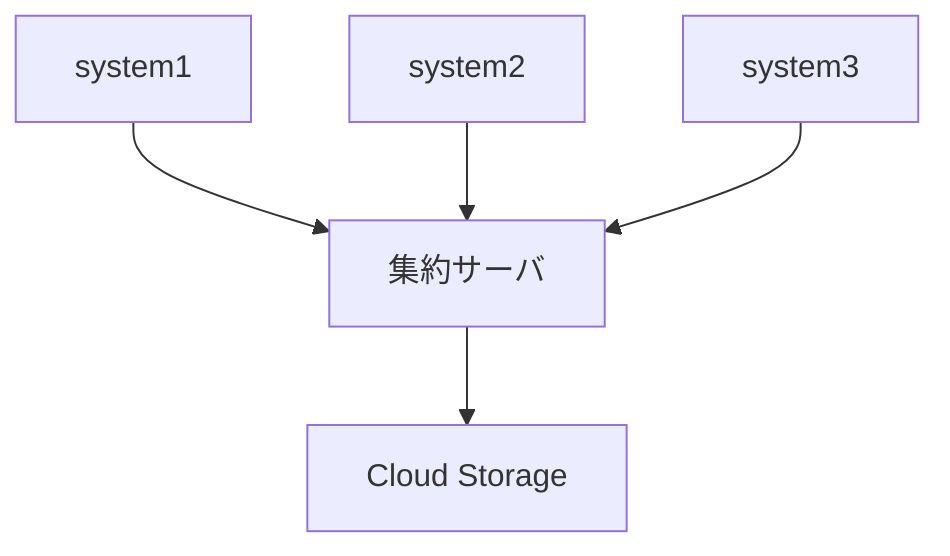

この記事はアドベントカレンダー[実践セキュリティ監視基盤構築](https://adventar.org/calendars/9986)の12日目です。

今回は、セキュリティ監視基盤で使用するログの取得方法について説明します。ログの取得方法は大きく分けて、Push型とPull型の2つがあります。Push型はログの発生元からログを送信してもらう方法で、Pull型はログを取得する側からログを取得する方法です。

# Pull型のログ取得

多くの外部サービスはAPIを提供しており、そのAPIを使ってログを取得できます。セキュリティ監視基盤側から能動的にログを取得する方法をPull型と呼びます。今回はPull型のログ取得を実装する際の留意点や実装方法について説明します。

## 一般的な監査ログ取得APIのリクエスト仕様

セキュリティ監視基盤で利用するのは主に監査ログです。SaaSなどのクラウドサービスではAPIが提供されていることが多く、そのAPIを使って監査ログを取得できます。

APIによるログ取得は、指定された期間で外部サービスが保持しているログを取得する形式が一般的です。サービスによって異なりますが、以下のようなパラメータを指定できることが多いです。

- **取得期間**: 取得したいログの期間を開始日時や終了日時で指定します。
- **limit, offset**: 取得するログの最大件数や取得開始位置を指定します。
- **フィルタリング**: 特定の条件に一致するログのみを取得するための条件を指定します。
- **ページネーション**: 大量のログを取得する場合、ページネーションを使って取得するページを指定します。

APIの仕様によっては、一度に全てのログを取得できない場合もあります。その場合は、複数回に分けて取得する必要があり、ページネーションなどを活用します。

このようなAPIを使用する場合、**ログ収集のためのジョブを定期的に実行し、直近のログを取得する** ということを繰り返すことでログの取得が可能です。ただし、実装においてはいくつかの留意点があります。

## 実装における注意点

Pull型のログ取得はAPIを叩くだけでログが入手できるため、非常に簡単に実装できるように見えます。しかし、セキュリティ監視基盤で利用するためには、継続的かつなるべく小さい遅延でログを取得することが求められます。そのため、実装上の注意点がいくつかあります。

### (注意点1) ログの遅延

外部サービスでイベントが発生しても、それが直ちにAPIから取得できるとは限りません。外部サービス側でもイベントの発生からログの生成、保存、取得可能になるまでの工程があるため、ログの取得には遅延が生じます。

この遅延は外部サービスによって異なります。遅延が数秒のサービスもあれば、数分から数時間の遅延があるサービスもあります。遅延を考慮してログ取得の周期を設定する必要があります。例えば、ログ取得の周期を1時間に1回とする場合、その1時間の遅延を考慮して1時間30分に1回ログを取得するように設定する必要があります。この場合、過去に取得済みのログが重複して取得されることになります。そのため、システム全体として重複を許容する仕組みを用意する必要があります。

また、遅延の大きさはログの取得を要求する期間にも影響するため、ドキュメントに遅延に関する情報が記載されていないかを確認することが重要です。

### (注意点2) ログの取得頻度

遅延の話とも関連しますが、ログの取得頻度もよく検討して決める必要があります。これは後続の機能においてどの程度の遅延を許容できるかによって変わります。これは主にログの調査やアラートの検知に発生する遅延に影響します。

ログやアラートの流入経路がこのPull型によるログ取得およびそのパイプラインだけではない点を考慮する必要があります。セキュリティ監視基盤のアーキテクチャでも示した通り、ログは直接Cloud StorageやBigQueryに送信するサービスもありますし、アラートも外部のセキュリティ対策サービス・ソフトウェアなどから直接送信されてくることがあります。これらがいかに遅延少なく送信されてきたとしても、このPull型のログ取得によるログ取得の遅延があると、それらのログやアラートの処理に対しても影響がでます。

そのため、ログの取得頻度は、ログの取得からアラートの検知までの遅延を考慮して決める必要があります。これは、ログの取得頻度を高くすることで遅延を短縮できますが、その分デメリットもあります。

- **APIの利用制限**: 多くの外部サービスのAPIは全体の負荷を一定に抑えるため、APIの利用制限を設けています。これはレートリミットとして単位時間ごとのAPI呼び出し上限を設定する形で実装されているものが多いです。これを超えるとAPIの利用が制限されるため、ログの取得頻度を高くしすぎるとAPIの利用制限に引っかかる可能性があります。
- **コスト**: 先述した通り、APIからログを取得する場合はログ到着の遅延に応じてログ取得の期間を冗長にする必要があります。そのため頻度が高くなるとこの冗長な部分の割合が増え、保存するログの量が増えるためコストが増加します。場合によっては2〜3倍のコストインパクトが発生することもあり、ログ量が多い場合は注意が必要です。

### (注意点3) リトライ制御

APIを使ってログを取得する場合、ネットワークエラーやサービス側の障害などでリクエストが失敗することがあります。そのため、リトライ制御を実装する必要があります。リトライ制御を実装する際には、以下のようなポイントに注意する必要があります。

- **エラーの種類**: エラーの種類によってリトライの挙動を変えることがあります。例えば、ネットワークエラーの場合は指数バックオフを使ってリトライすることが一般的ですが、サービス側の障害の場合はリトライを行わないようにすることもあります。
- **リトライ回数**: リトライ回数を設定することで、無限にリトライを繰り返すことを防ぐことができます。リトライ回数を超えた場合はエラーを通知するようにすることが一般的です。
- **リトライ間隔**: リトライ間隔を設定することで、リトライの頻度を制御することができます。指数バックオフを使ってリトライ間隔を徐々に増やすことで、サービス側に負荷をかけすぎないようにすることができます。

## 具体的なAPIの例

参考までに、具体的な監査ログのAPI仕様の例をいくつか紹介します。

- Slack: [Audit Logs API endpoints and actions](https://api.slack.com/admins/audit-logs-call)
- 1Password: [1Password Events API reference](https://developer.1password.com/docs/events-api/reference/)
- GitHub: [Using the audit log API for your enterprise](https://docs.github.com/en/enterprise-cloud@latest/admin/monitoring-activity-in-your-enterprise/reviewing-audit-logs-for-your-enterprise/using-the-audit-log-api-for-your-enterprise)
- Twilio: [Monitor Event Resource](https://www.twilio.com/docs/usage/monitor-events)
- Sendgrid: [Retrieve all recent access attempts](https://www.twilio.com/docs/sendgrid/api-reference/ip-access-management/retrieve-all-recent-access-attempts)

## 実装

Pull型のログ取得を実装する際には、大きく分けると2つの実装方法があります。

- **独自実装**: ログ取得のためのジョブを独自に実装する方法です。この場合、ログ取得のためのジョブを定期的に実行する必要があります。それぞれAPIの呼び出し自体は単純ですが、ページネーションやリトライ制御を考えるとプログラミング言語を用いた実装が望ましいでしょう。
- **マネージドサービスの利用**: 一部のSIEMサービスではSaaSからの定期的なログ取得をサポートしており、さらにデータの保存先をCloud Storageに指定できるものもあります。これらのサービスを利用することで、ログ取得のためのジョブを独自に実装する手間を省くことができます。

# Push型によるログ取得

Push型のログ取得は、組織内部で利用しているサービスやシステムからログを取得する場合に多く使われます。例えば、組織内で開発運用しているシステムやそのミドルウェア、OS、あるいはセキュリティ対策ソフトウェアなどからログを取得する場合に使われます。

Push型のログ取得は、ログ発生後に即座に送信され、その伝播も速いため、遅延が小さいという特徴があります。これはログを利用できるようになるまでの時間が短いというメリットがあります。しかし、基本的にログが滞りなく送信されることを前提としているため、障害時にログが送信されないことでログが欠落する可能性があります。

## 実装方法

Push型のログ取得については、ログの配送および受信に関するツール類が多数用意されています。これらをベースに構成するのが一般的です。例えば、以下のようなツールがあります。

- **Syslog**: システムログを受け取るためのプロトコルです。多くのOSやミドルウェアがSyslogをサポートしているため、Syslogサーバを構築することでログを受け取ることができます。Syslogも[syslog-ng](https://github.com/syslog-ng/syslog-ng/)や[rsyslog](https://github.com/rsyslog/rsyslog/)などにおいて機能が拡張されており、暗号化やフィルタリング、転送などの機能を利用することができます。
- **Fluentd**: ログ収集エージェントです。Fluentdは多くのログソースからログを収集し、様々なログの送信先にログを配送することができます。Fluentdは[Fluent Bit](https://fluentbit.io/)や[Fluentd Enterprise](https://www.fluentd.org/enterprise)などの派生プロダクトもあります。容易に拡張できることからエコシステムが豊富で、多くのプラグインが提供されています。
- **Logstash**: ログ収集エージェントです。Elasticsearchの一部として提供されており、Elasticsearchとの連携が容易です。LogstashはElasticsearchの他にも多くのデータストアと連携することができます。また、Logstashは[Beats](https://www.elastic.co/beats/)という軽量なログ収集エージェントと連携することができます。

FluentdやLogstashは、ログを受け取って加工し、Cloud StorageやBigQueryなどのデータストアに保存することができます。原則としてはログの送信、中継、保存をするツール類は統一したほうが運用しやすいですが、なんらかの事情で途中経路と保存で別のツールを使うこともあります。これは環境や要件にあわせて選択する必要があります。

## 構成例

監視対象のシステムが少ない場合は各システムから直接Cloud Storageに保存するという構成をとることもできますが、多くの場合はログを集約するためのサーバを用意して、そこにログを集約してからCloud Storageに保存するという構成をとります。この場合、FluentdやLogstashを使ってログを集約するサーバを構築し、そこにログを集約してからCloud Storageに保存するという構成が一般的です。

集約サーバを用意する理由は以下のとおりです。

- **ログ書込の権限の集約**: システムから直接Cloud Storageにログを書き込む場合、各システムにCloud Storageへの書込権限を与える必要があります。これはシステムが危殆化したり、ツールの設定が間違っていた場合に大きな影響を及ぼす可能性があります。各システムごとに書込権限を細かく分割する方法もありますが、管理が煩雑になるためあまり現実的ではありません。集約サーバにログを集約することで、Cloud Storageへの書込権限を集約し、ログの書込を制御しやすくなります。
- **書き込むログデータの集約**: ログはシステムごとに発生量が異なります。ログの発生量が少ないシステムだとオブジェクトが細かくなりすぎてしまい、オブジェクト関連の操作（例えば読み込み、削除、ストレージクラスの変更）にコストがかかりすぎる可能性があります。集約サーバを使ってログを集約することで、一定サイズにまとめて書込がしやすくなります。

集約サーバにはFluentdやLogstashを使うことが一般的です。これらのツールはログの受け取りから加工、保存までを一貫して行うことができるため、ログの集約に適しています。

## 留意点

このような構成をする際の注意点は以下の通りです。

### 集約サーバの冗長性

集約サーバは多くのログを集約するため、集約サーバがダウンすると全てのログの流通、保存が止まってしまいます。そのため、集約サーバを運用する際は冗長性を持たせた構成にすることが重要です。冗長性をもたせる方法はツールによって異なりますが、あらかじめ複数の宛先を各システムに設定しておく、あるいはロードバランサを使ってデータの送信先を振り分ける、といったアプローチがあります。

### 各システムのバッファ

集約サーバを含むログ流通経路のどこかがダウンした場合、各システムがログをどのようにバッファするかが重要です。ログをバッファしない場合、ログが欠落する可能性があります。そのため、各システムがログをバッファする仕組みを持たせることが重要です。

バッファの仕組みは各システムによって異なりますが、一般的にはローカルファイルにログを書き込む、あるいはメモリ上にログを保持する、といった方法があります。ただし各システムが持てるバッファの量は有限であり、その上限を超えるとログが欠落する可能性があります。そのため、バッファのサイズを適切に設定することが重要です。

バッファのサイズを検討するときはそのシステムが持ちうるログの発生量を基準に検討する必要があります。ログの流量からバッファがどの程度の時間で埋まるかを計算し、障害を検知してからどの程度で対応を開始できるかを考慮したうえでバッファのサイズを設定する必要があります。

# まとめ

今回はログの取得方法として、Pull型とPush型の実装方法についてそれぞれ紹介しました。Pull型とPush型のどちらを使うかは、ログの発生元やログの利用方法によって異なりますが、個人的には運用難易度の観点から、遅延の小ささを多少犠牲にしても、なるべくPull型に寄せていくのが良いと考えています。

次回は、取得したログを保存する際のポイントについて説明します。
