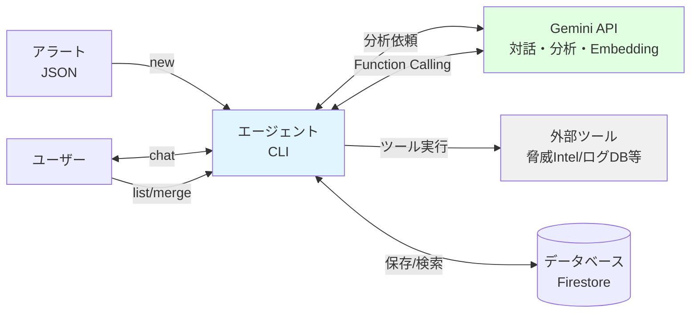
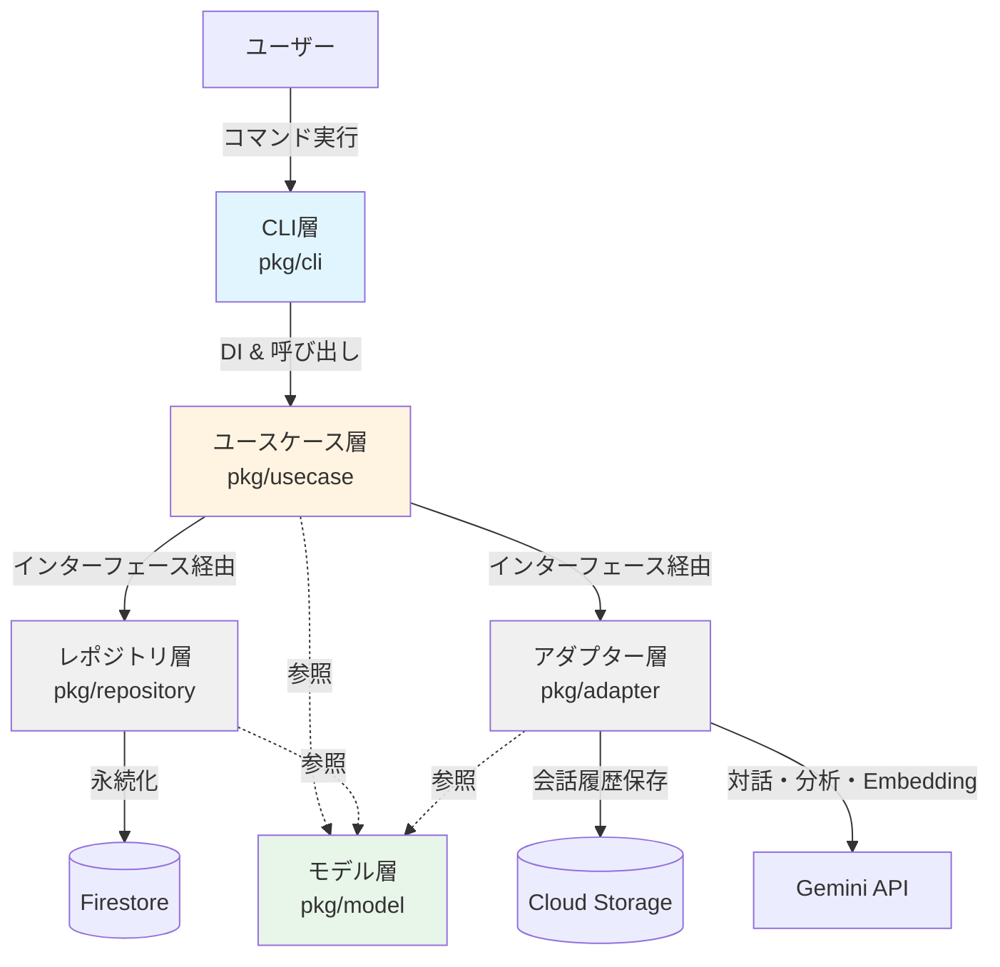
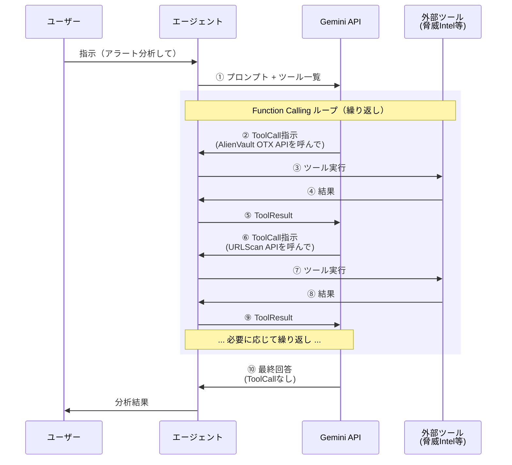
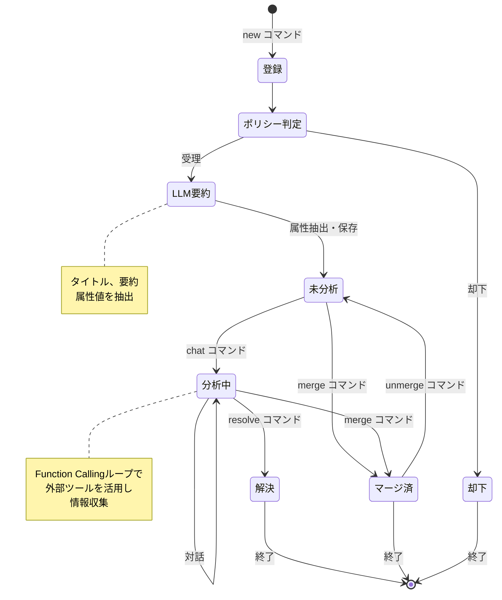

本章では本書で構築するエージェントの全体像を解説し、実装のイメージを持ってもらうのが目的です。

今回のエージェントのリファレンス実装として以下のリポジトリを用意しています。コードの開発方法などについては次章以降で解説しますが、必要に応じて参照してもらえるとより理解が深まるかと思います。

https://github.com/m-mizutani/leveret

# 今回実装するエージェントの基本設計

## 構築するエージェントの概要

まず、今回構築するエージェントの機能的な概要について説明します。本エージェントはセキュリティアラートをJSON形式で受け取り、LLMと外部ツールを活用して分析を行います。ユーザーは対話的に調査を進めることができ、最終的な結論を記録として残すことができます。受け付けたアラートはデータベースに保存され、検索したり整理したりといった管理機能も提供します。これらの操作は全てCLIで動作し、コマンドラインから各種操作を実行する形になります。

今回はLLMサービスとして、Google Gemini APIを利用します。Geminiはエージェントの動作制御、対話的な分析、ツール呼び出し、そしてアラートの類似度検索のためのEmbedding生成など、全ての機能を一貫して担当します。Gemini 2.5系はマルチモーダル対応、強力な推論能力、そして豊富なツール連携機能を備えており、セキュリティ分析エージェントに必要な機能を包括的にサポートしています。また、Vertex AI経由で利用することで、Google Cloudの他サービスとのシームレスな連携も実現できます。




## CLI中心のアーキテクチャを選択した理由

本エージェントはCLIツールとして動作する設計を採用しています。実運用を考えるとSlackやWebUIと統合しアラートを受け付けたり管理できる方が有用ですが、今回はまずCLIのみで動作するようにします。これにはいくつかの理由があります。

まず学習と理解の容易さという観点があります。LLMエージェントの本質的な機能、すなわちLLM統合、ツール連携、ポリシー処理といった部分に焦点を当てることができます。UI/UXの実装に時間を取られず、エージェントのロジックそのものを理解することに集中できます。またCLIであればデバッグやトラブルシューティングも容易です。

次に実装のシンプルさも大きな理由です。CLIであれば非同期処理やWebSocketなどの複雑な通信プロトコルが不要です。ユーザー認証やセッション管理などの付帯機能も排除できます。入出力がテキストベースなので、テストやモック化も容易になります。

このような理由から、本書ではCLI中心の実装を進めていきます。ただしこれは実運用においてもCLIが有用ではないという意味ではありません。CI/CDパイプラインからの呼び出しや、cronやバッチ処理での定期実行、スクリプトによる自動化やチェイニングなど、CLIベースのツールは実際の運用でも十分活用できる場面があります。

## 生成AI活用の戦略

LLMエージェントを設計する上で重要なのは、生成AIの特性を理解し、適切な場面で活用することです。生成AIはすべての問題を解決する万能ツールではなく、得意・不得意があります。そのため、どのような場面で生成AIを使い、どのような場面では使わないかを明確にする必要があります。

実際の運用では、コードやポリシーによって記述されたロジックや計算・集計処理と、生成AIを組み合わせて使います。また事前処理できるものについてはあらかじめ準備しておくなどの工夫も必要です。このように適材適所でLLMとルールベースの処理を組み合わせることで、効率的なエージェントを実現します。

### 生成AIを使う場面

LLMが特に力を発揮するのは、自然言語理解が必要な処理、対話的な表現が求められる場面、そして柔軟な判断が必要な処理です。具体的には以下のような場面で生成AIを活用します。

- **アラートの要約生成**: 構造化されていないログやアラートから、人間が理解しやすい要約を生成します。非定型なデータであっても、文脈を理解して重要な情報を抽出できます。
- **IOC（侵害指標）の抽出**: 様々な形式で記述されたIPアドレス、ドメイン、ファイルハッシュなどを抽出します。すべてのパターンに対応するルールを書くのは現実的ではありませんが、生成AIであればキーになりそうな情報を柔軟に抽出できます。
- **対話的な分析**: ユーザーの自然言語での質問に対して適切なツールを選択して実行します。説明の深堀りでより詳しい解説をさせたり、特定の要素を段階的に掘り下げることができます。
- **ログクエリの生成**: 「過去1時間のこのIPからのアクセスを調べて」といった自然言語をSQLクエリに変換します。技術的な知識がなくても自然な表現で指示できます。
- **状況に応じたツール選択**: 分析の進行状況や得られた情報に応じて、次に必要なツールを動的に判断します。

### 生成AIを使わない場面

一方、決定性のある判定が適している処理、責任を伴う重要な判断、性能要件が厳しい処理では生成AIを利用しない選択が適切です。これらの場面では以下のようにルールベースの処理やポリシーを活用します。

- **既知のルールによるフィルタリング**: 特定のIPアドレスやドメインのホワイトリスト/ブラックリスト判定など、明確なルールで判断できる処理はポリシー（Rego）で実装します。生成AIよりも高速で、動作が予測可能で、コストもかかりません。
- **正規表現で抽出可能なパターンマッチング**: 定型的なフォーマットのデータ抽出は、ルールベースの処理のほうが適しています。確実性が高く、デバッグも容易です。
- **単純な閾値判定**: アラート数やスコアに基づく機械的な判断は、条件分岐で十分に対応できます。
- **大量データの一括処理**: API呼び出しの回数制限やコストの問題があるため、大規模なバッチ処理には不向きです。このような場合はLLMではなく別途集計機能を用意してそれを活用します。
- **最終的な影響度判定**: アラートの重要度や対応優先度の最終判断は人間が行うべきです。LLMには誤った情報を生成する可能性（ハルシネーション）があるため、責任を伴う判断は避けるべきです。

# コンポーネント分割

次にこのエージェントを構成する各コンポーネントとその役割について説明します。



このプロジェクトはレイヤードアーキテクチャとして設計されています。CLIツールなのでもっと軽量な構成にすることもできましたが、ある程度機能を追加する必要があることと、テスタビリティを確保して責務を明確に分解するために多層化しています。依存関係の方向は上から下（CLI → UseCase → Repository/Adapter）となっており、下位層は上位層を知らない構造になっています。これにより下位層の変更が上位層に影響を与えにくく、保守性が向上します。またインターフェースはユースケース層で定義し、レポジトリ層・アダプター層がそれを実装することでDI（依存性注入）を実現しています。

## フレームワーク層 ( `pkg/cli` )

フレームワーク層はユーザーとシステムの接点となる部分です。コマンドラインオプションを解釈し、レポジトリやアダプターのセットアップを行い、それらを元にしたユースケースの作成と適切なユースケースの呼び出しまでを担当します。また設定ファイルの読込など最低限のI/O処理もこの層の責務となります。環境変数の読込についてもこの層で設定し、他の場所からは環境変数を直接読み込まないようにしています。これにより設定値の注入経路を一箇所に集約し、テストやデバッグを容易にしています。

## ユースケース層 ( `pkg/usecase` )

ユースケース層はアプリケーションのメインロジックを担当します。レポジトリやアダプターを複合的に利用して、各コマンドの機能を実現します。レポジトリやアダプターはインターフェースとして受け取るため、外部からDIによってテスト用のモック実装を注入することができます。基本的には各サブコマンドごとにユースケースを持ちますが、構造体は1つにまとめてメソッドを複数もたせる形にしています。これによって共通の依存関係を効率的に管理できます。

## レポジトリ層 ( `pkg/repository` )

レポジトリ層はデータベースへのデータ永続化を担当する層です。今回はFirestoreを使ってデータを保持します。必要に応じて別のDBを使うこともできますが、Firestoreのベクトル検索機能（Vector Search）を使うためその機能をもつDBである必要があります。Gemini APIで生成したEmbeddingベクトルをFirestoreに保存し、類似アラート検索に活用します。この類似アラート検索機能により、過去に似たようなアラートがあった場合にその対応履歴を参照できるようになります。

## アダプター層 ( `pkg/adapter` )

アダプター層は外部サービスとの接続を抽象化する層です。まず会話履歴保存のためのストレージ用インターフェースを持ちます。今回はCloud Storageを利用します。ファイルシステムでも実装可能ですが、Firestoreがリモートにあるため平仄を揃える形でCloud Storageを選択しています。

またLLMへアクセスするためのインターフェースもこの層で定義します。Gemini APIを対話的な分析、ツール呼び出し、そしてEmbedding生成（アラートのベクトル化）の全てに利用します。Gemini SDKをwrapするクライアントを持つことで、上位層からは具体的なAPI実装の詳細を隠蔽しています。

## モデル層 ( `pkg/model` )

モデル層は全体を通して利用する構造体を格納する場所です。構造体に閉じた必要なロジックがあればそれもここに内包します。

# データモデルに関する解説

実装が進むにつれて必要なデータを追加していきますが、システムの中核となるアラートとポリシーという2つの概念についてのみ、ここで先に解説します。

## アラート

アラートは外部から報告されたセキュリティに関する警告を示す構造体です。具体的な例として、[Amazon GuardDuty](https://aws.amazon.com/guardduty/)から発報されるアラートのサンプルを以下に示します。

:::details Amazon GuardDuty によるアラートのサンプル
```json
{
  "Findings": [
    {
      "AccountId": "783957204773",
      "Arn": "arn:aws:guardduty:ap-northeast-1:783957204773:detector/c6b248a96abef3c6dd24b07e13380b04/finding/034f3664616c49cb85349d0511ecd306",
      "CreatedAt": "2023-04-16T06:11:53.438Z",
      "Description": "EC2 instance i-99999999 is querying a domain name of a remote host that is known to hold credentials and other stolen data captured by malware.",
      "Id": "034f3664616c49cb85349d0511ecd306",
      "Partition": "aws",
      "Region": "ap-northeast-1",
      "Resource": {
        "InstanceDetails": {
          "AvailabilityZone": "GeneratedFindingInstaceAvailabilityZone",
          "IamInstanceProfile": {
            "Arn": "arn:aws:iam::783957204773:example/instance/profile",
            "Id": "GeneratedFindingInstanceProfileId"
          },
          "ImageDescription": "GeneratedFindingInstaceImageDescription",
          "ImageId": "ami-99999999",
          "InstanceId": "i-11111111",
          "InstanceState": "running",
          "InstanceType": "m3.xlarge",
          "OutpostArn": "arn:aws:outposts:us-west-2:123456789000:outpost/op-0fbc006e9abbc73c3",
          "LaunchTime": "2016-11-12T23:25:58.000Z",
          "NetworkInterfaces": [
            {
              "Ipv6Addresses": [],
              "NetworkInterfaceId": "eni-bfcffe88",
              "PrivateDnsName": "GeneratedFindingPrivateDnsName",
              "PrivateIpAddress": "192.168.0.1",
              "PrivateIpAddresses": [
                {
                  "PrivateDnsName": "GeneratedFindingPrivateName",
                  "PrivateIpAddress": "192.168.0.1"
                }
              ],
              "PublicDnsName": "GeneratedFindingPublicDNSName",
              "PublicIp": "198.51.100.0",
              "SecurityGroups": [
                {
                  "GroupId": "GeneratedFindingSecurityId",
                  "GroupName": "GeneratedFindingSecurityGroupName"
                }
              ],
              "SubnetId": "GeneratedFindingSubnetId",
              "VpcId": "GeneratedFindingVPCId"
            }
          ],
          "ProductCodes": [
            {
              "Code": "GeneratedFindingProductCodeId",
              "ProductType": "GeneratedFindingProductCodeType"
            }
          ],
          "Tags": [
            {
              "Key": "GeneratedFindingInstaceTag1",
              "Value": "GeneratedFindingInstaceValue1"
            }
          ]
        },
        "ResourceType": "Instance"
      },
      "SchemaVersion": "2.0",
      "Service": {
        "Action": {
          "ActionType": "DNS_REQUEST",
          "DnsRequestAction": {
            "Domain": "3322.org",
            "Protocol": "UDP",
            "Blocked": false
          }
        },
        "Evidence": {
          "ThreatIntelligenceDetails": [
            {
              "ThreatListName": "GeneratedFindingThreatListName",
              "ThreatNames": ["GeneratedFindingThreatName"]
            }
          ]
        },
        "Archived": false,
        "Count": 1,
        "DetectorId": "c6b248a96abef3c6dd24b07e13380b04",
        "EventFirstSeen": "2023-04-16T06:11:53.000Z",
        "EventLastSeen": "2023-04-16T06:11:53.000Z",
        "ResourceRole": "TARGET",
        "ServiceName": "guardduty",
        "AdditionalInfo": {
          "Value": "{\"threatListName\":\"GeneratedFindingThreatListName\",\"sample\":true}",
          "Type": "default"
        }
      },
      "Severity": 8,
      "Title": "Drop Point domain name queried by EC2 instance i-99999999.",
      "Type": "Trojan:EC2/DropPoint!DNS",
      "UpdatedAt": "2023-04-16T06:11:53.438Z"
    }
  ]
}
```
:::

このようなデータをもとに必要な情報を抽出し、分析するというのがこのエージェントの目標です。

アラートはあまり複雑な情報をもたない代わりに、元データから抽出した属性値（ `Attribute` ）を持てるようにします。属性値の抽出方法には2つのパターンがあります。1つはポリシーなどで決定的に抽出するパターンで、もう1つはLLMを使って重要そうなデータを抽出してもらうパターンです。

```go
type Alert struct {
    ID          AlertID
    Title       string
    Description string
    Data        any
    Attributes  []*Attribute

    CreatedAt  time.Time
    ResolvedAt *time.Time
    Conclusion string
    Note       string
    MergedTo   AlertID
}

type Attribute struct {
    Key   string
    Value string
    Type  AttributeType // 文字列、数値、IPアドレスなどの種別を示す型
}
```

- `Title`, `Description` は全体で統一するため都度LLMに生成させる前提です（ポリシーでも指定可能にします）
- `Data` は元データが入ります
- `Attribute` は同一キーを許容するために配列型にしています（LLMが重複キーを生成する可能性があるため）
- 生成日時 `CreatedAt` の他に、解決した状態やマージされた情報などを示す `ResolvedAt` などの情報を持ちます

## アラート処理ポリシー

このエージェントでは、決定性のある判定をするためにLLMの判定機能とは別にポリシーを持ちます。これはOpen Policy Agent (OPA) のRegoで記述されたルールベースの判定機能です。アラートのフィルタリング、分類、自動アクションのトリガーなどに利用されます。

LLMによる分析の前段階で、決定的に処理できる内容はポリシーで判定します。例えば、特定のIPアドレスからのアラートは無視する、あるいは特定の属性を持つアラートには自動的にタグを付与するといった処理です。具体例としては以下のようになります。

```rego
package alert

alert contains {
    "title": "this is test alert", # タイトルをポリシーで決定する
    "attributes": [
        {"key": "username", "value": input.user_name}, # ユーザ名のみ属性値に追加
    ],
} if {
    not ignore
}

ignore if {
    input.remote_addr == "192.168.0.1" # 192.168.0.1 からのアラートは無視
}
```

ポリシーは外部ファイルとして管理し、実行時に動的に読み込むことができます。これによりコードの再ビルドなしにルールの追加・変更が可能になります。ポリシーの詳細については第13章以降で扱います。

# 本エージェントの処理フロー

最後に全体の処理の流れがイメージしやすいよう、LLMの呼び出しとアラートの状態遷移の2点について説明します。

## 対話時のLLMの呼び出しフロー

対話的な分析の中心となるのが、LLMとのやり取りです。ここではその基本的なフローについて説明します。



最もシンプルなLLM呼び出しは単純なテキスト生成リクエスト（content generate）です。しかしこれだと単発の呼び出しで完結してしまい、外部ツールとの連携ができません。そこで本エージェントでは**Function Calling**と呼ばれる呼び出し方法を使います。

Function CallingはLLMにツール一覧と指示を渡して、その応答に呼び出すツールの指定を含ませる仕組みです。OpenAI APIでは"Function Calling"、Anthropic APIでは"Tool Use"と呼ばれています。LLMから**FunctionCall**（呼び出し指示）が返ってきたら、それに合わせて実際のツール（外部機能）を呼び出します。その結果を**FunctionResult**（実行結果）としてまたLLMに渡します。

この処理はFunctionCallが発生しなくなるまで繰り返されます。FunctionCallが返ってこなくなったら、生成AIは最終的な結論を返します。このワークフローには様々な発展形がありますが、これが最もシンプルな構成です。後続の章ではこれをベースに説明していきます。

## アラートのライフサイクル

次にアラートがどのような状態を経て処理されるかを説明します。以下の図は、アラートが登録されてから最終的な処理完了までの状態遷移を示しています。



今回のエージェントはCLIというインターフェースの特性から、サブコマンドでアラートを操作するものとします。コマンドの操作や内部処理によって、

- **却下**: 無視
- **解決**: 分析完了
- **マージ済み**: 類似するアラートとまとめる

のいずれかになると処理完了となります。コマンドの役割については以下のとおりです。

### アラートの登録（`new`コマンド）

アラートの処理はまず登録から始まります。JSON形式でアラートを投入すると、システムはIDを返します。この時点でポリシーによりアラートとして取り扱うかの判定を行います。却下された場合はここで処理が終了します。

受理されたアラートについては、Gemini APIを利用してタイトル、要約、属性値の抽出を行います。この段階で構造化された情報をDBに保存します。同時にGemini APIでアラートのEmbeddingベクトルを生成し、Firestoreに保存します。このベクトルは後続の類似アラート検索で活用されます。

### アラートの閲覧（`list`コマンド）

登録されたアラートは `list` コマンドで一覧表示できます。現在登録してあるアラート一覧として、ID、タイトル、作成日時、要約が表示されます。デフォルトではマージ済みアラートは非表示になっていますが、`-a` オプションを使うとマージ済みも含めて全件表示することができます。

### アラートの分析（`chat`コマンド）

分析を行う際は `chat` コマンドでIDを指定して対話的な分析を開始します。前節で説明したFunction Callingのループによって、必要な外部ツールを呼び出しながら分析を進めます。会話履歴はCloud Storageに保存されるため、次回の `chat` コマンド実行時に分析を継続することができます。

分析の際には、Firestoreから類似アラートをベクトル検索で取得し、過去の対応事例をコンテキストとして活用します。これにより、過去に似たようなアラートがあった場合にその対応履歴を参照しながら分析を進めることができます。

### アラートの解決（`resolve`コマンド）

分析が完了したら、`resolve` コマンドで結論を記録してアラートを解決状態にします。解決時は「影響のあるアラートだった」「誤検知だった」などの記録を残します。記録された結論は後から参照することが可能です。

### アラートの整理（`merge`/`unmerge`コマンド）

アラートの整理には2つの方法があります。まず個別整理として、`merge` コマンドで特定のアラートを別アラートに統合することができます。実態としては `MergedTo` フィールドに統合先IDを設定します。また一括整理として、`list` コマンドでフィルタした結果を、オプションにより特定のアラートへ一括マージすることも可能です。

マージされたアラートは以降 `list` で表示されなくなります。ただし誤ってマージした場合には、`unmerge` コマンドでマージを解除することができます。

# まとめ

本章ではこれから構築するセキュリティ分析エージェントの全体像を解説しました。重要なポイントの1つは、LLMとルールベースの処理を使い分けるアプローチです。生成AIは柔軟で強力ですが、万能ではありません。決定的な判断が必要な場面ではポリシーを、最終的な意思決定では人間の判断を組み合わせることで、実用的なエージェントを実現できます。

次章以降は実際にコードを書いていきます。まずは開発環境のセットアップとベースコードの理解から始め、段階的に生成AI統合、ツール連携、ポリシー処理などの機能を実装していきます。本章で解説したアーキテクチャが実装以外の観点でも参考になれば幸いです。
