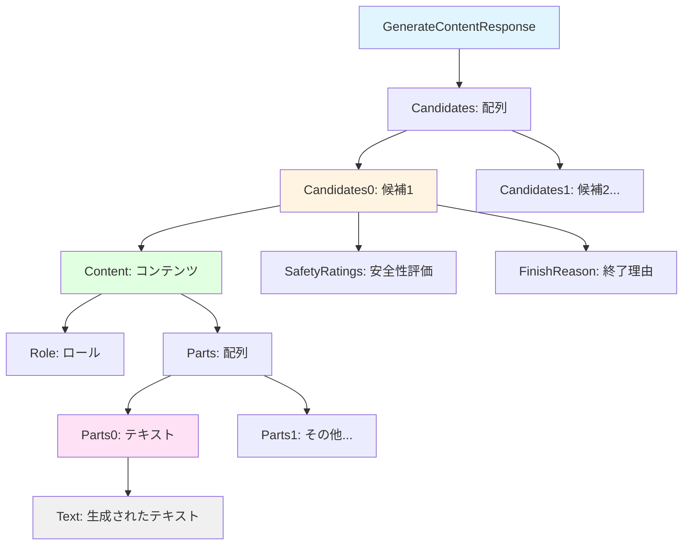

本章はもっとも簡単なLLMのAPI利用ということで、自動的にアラートのタイトルや要約を作成してみます。

# APIクライアントの設計

本章からいよいよLLMのAPIを利用していきますが、まずはAPIクライアントの設計について説明します。LLMのAPIクライアントは[pkg/adapter/gemini.go](https://github.com/m-mizutani/leveret/blob/main/pkg/adapter/gemini.go)にすでに実装されています。

今回はGoogle CloudのVertex AI経由でGemini APIを利用するため、`google.golang.org/genai` というSDKを使用しています。執筆時点（2025年10月）ではこのSDKが推奨されています。なお `github.com/google/generative-ai-go` というSDKもありますが、こちらはすでに利用非推奨となっているため注意してください。

クライアントの初期化処理は以下のようになっています。

```go:pkg/adapter/gemini.go
func NewGemini(ctx context.Context, projectID, location string, opts ...GeminiOption) (*GeminiClient, error) {
	client, err := genai.NewClient(ctx, &genai.ClientConfig{
		Project:  projectID,
		Location: location,
		Backend:  genai.BackendVertexAI,
	})
	if err != nil {
		return nil, goerr.Wrap(err, "failed to create genai client")
	}

	g := &GeminiClient{
		client:          client,
		generativeModel: "gemini-2.5-flash",
		embeddingModel:  "gemini-embedding-001",
	}

	for _, opt := range opts {
		opt(g)
	}

	return g, nil
}
```

Vertex AIをバックエンドとして指定し、プロジェクトIDとロケーションを設定してクライアントを作成します。デフォルトでは生成モデルとして `gemini-2.5-flash` を、埋め込みモデルとして `gemini-embedding-001` を使用しますが、オプションで変更も可能です。

このAPIクライアントは `google.golang.org/genai` の `Client` 構造体を薄くラップしているだけですが、テスト時にモックを作成しやすくするために以下の3つのメソッドをインターフェースとして定義しています。

- `GenerateContent`: テキストを生成するメソッドです。本章はまずこのメソッドを利用します
- `CreateChat`: 履歴を保持した対話セッションを作成するメソッドです。実態は履歴を管理しながら `GenerateContent` を呼び出しているだけです
- `Embedding`: テキストを数値ベクトルに変換するメソッドです。意味が類似したテキストほどベクトル空間上で近い位置に配置されるという性質があり、後日実装する類似アラート検索で利用します

# `GenerateContent` を呼び出してみる

`GenerateContent` はLLMのAPIで提供される最も基礎となるメソッドです。実際にこのメソッドを利用して、テキスト生成がどのように動作するのかを確認していきます。なお、この実装は `day05-alert-summary` ブランチで確認できます。

## テストコードの実装

まずテストコードの冒頭部分から見ていきます。

```go:pkg/adapter/gemini_test.go
func TestGenerateContent(t *testing.T) {
	projectID := os.Getenv("TEST_GEMINI_PROJECT")
	if projectID == "" {
		t.Skip("TEST_GEMINI_PROJECT is not set")
	}
```

このテストでは実際のGemini APIサービスを呼び出すため、環境変数 `TEST_GEMINI_PROJECT` が設定されていない場合はテストをスキップするようにしています。実サービスを呼び出すテストは、CI環境など一部の環境では実行できない場合があります。また、API呼び出しにはコストが発生するため、明示的に環境変数を設定した場合のみテストを実行する設計としています。

### クライアントの初期化とコンテンツの作成

次にクライアントを初期化し、LLMに送信するコンテンツを準備します。

```go:pkg/adapter/gemini_test.go
	ctx := context.Background()
	client, err := adapter.NewGemini(ctx, projectID, "us-central1")
	gt.NoError(t, err)

	contents := []*genai.Content{
		{
			Role: "user",
			Parts: []*genai.Part{
				{Text: "Hello, what is the capital of France?"},
			},
		},
	}

	resp, err := client.GenerateContent(ctx, contents, nil)
	if err != nil {
		t.Fatal("failed to call GenerateContent", err)
	}
```

ここで注目すべきは `genai.Content` の構造です。`Role` フィールドは `user` を指定します。これはユーザーからの入力であることを示すためです。これはGemini APIの仕様によるものです。

`Parts` フィールドには複数の入力を設定できます。基本的には1つの `Part` にテキストをまとめて入れるのが原則ですが、入力内容を条件によって動的に変更したい場合などに複数の `Part` を使うこともあります。また `Parts` にはテキスト以外のデータ（画像など）も入力できますが、本書では原則としてテキストのみを扱います。

### レスポンスの検証

API呼び出しが成功した後、レスポンスの内容を検証します。

```go:pkg/adapter/gemini_test.go
	if resp == nil ||
		len(resp.Candidates) == 0 ||
		resp.Candidates[0].Content == nil ||
		len(resp.Candidates[0].Content.Parts) == 0 ||
		resp.Candidates[0].Content.Parts[0].Text == "" {
		t.Fatal("unexpected response")
	}

	t.Log("response:", resp.Candidates[0].Content.Parts[0].Text)
```

`genai.GenerateContentResponse` の構造を理解することが重要です。レスポンスは以下のような階層構造になっています。



レスポンスには `Candidates` というフィールドがあり、複数の候補が返されることもありますが、通常は1つだけの応答が返されます。各候補の中には `Content` があり、さらにその中に `Parts` が含まれています。テキストのみの応答の場合、`Parts` は1つだけ含まれることが多くなっています。

このため、実際に生成されたテキストを取得するには `resp.Candidates[0].Content.Parts[0].Text` という深い階層をたどる必要があります。

## 実行結果の確認

実際にテストを実行すると以下のような結果が得られます。

```bash
$ env TEST_GEMINI_PROJECT=your-project go test -v ./pkg/adapter/
=== RUN   TestGenerateContent
    gemini_test.go:45: response: The capital of France is **Paris**.
--- PASS: TestGenerateContent (1.56s)
PASS
ok      github.com/m-mizutani/leveret/pkg/adapter
```

「フランスの首都は何ですか？」という質問に対して、「フランスの首都はパリです」という正しい回答が返されていることが確認できます。

## LLMのテストにおける考慮事項

生成AIは確率的な応答を返すという特性があるため、同じ入力に対しても毎回完全に同じ出力が得られるとは限りません。そのため、テストで出力内容を検証する場合は、完全一致ではなく "Paris" という単語が含まれているかどうかを確認するといったアプローチが現実的です。

ただし、このアプローチでも完全な検証は難しい場合があります。より決定的な動作を求める場合は、`temperature` パラメータを0に設定することで出力の多様性を抑えることができます。しかし `temperature` を0にすると、LLMが生成する多様な回答パターンに対応できるかどうかのテストが困難になるため、一長一短があります。

### 生成パラメータのカスタマイズ

`GenerateContent` を呼び出す際には、さまざまなパラメータを指定して出力を調整できます。本書ではこれらのパラメータについて詳しくは扱いませんが、興味がある方は[公式ドキュメント](https://cloud.google.com/vertex-ai/generative-ai/docs/multimodal/content-generation-parameters)を参照してください。


# エラー処理について

LLMのAPIは一般的なWebサービスと同様のエラーに加えて、LLM特有のエラーがいくつか存在します。これらを理解しておくとデバッグやトラブルシューティングに役立ちます。本セクションでは主にGemini APIを例として説明しますが、OpenAIのGPTやAnthropicのClaudeなど他のLLMサービスにも類似した概念が存在します。

## (1) トークン数に関する問題

LLMではテキストを「トークン」という単位で処理します。トークンとは、テキストを細かく分割した単位のことで、英語の場合は単語やサブワード（単語の一部）、日本語の場合は文字や形態素に相当します。目安として、英語は1トークンあたり約4文字、日本語は約2〜3文字程度です。

各モデルには処理できるトークン数の上限（コンテキストウィンドウ）があり、入力トークンと出力トークンの合計がこれを超過するとエラーが発生します。たとえばGemini 2.5 Flashの場合、約1Mトークンが上限です。このコンテキストウィンドウ問題はエージェントを構築するうえでの大きな課題の一つになります。詳しくは後日取り扱います。また `maxOutputTokens` パラメータを小さく設定しすぎると、LLMの応答が途中で打ち切られてしまうため、長い応答が必要な場合は適切に設定する必要があります。

## (2) コンテンツフィルタリング

LLMサービスには安全性を確保するためのコンテンツフィルタリング機能が組み込まれています。入力プロンプトや生成出力に不適切な内容が含まれていると判定された場合、処理がブロックされたり候補がフィルタリングされることがあります。セキュリティアラートの分析では攻撃の痕跡や悪意あるコンテンツを扱うため、これらが危険なプロンプト入力とみなされてブロックが発生する可能性があります。筆者の経験上ではあまりありませんが、そのような場合は安全性設定を調整する必要があります。

ブロックされた場合は `promptFeedback.blockReason` や `safetyRatings`、`finishReason = SAFETY` などのフィールドで理由を確認できます。また、全候補がフィルタリングされて空のリストが返されることもあるため、レスポンスが空であることを適切にハンドリングする必要があります。

## (3) その他の制約

Function Callingを使用する場合、ツール呼び出しと実行結果のペアを履歴に正しく含めないとエラーになります。後日実装するFunction Callingの仕組みでは、この履歴管理を適切に行う必要があります。

また、同じサービスプロバイダのモデルでもバージョンや種類によって利用できる機能が異なります。たとえばGeminiの1.0系ではFunction CallingやAudio入力が未サポートですが、2.0系以降では対応しています。基本的には最新のモデルを利用することをおすすめします。

# アラートのタイトルと要約を作成する

それでは実際にアラートのタイトルと要約を生成するコードを追加しましょう。追加するファイルは `pkg/usecase/alert/insert.go` となります。まずはタイトルを作成する関数を作成します。


## 基礎的なタイトルの生成

タイトルを生成する関数 `generateTitle` の実装は以下のようになります。

```go:pkg/usecase/alert/insert.go
func generateTitle(ctx context.Context, gemini adapter.Gemini, alertData string) (string, error) {
	prompt := "Generate a short title (less than 100 characters) for this security alert. Return only the title without any explanation:\n\n" + alertData

	contents := []*genai.Content{
		{
			Role:  "user",
			Parts: []*genai.Part{{Text: prompt}},
		},
	}

	resp, err := gemini.GenerateContent(ctx, contents, nil)
	if err != nil {
		return "", goerr.Wrap(err, "failed to generate content for title")
	}

	if resp == nil || len(resp.Candidates) == 0 || resp.Candidates[0].Content == nil || len(resp.Candidates[0].Content.Parts) == 0 {
		return "", goerr.New("invalid response structure from gemini")
	}

	return strings.TrimSpace(resp.Candidates[0].Content.Parts[0].Text), nil
}
```

この実装にはいくつかの重要なポイントがあります。

### プロンプトの言語

今回のプロンプトは英語で記述していますが、日本語でも同様に動作します。また、生成するタイトルの言語を指定したい場合は、プロンプト内にその旨を記述することで制御できます。たとえば "Generate a short title in Japanese..." のように指定することで、日本語のタイトルを生成できます。

### 出力制約の限界

プロンプトに記述した命令はあくまで目安として扱われ、厳密に守られるとは限りません。たとえば文字数制限について "less than 100 characters" と指定していますが、この制約がバイト数でカウントされる場合や、日本語で「N文字以内」と指定しても無視される場合があります。

そのため、出力結果に対して厳密な制約が必要な場合は、LLMの出力を信頼するのではなく、必ずコード内でバリデーションを実施する必要があります。生成AIはあくまで「なるべく指示に従おうとする」システムであり、確実に制約を守るシステムではありません。

### 構造化データの入力

もう一つの重要なポイントは、アラートデータを文字列として渡していることです。LLMに渡せるデータはテキスト、画像、音声などですが、画像や音声はマルチモーダル対応モデルでのみ利用できます。本書ではテキストのみを扱います。

アラートのような構造化データは、JSONなどの文字列形式に変換して渡す必要があります。データ形式についてはLLMにも得意不得意があり、一般的にXMLよりもJSONのほうが理解されやすい傾向があります。ただし、JSONでもネストが深くなると理解が難しくなる場合があります。

これらの傾向はモデルごとに異なるため、使用するモデルと実際のデータの組み合わせで、自分のシステムに最適な形式を試してみる必要があります。

要約の作成も同じ要領で実装できます。プロンプトのみ要約とは違った内容を記述し、後は同じ処理で実装できます。

```go
func generateDescription(ctx context.Context, gemini adapter.Gemini, alertData string) (string, error) {
	prompt := "Generate a detailed description (2-3 sentences) for this security alert. Explain what happened and why it might be important. Return only the description without any explanation:\n\n" + alertData
    // 以下略
```

ここまでできたら `Insert` メソッドを以下のように追記します。これでタイトルと要約が生成できるようになります。

```go
alert := &model.Alert{
	ID:        model.NewAlertID(),
	Data:      data,
	CreatedAt: time.Now(),
}

jsonData, err := json.Marshal(data)
if err != nil {
	return nil, goerr.Wrap(err, "failed to marshal alert data")
}

title, err := generateTitle(ctx, u.gemini, string(jsonData))
if err != nil {
	return nil, goerr.Wrap(err, "failed to generate title")
}
alert.Title = title

description, err := generateDescription(ctx, u.gemini, string(jsonData))
if err != nil {
	return nil, goerr.Wrap(err, "failed to generate description")
}
alert.Description = description

if err := u.repo.PutAlert(ctx, alert); err != nil {
	return nil, err
}

return alert, nil
```

これでアラートに関するタイトル・要約が自動生成されるようになりました。以下のコマンドでアラートが新規作成されるときにタイトル・要約が生成されてDBに登録され、閲覧時に確認ができるはずです。

:::message
前章で説明した通り、DBやGeminiに関するオプションを省略してコマンドを記述しています
:::

```shell
$ go run . new -i examples/alert/guardduty.json
Alert created: c994fb06-7b28-4b9c-9f0f-564f654b6684
$ go run . show -i c994fb06-7b28-4b9c-9f0f-564f654b6684
{
  "ID": "c994fb06-7b28-4b9c-9f0f-564f654b6684",
  "Title": "Drop Point domain name queried by EC2 instance i-99999999.",
  "Description": "An EC2 instance (i-11111111) in your AWS account queried the domain \"3322.org\". This domain is known to be a \"drop point\" where malware collects stolen credentials and other data, indicating a potential compromise of the instance by a Trojan.",
  "Data": {
# 以下略
```

生成されたタイトルは、元のアラートデータから重要な情報（ドロップポイントドメインへの問い合わせとEC2インスタンスID）を抽出して簡潔にまとめたものです。また要約では、何が起きたか（EC2インスタンスがドメインを問い合わせた）、なぜ重要か（マルウェアによる侵害の可能性）を2〜3文で説明しています。

# エラー処理と動的プロンプト生成

ここまでは基礎的な実装を見てきましたが、実用性を高めるためにエラー処理とプロンプト管理を改善します。前述した通り、LLMへの指示によって出力内容をある程度制御できますが、最終的な検証はコード内で行う必要があります。生成AIは必ずしも期待した出力を返すとは限らないため、特に厳密性を求める処理では必ず検証が必要です。しかし、一度失敗したらそのまま終了してしまうのでは、実務のアプリケーションとしては安定性に欠けます。

## リトライ機構の実装

出力内容をコントロールしたい場合は、リトライの仕組みを持たせることをおすすめします。今回の実装ではベタ書きしていますが、実際のプロダクションコードでは構造化したり共通ロジックとして切り出すのが良いでしょう。

ここで重要なポイントは、過去の失敗情報を付与したリクエストを送信すると修正される確率が高くなるということです。たとえば「100文字以内のタイトルを生成してください」という指示に対して120文字のタイトルが返ってきた場合、2回目のリクエストで「前回は120文字で長すぎました」という情報を追加することで、生成AIはより適切な長さのタイトルを生成しやすくなります。

失敗情報をどのように付与するかはアプリケーションやロジックによって異なり、これが共通化や構造化を考える際のポイントになります。

## プロンプトの管理

プロンプトの管理も重要な課題です。プロンプトが複雑化すると、どこにどのような変数を、どのような条件で入れ込むかの管理が大変になります。さらに長文になってくると、埋め込み文字列で文章を管理するのも困難です。プロンプトのベストプラクティスとして、Markdown形式で文章を構造化すると良いとされていますが、埋め込み文字列だとエディタのサポートを受けられず、入力補助、ハイライト、整形などができないため面倒です。筆者のおすすめは、`embed` パッケージで外部ファイルを読み込み、`text/template` を使ってプロンプトを生成する方法です。以下のように変数を埋め込める形式にします。

```markdown:pkg/usecase/alert/prompt/title.md
Generate a short title (less than {{.MaxLength}} characters) for this security alert. Return only the title without any explanation:

{{.AlertData}}
{{- if .FailedExamples}}

Previous attempts that were too long (please make it shorter):
{{- range .FailedExamples}}
- "{{.Title}}" ({{.Length}} characters)
{{- end}}
{{- end}}
```

このテンプレートでは、`FailedExamples` が存在する場合のみ過去の失敗例をリスト化して表示します。今回は失敗例のリスト化にしかMarkdownを使っていませんが、たとえばデバッグ時のみ詳細情報を含めるセクションを追加するなど、条件に応じたプロンプト構成が可能で便利です。

## リトライ機構を含む実装

これらの考え方をもとに修正した `generateTitle` 関数が以下のようになります。

```go:pkg/usecase/alert/insert.go
// プロンプトテンプレートファイルを埋め込み
//go:embed prompt/title.md
var titlePromptRaw string

// プロンプトテンプレートをパースして準備
var titlePromptTmpl = template.Must(template.New("title").Parse(titlePromptRaw))

func generateTitle(ctx context.Context, gemini adapter.Gemini, alertData string, maxLength int) (string, error) {
	const maxRetries = 3 // 最大リトライ回数

	// 失敗した生成例を記録する構造体のスライス
	var failedExamples []struct {
		Title  string
		Length int
	}
	logger := logging.From(ctx)

	// リトライループ
	for attempt := 0; attempt < maxRetries; attempt++ {
		// テンプレートにパラメータを適用してプロンプトを生成
		var buf bytes.Buffer
		if err := titlePromptTmpl.Execute(&buf, map[string]any{
			"MaxLength":      maxLength,      // 最大文字数
			"AlertData":      alertData,      // アラートデータ
			"FailedExamples": failedExamples, // 過去の失敗例（リトライ時のみ）
		}); err != nil {
			return "", goerr.Wrap(err, "failed to execute title prompt template")
		}

		// Gemini APIに渡すコンテンツを構築
		contents := []*genai.Content{
			{
				Role:  "user",
				Parts: []*genai.Part{{Text: buf.String()}},
			},
		}

		// タイトルを生成
		resp, err := gemini.GenerateContent(ctx, contents, nil)
		if err != nil {
			return "", goerr.Wrap(err, "failed to generate content for title")
		}

		// レスポンスの構造を検証
		if resp == nil || len(resp.Candidates) == 0 || resp.Candidates[0].Content == nil || len(resp.Candidates[0].Content.Parts) == 0 {
			return "", goerr.New("invalid response structure from gemini")
		}

		// 生成されたタイトルを取得
		title := strings.TrimSpace(resp.Candidates[0].Content.Parts[0].Text)

		// 文字数制限をチェック
		if len(title) <= maxLength {
			logger.Debug("title accepted", "title", title)
			return title, nil // 成功
		}

		// 文字数超過の場合は失敗例に追加してリトライ
		logger.Warn("title too long, retrying", "title", title, "length", len(title), "maxLength", maxLength)
		failedExamples = append(failedExamples, struct {
			Title  string
			Length int
		}{title, len(title)})
	}

	// 最大リトライ回数を超えた場合はエラー
	return "", goerr.New("failed to generate title within character limit after retries")
}
```

これで安定してアラートのタイトル、および要約を自動生成する実装ができました。

# まとめ

本章はLLMのAPIを実際に呼び出し、アラートのタイトルと要約を自動生成する実装を行いました。非常にシンプルなケースですが、それでもいくつかLLMのAPI呼び出し、コードの統合にポイントがあることがわかったかなと思います。

重要なポイントとしては、LLMを「命令したとおりに動く装置」として扱うのではなく、出力を検証し、失敗に対処する仕組みを組み込むという考え方です。生成AIは確率的に動作するため、期待通りの出力が常に得られるとは限りません。しかしリトライは可能ですし、失敗情報を次のリクエストに活用することで成功率を向上させることができます。このパターンは今後実装するより複雑な機能、たとえばFunction CallingやPlan-Execute パターンでも共通して使える考え方です。

また、プロンプトを外部ファイルとテンプレートで管理する方法も、プロンプトが複雑化してくるとさらに重要になります。今回紹介した方法に限りませんが、なんらかの工夫は必要となる点を抑えられるとよいでしょう。

次章では、LLMの出力を構造化データとして扱う方法について解説します。タイトルや要約といった自由形式のテキストではなく、JSONなどの決まった形式でデータを取得する技術について説明します。
