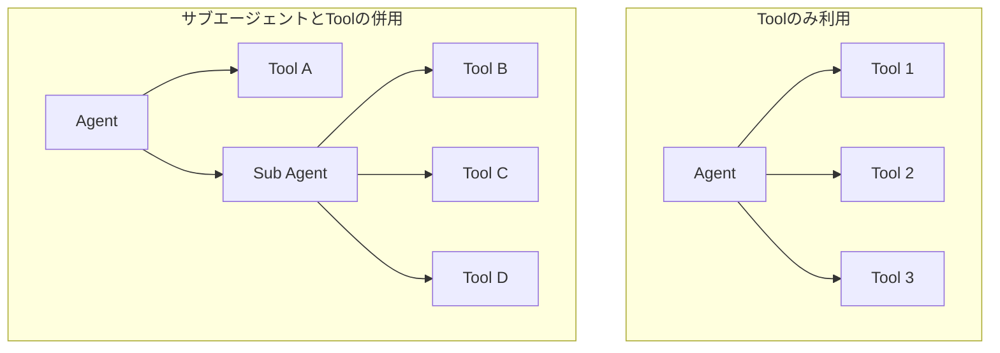

# コンテキスト圧縮の必要性

LLMエージェントを運用していくうえで避けて通れない問題が、コンテキストウィンドウ（トークン限界）の超過です。会話が長くなったりツールの実行結果が蓄積されたりすると、必ずこの問題に直面します。本章では、この問題にどう対処するかを解説します。

## LLMにおけるトークンに関する基礎知識

まず、トークンについての基礎知識を整理しておきます。ここでいうトークンとは、生成AI（特にLarge Language Model）が処理するために文字列を分割した単位のことです。英語の場合は1単語が1トークンとなることが多いのですが、必ずしもそうとは限りません。記号や特殊文字なども1トークンとして表されますし、長い単語は複数のトークンに分割されることもあります。

トークン数は原則としてサービスに問い合わせないと正確な値がわかりません。Geminiの場合、トークン数の取得自体は無料で提供されています。トークンの概念や分割方法はモデルやサービスごとに異なり、BPE（Byte Pair Encoding）やWordPieceといった手法が用いられています。また、言語によってもトークン数の傾向が変わります。英語では1単語が1トークン前後になることが多いのに対し、日本語では同じ文字列長に対してトークン数が多くなる傾向があります。

Geminiでトークン数を取得するには、以下のようなコードを使います。

```go
client, err := genai.NewClient(ctx, &genai.ClientConfig{
    Project:  os.Getenv("GEMINI_PROJECT"),
    Location: location,
    Backend:  genai.BackendVertexAI,
})
if err != nil {
    return goerr.Wrap(err, "failed to create genai client")
}

// Count tokens
contents := genai.Text(text)
resp, err := client.Models.CountTokens(ctx, model, contents, nil)
if err != nil {
    return goerr.Wrap(err, "failed to count tokens")
}

fmt.Printf("Token count: %d tokens\n", resp.TotalTokens)
```

実際に実行してみると、トークン分割の様子を確認できます。

```bash
$ cd examples/count-token
$ env GEMINI_PROJECT=your-project go run . "hello world"
Token count: 2 tokens
$ go run . '{"hello":"world"}'
Token count: 5 tokens
$ go run . 'こんにちは'
Token count: 1 tokens
$ go run . '寿限無寿限無五劫の擦り切れ'
Token count: 12 tokens
```

英語の "hello world" は2トークン、JSON形式の文字列は括弧やコロンなどの記号も含めて5トークンとなります。日本語の場合、「こんにちは」は1トークン、「寿限無寿限無五劫の擦り切れ」（15文字）は12トークンとなっています。英語は文字数（10文字）に対してトークン数（2トークン）が少ないのに対し、日本語は文字数に近いトークン数になる傾向があります。

## LLMエージェント利用時のトークン制限問題

モデルごとのトークン限界は年々増加していますが、それでも有限です。例えばGeminiの場合、100万トークン（正確には1,048,576トークン）が上限となっています。これはテキスト換算でおよそ4MB程度の容量に相当し、一見すると非常に長いように思えますが、LLMエージェントを運用していると意外と簡単に到達してしまいます。

LLMエージェントでトークン制限が問題になるケースは、大きく分けて2つあります。

### (1) 会話が続くことで履歴が長くなる

すでに実装した通り、LLMエージェントとの「会話」の実態は「都度会話の履歴を全部投げつける」ということでした。LLMは基本的にステートレスであるため、前回までの文脈を保持するには、毎回すべての履歴を含めてリクエストする必要があります。そのため会話が続くと自ずと履歴が長くなっていきます。個々のメッセージが短くても、やり取りの回数が増えれば全体のトークン数は増加し、最終的にはトークン限界を超過してしまいます。特にツール呼び出しを繰り返すような処理では、ツールの実行結果も履歴に含まれるため、トークン消費が加速します。

### (2) 一度に長いメッセージが投入される場合

もう一つのケースは、単一のメッセージが非常に長い場合です。ユーザが大きなファイルやログデータを直接入力しようとすると発生しやすい問題です。また、ツール実行の結果が非常に大きい場合（例えばログ検索の結果が数万行に及ぶなど）にも同様の問題が起こります。

このケースは会話履歴の要約だけでは解決できません。入力データそのもののサイズが限界を超えている場合、データ自体を圧縮したりフィルタリングしたりする必要があります。本章では主に(1)のケース、つまり会話履歴の蓄積によるトークン超過への対処方法を扱います。

# 会話履歴の圧縮戦略

会話履歴が限界を超えた場合、古い履歴を単純に削除するという対処も可能です。しかしこれには重大な問題があります。過去に会話した内容を「忘れて」しまうことになるからです。

例えば、最初にユーザから重要な指示や制約条件が与えられていた場合、それを削除してしまうと以降の応答がユーザの意図から外れてしまう可能性があります。また、調査の途中で得られた重要な知見や判断材料を失ってしまうと、同じ調査を何度も繰り返すことになりかねません。

そこで採用するのが、会話を要約することでサイズを圧縮するという手法です。これは単なるデータの可逆圧縮ではなく、要約によって要点だけを残すという手法です。例えば、途中でツールを呼び出した際のリクエストやレスポンスの詳細、知見を得る前の生ログデータなどは、後続の処理にはあまり意味を持ちません。このような情報を省略し、重要度の高い情報のみを保持することで、情報の欠落を最小限に抑えながらサイズを削減できます。

もちろん、要約によって一定の情報欠落は避けられません。そのため、可能であれば要約を行わないに越したことはありません。しかし現実的には避けられない問題であるため、適切な要約戦略を立てることが重要になります。

## 要約の具体的方法

大容量のデータを要約する方法はいくつかあります。今回はシンプルに、要約自体をLLMにクエリするという方法を採用します。これは、もともとトークン限界に収まっていたデータのサイズを圧縮したいだけであり、必要な履歴データをそのまま投入できるためです。

より高度な要約方法としては、例えば履歴を複数の断片に分割して個別に要約を作成し、それらを統合するといった手法もあります。しかし今回はシンプルな実装を優先し、このような高度な手法は扱いません。興味のある方は Map-Reduce 型の要約手法などを調べてみてください。

なお、要約自体もLLMへのクエリとなるため、要約対象のデータがトークン制限内に収まっている必要があります。要約対象が既にトークン制限を超えている場合は、先述したMap-Reduce型の分割要約などの別の手法が必要になります。今回の実装では、もともとトークン限界内だった履歴が時間経過で膨れ上がったケースを想定しているため、この点は問題になりません。

## 要約の方針

要約で最も重要な原則は、「何が分かったか（結果・知見）」を残し、「どうやって調べたか（プロセス）」を捨てることです。この観点から、何を保持し何を省略すべきかを考えます。

単に「要約して」とだけ指示すると、漠然としたまとめになったり、重要な情報が欠如したりする可能性があります。そのため、どういう情報を残すべきかをプロンプトエンジニアリングで明確に指示する必要があります。この方針はタスクによって大きく変わるため、エージェントごとに調整すべき部分です。

セキュリティ分析を主な目的とする場合、以下のような情報を優先的に保持すべきです。まず最も重要なのは、ユーザからの指示や質問、そして何をゴールにしているかという情報です。これらが失われると、エージェントの行動指針そのものが失われてしまいます。次に、分析の過程で得られた重要な知見や攻撃に関する情報も必須です。IOC（Indicator of Compromise: 侵害指標）は特に重要で、IPアドレス、ドメイン名、ファイルハッシュ、URLなどは確実に保持する必要があります。さらに、重要度や影響度の判定に利用できそうな証跡や痕跡、調査作業の進行状況や文脈、次以降の調査に必要そうな手がかり、ネクストステップなども保持すべき情報です。これらがあることで、調査を中断せずに継続できます。

逆に、省略してもよい情報もあります。ツール呼び出しの詳細（関数名やパラメータなど）や、その結果の生データ全体、ツール利用が失敗した履歴などは、最終的な結果には影響しないため削除できます。調査の過程で得られた冗長な情報や、調査の過程そのもの（手続きの詳細）も同様です。

こういった指示をプロンプトで与えることで、目的に応じた適切な要約を生成できます。

## 要約の範囲

会話履歴を要約する際、現状の履歴全体を要約するという選択肢もありますが、必ずしもそうする必要はありません。より効果的な戦略として、新しい会話は残し、古い部分のみを要約する方法があります。

例えば、要約対象は古い方の70%程度にしておき、新しい30%はそのまま残すという方針です。これにより、直近の文脈が要約によって失われることを防げます。特に、最近のやり取りには現在進行中の調査に関する重要な情報が含まれていることが多いため、これをそのまま保持することで調査の継続性を保ちやすくなります。

このあたりの勘所はタスクによって変わります。対話が短期間で完結するタスクであれば直近の履歴の重要性が高いですし、長期にわたる調査であれば初期の情報も重要になります。運用しながら適切な比率を見つけていくとよいでしょう。

## いつ要約するか

要約を実行するタイミングには、大きく分けて2つの方式があります。

### 予防的圧縮（事前監視方式）

一つ目は、トークンサイズを監視しながら一定値を超えたら圧縮するという方式です。例えば、トークン限界の80%に達したら要約を実行するといった具合です。この方式の利点は、トークン超過エラーが発生する前に対処できることです。

ただし、正確なトークン数を取得するにはAPIを呼び出す必要があります。Geminiの場合、トークン数の取得自体は無料ですが、毎回チェックしていると応答時間が劣化します。また、レート制限にも注意が必要です。また、モデルごとにトークン限界が異なるため、複数のモデルを使い分ける場合はそれぞれの制限を管理する必要があり、実装が複雑になります。バイト数による近似であれば、モデルに依存しない単純な実装で済みます。

### リアクティブ圧縮（エラー駆動方式）

もう一つの方式は、トークン超過エラーが起きたら発火するという方式です。今回の実装ではこちらを採用しています。実装がシンプルになり、不要な監視コストがかからないためです。

なお、今回の実装では文脈を可能な限り維持するためにエラーが発生するまで圧縮を行わない方式を採用していますが、コスト削減を優先する場合はもっと早い段階で要約を実行してもよいでしょう。GenerateContentのレスポンスには現在のトークン使用量（`UsageMetadata`）が含まれているため、この情報を利用して一定の割合（例えば限界の60-70%）に達したら予防的に圧縮する実装も可能です。文脈の維持とコストのバランスを考慮して、自分のユースケースに合った戦略を選択してください。

両方式の比較は以下の通りです。

| 方式 | メリット | デメリット |
|------|---------|-----------|
| 予防的圧縮 | エラー発生前に対処できる | トークン数取得のコスト、閾値設定の難しさ |
| リアクティブ圧縮 | 実装がシンプル、不要な監視コストなし | 一度エラーが発生する、リトライが必要 |

Geminiの場合、トークン超過エラーは以下のようなメッセージで返されます。

```bash
% cd examples/too-large-request
% env GEMINI_PROJECT=your-project go run .
APIError - Code:400 Status:INVALID_ARGUMENT Message:The input token count (2500030) exceeds the maximum number of tokens allowed (1048576). Details:[]
```

このエラーメッセージを検知して要約処理を実行します。`examples/too-large-request/main.go` を実行すると、実際にこのエラーを確認できます。

ただし注意点として、API側の挙動が変わる（エラーメッセージが変更される）場合などに影響を受ける可能性があります。AI関連のツールやサービスはこういった仕様の更新が頻繁に行われるため、実装が不安定になりやすい面があります。重要なシステムでは、エラーパターンのテストを定期的に実行することをお勧めします。例えば、`isTokenLimitError` 関数が実際のエラーメッセージを正しく検知できるかのユニットテストを用意し、API仕様変更の影響を早期に検出できるようにしておくとよいでしょう。

# 圧縮戦略の実装

それでは、実際のコードを見ていきましょう。全体の流れとしては、トークン超過エラーを検知したら要約を実行し、圧縮された履歴でリトライするという仕組みです。

## エラーハンドリングとリトライロジック

まず、セッション内でのエラーハンドリングとリトライのロジックです。`pkg/usecase/chat/session.go` の `Send` メソッド内で、以下のような処理を行っています。

```go
resp, err := s.gemini.GenerateContent(ctx, s.history.Contents, config)
if err != nil {
    // Check if error is due to token limit exceeded
    if isTokenLimitError(err) {
        // Attempt compression
        fmt.Println("\n📦 Token limit exceeded. Compressing conversation history...")

        compressedContents, compressErr := compressHistory(ctx, s.gemini, s.history.Contents)
        if compressErr != nil {
            return nil, goerr.Wrap(compressErr, "failed to compress history")
        }

        // Update history with compressed contents
        s.history.Contents = compressedContents

        // Save compressed history immediately
        if saveErr := saveHistory(ctx, s.repo, s.storage, s.alertID, s.history); saveErr != nil {
            fmt.Printf("⚠️  Warning: failed to save compressed history: %v\n", saveErr)
        }

        fmt.Println("✅ Conversation history compressed successfully. Retrying...")
        continue // Retry with compressed history
    }
    return nil, goerr.Wrap(err, "failed to generate content")
}
```

このコードでは、シンプルにエラーが起きたときに要約を試みています。`isTokenLimitError` 関数でトークン超過エラーかどうかを判定し、該当する場合は `compressHistory` 関数で履歴を圧縮します。圧縮された履歴で `s.history.Contents` を差し替え、`continue` でループの先頭に戻ることでリトライします。トークン超過エラーでなければ、そのままエラーを返します。

重要な点として、要約後は即座に `saveHistory` で履歴を永続化しています。これにより、次回以降のセッションでも圧縮後の状態から再開できます。圧縮処理はコストがかかるため、一度圧縮したものは保存しておくことで、無駄な再圧縮を避けられます。

## 履歴の範囲計算

次に、`compressHistory` 関数の中身を見ていきましょう。まず最初に行うのが、要約対象となる履歴部分の抽出です。`pkg/usecase/chat/compress.go` では以下のようなコードで範囲を計算しています。

```go
	// Calculate byte size for each content
	totalBytes := 0
	byteSizes := make([]int, len(contents))
	for i, content := range contents {
		size := contentSize(content)
		byteSizes[i] = size
		totalBytes += size
	}

	// Calculate compression threshold (70% of total bytes)
	compressThreshold := int(float64(totalBytes) * compressionRatio)

	// Find the index where we cross the 70% threshold
	cumulativeBytes := 0
	compressIndex := 0
	for i, size := range byteSizes {
		cumulativeBytes += size
		if cumulativeBytes >= compressThreshold {
			compressIndex = i + 1 // Include this message in compression
			break
		}
	}

	// If compression index is 0 or at the end, nothing to compress
	if compressIndex == 0 || compressIndex >= len(contents) {
		return nil, goerr.New("insufficient content to compress")
	}
```

ここでは対象をバイト数で計算しています。`contentSize` 関数は、各 `Content` を JSON にマーシャルしてバイト数を取得する関数です。

```go
// contentSize calculates the byte size of a content by JSON marshaling
func contentSize(content *genai.Content) int {
	data, err := json.Marshal(content)
	if err != nil {
		return 0
	}
	return len(data)
}
```

この関数は、テキストだけでなくツール呼び出しの情報なども含めた正確なサイズを測定できます。

本来であればトークン数で計算すべきですが、都度APIでトークン数を問い合わせていると遅延が発生しますし、レート制限に引っかかる恐れもあります。そのため、多少粗くてもローカルで計算できるバイト数を使っています。

バイト数とトークン数には相関があるため、完全に正確でなくても圧縮の目的は達成できます。コード内の `compressionRatio` は 0.7 に設定されており、全体の70%のバイト数に達するまでのメッセージを要約対象としています。これにより、新しい30%の履歴はそのまま保持されます。

## 要約の実行と履歴の再構築

範囲計算が終わったら、実際に要約を実行して新しい履歴を構築します。

```go
	// Extract contents to compress and to keep
	toCompress := contents[:compressIndex]
	toKeep := contents[compressIndex:]

	// Generate summary of compressed contents
	summary, err := summarizeContents(ctx, gemini, toCompress)
	if err != nil {
		return nil, goerr.Wrap(err, "failed to summarize contents")
	}

	// Create summary content as user message
	summaryContent := &genai.Content{
		Role: genai.RoleUser,
		Parts: []*genai.Part{
			{Text: "=== Previous Conversation Summary ===\n\n" + summary},
		},
	}

	// Return new history: summary + kept contents
	newContents := append([]*genai.Content{summaryContent}, toKeep...)
	return newContents, nil
}
```

まず、計算した `compressIndex` を使って履歴を2つに分割します。`toCompress` が要約対象の古い履歴、`toKeep` がそのまま保持する新しい履歴です。

次に、`summarizeContents` 関数を呼び出して要約を生成します。この関数は、要約対象の履歴に要約用のプロンプト（後述）をユーザメッセージとして追加し、LLMに投げて要約テキストを取得します。

要約結果は新しいユーザメッセージとして履歴の先頭に挿入されます。`Role` を `genai.RoleUser` に設定し、テキストの冒頭に `=== Previous Conversation Summary ===` というマーカーを付けることで、LLMが「これは過去の会話の要約である」と認識できるようにしています。最後に、要約メッセージと保持する履歴を結合して返します。これにより、元の履歴よりも大幅に小さい新しい履歴が構築され、トークン限界を回避できます。

## 要約用のプロンプト

最後に、要約を生成する際に使用するプロンプトです。`pkg/usecase/chat/prompt/summarize.md` に以下のような内容が格納されています。

```markdown
You are an assistant for security alert analysis.

## Context and Purpose

The conversation history has exceeded the token limit. Create a summary that will replace the older parts of the conversation, preserving all critical information needed to continue the security investigation.

This summary will be inserted at the beginning of the conversation history. Focus on what matters for ongoing analysis, not the investigation process itself.

## What to Preserve (Highest Priority)

**1. User's Intent and Goals (MOST CRITICAL)**
- User's questions and what they want to know
- Investigation goals and what conclusion the user seeks
- Explicit instructions or constraints the user has given
- User's concerns or areas of focus

**2. Attack and Security Intelligence**
- Key findings about the incident (malicious/benign/false positive)
- Attack patterns, techniques, TTPs identified
- IOCs: IP addresses, domains, file hashes, URLs, email addresses, usernames
- Evidence supporting severity/impact assessment
- Timeline of the attack or suspicious activities

**3. Investigation Progress and Context**
- Current state of the investigation
- Important insights or discoveries from the analysis
- Clues or leads for next steps
- What has been verified vs. what remains uncertain

**4. Next Steps and Actions**
- Recommended next steps in the investigation
- Decisions requiring user input
- Outstanding questions that need answers

## What to Deprioritize or Omit (Lowest Priority)

**Do NOT include:**
- Tool call details (function names, parameters, how they were invoked)
- Full tool output or raw data dumps
- Failed tool calls or error messages
- Exploratory queries that yielded no useful information
- The investigation process itself (step-by-step procedures)
- Redundant or repeated information
- Assistant's internal reasoning or thought process

**Remember:** Summarize RESULTS and FINDINGS, not the PROCESS of obtaining them.

## Output Format

Format the summary in markdown:

- **User's Goals**: What the user wants to achieve or understand
- **Investigation Status**: Current understanding of the incident
- **Key Findings**: Critical security conclusions and determinations
- **Attack Intelligence**: IOCs, TTPs, timeline, attack patterns
- **Evidence**: Important facts supporting severity/impact assessment
- **Next Steps**: What to investigate next or decisions needed
- **Open Questions**: Unresolved issues requiring attention

Be extremely concise. One sentence per point is ideal. Preserve facts, not explanations.
```

このプロンプトは、先ほど説明した要約の方針を具体的に指示したものです。あくまで一例であり、実際の運用に合わせて調整できます。

プロンプトでは「何を残すか」「何を捨てるか」を明確に指示することが重要です。特にセキュリティ分析では、IOCや攻撃パターンなどの重要情報を確実に保持する必要があります。一方で、ツール実行の詳細や調査プロセスは省略可能です。「RESULTS and FINDINGS, not the PROCESS」という原則を明記することで、LLMに適切な要約を生成させられます。

また、出力フォーマットを指定することで、要約結果の構造を一定に保つことができます。構造化された要約は、後続の処理でも扱いやすくなります。各項目を1文で簡潔に記述するよう指示しているのもポイントです。冗長な説明を避け、事実のみを保持することで、要約後のトークン数を最小限に抑えられます。

このあたりのプロンプトは、実際に動かしてみながら調整していく必要があります。最初から完璧なプロンプトを作ることは難しいため、実運用での要約結果を観察しながら改善していくとよいでしょう。

# サブエージェントによる分散

これまでの圧縮戦略は、会話履歴そのものをコンパクトにする手法でした。次のセクションでは別のアプローチ、サブエージェントを使って処理を分散させることでコンテキスト消費を抑制する手法を見ていきます。

## サブエージェントの概念と必要性

サブエージェントとは、メインで動作するエージェントが、さらに別のエージェントを呼び出すという設計パターンです。呼び出される側のエージェントも通常のエージェントと同様にツールを使用するため、本質的にやっていることは大きく変わりません。しかし、サブエージェントに特定の問題領域を委譲することで、モジュール化やカプセル化と同様の設計上の利点を得ることができる**場合があります**。

一方で、この構成は当然ながらシステムを複雑化させます。そのため、何でもかんでもエージェント化すれば良いというわけではありません。サブエージェントアーキテクチャが効果を発揮するのは、明確に切り出せるタスクが存在し、そのタスクが独立して実行可能な場合に限られます。

サブエージェントの構成を図で表すと以下のようになります。基本的にはツールと並列にエージェントが存在するという考え方で問題ありません。エージェントの先にさらにエージェントがいるような多段階の構成も考えられますが、本章では階層が一段階のみのシンプルな構成を扱います。



上図の「Toolのみ利用」では、エージェントが直接各ツールを呼び出しています。一方「サブエージェントとToolの併用」では、エージェントがTool Aを直接呼び出す一方で、Tool B、C、Dに関してはサブエージェントを介して利用する構成になっています。この構成により、Tool B、C、Dに関連する処理はサブエージェント内で完結し、メインエージェントはその結果のみを受け取ることができます。

## サブエージェントの利点と欠点

サブエージェントアーキテクチャを採用するかどうかは、利点と欠点を天秤にかけて判断する必要があります。以下では、それぞれについて詳しく解説します。

### 利点

#### コンテキスト消費の抑制

サブエージェントアーキテクチャの最も大きな利点は、コンテキスト消費を抑制できることです。例えば「ログデータを調査する」というタスクを投げる場合を考えてみましょう。最終的に必要なのは調査結果だけです。しかし、実際の調査過程では様々な試行錯誤が発生します。SQLクエリを試してみたり、結果を確認して条件を変更したり、スキーマを確認したりといった作業が繰り返されます。この試行錯誤ができることこそがLLMエージェントの強みですが、その過程はメインエージェントのコンテキストとしては無駄になります。すべての中間結果を保持し続けると、コンテキストウィンドウを圧迫してしまうからです。

サブエージェントを使用すると、タスクが完了した後にこの過程を不要なものとして破棄できます。メインエージェントに返されるのは最終的な調査結果のみであり、途中のSQLクエリやその実行結果、エラーとリトライの記録などは保持されません。これにより、メインエージェントのコンテキスト増加を大幅に抑制することができます。

#### モデル切り替えが容易

サブエージェントを使用すると、処理の途中でLLMモデルを差し替えることが非常に簡単になります。現在利用可能なLLMモデルには、それぞれ異なる特徴があります。例えば、あるモデルは論理的推論に強いがコストが高い、別のモデルは大量データの読み込みに強いがツール呼び出しの精度が低い、といった違いがあります。

もちろん、ツールとして実装している場合でも力技でモデルを差し替えることは可能です。しかし、その場合はモデル間の互換性を考慮する必要があります。同じプロバイダのモデル間でも、トークン上限の違いや利用可能な機能の違いが問題になることがあります。これが異なるプロバイダのモデルをまたぐ場合はさらに複雑になり、会話履歴の互換性を維持するのは非常に困難です。

エージェントとして分離していれば、「このタスクを処理するエージェントにはこのモデルを使用する」という割り当てが非常に容易になります。BigQuery調査用のエージェントにはデータ処理に特化したモデル、脅威分析用のエージェントには推論能力の高いモデル、といった使い分けが自然にできるようになります。

#### 問題領域の限定化

サブエージェントを使用すると、各エージェントが扱う問題領域を絞ることができ、それに伴い対応も特化できます。具体的には、サブエージェントごとに詳細なシステムプロンプトを設定できるようになります。

以前の記事で解説したように、LLMには「知らないものは探さない」という特性があります。そのため、ツールやデータソースについて適切な情報を提供する必要があります。しかし、ツールが多くなってくると、システムプロンプトに記載する情報が膨大になり、混乱を招く可能性があります。また、多くの文脈が混在していると、個別の状況に対する具体的な指示を与えにくくなります。

サブエージェントとして問題領域を分離すると、「こういう場合はやり直せ」「こういう状況ではこの可能性を疑え」といった細かい指示を入れやすくなります。また、一度に呼び出されるツール群も限定されるため、デバッグや制御が容易になります。これは一般的なプログラミングにおけるモジュール化と同じ発想です。適切な粒度で責務を分離することで、システム全体の保守性と品質が向上します。

### 欠点

#### コンテキストの欠落

サブエージェントの最大の欠点は、コンテキストが欠落することです。サブエージェントに渡される情報は、メインエージェントが持つ全コンテキストの一部に過ぎません。インターフェースの設計によりますが、例えば自然言語でタスクを渡すような場合、かなりの情報が削られることになります。

そのため、「これまでの情報をもとに総合的に判断する」ような、全コンテキストを必要とする処理には向いていません。サブエージェントが活用できるのは、仕事として明確に切り出せるタスク、つまり短い命令で期待する結果が得られる移譲可能なタスクに限られます。例えば「このIPアドレスの脅威情報を調べて」「このログを検索して」といった、入力と出力が明確に定義できるタスクが適しています。

#### 設計がかなり難しい

サブエージェントの設計は、コンテキストの欠落問題と密接に関連しており、非常に難しい課題です。APIをラップするだけのシンプルなFunction CallingやMCPツールとは根本的に異なります。

サブエージェントを設計する際には、常に「このユースケースでは、どの程度のコンテキストを受け取ってタスクを委譲すればうまく機能するか」を考える必要があります。コンテキストが少なすぎればサブエージェントは適切に動作できませんし、多すぎればサブエージェントの利点が薄れます。また、どのようなインターフェースにすればよいか（自然言語で指示するのか、構造化されたパラメータを渡すのか）といった設計判断にもセンスが問われます。

#### コントロールが難しい

LLMエージェントは、単体でも制御が難しいものです。ツールの呼び出し順序、判断ロジック、エラー時の振る舞いなど、不確定な要素が多く存在します。サブエージェントにタスクを委譲するだけでも、この複雑性は一気に増大します。

さらに複数のエージェントを協調させようとすると、複雑性は指数関数的に増加します。筆者の視点では、この分野はまだ成熟しておらず、ベストプラクティスも確立されていません。そのため、サブエージェントを導入する際には、システム全体の複雑性増加を十分に考慮する必要があります。

## サブエージェントの実装例

本章では、BigQueryの検索タスクをサブエージェント化します。以前の記事で実装したBigQuery関連のツール群を、サブエージェントとして再構成します。具体的には、`pkg/tool/bigquery`パッケージを廃止し、`pkg/agent/bigquery`としてツールごと引っ越しを行います。

前述の通り、サブエージェントのインターフェースはToolと同じにします。そのため、他のツールと同じように並べて登録するだけで利用できます。

```go
	// Create tool registry early to get flags
	registry := tool.New(
		alert.NewSearchAlerts(),
		otx.New(),
		bigquery.New(),
	)
```

このコードでは、`alert.NewSearchAlerts()`や`otx.New()`といった通常のツールと並んで、`bigquery.New()`（これがサブエージェント）を登録しています。外から見ると、これらは全て同じToolインターフェース（以前の記事で定義した`Spec()`や`Run()`メソッドを持つインターフェース）を実装しているため、メインエージェントは違いを意識する必要がありません。

一方、Toolとしてのインターフェースは`bigquery_run`という非常にシンプルなFunction Declarationに統一されます。このツールの説明には、自然言語で指示を出すよう促す内容を記載します。

```go
// Spec returns the tool specification for Gemini function calling
func (t *Tool) Spec() *genai.Tool {
	return &genai.Tool{
		FunctionDeclarations: []*genai.FunctionDeclaration{
			{
				Name:        "bigquery_run",
				Description: "Execute BigQuery analysis using natural language. This tool translates your request into SQL queries, executes them, and returns analysis results. Use this for log analysis, security investigation, and data exploration.",
				Parameters: &genai.Schema{
					Type: genai.TypeObject,
					Properties: map[string]*genai.Schema{
						"query": {
							Type:        genai.TypeString,
							Description: "Natural language description of what you want to analyze or query from BigQuery",
						},
					},
					Required: []string{"query"},
				},
			},
		},
	}
}
```

ここで重要なのは、メインエージェントからサブエージェントへの指示が自然言語で行われるという点です。構造化されたパラメータではなく自然言語を選択した理由は、サブエージェントに高い柔軟性を持たせるためです。メインエージェントは具体的なSQLの構造を知る必要がなく、「このIPアドレスに関連するログを過去24時間分検索してください」といった自然言語の指示を`query`パラメータに渡すだけで済みます。サブエージェント側がこの指示を解釈し、適切なSQLクエリを生成・実行します。

また、サブエージェントが利用可能なBigQueryテーブルの情報は、メインエージェント側のシステムプロンプトに追加されます。これにより、メインエージェントはどのようなデータが検索可能かを把握した上で、適切にサブエージェントを呼び出すことができます。

```go
// Prompt returns additional information to be added to the system prompt
func (t *Tool) Prompt(ctx context.Context) string {
	if !t.enabled || t.agent == nil {
		return ""
	}

	// Only expose table list to main agent (not runbooks)
	if len(t.agent.tables) == 0 {
		return ""
	}

	var sb strings.Builder
	sb.WriteString("### BigQuery Tables\n\n")
	for _, table := range t.agent.tables {
		sb.WriteString(fmt.Sprintf("- **%s**", table.FullName()))
		if table.Description != "" {
			sb.WriteString(fmt.Sprintf(": %s", table.Description))
		}
		sb.WriteString("\n")
	}

	return sb.String()
}
```

このコードでは、テーブル名と説明のみを提供しています。ただし、この情報量が適切かどうかはユースケースによります。場合によっては、テーブルのスキーマ情報を詳細に含めた方が良いかもしれませんし、逆にテーブルが多数ある場合は生成AIで要約した内容を付与した方が効果的かもしれません。この部分は扱うテーブルの数や用途に合わせて調整してください。

サブエージェントの実行ロジックは以下の通りです。メインエージェントと同様に、繰り返し処理を行います。

```go
// Execute processes a natural language query and returns the result
func (a *Agent) Execute(ctx context.Context, query string) (string, error) {
	// Build system prompt with context
	systemPrompt := a.buildSystemPrompt()

	// Create initial user message
	contents := []*genai.Content{
		genai.NewContentFromText(query, genai.RoleUser),
	}

	// Build config with tools
	config := &genai.GenerateContentConfig{
		SystemInstruction: genai.NewContentFromText(systemPrompt, ""),
		Tools:             []*genai.Tool{a.internalToolSpec()},
	}

	// Tool Call loop
	const maxIterations = 16
	var finalResponse string

	for i := 0; i < maxIterations; i++ {
		resp, err := a.gemini.GenerateContent(ctx, contents, config)
		if err != nil {
			return "", goerr.Wrap(err, "failed to generate content")
		}

		if len(resp.Candidates) == 0 || resp.Candidates[0].Content == nil {
			return "", goerr.New("empty response from Gemini")
		}

		candidate := resp.Candidates[0]
		contents = append(contents, candidate.Content)

		// Check for function calls
		hasFuncCall := false
		for _, part := range candidate.Content.Parts {
			if part.FunctionCall != nil {
				hasFuncCall = true
				// Execute the internal tool
				funcResp := a.executeInternalTool(ctx, *part.FunctionCall)

				// Add function response to contents
				funcRespContent := &genai.Content{
					Role:  genai.RoleUser,
					Parts: []*genai.Part{{FunctionResponse: funcResp}},
				}
				contents = append(contents, funcRespContent)
			}
		}

		// If no function call, extract final text response
		if !hasFuncCall {
			var textParts []string
			for _, part := range candidate.Content.Parts {
				if part.Text != "" {
					textParts = append(textParts, part.Text)
				}
			}
			finalResponse = strings.Join(textParts, "\n")
			break
		}
	}

	return finalResponse, nil
}
```

このコードの構造は、メインエージェントの実装とほぼ同じです。イテレーションごとに`GenerateContent`を呼び出し、Function Callが返ってきたらそれに従ってツールを実行します。ここで使用されるツールは、以前実装したBigQuery用のツール群（スキーマ取得、クエリ実行、結果取得など）です。

重要なポイントとして、`maxIterations`を指定して無限ループを防止しています。イテレーション制限の設定は難しい問題で、どの程度複雑なタスクをエージェントに任せるかによって調整が必要です。今回は16回としていますが、より複雑なタスクであれば増やす必要があるかもしれません。

また、このコードには含まれていませんが、処理の途中結果をなるべくユーザーに表示することが推奨されます。今回のようなCLIベースのシンプルなチャットであれば、標準出力に直接出力するだけでも十分です。より複雑なアプリケーションではコールバック関数やチャネルを使った通知の仕組みを検討してください。途中経過を表示することで、ユーザーは処理が進行していることを確認でき、安心感が得られます。また、エージェントが想定外の方向に進んでいる場合、早期に中断することも可能になります。

Function Callがなかった場合は、サブエージェントが結論に達したとみなし、テキストレスポンスを抽出してメインエージェントに返します。この結果には、調査で得られた情報と分析結果が含まれます。

## サブエージェント専用のシステムプロンプト

サブエージェントには専用のシステムプロンプトを設定します。これにより、そのタスクに特化した詳細なガイドラインを提供できます。完全なプロンプトはGitHubリポジトリを参照してください。以下では重要な部分を抜粋して解説します。

まず、基本的なワークフローを定義します。

```markdown
## Workflow

1. Understand the user's analysis request
2. If a suitable runbook exists, use `bigquery_runbook` to get the pre-defined query
3. Get table schema using `bigquery_schema` if needed to understand the data structure
4. Execute SQL queries using `bigquery_query`
5. Retrieve and analyze results using `bigquery_get_result`
6. Provide insights based on the query results
```

このワークフローを明記することで、例えばエージェントがいきなり推測でクエリを作成するのを防ぐことができます。まずスキーマを確認し、既存のランブックを参照するという手順を踏むことが促されます。このような指示は、全てのツールが横並びになっている状態では書きにくいものです。問題領域がサブエージェントとして分離されているからこそ、このような詳細なワークフローを記述しやすくなります。

次に、ツール使用上の重要なガイドラインを提供します。

```markdown
## Important Guidelines

- Always validate table existence before querying
- Use LIMIT clauses to avoid excessive data scans
- Consider time ranges to narrow down results
- When query results are large, use pagination with offset
- Explain your findings in the context of security analysis
- If the scan limit is exceeded, modify the query to reduce data scanned
```

ここでは、LIMIT句を必ず使用すること、時間範囲を考慮すること、スキャン制限を超えた場合の対処法などを指示しています。LIMIT句の使用は課金問題の防止だけでなく、大量データが返ってコンテキストを圧迫するのを防ぐ役割もあります。

さらに重要なのは、予期しない結果に対するリカバリ戦略です。

```markdown
## Unexpected Result Recovery

**CRITICAL**: When query results are unexpected (0 rows, missing expected data, strange values), DO NOT immediately trust the result. Instead:

1. **Question the search criteria** - The field values may not match your expectations
   - Field format might be different (e.g., IP as string vs integer, timestamps in different formats)
   - Field names might be different from what you assumed
   - Values might use different conventions (e.g., "ERROR" vs "error" vs "ERR")
   - Data might be in nested or repeated fields

2. **Verify field values** - Issue a separate query to check what values actually exist:
   -- Check distinct values in a field
   SELECT DISTINCT field_name FROM table LIMIT 100

   -- Check value patterns
   SELECT field_name, COUNT(*) as cnt
   FROM table
   GROUP BY field_name
   ORDER BY cnt DESC
   LIMIT 20
```

結果が見つからなかったり予期しない値が返ってきたりした場合、すぐに「データがない」と結論づけるのではなく、フィールドのフォーマットや命名規則を疑うよう指示しています。例えば、IPアドレスが文字列として格納されているか整数として格納されているか、タイムスタンプのフォーマットが想定と異なるか、といった点を確認させます。

これは実際に人間がBigQueryを使用する際にも行う確認作業です。しかし、生成AIはこのような指示を明示的に与えないと、勝手に推測してクエリを作成し、「結果がありませんでした」と報告してしまうことがあります。そのため、「こういう状況ではこうしろ」というプラクティスを明確に渡す必要があります。

このような詳細なガイドラインも、全てのツールが混在した状態では記述しにくいものです。サブエージェントとして問題領域を分割したことで、文脈が限定され、このような具体的な指示を書きやすくなっています。

# まとめ - コンテキスト管理の総合戦略

本章では、LLMエージェントにおける会話コンテキストの圧縮戦略とサブエージェントアーキテクチャについて解説しました。

会話履歴の圧縮で最も重要なのは、「何を残し、何を捨てるか」を明確に定義することです。LLMによる要約で重要な情報のみを抽出し、エージェントの文脈理解を保ちながらトークン数を削減できます。本章で紹介した要約プロンプトは、セキュリティ分析に特化したものですが、自分のユースケースに合わせてカスタマイズしてください。

要約による情報欠落は避けられないため、可能な限り要約を発生させない設計（ツール実行結果のフィルタリングなど）も併せて検討するとよいでしょう。

サブエージェントアーキテクチャは、単にエージェントを階層化するだけでなく、問題領域をモジュール化する設計パターンです。その本質は「どのタスクを切り出せば、短い命令で期待する結果を得られるか」という見極めにあります。

重要なのは、サブエージェントが銀の弾丸ではない、という点です。コンテキストの欠落は避けられず、設計の複雑化も伴います。しかし、BigQueryの調査のような試行錯誤が必要だが最終結果だけが重要なタスクには非常に効果的です。中間過程を捨てられることでコンテキスト消費を抑制し、問題領域が限定されることで詳細なガイドライン（リカバリ戦略やベストプラクティス）を埋め込みやすくなります。

サブエージェントの導入では、まず「このタスクは移譲可能か？」をよく検討するべきです。全てのコンテキストを必要とする処理や、メインエージェントとの密な連携が必要なタスクには向きません。一方で、独立した調査や変換処理のように、入力と出力が明確に定義できるタスクは良い候補です。

実装面では、Tool呼び出しと同じインターフェースを保つことで既存システムへの統合が容易になります。また、サブエージェント専用のシステムプロンプトを設けることで、そのタスクに特化した指示や注意事項を詳細に記述できるようになります。これは一般的なプログラミングにおけるモジュール化と同じ発想であり、適切な粒度で責務を分離することがシステム全体の品質向上につながります。

トークン管理はエージェント設計全体で考えるべき課題であり、今後の章でもこの観点を意識しながら機能拡張を進めていきます。
