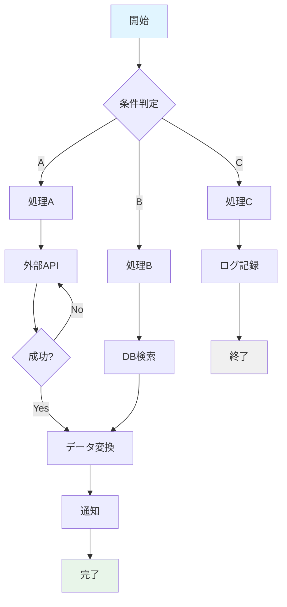
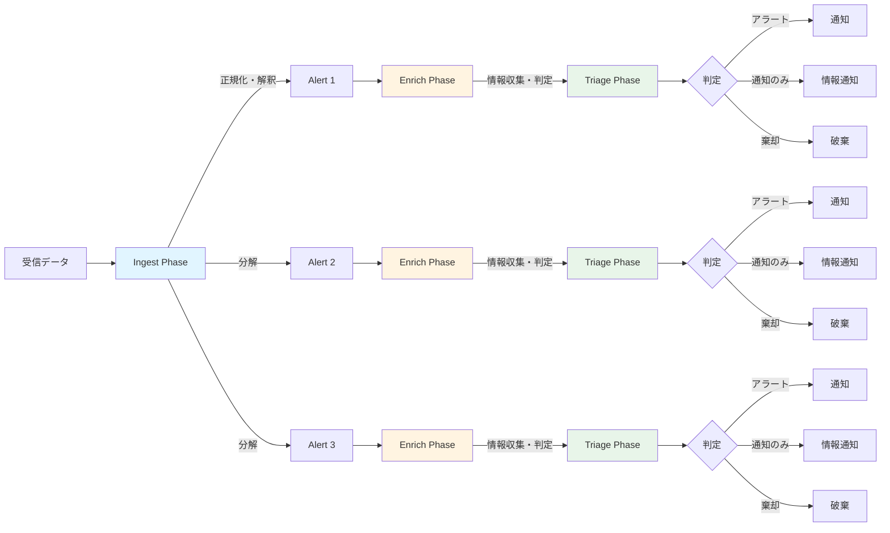
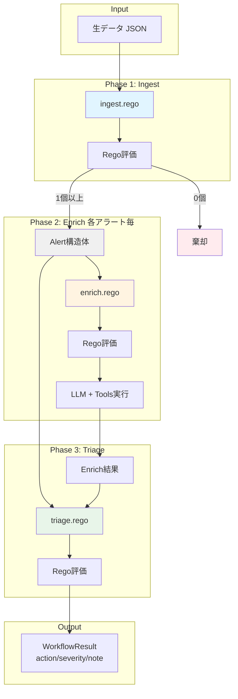
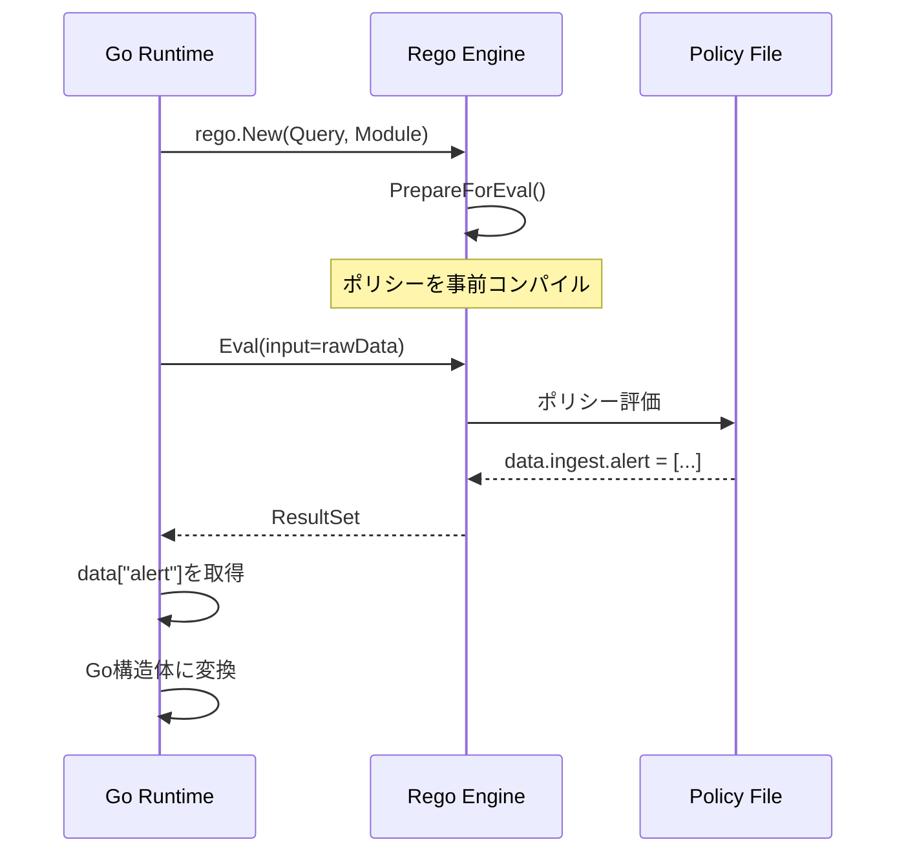
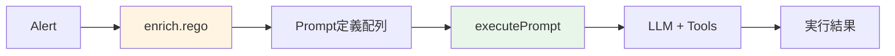

# AIワークフローの概念と設計思想

本章では、AIワークフローを一般的なワークフローエンジン・管理ツールにLLM機能を組み込んだものと定義します。ワークフローエンジンは処理、入出力、条件分岐などを接続して一連の手続きや業務を表現・実行する仕組みです。処理や入出力には外部サービスとの連携も含まれますが、むしろ外部システムとの連携こそがワークフローの主要な用途と言えます。

以下は一般的なワークフローの例です。このように処理、分岐、遷移が複雑に組み合わさり、自由な状態遷移を表現できます。


```mermaid
graph TD
    Start[開始] --> Check1{条件判定}
    Check1 -->|A| Process1[処理A]
    Check1 -->|B| Process2[処理B]
    Check1 -->|C| Process3[処理C]

    Process1 --> API1[外部API]
    API1 --> Check2{成功?}
    Check2 -->|Yes| Process4[データ変換]
    Check2 -->|No| API1

    Process2 --> DB[DB検索]
    DB --> Process4

    Process3 --> Log[ログ記録]
    Log --> End1[終了]

    Process4 --> Notify[通知]
    Notify --> End2[完了]

    style Start fill:#e1f5ff
    style End1 fill:#f0f0f0
    style End2 fill:#e8f5e9
```

AIが組み込まれたワークフローは、AIアプリケーションビルダー、LLMオーケストレーション、AIエージェントフローなど、さまざまな呼び方で呼ばれています。OSSではn8nやDifyなどが代表例として挙げられます。これらのツールの特徴は、直接コードを書くよりも簡単に処理を表現できる点にあります。DSL（Domain Specific Language）で記述したり、GUI上で設定することで、コーディングができない人や、コーディングよりも手軽に処理を組み立てたい人にとって有用な選択肢となります。

## AIワークフローにおけるAIの役割

AIワークフローにおいてLLMが担う役割は、大きく分けて3つあります。

**データの加工**: 雑多な自然言語を構造化データに変換したり、特定のキーワードを抽出したり、なんらかの法則に基づいてデータを変換する処理が該当します。従来のワークフローでは、ルール記述によって決定性のある処理を実現できていました。しかし曖昧なデータを扱う場合、ルールを記述するのは困難になります。特に自然言語のような非構造化データは、ルールベースでの処理が極めて難しくなります。たとえば、セキュリティアラートのメッセージから「誰が」「どこで」「何をした」という情報を抽出する場合、アラートの書式が統一されていないとルールでの対応は困難になります。生成AIを利用することで、このような曖昧なデータを構造化データへと変換できます。また自然言語から自然言語への変換も可能で、通知文面の作成などに活用できます。

**条件分岐判定**: 処理の内容としてはデータ加工と本質的には同じですが、目的が異なります。従来は個別にルールを記述する必要がありましたが、生成AIを使うことで曖昧な判定を実現できます。もちろんクリティカルな業務判断には使えませんが、ある程度の柔軟性が許容される判定であれば有用になります。たとえば、アラートの緊急度を4段階で判定したり、特定の条件に該当するかを柔軟に判断したりする用途に向いています。

**エージェント処理**: 他システムにアクセスする処理が該当します。具体的には、データ収集や収集対象の判断を自律的に行う調査タスク、ドキュメント作成、チケット作成、スケジュール作成などの作成・変更タスクが含まれます。

## セキュリティ分析で利用するワークフロー

セキュリティ分析におけるワークフローは、SOAR（Security Orchestration, Automation and Response）と呼ばれるものに相当します。従来のSOARは、アラートの種類ごとに詳細なルールを記述する必要があり、アラートが増えるほど運用コストが爆発的に増大するという課題がありました。この課題については以前の記事で解説した通りです。そこでSOARにLLM機能を組み込むことで、従来の課題がさまざまな形で軽減されます。

しかしSOARに生成AIを組み込んだだけで全てが解決するわけではありません。依然としてルールを書くのは大変です。そもそもルールを書かなくても、エージェントに命令するだけでだいたいのことはよしなにやってくれます。エージェントは人間に伴走する存在です。一方でSOARはそういった性質のツールではありません。

## それでもワークフローが必要な理由

それでもワークフローが必要な理由は2つあります。第一は、決定性のある処理は決定性をもって実行したほうがよいという点です。たとえばLLMに特定条件を無視させることも概ねうまくいきますが、一抹の不安が残ります。確実性をもって処理するための仕組みは欲しいところです。ルールをLLMに書かせて人間がレビューする方法もあります。それによって基本の動作は保証できます。第二は、セキュリティ分析ではアラートの事前処理を行いたいという点です。具体的には初期トリアージのような処理が該当します。人間が介入する前に、明らかに棄却すべきアラートをフィルタリングしたり、逆に緊急度の高いアラートを優先的にエスカレーションしたりします。このような仕組みがあると運用負荷を大きく軽減できます。

## ワークフローを独立して実装する必要があるのか

ここまでワークフローについて解説してきましたが、そもそもワークフロー機能として独立させずに普通にコードで表現すればいいのではないかという疑問もあります。その指摘はもっともで、だいたいのユースケースや要件はソースコードでの実装で充足します。しかしワークフローとして分離しておいたほうが良いケースもあります。

ワークフローを別の系で実装したほうがよい理由は主に2つあります。第一は、ロジックを平易に表現できる点です。たとえば「特定のIPアドレスからのアクセスは常に棄却する」というルールを、Goのコードで書くと条件分岐やデータ取得処理が複雑になりますが、DSLなら数行で表現できます（次のセクションで具体例を示します）。第二は、ランタイムとロジックを分離できる点です。実装分離が明確化されていると、コード上の整理としては良い状態になり、リファクタリングなどがしやすくなります。また、ランタイム実装者とロジック実装者を切り分けられるため、より運用寄りの人がロジックをいじりやすくなります。たとえば開発チームはランタイムの性能改善やバグ修正に集中し、セキュリティオペレーションチームは業務ロジックの調整に集中するといった役割分担が可能になります。実際にはソースコードでの実装で十分な場合もありますが、本章ではあえてワークフローを別で実装してみます。

# OPA/Regoの選定理由

## セキュリティアラートに対応するワークフローの設計のための整理

汎用的なワークフローエンジンを作ろうとすると非常に大変で、自由度を高めるために大量の機能を作る必要があります。しかし今回はユースケースがはっきりしているので、それに応じたワークフローを作ります。

### ユースケースの整理

今回実装するワークフローは、外部システムからアラートを受け取るたびに実行されるものとします。本来はアラートが発生したらそれを受信し、処理するためのサービスとして実装するのがよいでしょう。今回はあくまで学習のため実装しやすさを優先してCLIチャットとして実装していますが、実用上はアラートが発生するたびに自動的に何かしらの処理を実行したいというのがユースケースです。

逆に、ワークフローが実行されるのはアラート到着時だけで構いません。SOARでは人間が任意のタイミングでトリガするようなユースケースも組むことができます。しかし人間が指示するなら、AIエージェントで十分ではないかという考え方もあります。実装するとしても、あらかじめ用意しておいたプロンプトを実行するようなもの、AIコーディングエージェントで用意されているカスタムコマンドに近い概念で十分ではないかと考えます。これについては本書では実装しませんが、実装する価値があることだけは言及しておきます。

もちろん定型業務がバチッと決まっているような場合は、ワークフローを実装する価値はあります。ただしその場合は、セキュリティ分析エージェント内に実装するのではなく、フローを外部に用意して叩く方法も検討しうるでしょう。なぜなら、そういうタイプのワークフローはだいたい外部干渉系のワークフローだからです。具体例としては、ファイアウォールのルールを変更する、インスタンスを停止する、EDRの機能で端末に干渉するといった処理が挙げられます。

このようなワークフローは強い権限を持つため、セキュリティ分析エージェントとは切り離し、実行アカウントの権限を分離しておいたほうがよいでしょう。これは単純に最小権限化という観点もありますが、セキュリティ分析エージェントはさまざまなツールを使う際に誤って強い権限が発動されると危険です。そのためエージェントの実行アカウントは読込系を中心にしておいたほうが安全です。こういった機能の発火トリガ機能は作ってもよいかもしれませんが、むしろ一発指令を飛ばすだけにするみたいな設計のほうがよいかもしれません。また、破壊的変更を伴うワークフローにLLM機能を織り交ぜるのは危険です。いずれにせよ、今回はそういうタイプのワークフローは扱いません。

### 具体的なワークフローに必要な機能

セキュリティ分析において、アラート受信時に実行するタスクの機能は主に3つ考えられます。実装をきれいに分離できるわけではありませんが、まずは機能として整理します。

#### (1) アラートの解釈

第一の機能は、取得したアラートの内容を解釈することです。これは分析云々ではなく、アラート本文データ内にある項目を変換したり、共通の項目へ置き換える正規化などを指します。アラートの要約を作成させるのもこれにあたり、タイトルや要約作成は以前の記事で解説しました。また、受信したものをアラートとして扱うかどうか（無視してもいいか）という判断も含まれます。たとえば開発環境からのテストアクセスによるアラートや、既知の誤検知パターンに該当するアラートを事前に除外する処理です。

アラートの抑制については、送信する側で抑制すべきという考え方と、受信した側で制御するべきという考え方があります。個人的にはなるべく送信する側で制御したいところですが、現実問題としてそもそも制御できないような検知機構も多く存在します。またルールを統合的に管理できるという意味では、受信側で管理したほうがよいという観点もあります。このように、分析まで行かずともアラートの理解をして整理をするというフェーズがまず必要になります。

#### (2) 関連情報の収集

第二の機能は、関連情報の収集です。これはSOARなどでユースケースが多いもので、enrichと呼ばれることが多い処理です。各所からそのアラートに関連しそうな情報を収集して付与します。検索する内容については「セキュリティ分析のためのツール・サブエージェント」の回を参照してください。ここまでで解説したものはエージェントに依頼して情報を集めるというのを主眼においていましたが、「この種類のアラートなら必ずこの調査をする」というのが決まっているなら、人間が介入する前に先手を打って調査したほうがよいでしょう。

これは従来型の決定性ルールのSOARのフローでもやりうることですが、生成AIベースだと次のような強い利点があります。第一は、IoC調査などに使うデータの取り出しに関するルールを明確に記述しなくてもよい点です。SOARでやる場合、どの種類のアラートのどのパスのどのフィールドにどういう値が入っているかを明確に定義する必要があります。たとえばAWS GuardDutyのアラートなら`finding.resource.instanceDetails.networkInterfaces[0].privateIpAddress`、CloudTrailのアラートなら`detail.sourceIPAddress`といった具合に、アラートごとに異なるパスを指定します。これはアラートの種類が増えると本当に辛い作業で、しかもたまに急にアラートのスキーマが変わることがあり、そのたびに対応が必要になります。しかし生成AIの場合、値の抽出のパートでも解説したとおりある程度はよしなに関連しそうな値を抽出してくれます。真に重要なIndicatorが入っているフィールドはちゃんとルールで指定すればよい一方で、関連情報として入ってくるようなものについては雑に抽出し、それについて調べよという指示で済みます。

第二は、手順を厳格に指示しなくてもある程度エージェント的に処理してくれる点です。SOARの場合、ワークフローに関して「こうだったらこうしろ」みたいな分岐を大量に書く必要があります。たとえば脅威DB(a)で情報が見つかったら脅威DB(b)で深堀りしろ、みたいな指示です。しかしこれもアラートの種類やスキーマが増えるとルールが爆発的に増えます。LLMエージェントの指示は自然言語でできるため融通がきき、大量のルールを管理する必要がありません。もちろんクリティカルな処理ならルールで決定的な処理をすべきですが、ちょっとした例外にも強くなるというのは非常に助かります。このようなことから、生成AIを使った関連情報の収集は、LLMエージェントに直接問い合わせてもよいですし、ワークフローとして事前にやっておく場合でも非常に有用です。

#### (3) 初動処理

第三の機能は、初動処理です。最終的にそのアラートを初動でどう扱うかを決めます。具体的にはseverityを決めてそれに応じて通知を行ったり、場合によっては通知しない、通知だけはするが対応不要としておく、あるいはアラートとして棄却するといった判断を行います。また通知先を決めたり、誰が担当するかといった判断も含まれます。SOARでは決定性のあるルールでこの処理を行いますが、再三言っているとおりアラートの数が増えてくると非常にしんどくなります。最終的にだいたい全部同じseverityになってしまい、せいぜい棄却 or escalationの2択になることが多いです。

これも生成AIベースでseverity判定などをして、それに基づいて初動処理を変更することができます。ただしLLMにいきなり「severity判定して」と投げかけても難しいため、enrichで取得した情報を利用したり、コンテキストをちゃんと与えることが重要になります。enrich情報はそのまま必要な情報として使えます。コンテキストとは自組織の独自の情報で、これをいかにうまく与えるかで判定の精度は大きく異なります。具体的には次のような情報が該当します。

- 使っているインフラ、サービス、ソフトウェアの情報
- 開発スタイル、ソフトウェアの開発・管理スタイル
- インフラ変更に関する手順やどういう方針で変更しているか
- その他独自に決めているルール
- セキュリティポリシーや体制の情報
- 具体的なアラート処理の事例（few-shot prompting的に与える）

コンテキストが足りないと適当なことしか言いませんが、逆にこれが足りているとある程度論理的な回答をします。ただし当然ハルシネーションなどは一定起こりうるため、防御的な判断にしつつ人間のレビューを入れることが現段階では適切と考えられます。たとえばseverityが低いと判断されたものも1日1度目だけ通すようにするといった対策が考えられます。

## ワークフローのアーキテクチャ設計

今回は、あくまで「定常的にセキュリティアラートを受け付けるサービスの初動対応ワークフローの一例」という観点で見てください。他のやり方もありますが、ここでは設計や実装のポイントなどを解説していきます。

### 基本方針

今回のワークフローでは、冒頭で示したような複雑な分岐やループを持つ自由な状態遷移をするワークフローは不要とします。やることがある程度限られているため、自由度をもたせる必要はありません。

各タスクの表現には[OPA](https://github.com/open-policy-agent/opa)（Open Policy Agent）と[Rego](https://www.openpolicyagent.org/docs/policy-language)を使います。OPA/Regoは、コードから分離された判定のロジックを記述するのに便利です。Regoはポリシー記述に特化した宣言的な言語で、複雑な条件判定を簡潔に表現できます。特にOPA/Regoに拘る理由はなく、他の処理系などでももちろん構いません。ただし、独自にJSONやYAMLでワークフロー機能を作ろうとするのはあまりおすすめしません。判定のロジックでちょっと複雑なこと（たとえば配列のフィルタリングやネストした条件判定）をしようとすると、途端にソースコード側の実装がややこしくなるためです。既存の何かを使うことを勧めます。

### 全体構成

今回実装するワークフローは、`ingest`, `enrich`, `triage` という3つのフェーズをもつ構成にします。各フェーズの役割は次のとおりです。

**`ingest` フェーズ**: 受信したアラートを解釈・正規化します。具体的には、タイトルや要約、抽出する属性値などを決めます。また一度の受信に複数アラートが含まれる場合もあります（たとえばAWS GuardDutyのfindingsは、1回のAPIレスポンスに複数の検知結果が含まれるスキーマです）。このような場合、アラートを分解します。分解されたらそれは別のアラートとして扱われ、以降は異なるスレッドに分岐して処理するイメージです。なお、LLMによるタイトル、要約の生成や属性値抽出は自動で行うため、ワークフロー定義では明示的に記述しません。

**`enrich` フェーズ**: データ取得を行います。より正確には、LLMへの問い合わせやLLMエージェントを走らせるフェーズと言えます。たとえば、アラートに含まれるIPアドレスの評判情報を外部サービスから取得したり、関連するログを検索したりする処理です。生成AIでなんらか判定させたり、情報を収集させるエージェントを走らせたりします。「情報を取得したうえで判定をだす」というようなユースケースも、エージェントにそういうプロンプトを渡せば実現できます。

**`triage` フェーズ**: 最終的にどうするのかを決定します。今回はとりあえず、アラートとして扱う、通知だけする、棄却、の3パターンの判定だけを行います。この他にも、自動アサインだったり、`enrich` の結果から属性値を追加したりといった処理もここで行うとよいでしょう。

以下に3フェーズ構成のワークフロー図を示します。冒頭で示した一般的なワークフローと比べて、状態遷移が単純で直線的な構造になっていることがわかります。


```mermaid
graph LR
    Input[受信データ] --> Ingest[Ingest Phase]

    Ingest --> |正規化・解釈| A1[Alert 1]
    Ingest --> |分解| A2[Alert 2]
    Ingest --> |分解| A3[Alert 3]

    A1 --> Enrich1[Enrich Phase]
    A2 --> Enrich2[Enrich Phase]
    A3 --> Enrich3[Enrich Phase]

    Enrich1 --> |情報収集・判定| Triage1[Triage Phase]
    Enrich2 --> |情報収集・判定| Triage2[Triage Phase]
    Enrich3 --> |情報収集・判定| Triage3[Triage Phase]

    Triage1 --> Decision1{判定}
    Triage2 --> Decision2{判定}
    Triage3 --> Decision3{判定}

    Decision1 --> |アラート| Notify1[通知]
    Decision1 --> |通知のみ| Info1[情報通知]
    Decision1 --> |棄却| Discard1[破棄]

    Decision2 --> |アラート| Notify2[通知]
    Decision2 --> |通知のみ| Info2[情報通知]
    Decision2 --> |棄却| Discard2[破棄]

    Decision3 --> |アラート| Notify3[通知]
    Decision3 --> |通知のみ| Info3[情報通知]
    Decision3 --> |棄却| Discard3[破棄]

    style Ingest fill:#e1f5ff
    style Enrich1 fill:#fff4e1
    style Enrich2 fill:#fff4e1
    style Enrich3 fill:#fff4e1
    style Triage1 fill:#e8f5e9
    style Triage2 fill:#e8f5e9
    style Triage3 fill:#e8f5e9
```

# ワークフローの実装

前のセクションで提案した `ingest` → `enrich` → `triage` の3フェーズ構成を、GoのワークフローエンジンとOPA/Regoポリシーで実装していきます。OPA/Regoを選択した理由は、前述の通り、宣言的なポリシー記述によってコードとロジックを明確に分離できる点にあります。既存のツールを活用することで、独自のDSLを作るよりもメンテナンス負担を大幅に軽減できます。今回はあくまで実装例という位置づけなので、必要に応じて他のルールエンジン、あるいはワークフローエンジンを利用してください。

OPA/Regoの概念、文法などについて知りたい方は[公式ドキュメント](https://www.openpolicyagent.org/docs/policy-language)意外にも、拙著[OPA/Rego入門](https://zenn.dev/mizutani/books/d2f1440cfbba94)もご参考いただければと思います。

## 全体アーキテクチャ

ワークフロー機能は `pkg/workflow/` パッケージに実装します。UseCaseレイヤーに密着した形で実装する手もありますが、今回はわかりやすさを重視してパッケージとして分離しました。実装コード全体は長いため、本章では要点を抽出して解説します。全体のコードはリポジトリを参照してください。

以下の図は、1つのアラートが生成された場合のデータフローを示したものです。実際には、Ingestフェーズで複数のアラートが生成されることもあり、その場合は各アラートに対してEnrich→Triageが独立して実行されます。各フェーズでRegoポリシーの評価を実施し、その結果に応じて必要な処理や分岐を入れています。**Ingestフェーズ**は1回の入力から0個以上のアラートを生成し（0個の場合は棄却）、**EnrichフェーズとTriageフェーズ**は生成された各アラートに対して個別に実行されます


```mermaid
graph TB
    subgraph Input
        RawData[生データ JSON]
    end

    subgraph "Phase 1: Ingest"
        IngestRego[ingest.rego]
        IngestEval[Rego評価]
        RawData --> IngestRego
        IngestRego --> IngestEval
    end

    subgraph "Phase 2: Enrich 各アラート毎"
        Alert[Alert構造体]
        EnrichRego[enrich.rego]
        EnrichEval[Rego評価]
        PromptExec[LLM + Tools実行]
        Alert --> EnrichRego
        EnrichRego --> EnrichEval
        EnrichEval --> PromptExec
    end

    subgraph "Phase 3: Triage"
        TriageRego[triage.rego]
        TriageEval[Rego評価]
        EnrichResult[Enrich結果]
        PromptExec --> EnrichResult
        Alert --> TriageRego
        EnrichResult --> TriageRego
        TriageRego --> TriageEval
    end

    subgraph Output
        Result[WorkflowResult<br/>action/severity/note]
    end

    IngestEval --> |1個以上| Alert
    IngestEval --> |0個| Reject[棄却]
    TriageEval --> Result

    style IngestRego fill:#e1f5ff
    style EnrichRego fill:#fff4e1
    style TriageRego fill:#e8f5e9
    style Alert fill:#f0f0f0
    style Reject fill:#ffebee
```

## Regoの基本

本格的な実装に入る前に、Regoの基本概念を簡単に説明します。

Regoはポリシー記述に特化した宣言的言語で、「条件を満たすものをセットに追加する」というスタイルで記述します。今回のワークフローでは、`package` キーワードで名前空間を宣言し、`ingest`, `enrich`, `triage` という3つのパッケージに分けています。

基本構文は以下の通りです。

- **`if` ブロック**: 複数の条件をAND条件として評価します
- **`contains`**: 条件を満たす場合、指定された内容をセット型の変数に追加します
- **セット型変数**: 0個以上のデータを格納し、次のフェーズへ渡します

例えば `alert contains { ... } if { 条件 }` という記述は、「条件を満たす場合に `alert` セットへデータを追加する」という意味になります。条件を満たさない場合は何も追加されず、結果として0個のアラートが生成されます（棄却）。

## Ingestフェーズの実装

Ingestフェーズは生データを受け取り、アラートとして処理すべきものを抽出する最初のゲートです。アラートとして処理しない場合は棄却（破棄）されます。

### 実装の設計方針

Ingestフェーズが解決する課題は主に3つあります。第一は、データ形式の正規化です。様々な形式の入力データを統一的なAlert構造体に変換します。第二は、複数アラートへの分解です。1つのJSONに複数の検知結果が含まれる場合（例：GuardDutyのfindings配列）、これらを個別のアラートとして分離します。第三は、事前フィルタリングです。明らかに不要なアラート（開発環境のテストなど）を早期に棄却します。

これらの処理をRegoポリシーで宣言的に記述することで、運用中のルール調整が容易になります。

### Regoポリシーの実装パターン

Ingestフェーズのポリシーは `ingest.rego` に記述します。以下に3つの典型的なパターンを示します

```rego
package ingest

# パターン1: 単一アラートの生成
alert contains {
    "title": input.title,
    "description": input.description,
    "attributes": [
        {"key": "severity", "value": input.severity, "type": "string"},
    ],
} if {
    # 本番環境かつseverityがHIGHの場合のみアラートを生成
    input.environment == "production"
    input.severity == "HIGH"
}

# パターン2: 配列を複数アラートに展開
alert contains {
    "title": sprintf("Finding: %s", [finding.title]),
    "description": finding.description,
    "attributes": [
        {"key": "source_ip", "value": finding.resource.instanceDetails.networkInterfaces[0].publicIp, "type": "ipaddr"},
        {"key": "finding_id", "value": finding.id, "type": "string"},
    ],
} if {
    # findings配列の各要素を展開
    some finding in input.findings
    finding.severity >= 4  # severity 4以上のみ
    finding.resource.instanceDetails.networkInterfaces[0].publicIp != null
}

# パターン3: 複合条件による判定
# 本番環境かつタイトルが空でない場合のみ通す
alert contains {
    "title": input.title,
    "description": input.description,
    "attributes": [],
} if {
    input.environment == "production"
    input.title != ""
}
```

### Goランタイムでの評価

Regoポリシーを評価するGoの実装を見ていきます。実装のポイントは以下の3つです。

1. **事前コンパイル**: `PreparedEvalQuery`を使って初期化時にポリシーを事前コンパイルしておくことで、実行時のオーバーヘッドを削減します。毎回Regoファイルをパースする必要がなくなり、評価のたびに実行すべきルールを探索する処理も省略できます。
2. **型変換**: 評価結果は`map[string]any`型として取得されるため、型アサーションを使ってGo構造体に変換します。`json.Marshal/Unmarshal`でも同様のことができますが、Regoの評価結果は型が保証されているため、型アサーションを使うことで不要なエラーハンドリングを避けています。実際の実装では、型アサーションの失敗に備えてエラーハンドリングを追加する必要があります（例: `alertMap, ok := a.(map[string]any)` でチェック）。
3. **空結果の扱い**: `alert`セットが空の場合は棄却を意味し、これはエラーではなく正常な動作です


```go
func (e *Engine) runIngest(ctx context.Context, rawData any) (*IngestResult, error) {
    // 1. Regoポリシーを評価（inputとしてrawDataを渡す）
    rs, err := e.ingestPolicy.Eval(ctx, rego.EvalInput(rawData))
    if err != nil {
        return nil, err
    }

    // 2. 評価結果から"alert"セットを取得
    data := rs[0].Expressions[0].Value.(map[string]any)
    alertData := data["alert"]  // Regoのalertセット
    alerts := alertData.([]any)

    // 3. Go構造体に変換
    result := &IngestResult{Alert: make([]*IngestedAlert, 0, len(alerts))}
    for _, a := range alerts {
        alertMap := a.(map[string]any)
        result.Alert = append(result.Alert, &IngestedAlert{
            Title:       alertMap["title"].(string),
            Description: alertMap["description"].(string),
            Attributes:  parseAttributes(alertMap["attributes"]),
        })
    }
    return result, nil
}
```

上記の実装は、実際には初期化フェーズと実行フェーズに分かれます。初期化フェーズでは`rego.New()`でRegoエンジンを生成し、`PrepareForEval()`でポリシーを事前コンパイルします。実行フェーズでは、`Eval()`で生データを入力として評価し、結果セットから`alert`を取り出してGo構造体に変換します。以下の図は、この一連の流れを示したものです。


```mermaid
sequenceDiagram
    participant G as Go Runtime
    participant R as Rego Engine
    participant P as Policy File

    G->>R: rego.New(Query, Module)
    R->>R: PrepareForEval()
    Note over R: ポリシーを事前コンパイル

    G->>R: Eval(input=rawData)
    R->>P: ポリシー評価
    P-->>R: data.ingest.alert = [...]
    R-->>G: ResultSet

    G->>G: data["alert"]を取得
    G->>G: Go構造体に変換
```


## Enrichフェーズの実装

Enrichフェーズは、アラートに対する追加調査をLLMエージェントに実行させるフェーズです。Enrichフェーズの特徴は、**プロンプトの定義**と**プロンプトの実行**を分離している点です。Regoはポリシー評価に特化しているため、LLMとのやり取りはGoランタイム側で実装する必要があります。


```mermaid
graph LR
    A[Alert] --> B[enrich.rego]
    B --> C[Prompt定義配列]
    C --> D[executePrompt]
    D --> E[LLM + Tools]
    E --> F[実行結果]

    style B fill:#fff4e1
    style D fill:#e8f5e9
```

この分離により、以下の役割分担が実現されます。

- **Regoポリシー**：「何を調査するか」を宣言的に記述
- **Goランタイム**：「どう実行するか」を手続き的に処理

### Regoポリシーでのプロンプト定義

`enrich.rego` では、アラートの内容に応じて実行すべきプロンプトを動的に生成します。`prompt` セットに格納されたオブジェクトがそれぞれ1つのタスクとして扱われます。

各プロンプトオブジェクトには以下の3つのフィールドがあります。

- **`id`**: 調査タスクの識別子。例えば、Triageフェーズで `result.id == "check_ip_reputation"` のように特定の調査結果を参照する際に使用します。
- **`content`**: LLMに発行する具体的なプロンプト内容。元アラートの情報はデフォルトでプロンプトに含まれるため、追加で必要な調査内容や観点を指示します。
- **`format`**: 応答形式（`text` または `json`）。`json`を指定すると構造化データとして取得でき、後続のTriageフェーズでの解析が容易になります

```rego
package enrich

# パターン1: 属性値に基づく調査
prompt contains {
    "id": "check_ip_reputation",
    "content": "Check the reputation of IP addresses found in the alert using threat intelligence tools. Summarize any malicious indicators.",
    "format": "text",
} if {
    # IPアドレス属性が存在する場合のみ
    some attr in input.attributes
    attr.type == "ipaddr"
}

# パターン2: JSON形式での構造化応答
prompt contains {
    "id": "domain_analysis",
    "content": "Analyze the domain using threat intelligence. Return JSON with keys: domain, threat_score (0-10), categories (array).",
    "format": "json",
} if {
    some attr in input.attributes
    attr.type == "domain"
}

# パターン3: アラート内容に応じた調査
prompt contains {
    "id": "assess_urgency",
    "content": "Assess the urgency of this unauthorized access. Consider: 1) Time of day, 2) Affected resource, 3) Access pattern.",
    "format": "text",
} if {
    contains(input.title, "unauthorized")
    not contains(input.title, "test")  # テストアラートは除外
}
```

### プロンプトの実行

Regoで定義されたプロンプトをLLMで実行します。Function Callingの詳細は別の回で解説済みなので、ここではEnrichフェーズでの利用方法に焦点を当てます。

```go
func (e *Engine) executePrompt(ctx context.Context, prompt AgentPrompt, alert *model.Alert) (string, error) {
    // 1. プロンプトテンプレートでシステム指示を構築
    systemInstruction := buildInstructionFromTemplate(prompt, alert)

    // 2. ツール付きでLLMを設定
    config := &genai.GenerateContentConfig{
        SystemInstruction: genai.NewContentFromText(systemInstruction, ""),
        Tools:             e.registry.Specs(),
    }

    // 3. Function Callingループで調査（詳細は別回で解説済み）
    result := runFunctionCallingLoop(ctx, config)

    // 4. format="json"の場合はクリーニング
    if prompt.Format == "json" {
        result = cleanJSONResponse(result)
    }

    return result, nil
}
```

`cleanJSONResponse`は、LLMがMarkdownのコードブロック記法（```json）で囲んで返した場合にそれを除去し、純粋なJSON文字列に整形する処理です。

#### プロンプトテンプレート（`prompt/enrich.md`）

プロンプトはMarkdownファイルとして管理し、Go標準の`embed`パッケージで埋め込んで `text/template` パッケージで構築すると、メンテナンス性が向上します。テンプレート内の `.PromptContent` にRegoで定義したタスク内容を差し込み、アラート情報を構造化して提供することで、LLMが必要な情報にアクセスできるようにします

```markdown
You are a security analyst assistant. Execute the following task:

{{ .PromptContent }}

## Alert Information
**Title:** {{ .Alert.Title }}
**Description:** {{ .Alert.Description }}

## Attributes
{{- range .Alert.Attributes }}
- **{{ .Key }}:** {{ .Value }} (type: {{ .Type }})
{{- end }}
```

## Triageフェーズの実装

Triageフェーズは、Enrichの結果を踏まえて最終判定を行います。

### Regoポリシーの実装

`triage.rego`では、Enrichフェーズの調査結果（`input.enrich`）を参照しながら最終判定を行います。

ポリシーの書き方の基本はIngestやEnrichと同じですが、IngestやEnrichと異なり、Triageフェーズで扱う `action`, `severity`, `note` はセット型ではなく、単一の文字列値を持つ点に注意が必要です。Regoでは同じ変数に複数の異なる値を代入すると評価エラーになります（変数は一度束縛されると変更できません）。`default` キーワードで指定したデフォルト値は例外で、他のルールで上書きされない場合にのみ使用されます。もし複数のルールで評価した結果から最も重大度の高い値を選択したい場合は、セット型にしてGoのランタイム側で判定処理を実装するという手もあります。

Triageフェーズでは2つの入力データにアクセスできます。`input.alert` にはアラート自体の情報（title、description、attributes）が含まれています。

`input.enrich` にはEnrichフェーズの実行結果が配列形式（`[]{ "id": "...", "result": "..." }`）で格納されています。Enrich結果の中身はテキストまたはJSON文字列なので、`contains` 関数で文字列検索したり、`json.unmarshal` でパースして構造化データとして扱ったりできます

```rego
package triage

default action = "accept"
default severity = "medium"
default note = ""

# パターン1: アラート内容による判定
action = "discard" if {
    contains(input.alert.title, "maintenance")
}

# パターン2: Enrich結果を参照した判定
severity = "critical" if {
    some result in input.enrich
    result.id == "check_ip_reputation"
    contains(result.result, "malicious")  # Enrichで"malicious"が見つかった
}

severity = "high" if {
    contains(input.alert.title, "unauthorized")
    not contains(input.alert.title, "test")
}
```


Goでの評価は、IngestやEnrichと同様に`Eval()`で評価し、結果から`action`/`severity`/`note`を取得します。

## ワークフローエンジンの統合

### ポリシーの読み込みと事前コンパイル

ワークフローエンジンは、起動時に3つのフェーズに対応するRegoファイルを読み込んで事前コンパイルします。

Regoはファイル名やファイルパスに依存しない設計になっているため、指定したディレクトリ以下から全てのRegoファイルを読み込み、クエリだけを事前に各フェーズに振り分けます。`PrepareForEval()` メソッドで事前コンパイルすることで、実行時のオーバーヘッドを削減できます。ポリシーファイルが存在しない場合は `nil` を返しますが、これはエラーではなく正常な動作です。この場合、該当フェーズの評価はスキップされ、デフォルトの動作（例: 全アラートを通過させる）が実行されます。クエリは `data.<package名>` という形式で指定します。これはRegoの評価モデルで、`data`名前空間以下に各パッケージの評価結果が格納されるためです（例：`data.ingest.alert`、`data.enrich.prompt`、`data.triage.action`）

```go
// loadPolicies loads all Rego files from policyDir and prepares queries for each phase
func loadPolicies(ctx context.Context, policyDir string) (ingest, enrich, triage *rego.PreparedEvalQuery, err error) {
	// Read all .rego files from the directory
	files, err := filepath.Glob(filepath.Join(policyDir, "*.rego"))
	if err != nil {
		return nil, nil, nil, goerr.Wrap(err, "failed to glob policy files")
	}

	if len(files) == 0 {
		// No policy files found, return nil for all phases
		return nil, nil, nil, nil
	}

	// Load all policy files as modules
	modules := make([]func(*rego.Rego), 0, len(files))
	for _, file := range files {
		data, err := os.ReadFile(file)
		if err != nil {
			return nil, nil, nil, goerr.Wrap(err, "failed to read policy file", goerr.Value("path", file))
		}
		modules = append(modules, rego.Module(file, string(data)))
	}

	// Prepare query for ingest phase
	ingest, err = prepareQuery(ctx, modules, "data.ingest")
	if err != nil {
		return nil, nil, nil, goerr.Wrap(err, "failed to prepare ingest query")
	}

	// Prepare query for enrich phase
	enrich, err = prepareQuery(ctx, modules, "data.enrich")
	if err != nil {
		return nil, nil, nil, goerr.Wrap(err, "failed to prepare enrich query")
	}

	// Prepare query for triage phase
	triage, err = prepareQuery(ctx, modules, "data.triage")
	if err != nil {
		return nil, nil, nil, goerr.Wrap(err, "failed to prepare triage query")
	}

	return ingest, enrich, triage, nil
}

// prepareQuery prepares a Rego query with all loaded modules
func prepareQuery(ctx context.Context, modules []func(*rego.Rego), query string) (*rego.PreparedEvalQuery, error) {
	// Build Rego options
	options := make([]func(*rego.Rego), 0, len(modules)+1)
	options = append(options, rego.Query(query))
	options = append(options, modules...)

	r := rego.New(options...)

	prepared, err := r.PrepareForEval(ctx)
	if err != nil {
		return nil, goerr.Wrap(err, "failed to prepare query", goerr.Value("query", query))
	}

	return &prepared, nil
}
```


### Execute関数：3フェーズの実行

`Execute` 関数は、ワークフロー全体を制御する関数です。Ingestフェーズは1回だけ実行し、0個以上のアラートを生成します。EnrichフェーズとTriageフェーズは、生成された各アラートに対して独立して実行されます。今回の実装では各アラートを順次処理していますが、実運用では `go` キーワードで並列実行し、処理速度を向上させることも可能です。各フェーズの結果は最終的に `WorkflowResult` 構造体に集約されます

```go
func (e *Engine) Execute(ctx context.Context, rawData any) ([]*WorkflowResult, error) {
    // Phase 1: Ingest（生データ → Alert配列）
    ingestResult, _ := e.runIngest(ctx, rawData)
    if len(ingestResult.Alert) == 0 {
        return nil, nil  // 棄却された
    }

    // 各アラートに対してEnrich + Triageを実行
    results := []*WorkflowResult{}
    for _, alert := range ingestResult.Alert {
        // Phase 2: Enrich（Alert → 調査結果）
        enrichResult, enrichExecution, _ := e.runEnrich(ctx, alert)

        // Phase 3: Triage（Alert + 調査結果 → 判定）
        triageResult, _ := e.runTriage(ctx, alert, enrichExecution)

        results = append(results, &WorkflowResult{
            Alert:           alert,
            EnrichResult:    enrichResult,
            EnrichExecution: enrichExecution,
            Triage:          triageResult,
        })
    }
    return results, nil
}
```

## 実行例とまとめ

### 実行フローの例

以下の例では、アラートを事前検査し、関連ログが見つからなかった場合にTriageフェーズで `discard` として棄却するように設定しています。実運用ではここまで厳格な判定は行わないケースも多いですが、動作確認用としてこのようなポリシーを定義しています

```bash
$ go run . new -i examples/alert/scc.json --policy-dir examples/policy-scc

━━━━━━━━━━━━━━━━━━━━━━━━━━━━━━━━━━━━━━━━━━━━━━━━━━━━━
📥 INGEST PHASE
━━━━━━━━━━━━━━━━━━━━━━━━━━━━━━━━━━━━━━━━━━━━━━━━━━━━━
✅ Generated 1 alert(s)
   1. SCC: Execution: Cryptocurrency Mining Hash Match

━━━━━━━━━━━━━━━━━━━━━━━━━━━━━━━━━━━━━━━━━━━━━━━━━━━━━
📋 ALERT 1/1: SCC: Execution: Cryptocurrency Mining Hash Match
━━━━━━━━━━━━━━━━━━━━━━━━━━━━━━━━━━━━━━━━━━━━━━━━━━━━━

🔍 ENRICH PHASE
   🤖 Task 1/1: bigquery_impact_analysis
      🔧 Tool: bigquery_run
  📊 BigQuery: 0 rows, 0 MB scanned

#######（BigQueryでログを検索し、該当ログが0件だったことを確認）#########

   ✅ Executed 1 enrichment task(s)
      1. bigquery_impact_analysis: {
  "result": "false_positive",
  "reasoning": "BigQuery ret...

⚖️  TRIAGE PHASE
   🗑️ Action: discard
   ℹ️ Severity: info
   📝 Note: False positive: BigQuery returned 0 matching logs for the specified resource and time frame (2025-11-08 04:23:47 UTC to 2025-11-08 06:23:47 UTC) containing keywords 'xmrig', 'pool.minexmr.com', or '185.220.101.42'. This strongly suggests that the activity described in the alert did not actually occur or was not logged within the specified period, leading to a false positive verdict based on the log evidence.

Alert: SCC: Execution: Cryptocurrency Mining Hash Match
  Action: discard, Severity: info
  Note: False positive: BigQuery returned 0 matching logs for the specified resource and time frame (2025-11-08 04:23:47 UTC to 2025-11-08 06:23:47 UTC) containing keywords 'xmrig', 'pool.minexmr.com', or '185.220.101.42'. This strongly suggests that the activity described in the alert did not actually occur or was not logged within the specified period, leading to a false positive verdict based on the log evidence.
  → Discarded (not saving to database)
```

各フェーズが順次実行され、最終的にアラートが保存されます。

### 運用のポイント

ワークフローを実運用で活用する際には、いくつかの重要なポイントがあります。

#### プロンプトの調整

プロンプトは期待通りの動作を実現するために、十分な調整が必要です。実際に運用してみると、LLMが思ったとおりに動いてくれないケースが多々あります。これはモデル自体の性能の問題もありますが、多くの場合はプロンプトに含まれるコンテキスト情報が不足していることが原因です。アラートの背景情報や期待する調査の観点を明確に記述することで、精度が向上します。

#### Gitでのポリシー管理

Regoファイルはバージョン管理システム（VCS）で管理し、変更履歴を追跡できるようにしておくべきです。ポリシーをコードと同様にGitで管理することで、変更の理由や影響範囲を追跡でき、問題が発生した際のロールバックも容易になります。これも、ワークフローの実装とビジネスロジックを分離する理由の一つです。

#### ログとモニタリング

どのルールでマッチしたかを記録し、どのようなプロンプトが生成され、それに対してどのような応答があったかをログとして残すことが重要です。このデータが蓄積されていれば、あとからプロンプトやポリシーをチューニングする際の貴重な参考情報になります。特に、誤検知や見逃しが発生した際の原因分析に役立ちます。

#### ポリシーのチューニングへの生成AI活用

ポリシーのチューニング作業自体にも生成AIを活用できます。ポリシーのスキーマやルールを事前にLLMに入力し、かつ具体的な事例を提示すると、適切なルール修正案を提案してくれます。ただし、Regoは比較的マイナーな言語であるため、完全に独自のDSL言語を使う場合に比べれば有利ですが、それでも生成AIの対応精度には限界がある点に注意が必要です。

# まとめ

本章では、セキュリティアラート分析のためのAIワークフローを設計し、GoとOPA/Regoで実装しました。実装の核心は、Ingest/Enrich/Triageの3フェーズ処理と、**RegoによるロジックとGoによる実行基盤の分離**にあります。この分離により、開発者はエンジンの改善に集中でき、運用担当者はRegoファイルの編集だけでビジネスロジックを調整できます。再コンパイル不要でポリシーを更新できるため、アラート分析ルールの改善サイクルを高速化できます。

「入力の正規化」→「外部情報による拡充」→「最終判定」という処理パターンは、セキュリティ以外の定型業務にも応用可能です。例えばカスタマーサポートでは、Ingestで問い合わせチケットから製品名・エラー内容・契約プランを抽出し、Enrichでナレッジベースから類似事例を検索したりシステムログで障害状況を確認したりして、Triageで緊急度・対応部署・エスカレーション要否を判定するといった流れが考えられます。LLMによる柔軟な調査が必要な業務であれば、このアーキテクチャの恩恵を受けられます。

実運用では、最初から完璧を目指さず、小さく始めて運用データをもとに改善していくアプローチが効果的です。
