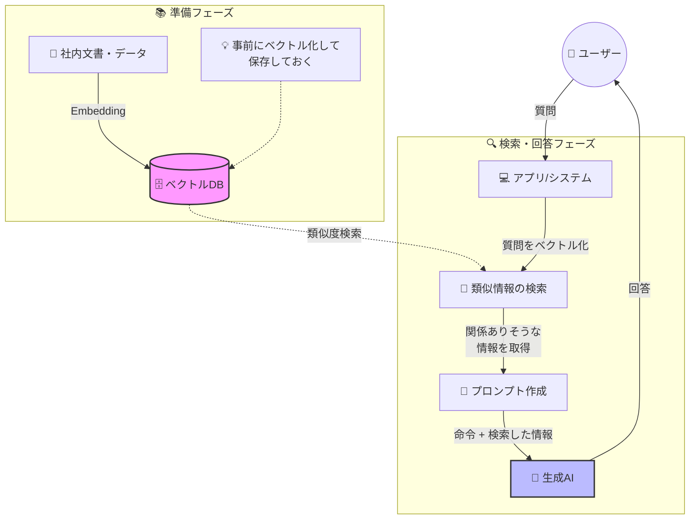

# Embeddingによる類似検索

## Embeddingとはなにか

Embeddingとは、一言で言えば「言葉や文章の意味をベクトル化する技術」です。似た意味を持つ言葉や文章同士が、ベクトル空間上で近い位置に配置されるように計算される仕組みとなっています。たとえば「ペット」と「犬」は意味的に近いためベクトルの距離も近く、「犬」と「宇宙」は意味が離れているためベクトルの距離も遠くなります。同様に「ペット」と「宇宙」も遠い関係となります。こうした単語や文章のベクトル化技術は、生成AIが登場する以前から長く研究されてきました。初期のEmbedding技術であるword2vecやGloVeなどは、単語単位のベクトル化を中心としていましたが、文脈によって意味が変わる多義語への対応が弱く、文全体のベクトル化も苦手という制約がありました。その後、文章の流れ（文脈）を捉えるためにRNNやLSTMといったモデルが登場し、文全体の意味を扱えるようになりました。しかし長文になると精度が落ちるという課題が残っていました。

この状況を大きく変えたのがTransformerの登場です。Transformerによって文中の意味のつながりを効率良く理解できるようになり、文脈を考慮した高精度なEmbeddingが実現されました。TransformerはBERTやGPTなどの大規模言語モデルにも採用されている現在のLLMにおける重要な基礎技術の一つです。このため、LLMサービスと一緒にEmbedding機能が提供されることが多くなっています。たとえばGeminiやOpenAIはそれぞれEmbedding機能を提供しています。一方、Claudeは2025年現在ではEmbedding機能を直接提供しておらず、[Voyage AI](https://www.voyageai.com/)を利用することを推奨しています。

詳しい理論についてはこの本の範囲を超えるため扱いませんが、興味がある方は調べてみてください。

## RAG（Retrieval Augmented Generation）とはなにか

RAG(Retrieval Augmented Generation)とは、Embedding機能を活用してLLMへのプロンプトに必要な情報を検索・拡充する技術です。検索にはEmbeddingによる類似度検索が多く使われ、最終的にプロンプトを拡充するのがポイントです。

LLMにはコンテキスト限界の問題があるため、関連する情報を事前にすべて入力するのは困難です。そこで質問文から意味の近いデータを検索して、必要な知識を拡充したプロンプトを組み上げて回答させる、という一連の処理がRAGと呼ばれています。

RAGは一時期、コンテキスト限界の問題を一挙に解決する技術のようにもてはやされていました。しかしLLMの利用範囲がさらに拡大した結果、実際には適用範囲が限られることが判明しました。ユーザの質問に対して知識や事実情報を直接返す一問一答形式では有効ですが、複雑なタスク処理では必ずしも有用ではありません。たとえば今回のセキュリティ分析でも、ログやデータをAPI経由で取得する必要があるため、ユーザの入力にもとづいて知識や事実情報を補完したプロンプトを組み上げることが有用ではないケースも多くあります。

そのため、RAGそのものについてはLLMエージェントの目的に応じて使ったり使わなかったりということになります。今回のセキュリティ分析では従来のRAGはあまりそぐわないと考えられます。ユーザの入力から汲み取れる補完情報があまりないためです。しかしEmbeddingの技術自体は活用のしがいがあるため、それは有効活用していきます。



## セキュリティ分析におけるEmbeddingの利活用

### いわゆるRAGとしての活用は難しい

先述した通り、セキュリティ分析ではユーザ入力を起点としたプロンプト拡充というRAGの典型的なユースケースは適用しにくい状況です。プロンプトに拡充すべき知識が明確でないことや、組織内ドキュメントを事前ベクトル化するといった典型的な活用方法も適さないためです。

組織ポリシーやサービス環境の情報であれば、それほど大量のデータにはならず、事前にプロンプトに入れておけば十分な範囲です。もし大量の知識があって適宜与えたい場合でも、ユーザの入力から適切な情報を導出するのは難易度が高く、ツールとして検索システムを提供する方が現実的です。ただし、これはEmbeddingベースの検索である必要性は特になく、例えばドキュメント管理SaaSの検索機能で十分です。既存の検索機能が不十分な場合に、代替としてEmbeddingを活用するのは有効な選択肢となります。

また、IoC（Indicator of Compromise：侵害指標）のように1文字違いで意味が変わるデータが多く、完全一致検索を要する情報については、曖昧検索は不向きです。このような情報を扱う場合は、Embeddingベースの検索ではなく、ツールとしてSQLやAPIベースの検索システムを提供する方が現実的です。

これらの理由から、セキュリティ分析のために、プロンプト生成にEmbeddingを利用するユースケースは筆者の経験上ほとんどありません。もし有効な活用方法があればぜひ教えてください。

### 類似情報の検索機能としては有用

一方で、Embeddingを使った類似検索自体はかなり有用性の幅が広いと言えます。主な用途として、過去に発生した類似アラートの検索が挙げられます。アラートは構造化データですが、JSONに変換したものは普通にEmbeddingでベクトル化できます。これにより、たとえば「時刻やIPアドレスなどのパラメータが少しズレているが概ね似たようなアラート」というものを手軽に検索できるようになります。

#### ユースケース1: ツールとして機能提供しエージェントに検索させる

エージェントが必要に応じて類似アラートを検索できるようにしておくことで、例えばそのアラートの影響を分析する際に、過去に発生した類似アラートの処理状況を容易に確認できるようになります。

パラメータを条件として検索させる方法も考えられますが、実装コストが高くなりがちです。ログ検索と同様に、スキーマやフィールドのメタ情報、サンプル値などを詳細に伝える必要があります。また一部のフィールドのみが一致し他の要素が大きく異なる結果を取得してしまう可能性もあります。もちろん意図的にこのような厳密な検索を実装することも有用です。

しかし「類似アラートを検索できる」という機能をツールとして提供することで、実装の手間に対して得られる価値が大きくなります。注意点としては、過去のアラートが適切に処理されている必要があります。処理が不適切な場合、検索結果から得られる情報も限定的になります。アラートをCloseする際に理由を記載するようにしておくと、その情報を有効活用できるようになります。

#### ユースケース2: 類似するアラートを一括で処理する、あるいは統合する

実はこちらのユースケースのほうが実運用では非常に強力です。セキュリティアラート監視を運用していると、アラートが大量発生する場面に遭遇することがあります。よくあるパターンとしては以下のようなケースです。

- 検知設定が間違っていてアラートが暴発する
- たまたま何らかの攻撃にさらされてアラートが大量発生する
- 検知システム側のロジックが変更された影響でアラートが暴発する

こうした何らかの要因で大量発生した（しかし影響がないと確信できる）アラートを全て処理しなければならない状況になります。ひどいときは数千件になることもあり、これを1件ずつ確認してクローズするのは非現実的です。それでは一括でクローズすればよいかというと、それも難しい問題があります。まず「しれっと1件全然関係ないアラートが混ざっていないか？」という懸念があります。似たようなアラートであれば一括処理しても大丈夫と考えられますが、キーワード検索で絞り込もうとすると、同じ種類のアラートであってもまったく異なる状況のものが混ざってしまう可能性があります。このような処理の煩雑さがセキュリティ監視の滞りにつながることも珍しくありません（筆者もよく経験していました）。

この課題をEmbeddingを使って解決することができます。具体的には、一括クローズ対象のアラートを以下のような手順で検索します。まず類似度の閾値を設けて足切りします。例えば閾値を0.1以下に設定すると、非常に類似したアラートのみが抽出されます。次に、抽出されたアラートに対してさらにキーワードでフィルタをかけます。これは「似てはいるが、意図していないアラートが紛れていないか」を確認するためです。もちろんそれでも紛れ込む可能性は0ではありませんが、作業量を大幅に緩和できます。

このように類似度の閾値とキーワードフィルタを組み合わせることで、概ね意図した関連アラート一覧を抽出できます。これをクローズするなり、別のアラートにマージするなりすればシステム上まとめて処理できます。この方法は作業時間の削減だけでなく、精神的負担の軽減という観点でも大きな効率化になります。

## Embeddingの実装

今回はユースケース2として、類似アラートを検索する機能を実装します。検索後のクローズやマージといった処理は、本章では扱いませんが、同様のアプローチで実装できます。ツールとして検索機能を提供する場合も基本的には同じ実装になるため、今回は説明を割愛します。

### Firestoreのindex作成

まずFirestoreでベクトル検索を使う場合、Indexを作成する必要があります。以下のコマンドを実行してください。なお、フィールド名とベクトルの次元数はこの時点で決定しておく必要があります。

また重要なポイントとして、そのフィールドが存在しない、あるいは0ベクトルのレコードが存在すると、Firestoreでは検索に失敗する点に注意してください。そのため、Embeddingを導入する際は新しいcollectionを使うか、既存レコードに後からEmbeddingを追加する処理が必要です。

```bash
gcloud firestore indexes composite create \
    --project=your-project \
    --database=your-database \
    --collection-group=alerts \
    --query-scope=COLLECTION \
    --field-config=vector-config='{"dimension":"768","flat": "{}"}',field-path=Embedding
```

### Embeddingの生成

Embeddingの生成は非常に簡単です。Geminiの場合は `EmbedContent` を呼び出すだけで完了します。注意すべきポイントは次元数の設定です。これはFirestore側で設定した次元数に合わせる必要があります。次元数を増やすほど細かい意味の違いを表現できますが、計算コストやストレージも増加します。一般的に512〜768次元で十分な精度が得られるため、今回は768次元を採用しています。

```go:pkg/adapter/gemini.go
func (g *GeminiClient) Embedding(ctx context.Context, text string, dimensions int) (firestore.Vector32, error) {
	config := &genai.EmbedContentConfig{}
	if dimensions > 0 {
		d := int32(dimensions)
		config.OutputDimensionality = &d
	}

	resp, err := g.client.Models.EmbedContent(ctx, g.embeddingModel, genai.Text(text), config)
	if err != nil {
		return nil, goerr.Wrap(err, "failed to embed content")
	}

	if len(resp.Embeddings) == 0 {
		return nil, goerr.New("no embeddings returned")
	}

	return firestore.Vector32(resp.Embeddings[0].Values), nil
}
```

### Alertへの埋め込み

次に、アラートデータにEmbeddingを埋め込みます。実装は以下のようにシンプルで、`PutAlert` する直前にEmbeddingを生成して格納しているだけです。

```go
// Generate embedding vector from original alert data
embedding, err := u.gemini.Embedding(ctx, string(jsonData), 768)
if err != nil {
    return nil, goerr.Wrap(err, "failed to generate embedding")
}
alert.Embedding = embedding

if err := u.repo.PutAlert(ctx, alert); err != nil {
    return nil, err
}
```

Go実装におけるポイントは、`firestore.Vector32` あるいは `Vector64` を使うことです。これを使わないとベクトル検索用のフィールドとして正しく認識されません。

```go
type Alert struct {
	ID          AlertID
	Title       string
	Description string
	Data        any
	Attributes  []*Attribute
	Embedding   firestore.Vector32
```

### Alertの検索

次に、類似アラートを検索する実装です。Firestoreのベクトル検索機能を使って、以下のように実装します。

```go:pkg/repository/firestore.go
func (r *Firestore) SearchSimilarAlerts(ctx context.Context, embedding []float64, threshold float64) ([]*model.Alert, error) {
	client, err := r.getClient(ctx)
	if err != nil {
		return nil, err
	}

	// Convert []float64 to firestore.Vector32
	vector32 := make(firestore.Vector32, len(embedding))
	for i, v := range embedding {
		vector32[i] = float32(v)
	}

	// Build vector query with distance threshold
	query := client.Collection(alertCollection).
		FindNearest("Embedding", vector32, 1000, firestore.DistanceMeasureCosine, &firestore.FindNearestOptions{
			DistanceThreshold: &threshold,
		})

	// Execute query
	iter := query.Documents(ctx)
	defer iter.Stop()
```

ここでは `FindNearest` メソッドを使ってベクトル検索を実行しています。第3引数の1000は、最大1000件の類似アラートを取得することを意味します。ベクトルの距離の計算にはユークリッド距離、コサイン類似度、ドット積が選択できますが、Embeddingベクトルは正規化されているため、コサイン類似度が最も適切な距離指標とされています。詳しい理論的背景については関心がある方は調べてみてください。

### CLIコマンドの実装

次に、`similar` コマンドを実装して類似アラートを表示できるようにします。指定されたIDのアラートを取得し、そのEmbeddingの値を使って類似するものを検索します。取得した結果からさらにキーワードでフィルタすることで、意図しないアラートが混入するのを防ぎます。

```go:pkg/cli/similar.go
// Get the source alert
sourceAlert, err := repo.GetAlert(ctx, model.AlertID(alertID))
if err != nil {
    return goerr.Wrap(err, "failed to get source alert")
}

if len(sourceAlert.Embedding) == 0 {
    return goerr.New("source alert does not have an embedding vector")
}

// Search for similar alerts with threshold
similarAlerts, err := repo.SearchSimilarAlerts(ctx, sourceAlert.Embedding, threshold)
if err != nil {
    return goerr.Wrap(err, "failed to search similar alerts")
}

// Filter alerts
var filtered []*model.Alert

for _, alert := range similarAlerts {
    // Skip the source alert itself
    if alert.ID == sourceAlert.ID {
        continue
    }

    // Apply keyword filters (AND condition) on alert data
    if len(filters) > 0 {
        // Marshal alert data to JSON for filtering
        dataJSON, err := json.Marshal(alert.Data)
        if err != nil {
            return goerr.Wrap(err, "failed to marshal alert data", goerr.Value("alert_id", alert.ID))
        }
        dataStr := string(dataJSON)

        allMatch := true
        for _, filter := range filters {
            if !strings.Contains(dataStr, filter) {
                allMatch = false
                break
            }
        }
        if !allMatch {
            continue
        }
    }

    filtered = append(filtered, alert)
}
```

### 実行例

以下は、あるアラート（暗号通貨マイニング検出）に対して類似アラートを検索した実行例です。

#### 閾値0.1の場合

```bash
$ go run . similar -i 69a6df97-b36f-49d4-87bb-3643246b4a4c -t 0.1
Found 2 similar alerts for 69a6df97-b36f-49d4-87bb-3643246b4a4c (Cryptocurrency Miner (XMRig) Detected on 'web-server-prod-01' due to CVE-2023-32784):

1. 8344452d-bdb9-4e64-9121-b1b2b0d14744 (distance: 0.0000)
   Title: Cryptominer (XMRig) Detected on Instance 'web-server-prod-01'
   Description: A cryptocurrency mining software (XMRig) has been detected running on Compute Engine instance 'web-server-prod-01'. This instance is connecting to known Monero mining pools and consuming significant CPU resources, indicating a potential compromise via CVE-2023-32784 from an attacker in Romania. Immediate investigation and remediation are required to prevent further resource abuse and potential data exposure.

2. a859cb2f-9392-4ceb-9420-c554f9b63766 (distance: 0.0120)
   Title: Cryptocurrency Mining Detected on Compute Engine Instance
   Description: Cryptocurrency mining software (XMRig) has been detected running on the 'web-server-prod-01' instance, consuming 98.5% CPU resources. The instance is connecting to a known Monero mining pool, indicating a potential compromise and resource abuse.
```

閾値を0.1に設定した場合、2件の類似アラートが見つかりました。1件目（`examples/alert/scc.json`）はdistanceが0.0000でほぼ完全一致の内容、2件目（`examples/alert/scc_mini.json`）はdistanceが0.0120で非常に類似した内容となっています。

#### 閾値0.01の場合

```bash
$ go run . similar -i 69a6df97-b36f-49d4-87bb-3643246b4a4c -t 0.01
Found 1 similar alerts for 69a6df97-b36f-49d4-87bb-3643246b4a4c (Cryptocurrency Miner (XMRig) Detected on 'web-server-prod-01' due to CVE-2023-32784):

1. 8344452d-bdb9-4e64-9121-b1b2b0d14744 (distance: 0.0000)
   Title: Cryptominer (XMRig) Detected on Instance 'web-server-prod-01'
   Description: A cryptocurrency mining software (XMRig) has been detected running on Compute Engine instance 'web-server-prod-01'. This instance is connecting to known Monero mining pools and consuming significant CPU resources, indicating a potential compromise via CVE-2023-32784 from an attacker in Romania. Immediate investigation and remediation are required to prevent further resource abuse and potential data exposure.
```

閾値を0.01に下げると、より厳密な類似度判定となり、ほぼ同一の内容のアラート（`examples/alert/scc.json`）のみが抽出されました。実際の運用では、誤検知を避けたい場合は0.01のような低い閾値を、より多くの候補を見たい場合は0.1程度の閾値を使うなど、目的に応じて調整します。

## Embeddingのポイント

Embeddingに関するポイントの一つは、EmbeddingはRAGだけのものではないということです。Embeddingは一般的にRAGの文脈で語られることが多いですが、RAGなしでも強力に活用できます。セキュリティ分析はその代表例です。ユーザの入力に対してプロンプトを拡充すべき知識が明確に存在しないため、RAGとしては効果が限定的ですが、類似アラート検索やクラスタリング、異常検知といった用途では、Embeddingの価値が直接発揮されます。特にアラートのようにスキーマが多様な構造化データから類似事例を探す場合、従来のキーワード検索や条件指定では実現困難だった柔軟な検索が可能になります。

もう一つ重要なのは、Embeddingによる類似度検索だけでは不十分であり、ユースケースに合わせた工夫が必要だということです。RAGにおいてもrerankingなどの仕組みが存在するように、単純な類似度検索の結果をそのまま使うのではなく、目的に応じた後処理や追加のフィルタリングを組み込むべきです。今回の実装では、類似度の閾値とキーワードフィルタを組み合わせることで、意図しないアラートの混入を防ぎつつ、柔軟な検索を実現しました。

「意味的に似たものを見つけたい」というニーズに対してLLMサービスが提供しているEmbeddingは強力な武器になると思います。これは様々なユースケースで活用できると考えられ、うまく応用することで実用的なシステムを構築が期待できます。

# エージェントの記憶システム概論

これまでも解説してきた通り、LLMはステートレスであり、かつコンテキストウィンドウに制限があります。コンテキストウィンドウとは与えられるトークンサイズのことであり、この制約をうまく扱うためのアプローチの一つが「記憶」です。

本節では記憶に関する解説をしますが、実は筆者自身もいろいろ試したものの、セキュリティ分析における記憶の使い方の解がまだ見えていないというのが正直なところです。そのため本節では、2025年12月執筆時点での技術とこれまで試した記憶に関する手法の現在地について解説します。記憶システムの分野は今後も発展していくと考えられ、より良い手法が確立されていくことが期待されます。

## LLMエージェントにおける「記憶」の整理

2025年現在、LLM実行においてユーザ入力以外で外部から取り込むデータの総称として「記憶(Memory)」という言葉が使われることが多い印象です。システムプロンプトや会話履歴、RAGで取得するドキュメントなど、LLMに与える情報は多岐にわたりますが、これらも十把一絡げに「記憶」として扱われています。

明確な定義があるわけではありませんが、LLMが利用する記憶は短期記憶と長期記憶に分けて考えられることが多くなっています。これは人間の記憶モデルを参考にしたもので、人間がワーキングメモリで保持する短期記憶と、長期的に蓄積される長期記憶に対応します。人間の記憶モデルを参考にしたアプローチは他にもいくつか提案されていますが、今のところ実用的なのはまずこの分類と思われます。例えばLlamaIndexにおけるメモリモデル[^llamaindex-memory]では、短期記憶（Short-term Memory、あるいはActive Context）と長期記憶（Long-term Memory、あるいはExternal Archive）に分類されています。短期記憶は主にセッションの履歴や状態の管理を指し、現在進行中の会話で必要な情報を一時的に保持します。短期記憶は主に会話履歴をメモリに保持することで実装されます。一方で長期記憶は、セッションを跨いで長期的に保存され必要に応じて呼び出される記憶を指します。RAGが代表的な長期記憶の実装方法です。

また、処理の仕方によって事前定義（static）と都度更新（dynamic）のような分類もできます。事前定義はRAGのように事前に文章を突っ込んでおくケースや、実装上のワークフローで定義するプロンプトのようなものを指します。一方で都度更新は、生成AIの行動によって生成されるもの、つまり会話から発生するユーザのプロファイル、エピソード、知見などを指します。これらの組み合わせで整理すると次のようになります。

|  | Static（事前定義） | Dynamic（都度更新） |
|---|---|---|
| **Short（短期）** | (1) システムプロンプト、Reasoning Strategies | (2) セッション状態管理[^checkpoint]、履歴、CoT |
| **Long（長期）** | (3) RAG、固定ポリシー、GraphRAG[^graph-rag] | (4) 過去の知見、プロファイル、エピソード |

[^checkpoint]: LangChain Short-term memory https://docs.langchain.com/oss/python/langchain/short-term-memory?utm_source=chatgpt.com。セッション状態のチェックポイントとして、会話の途中経過を保存し復元する仕組みを指します。
[^llamaindex-memory]: Memory in LlamaIndex https://developers.llamaindex.ai/python/examples/memory/memory/
[^graph-rag]: From Local to Global: A Graph RAG Approach to Query-Focused Summarization https://arxiv.org/pdf/2404.16130

(1)から(3)に関してはこれまでも説明してきましたし、現時点で成長の余地はあるものの、かなり方法論が確立してきた印象があります。それぞれ具体的には次のようなものです。

- (1) システムプロンプト: 「あなたはセキュリティアナリストです」といった役割定義や、タスクに応じた推論戦略
- (2) 会話履歴: ユーザとLLMの過去のやり取り、Chain-of-Thoughtの推論過程、セッション状態のチェックポイント
- (3) RAG: 事前に用意されたドキュメントやポリシー、過去のアラート対応記録

一方で(4)の長期動的記憶は課題が多い領域です。これはエージェントが動作する中で得た知見や経験を次回以降のセッションで活用するというものですが、ユースケースにかなり依存するため、まだ各プロダクト・サービスなどが試行錯誤している段階のように感じます。

## 長期動的記憶の特性と課題

前節で整理した4つの記憶タイプのうち、(4)の長期動的記憶は基本的にセッション（一連の会話）を跨ぐことで効果を発揮します。一度のセッション内で完結する一問一答形式のChatだとあまり問題になりませんが、実際にはメモリ機能がChatGPT、Claude、Geminiでそれぞれ導入済みもしくは導入中であり、注目されている機能です。

セッション間で記憶を引き継ぐということについて、ChatGPTで過去に話題になった4oがわかりやすいかと思います。チャットのセッションをまたいで記憶を引き継ぐ機能が導入された際、ユーザーがChatGPTに「人格」を記憶機能に実質的に設定することができました（その後、その機能がなくなり問題となりました）。

単なるチャットであれば「その人とのエピソード」を散発的に記憶すればよいのですが、業務によっては記憶を細かく制御する必要があります。具体的には次のような分類が考えられます。

- 覚えてほしい記憶: 組織固有のルール、過去のインシデント対応で得た教訓
- 覚えてほしくない記憶: 一時的なテストデータ、個人的な雑談
- 思い出してほしい記憶: 現在のタスクに直接関連する過去の知見
- 思い出してほしくない記憶: 異なる文脈での類似事例（混乱を招く可能性）

この制御方法はまだいろいろ模索中であるように感じます。

難しいポイントとして、ある程度使い込んでみないとその記憶システムの良し悪しが判断できないという点があります。人間の体感による良し悪しがあるうえ、記憶による影響が自明ではないことが多いため、その記憶が本当に良かったのかどうか判断しづらいのです。例えばLLMがある判断を下したとき、その原因を特定するのは困難です。それが記憶の影響なのか、プロンプトの影響なのか、あるいはLLM自体の推論能力によるものなのかを切り分けられません。ただし明らかに行動は変容するため、記憶の有無による影響を後から認識できることもあります。このように評価が難しい＝ベンチマークしづらい＝方法が確立しづらい、という構造があると感じています。

## 記憶機能の設計

ここでは長期動的記憶（Long-term Dynamic Memory）のシステムを構築するに当たってのポイントについて解説します。LLMエージェントにおける記憶は保存、取得、管理という3つの要素から考えることができます。

### 記憶の保存：何をいつ記憶すべきか

#### 記憶すべき内容の選定

記憶すべき内容は、その業務の目的によって異なります。セッション中で明らかになった事実、ユーザーから教えられた知見、ツール実行時にうまくいったこと、ツール実行で失敗したこと、あるいは改善されたことなど、様々な候補が考えられます。

これらの情報を別セッションに持ち越すことで利益になるかを考える必要があります。例えば単なるおしゃべり会話だとしたらツール実行の振り返りは役に立ちません。またシンプルなAPI実行代行のようなものであれば、殆どの場合これも振り返りは不要です。それぞれのセッションが独立しており、前回の経験が次回に活きる場面が少ないためです。

しかしツール実行が複雑な業務、例えばBigQueryにクエリ発行してログを分析するような場合はどうでしょうか。分析を進める中で「このテーブルのこのフィールドには特定形式のデータが入っている」「このフィールドは空の場合がある」「このフィールドが取りうる値はこのぐらいの範囲だ」「このフィールドはキーとして使える」といった知見が蓄積されていきます。こうした情報は次回のセッションでも役立ちます。また、組織固有の文化、文脈、体制や最近の状況、活発な事業などの変わりゆく情報も記憶の対象となります。これらは静的なドキュメントには書かれていない、実際の運用を通じて得られる知見です。

もちろんこれらは事前にプロンプトやツール説明に入れておくべきという考え方もあります。しかし実際には分析している最中に気づくことが多く、その都度設定ファイルをいじって編集するのは手間がかかります。特に運用中のシステムでは、このような知見が日々蓄積されていくため、手動でメンテナンスし続けるのは現実的ではありません。エージェント自身が学習して覚えてくれるなら便利です。これが長期動的記憶の醍醐味といえます。

ただしこれはプロンプトの管理などに近しい部分もあり、システム上これらを統合して管理する仕組みがあってもよいと考えられます。例えば記憶として蓄積した知見のうち、十分に安定したものは静的なプロンプトやツール説明に昇格させるといった運用も考えられます。むしろそれらをどう統合管理するのが最適なのか、模索が必要です。

#### LLMに判断させるか、人間が判断するか

さらに「何」を記憶するかをLLMに判断させるか、それとも人間が判断するかという点も検討ポイントです。

LLMに判断させることももちろんできます。たとえばセッションの終わりで、「このセッションで有効だったことを最大3つあげろ」といった指示をして記憶させる方法があります。自動化できるため運用負荷が低いのが利点です。しかし本当に記憶してほしいことをちゃんと記憶したかどうかは判断が難しく、LLMが適切に判断してくれるとは限りません。重要な知見を見逃したり、逆に些細なことを記憶してしまったりする可能性があります。プロンプトをチューニングしたり与えるデータを調整したりなど、かなり工夫が必要になります。

一方で人間が指示する方法もあります。指示自体は自然言語で行えばよいため、「この情報は今後も使うから覚えておいて」といった形で明示的に記憶を指示できます。重要度の判定がLLMに難しかったり、あるいはまだプロンプトが熟れてなくて自動判定が難しいときはこちらのほうが適しているかもしれません。LLMベースのコードレビューサービス（[devin](https://devin.ai/)や[CodeRabbit](https://www.coderabbit.ai)など）がこういった機能を持っています。

### 記憶の取得：何をいつ思い出すべきか

記憶システムは「覚える」と「思い出す」の両方を設計する必要があります。前節では何を記憶するかを解説しましたが、記憶する方法だけでなく、当然ながら思い出す方法も考えないといけません。

記憶を全部プロンプトに乗せていいかというと、まったくそういうわけにはいきません。再び立ちふさがるのがコンテキストウィンドウ制限の壁です。そのため記憶を大量に持っていたとしても、それを適切なタイミングで適切な記憶だけを注入するというテクニックが必要になります。

#### 記憶取得の3つのアプローチ

これについてはケースバイケースすぎて一概には言えませんが、大きく分類すると3つのアプローチが考えられます。以下の図は、3つのアプローチとその処理フローを示しています。


#### (1) システムプロンプトに注入するアプローチ

まず初期プロンプト（特にシステムプロンプト）に記憶を注入してしまうパターンです。エージェント起動時に関連する記憶を検索してプロンプトに含めることで、LLMが最初から必要な知識を持った状態で動作できます。ユーザ入力をEmbeddingして検索するのがいわゆるRAGで、このアプローチに位置します。

もし他の入力データもセッションの文脈で持つシステムなら、それを利用して記憶を取得することもできますし、そちらのほうが良い場合もあります。例えばセキュリティ分析の場合、分析対象となる「アラート」というわかりやすい構造データが存在します。アラートにはソースIPアドレス、宛先URL、検知ルール名などの属性があり、これらを活用できます。その中の一部のデータをEmbeddingして検索したり、属性値と一致するものがないか検索したり、アラートの種類が特定できればその種類に関する記憶を引っ張ってこれます。

また、記憶となるデータをそのまま全部プロンプトに書くのではなく、ID＋要約だけ記載しておくという手もあります。これはIDによって記憶を検索するツールを用意しておくことで全文の掲載を回避し、コンテキスト消費を抑えるテクニックです。ただしLLMが正しく検索してくれる必要があり、プロンプトを工夫する必要があります。このように単に記憶をプロンプトに入れ込むだけでも様々なアプローチがあります。

#### (2) 処理フロー内で取得するアプローチ

(1)に似ていますが、処理フローの中で何か条件にマッチした場合にワークフロー内で記憶を取得し、プロンプトなどに付与する方法です。初期プロンプトではなく、処理の途中で動的に記憶を追加します。例えばPlan & Executeのような処理で列挙させたタスク名をEmbeddingし、似たような過去のタスクの実行結果振り返りの記憶を探すといったことが考えられます。

具体的には「BigQueryでログを検索する」というタスクが出てきたら、過去の同様のタスクで得られた知見（「このフィールドはタイムアウトしやすいのでLIMIT句を付けるべき」など）を検索して注入する、といった使い方です。タスクの種類に応じて関連する記憶を動的に取得することで、必要な知識だけを効率的に活用できます。

このアプローチは(1)以上に処理が複雑になりますし、ちゃんと噛み合うケースは結構少ないかもしれません。適切なタイミングで適切な記憶を取得する条件設計が難しいためです。

#### (3) エージェントに検索させるアプローチ

LLMが使えるツールに記憶検索機能を実装しておく方法です。これによってLLMが必要だと判断したタイミングで任意に記憶を取得できます。利点としてはID＋要約をいれておく(1)の場合と同じく、コンテキスト消費を大幅に抑えられます。LLMが本当に必要なときだけ記憶を取得するため、無駄なコンテキスト消費を避けられます。

問題はLLMが必要なときに必要な記憶を検索してくれるかどうかです。「記憶を検索できますよ」という情報だけだとなかなか検索しなかったり、検索しようとしても期待した検索条件を入れてくれないことがあります。例えば「BigQueryに関する知見を検索して」と指示しても、具体的にどのような検索キーワードを使うべきか、LLMが適切に判断できない場合があります。

そのため、必要に応じて記憶を検索せよ、といったことをかなり強めにプロンプトに書き込んでおく必要があります。また、ツールの説明には、格納されている知識の種類（過去のBigQueryクエリ実行時の知見など）と、利用すべきタイミング（分析開始前や問題発生時など）を明記する必要があります。漠然と記憶がありますとだけ伝えるのでは不十分です。あとはツールの検索方法についてもいろいろなアプローチがありえます。

### 記憶の管理：何をいつ更新する・忘れるべきか

#### なぜ記憶を忘れる必要があるのか

記憶は蓄積するだけでなく、忘れる必要もあります。すべての記憶が有効というわけではなく、たまたまうまくいった、もしくはうまくいかなかったケースがあとから有害になることがあります。例えば特定の条件下でのみ有効だった回避策を一般的な知見として記憶してしまうと、本来適用すべきでない場面でその回避策が使われてしまう可能性があります。あるいは状況が変わったことでその情報はもう価値がなかったり、間違った情報になっているということもありえます。システムの仕様変更やデータスキーマの更新などにより、過去の知見が陳腐化することは珍しくありません。そのため記憶を更新したり忘れる（つまり記憶の削除）をする必要があります。

#### 更新・削除のタイミング

どのタイミングでどう更新・削除するかは極めて難しい問題です。一つのタイミングとして考えられるのは、それが間違い・無価値と判明した瞬間です。殆どの場合それは何か処理をする過程で発覚するため、タスク完了時などにその記憶の有用性を評価させるアプローチはありえます。

#### 更新・削除する記憶の選定

どの記憶を更新・削除するのかという点もまた難しい問題です。「役に立った」記憶は評価しやすいのですが、一方で「役に立たなかった」記憶をどう評価するかが問題になります。ある記憶が参照されなかったからといって、それが無価値とは限りません。後で役に立つかもしれませんし、その時はたまたま何か噛み合わなかっただけかもしれません。逆に頻繁に参照される記憶でも、内容が古くなっていれば有害です。

現実的には記憶にスコアを付けて徐々に評価を落としていくパターンになると思われます。例えばスコアリング方式の一例として、記憶作成時に初期スコアを設定し、参照時に加点、一定期間未参照で減点、スコアが閾値を下回ったら削除といったルールが考えられます。しかし実際にそこまで長期運用されたケースはまだまだ世の中に多くないのではないでしょうか。このあたりについては今後ベストプラクティスが定まっていくことに期待しています。

また場合によっては人間が直接記憶をいじることができるインターフェースを用意するというのも手段のひとつです。例えばWebUIに記憶編集・削除画面を作るといった方法があります。記憶データ（文章など）なら人間にも理解しやすく管理できます。ただし「このワークフローで悪さしたのはどれだ」といった特定作業はやや大変かもしれません。

## セキュリティ分析における記憶のユースケース

次章では記憶システムの実装を示しますが、その前に記憶に関するセキュリティ分析のユースケースをまとめておきます。

### (1) 類似アラートの対応記録の呼び出し

これはすでに実装したものです。過去の対応記録を元に脅威度の判定をさせる一種の記憶管理で、どちらかといえばfalse positiveであることの根拠に使います。同じようなアラートが過去に誤検知と判定されていれば、今回も誤検知である可能性が高いと推論できます。これは長期静的記憶（表の(3)）に近い実装ですが、対応記録が増えていくという意味では動的な側面もあります。

### (2) ツールの使い方に関する技術的知見

ツール呼び出しに関する実践的なノウハウの記憶が有用です。先述した通り、例えばログを蓄積したDWHへのアクセスでは、どのフィールドに何が入っていて、それがどう活用できるのかといった知識が必要になります。もちろんこれらはスキーマ情報として与えられているのが望ましいのですが、説明不足であったり行間の補足が必要なものもあります。「このクエリはタイムアウトしやすいのでLIMIT句を付けるべき」「このフィールドとこのフィールドをJOINすると効率的」といった実践的なノウハウは、実際に使ってみないとわかりません。それゆえに行動の記録を取得しておくことには効果があります。

### (3) ビジネス文脈や組織ルールに関する知識

組織固有の情報、監視対象環境のアーキテクチャ、システム運用方法、組織のポリシー、独特なルールといった情報も記憶の対象になります。「この部署は毎週金曜日に定期メンテナンスを行う」「このIPアドレス帯は開発環境なので多少の異常は許容される」「このアプリケーションは既知の脆弱性があるが業務上の理由でパッチ適用を延期している」といった文脈情報です。これも事前にプロンプトに入れておけばよいのですが、管理するのが面倒ですし、実際に分析させてみてわかることもあります。それをいちいちLLMで要約してコピーして設定ファイルに投入する、といった作業もできなくはありませんが、今どきのやり方でやるならもうエージェント内で完結していてほしいところです。

## 記憶システムの設計まとめ

本章では、LLMエージェントにおける記憶システムを短期/長期と事前定義/都度更新という2軸で整理し、特に長期動的記憶の課題と可能性について解説しました。記憶システムの設計では、何を記憶し、いつ思い出し、どう管理するかという3つの観点を総合的に考える必要があります。長期動的記憶は静的なプロンプトやRAGでは対応しきれない「実運用を通じて得られる知見」を扱う仕組みですが、その制御は複雑で評価も難しく、ベストプラクティスはまだ確立していません。

本章では4つの記憶タイプと3つの取得アプローチという設計の枠組みを整理しました。次章では、これらの概念を実際のコードに落とし込み、セキュリティ分析エージェントに記憶機能を組み込んでいきます。
