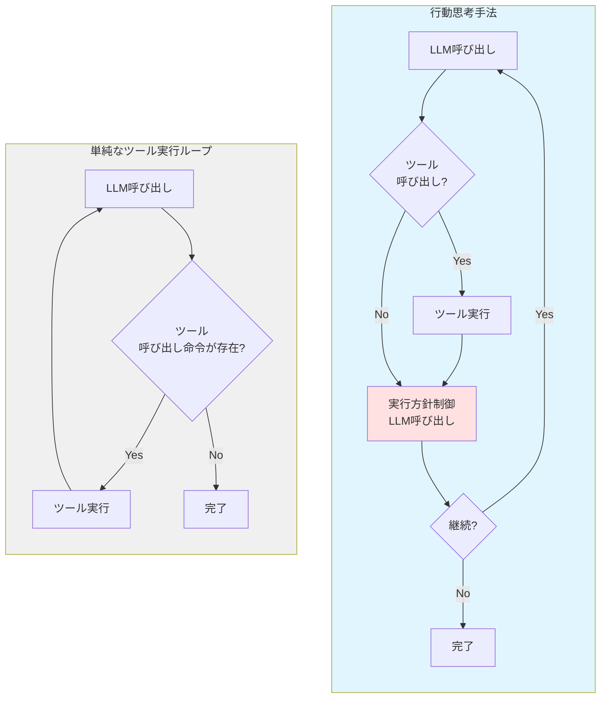
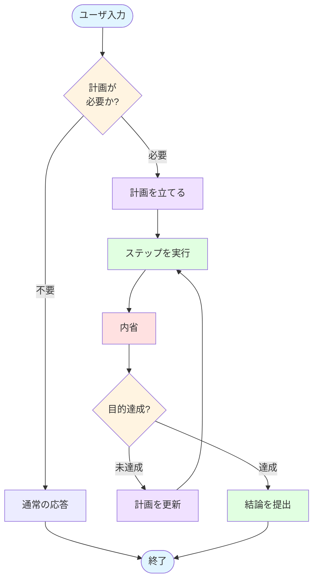

# エージェント推論戦略の比較

LLMエージェントを運用していくと、やや複雑な処理や複数の要件が絡むタスクになると、エージェントが迷走を始めることがあります。具体的には、本来の目的から横道にそれて関係ない処理を始めたり、何かを頑張っているようには見えるものの、よくわからない作業を延々と続けたりする現象です。このような目的からの逸脱や非効率な探索が発生すると、タスクの完了に時間がかかったり、期待した結果が得られなくなったりします。

## 迷走が発生する原因

このような迷走が発生する原因はいくつか考えられます。

まず「Lost in the middle」と呼ばれる現象があります。これは入力データが大きくなりすぎると、コンテキストの真ん中あたりにある情報の優先度が低くなってしまう現象です。LLMは一般的にコンテキストの最初と最後の情報に注意を向けやすく、中間部分の情報を見落としやすい傾向があります。これは注意機構(Attention Mechanism)における位置バイアスとして知られる特性です。プロンプトに目的が含まれていても、大量のツール実行結果やログデータなど他の情報に埋もれて部分的に忘れられてしまうことがあります。

次に、会話履歴が長くなりすぎた場合の問題があります。多くのLLMにはコンテキストウィンドウの上限(例えば128Kトークンなど)があり、その制限に対処するため履歴を圧縮する必要があります。この圧縮過程で本来の目的が見失われてしまうケースがあります。要約によって適切に目的を残すよう指示しても、大量のデータを要約する際には重要な文脈が失われやすくなります。単純なトリミング(古い履歴を削除する方式)を採用した場合は、タスクの目的そのものが削除されてしまうなど、さらに深刻な問題が発生する可能性があります。

また、LLMは直近の履歴に強く影響される傾向があります。これは「Recency Bias(新近性バイアス)」として知られる現象で、最新の情報に過度に重みを置いてしまう特性です。そのため、一度おかしな推論をしたり誤った仮説を立てたりすると、その誤った方向性が直近の履歴に記録され、それに基づいてさらに誤った推論を重ねていってしまいます。最悪の場合、本来の目的から完全に外れたまま戻ってこなくなることもあります。

## LLMエージェントの行動思考手法

こうした迷走を防ぐために、LLMエージェントの行動を制御する手法がいくつか存在します。これらは「LLM Agent Architectures」や「Reasoning Strategies」などと英語では呼ばれています。本章では、これらを総称して「行動思考手法」と呼ぶことにします。

行動思考手法の基本的なアイデアは、単純にツール実行を繰り返すのではなく、ツール実行の合間にさらにLLMによるコンテンツ生成を挟み込むというものです。その生成結果によって次の行動を選択していきます。具体的には、ここまでの要約を与えたり、フルヒストリを与えたりなど様々な手法がありますが、共通するポイントは「タスクの実行とは別に、実行方針の制御も生成AIで行う」という点です。下記の図が単純なループと行動思考手法を組み込んだループの違いのイメージ図です(実際にはより詳細な制御が発生します)。



### 代表的な行動思考手法

筆者が知る範囲では、メジャーな行動思考手法として以下のようなものがあります。

**ReAct (Reason + Act)** は、思考と実行を繰り返す汎用的な手法です。各アクションの前に「なぜそのアクションを実行するのか」という思考過程を明示的に生成させます。Function Callingと比較すると、ReActでは思考過程をテキストとして履歴に明示的に含められます。これにより、エージェントの意思決定プロセスがよりクリアになり、デバッグやトラブルシューティングが容易になります。一方、Function Callingは最新のLLM機能を活用しており構造化されたJSON形式で確実にツールを呼び出せるという利点があります。ReActの本質は、推論ステップを明示的にプロンプトに示して制御することにありますが、これは履歴管理の一種とも言えます。

**Reflexion** は、自己評価と改善を繰り返すループ型の手法です。実行するたびに「結果が目的を達成したか」を自己評価し、達成できていなければ何が問題だったのかを内省します。その内省結果(例えば「データベースクエリの条件が狭すぎた」など)を次の試行に反映させて再実行を繰り返していきます。この試行錯誤のプロセスにより、正解が明確でない探索的な処理に適しています。

**Plan & Execute** は、計画フェーズと実行フェーズを分離することで、計画に沿ったタスクをこなす手法です。最初に全体の実行計画を立て、その計画に従って順次タスクを実行していきます。安定的に動作する反面、探索的なタスクには弱いという特徴があります。初期計画が基本的に静的なため、実行中に予期しない状況が発生した場合の適応が困難です。またタスクが順次実行されるため、独立したタスクを並列実行して高速化するといった最適化も難しくなります。

研究分野も含めると、より多様な手法が存在します。ただし、本章では実装の詳細に集中するため、理論的な詳細には立ち入りません。また、最新の研究成果についても追随できていません(そもそも、ここに書いてもあっという間に陳腐化してしまいます)。興味がある方は、arXivやHugging Faceのブログなどで最新の研究動向を追うことをお勧めします。

### 手法の組み合わせ

2025年現在の最新のエージェントでは、これらの手法を組み合わせたり、必要に応じて切り替えたりしながら利用しています。例えば、「明確な目標があるタスクにはPlan & Execute、試行錯誤が必要なタスクにはReflexionを使う」といったタスクの性質による使い分けや、「Plan & Executeで分解した個別のステップの実行にReflexionを使う」といった階層的な組み合わせなどが考えられます。万能な行動思考手法は存在せず、タスクやユースケースに応じた最適手法に関しての研究が進んでいる状況です。

# Plan & Executeの設計

本章では、LLMエージェントにPlan & Executeの手法を組み込んでいきます。

## セキュリティアラートの分析と Plan & Execute パターン

### Plan & Executeを採用する理由

今回のLLMエージェントでは、事前に計画を立てて遂行していくPlan & Executeパターンを採用します。この選択は、対象とする「セキュリティアラートの分析」というユースケースの性質に依存しています。セキュリティアラート分析の典型的なフローは以下のようになります。

1. **アラートの受信と初期分析**: セキュリティアラートが飛んでくると、その時点で何らかの問題が発生している可能性が示唆されています。アラートには問題の種類に関する情報が含まれており、問題に関する手がかり(IPアドレス、ユーザー名、ファイルハッシュなど)が記されています。

2. **影響の有無を確認**: その手がかりをもとに、アラートが実際に影響を及ぼしたのかを調査します。これには関連するログやシステムの状態を調べることや、問題のリソースに関する社内のアクティビティを調べることが含まれます。

3. **影響範囲の特定**: もし影響があると判断された場合は、影響の範囲を調べます。アラートに関連するリソースや主体がどのような行動をしていたかを調査します。

ここで重要なのは、この作業は実はあまり探索的ではないという点です。ここでいう「探索的」とは、「新しい情報を取得してそれを元に次の行動を変更・決定する、というのを連続してやるもの」という意味です。アラートを見た時点で、アクセス可能なデータソースから調査すべき情報は概ね定まっています。

もちろん、何か見つけた際に深堀りが必要になったり、期待していたデータが発見されなかったので調査方針を修正したりすることはあります。しかし、まず初手として以下のような方針は、熟練のアナリストであればおおむねあたりをつけられると筆者は考えています。例えば、GuardDutyのUnauthorizedAccess検知が発生した場合、まずVPCフローログとCloudTrailを確認するといった具合です。

- 実際のアクセスログを確認する
- 脅威インテリジェンスでIPアドレスの評判を調べる
- 該当ユーザーの直近の行動履歴を確認する

この性質から、まず計画を立てることが重要です。むしろ、一つの事象に囚われてあちこちで余計な深堀りを始めるほうが、調査の方向性を見失いやすく効率的ではありません。また、影響範囲の特定についても、最初に探すべきキー(検索条件)とデータベースは容易に推定できるため、事前計画と相性が良いのです。

なお、個別のタスクについてはさらに深堀りする可能性があります。ただし、ポイントはタスク全体ではなく個別のタスクの中で深堀りしていくという点です。この場合、Plan & ExecuteとReflexionを組み合わせるという手法も考えられますが、複雑になるため、今回はPlan & Executeだけに集中します。

### Plan & Execute が適さないユースケース

一方で、Plan & Execute では難しいユースケースもあります。例えば全く無の状態から始めるタイプの脅威ハンティングでは、全く違った戦略が必要になります。この場合、そもそも大量のデータからどうやって分析するかの取っ掛かりをいかに作るかが問題となります。

こういうケースでは、少なくとも初手では生成AIを使わない方が良いかもしれません。例えば、従来の機械学習手法(クラスタリング、異常検知アルゴリズムなど)を使い、怪しい点にまず目星をつけるというアプローチが考えられます。これは、生成AI・LLMが大量データの処理に弱いという特徴があるためです。

具体的には、まずコンテキストウィンドウの制約により、数千行以上の大量のログを一度に見ることができません(例えば128Kトークンのモデルでは、1トークンあたり平均4文字として約50万文字分のテキストが限界です)。また、「異常検知」のようなタスクにも弱い傾向があります。LLMは個別のデータに対する推論は得意ですが、複数データ全体を俯瞰して統計的に異常を見つけたり、類似パターンをグルーピングしたりすることは苦手です。具体的に「不正なログイン試行のような挙動」といった形でパターンを定義し、順次ログを与えていくと検知してくれる場合もありますが、大量のログを処理する際の時間とAPIコストが問題になることが多いのです。このように、LLMエージェントを使った問題解決では、依然としてデータをどう扱うのが最適なのか人間がしっかり考える必要があります。

## 全体の流れ

Plan & Executeパターンの全体の流れは、大まかに以下のステップで構成されます。計画必要有無の判定、計画、実行、内省、最終結果の提出という流れです。実行と内省をループし、タスクが完了したと判断されたら最終結果提出へ遷移します。



### (0) まず計画が必要かどうか判定する

本来はPlan & Executeの範疇ではありませんが、計画が必要かどうかを事前に判定するのは重要なテクニックです。Plan & Executeは計画→実行→反省というループを繰り返すため、一ラウンドだけでも最低3〜4回のLLMクエリが発生します(計画作成、ステップ実行、内省、結果提出)。そのため、「今日の天気は?」のような非常に単純な質問や、ツールを使わなくて良いような質問でも、なんでもかんでもPlan & Executeにすると応答時間が数倍かかってしまいます。

APIコストの問題もありますが、それ以上にユーザ体験が悪化します。単純な質問に数十秒待たされるのは、ユーザにとってストレスです。そこで、一番最初にそもそもPlan & Executeを実施する必要があるかを判定します。もし必要無ければ通常のFunction Callingループで良いことになります。この判定は(1)の計画立案と同時にやっても構いません(「計画が必要ならその計画を返し、不要ならnullを返す」といった形式)。ポイントとしては、現在のユーザ入力だけでなく、過去の会話履歴などの文脈も見て判断する必要があるという点です。

### (1) 計画をたてる

ユーザーからの入力をもとに計画を立てます。この1度のユーザの入力によって起きる一連の作業を、今回は説明のため「タスク」と呼ぶことにします(異なる命令は異なるタスクとして扱います)。

計画を立てる際には、なるべくシステムプロンプトで豊富なコンテキストを与えてあげると良いでしょう。具体的には、AIのロール(「あなたはセキュリティアナリストをサポートするアシスタントです」など)、分析の方針(「疑わしい活動を見逃さないことを優先する」など)、組織やインフラ・環境に関する情報(「AWSとGCPを利用している」など。これらは設定ファイルや環境変数で管理することが多いです)、ログのDBなどのデータソースに関する情報(「BigQueryに過去90日分のログがある」など)、利用可能なツールのリスト、そして分析対象のアラートのデータなどです。

また、計画を立てる方針も明示的に指示する必要があります。どういうタスクの分解が良く、どういうものが悪いかという説明(「1ステップは1つの具体的な調査に対応すること」など)、実際の具体例をいくつか示すFew-shot学習、あまり細かく分類しすぎないようにという注意(「10ステップ以内を目安にする」など)、ユーザの目的を達成することを最優先するという指示、そして存在するツールしか使わないという制約などです。この最後の制約を与えないと、LLMが存在しない「check_malware」のような架空のツールをでっち上げ始めることがあります。LLMが架空のツールを作り出すと、無駄な工程を続けたり誤った分析結果を出力したりする原因になります。

計画の生成はLLMに行わせます。計画に必要な要素は目的と手順の一覧です。まず `goal` フィールドでユーザの意図を解釈させます。例えば、ユーザが単に「このアラートを調査して」と言った場合でも、LLMに「不正アクセスの可能性を確認し、影響範囲を特定する」といった具体的な目的を解釈させるわけです。この目的の明確化が、計画全体の方向性を定めます。

次に `steps` フィールドでタスクを分解した作業を定義します。例えば「BigQueryから送信元IPアドレスに関連するアクセスログを抽出する」「AlienVault OTXでIPアドレス x.123.4.56の脅威情報を調べる」といった具体的な粒度で分解します。各ステップには以下の要素を含めます。

- `id`: ステップの識別子(例: "step1", "step2")。これは後の内省フェーズで「step2をキャンセルする」といった操作を指定するために利用します
- `description`: 具体的にどういうステップかの説明。実行者(人間またはエージェント)が何をすべきか明確にわかる記述にします
- `tools`: 利用を期待するツールのリスト。これは入れるのが良い場合と悪い場合があります。明確に使うツールを限定したい場合(「BigQueryツールだけを使う」など)は有効ですが、逆に探索要素が入り込む場合は縛りになってしまうことがあります(「どのツールを使うかは状況次第」という場合)。これはプロンプトとのバランスで調整します
- `expected`: どのような結果を期待するかの情報をあらかじめ設定させます(「該当するログが1件以上見つかる」「IPアドレスの評判スコアが取得できる」など)。これによって、そのタスクが目的を達成したのか、それとも失敗したのかを判定する指標にします。これは後の計画見直しフェーズで、「期待した結果が得られなかったので別のアプローチを試す」といった判断に利用されます

### (2) ステップを実行する

ステップ実行は、これまで実装してきたエージェントのループと基本的に同じです。ただし、ポイントとして履歴の扱いをどうするかという議論があります。主に以下の3つの選択肢が考えられます。

**(a) 全履歴を取り込んで残す方式**では、エージェントがコンテキストを十分に理解できるという利点があります。過去のステップで得られた情報をすべて参照できるため、情報の重複取得を避けたり、過去の失敗から学んだりできます。一方で、過去に変な行動をした場合(誤ったツールを呼び出したなど)の影響を引きずることになります。またコンテキスト消費が激しくなり、ステップ数が増えるとコンテキストウィンドウを圧迫します。さらに前のタスク(別のユーザ命令)での影響も受けやすくなります。これには良い面と悪い面があり、「前回のタスクでこのIPアドレスは調査済み」という情報を活用できる反面、前回の誤った判断を引きずる可能性もあります。

**(b) そのタスク内の他の実行結果を要約して渡す方式**では、各ステップのdescription、実行結果、得られた重要な情報などを構造化して要約し、それを次のステップに提供します。例えば「step1: BigQueryから3件のログを取得。送信元IPは x.123.4.56」といった形です。この方式では、すでに保持している情報を改めて探すという無駄が発生しなくなります。一方で、細かいコンテキスト(ツール呼び出しの詳細な経緯など)までは引き継がれません。失敗した処理の詳細が引き継がれないため、同じ失敗を繰り返す可能性があります。

**(c) まったく履歴を引き継がない方式**では、各ステップが完全に独立した作業になります。過去のステップの影響をまったく受けないため、各ステップを並列実行できる可能性があります。しかし、タスクの記述がかなり具体的で自己完結的でないとうまく動きません(「step1で取得したIPアドレスを使う」といった依存関係が表現できない)。

諸説ありますが、今回は折衷案の(b)を採用します。ただし、タスクによっては(a)や(c)、あるいはもっと別の手段を取ることも可能です。

### (3) 内省をする

ステップ実行によって得られた結果とこれまでの履歴、そしてこのタスクの目的を持ち寄って内省を行います。この反省・内省ステップをPlan & Executeに含めるべきかという議論はあります(Plan & Execute & Reflectionと呼ぶこともあります)が、実際にはやはり内省を挟んだ方が良いでしょう。

内省を行うことで、調査によって新たにわかったことをもとにステップを追加したり(これはそれほど多くない想定ですが)、すでに明らかになって不要になった未完了ステップをキャンセルしたり、タスクの目的がすでに達成されていたら早期終了したりできます。一度のクエリを挟むので応答時間が長くなります(通常数秒から数十秒追加されます)が、やる価値は大きいと言えます。

基本的に内省に必要なのは以下の情報です。まず `achieved` フィールド(真偽値)で、今回完了したステップによってすでに全体の目的を達成したかを判定します。例えば、5ステップ中3ステップ目まで完了した時点で「すでに不正アクセスではないことが確認できた」という場合、残りのステップを実行せずに早期終了できます。

次に `plan_updates` フィールドで計画をどう更新するかを定義します。これには既存ステップの修正、あるいは新規ステップの追加が含まれます。ここでどのステップを操作するのかを指定するために、各ステップの `id` が必要になります。更新の仕方は「追加」(新しいステップを挿入)と「変更」(既存ステップの内容を更新)を設けます。ステップのキャンセルも「変更」として扱い、ステップ自体はリストに残しておくようにします(status: "cancelled" のようなフラグを立てる)。そうすると、「step2をキャンセルしたのにまたstep2を追加する」といった無駄な往復を防げます。

内省フェーズにおけるポイントとして、タスクの更新についてもちゃんとポリシーを与える必要があります。例えば、「データソースに対象が見つからない場合、3つまで別のデータソースを試したら諦める」といった形で、どのくらいまで深追いするかを明示しておきます。また、「失敗したステップと同じアプローチを二度試さない」「ただし、異なるパラメータであれば再試行してもよい」といった指示も与えておいた方が良いでしょう。さらに、プラン作成時の指示・制約(「10ステップ以内」など)と平仄をそろえておくことも重要です。これによって、初期計画と内省フェーズで追加されるステップの粒度や品質が一貫します。

### (4) 結論の提出

`achieved` が `true` になったら、そこで完了してユーザに報告する結論をまとめます。これは要するに、一連の思考プロセスを経て得られた結論となります。これまでの各ステップの実行結果をもとに、最終的な分析結果を生成します。

# Go言語での実装

前のセクションで提示したPlan & Executeパターンの実装を理解するため、まず具体的な処理の流れを見ていきます。

## 実装の大まかな流れ

このフローの中核を担うのが `sendWithPlanExecute` という関数です。この関数は既存の `Send` メソッドとは別に実装されており、従来の通常ループを壊すことなくPlan & Executeパターンを導入できるようになっています。

```go
// sendWithPlanExecute executes the plan & execute mode
func (s *Session) sendWithPlanExecute(ctx context.Context, message string) (*PlanExecuteResult, error) {

	// Initialize plan & execute components
	planGen := newPlanGenerator(s.gemini, s.registry)
	conclusionGen := newConclusionGenerator(s.gemini)

	// Step 1: Generate plan
	fmt.Printf("\n📋 計画を生成中...\n")
	plan, err := planGen.Generate(ctx, message, s.alert)
	if err != nil {
		return nil, goerr.Wrap(err, "failed to generate plan")
	}
	displayPlan(plan)
```

この段階でまず実行計画を作成し、ユーザに提示します。計画生成には専用の `planGen` ジェネレーターを使用しており、ユーザからのメッセージとアラート情報を入力として受け取っています。

```go
	// Step 2-4: Execute plan with reflection loop
	results, reflections, err := executeStepsWithReflection(ctx, s.gemini, s.registry, plan)
	if err != nil {
		return nil, err
	}
```

計画の提示が完了したら、次は `executeStepsWithReflection` 関数によるツール実行と計画修正(Reflection)のループに入ります。このループでは、各ステップを1つずつ実行し、そのたびに結果を振り返って計画の調整が必要かどうかを判断していきます。

```go
	// Step 5: Generate conclusion
	fmt.Printf("\n━━━━━━━━━━━━━━━━━━━━━━━━━━━━━━━━━━━━━━━━━━━━━━━━━━━━━\n")
	fmt.Printf("📝 結論を生成中...\n")
	fmt.Printf("━━━━━━━━━━━━━━━━━━━━━━━━━━━━━━━━━━━━━━━━━━━━━━━━━━━━━\n\n")

	conclusion, err := conclusionGen.Generate(ctx, plan, results, reflections)
	if err != nil {
		return nil, goerr.Wrap(err, "failed to generate conclusion")
	}
```

すべてのステップの実行が完了したら、最後にループから得られた情報をもとに結論を生成します。結論生成では、元の計画、各ステップの実行結果、そして内省の結果をすべて統合して、ユーザに提示する最終的な回答を作成します。

ここまでが計画から結論までの流れですが、前のセクションで触れた(0)の「Plan & Executeを使うかどうかの判定」については、`sendWithPlanExecute` ではなく元の `Send` メソッド側に実装しています。具体的には、`Send` メソッドの冒頭でLLMに問い合わせることで、通常のループで処理するかPlan & Executeで処理するかを自動的に選択しています。なお、この判定にはLLMへのAPI呼び出しが必要なため、メッセージ送信ごとに若干のコストとレイテンシが発生します。実運用で問題になる場合は、ユーザに明示的にモード選択させる実装も検討できます。

```go
func (s *Session) Send(ctx context.Context, message string) (*genai.GenerateContentResponse, error) {
	// Check if plan & execute mode should be used
	if shouldUsePlanExecuteMode(ctx, s.gemini, message, s.history.Contents) {
		// Use plan & execute mode
		result, err := s.SendWithPlanExecute(ctx, message)
		if err != nil {
			return nil, goerr.Wrap(err, "Plan & Execute mode failed")
		}
		// Plan & Execute mode succeeded
		// Convert to response format (create a synthetic response)
		return s.createResponseFromPlanExecute(result), nil
	}
```

この判定には以下のようなプロンプトを送ります。シンプルに "yes" または "no" で回答させる形式になっていますが、もちろん構造化出力でboolean型として答えさせることも可能です(今回はシンプルさを優先してテキスト判定としています)。重要なのは、どういう処理がPlan & Executeに適していて、どういうものが通常の会話ループに適しているのかという事例を示して判断させている点です。この判定でyesが返ってきた場合はPlan & Executeで実行し、そうでなければ通常のループへ分岐します。

```go
// shouldUsePlanExecuteMode determines if plan & execute mode should be used
func shouldUsePlanExecuteMode(ctx context.Context, gemini adapter.Gemini, message string, history []*genai.Content) bool {
	// Use LLM to judge if the message requires systematic multi-step execution
	systemPrompt := `You are evaluating whether a user's request requires systematic multi-step execution (Plan & Execute mode) or can be handled with direct conversation.

Plan & Execute mode is needed when:
- Multi-step tasks or operations are required
- Complex tasks combining multiple tools or actions
- User requests deep or thorough work ("in detail", "thoroughly", "investigate", "analyze")
- Systematic data collection or processing is necessary

Plan & Execute mode is NOT needed when:
- Simple questions or confirmations
- Questions about already displayed information
- Simple viewing or checking
- Single-step operations
- Follow-up questions in an ongoing conversation

Respond with ONLY "yes" or "no".`
```

## 履歴の管理

それぞれの処理の各論に入る前に、履歴の管理について整理しておきます。ここまでは実行ループだけが存在し、全ての行動と処理が一つのセッションで継続していました。履歴もそのセッションに紐づけられ永続化されてきました。では今回のPlan & Executeのような行動思考手法の場合はどうでしょうか？

行動思考手法を実装する際、履歴をどう管理するかは非常に重要なポイントです。ここまで見てきた通り、履歴は文脈を伝えるための重要な手段ですが、同時にいくつかのデメリットも存在します。過去の判断に引きずられて誤った方向に進んでしまったり、APIコストが増加したり、プロンプト全体が長くなることでコンテンツ生成の精度がぼやけたりする問題があります。そのため、すべての処理に履歴を渡すのではなく、必要なところでのみ履歴を投入すべきです。

Plan & Executeパターンでは、計画生成、処理実行、内省、結論生成という各フェーズでそれぞれ異なるアプローチを取ります。履歴管理においては、以下の2つの観点から考慮する必要があります。

まず1つ目は、処理実行時にこれまでの履歴を利用するかどうかです。すべての履歴を使うか、一部の履歴だけ(例えばそのタスク内で生成されたものだけ)を使うか、あるいは履歴をまったく使わないかという選択があります。

2つ目は、処理完了時にその履歴を引き継ぐかどうかです。次のフェーズや次のタスクで参照する必要がある場合は履歴を保持しますが、残す必要がなければそのまま履歴を捨ててしまうこともできます。

これらの調整方法には様々なアプローチがあり一概には正解がありませんが、おおよその方向性を持つことは重要です。以下の表に本実装での方針をまとめました。これはあくまで一例であり、異なる実装方法も十分にありえます。

| フェーズ | 履歴利用 | 履歴引き継ぎ | 理由 | 実装での対応 |
|---------|---------|------------|------|------------|
| (1) 計画をたてる | ✅ YES | ❌ NO | 過去の文脈から重複調査を避けるため履歴を参照するが、計画生成は内部的な分析プロセスなので引き継がない | `plan_generator.go`: `planGen.Generate(ctx, message, s.alert, s.history.Contents)` で履歴を渡すが、計画生成後は履歴に追加しない |
| (2) ステップを実行する | ✅ YES | ✅ YES | ツール実行結果を保持し、後続のステップで参照できるようにする | `step_executor.go`: ツール呼び出しとその結果を `contents` に追加し、次のツール呼び出しに引き継ぐ。`previousResults` として参照可能 |
| (3) 内省をする | ❌ NO | ❌ NO | 現在のステップの結果のみに基づいて内省を行い、履歴は引き継がない | `reflector.go`: ステップ結果と計画のみを使用し、新しいセッションで内省を実行 |
| (4) 結論の提出 | ❌ NO | ✅ YES | タスクの実行結果のみで結論を生成するが、最終的な回答として履歴に残す | `session.go`: 結論生成後、ユーザメッセージと結論を `s.history.Contents` に追加 |

(3) 内省で履歴利用を「NO」としているのは、全体の会話履歴は使わず、その時点でのステップ実行結果のみを使うという意味です。同様に (4) 結論の提出も、全体の会話履歴ではなくそのタスクで得られた結果だけを利用します。

(2) のステップ実行での履歴の取り扱いは以下のような実装になっています。

```go
// Create initial user message
userMessage := fmt.Sprintf("Execute this step: %s", step.Description)
contents := []*genai.Content{
	genai.NewContentFromText(userMessage, genai.RoleUser),
}

// Tool Call loop
for i := 0; i < maxIterations; i++ {
	// ... LLM呼び出し ...
	resp, err := gemini.GenerateContent(ctx, contents, config)

	for _, candidate := range resp.Candidates {
		// Add assistant response to history
		contents = append(contents, candidate.Content)

		for _, part := range candidate.Content.Parts {
			if part.FunctionCall != nil {
				// ツール実行...
				funcResp, execErr := executeTool(ctx, registry, *part.FunctionCall)
				// ...
				functionResponses = append(functionResponses, &genai.Part{FunctionResponse: funcResp})
			}
		}
	}

	// Add all function responses as a single Content
	if len(functionResponses) > 0 {
		funcRespContent := &genai.Content{
			Role:  genai.RoleUser,
			Parts: functionResponses,
		}
		contents = append(contents, funcRespContent)
	}
}
```

各ステップの実行内では、ツール呼び出しとその結果が `contents` に追加されていき、それが次のツール呼び出しに引き継がれます。この履歴は1つのステップの実行が終われば破棄されず、同じタスク内の次のステップ実行にも渡されます (`previousResults` として参照可能)。これにより、「前のステップでこのIPアドレスを調査済み」といった文脈を保持しながら処理を進められます。

## 計画生成

計画生成のプロンプトは、LLMにどのような振る舞いを期待しているのかを明確にすることから始まります。

```markdown
# Plan Generation

## Your Role

You are a security analyst assistant. Your role is to support security alert analysis and create systematic plans for various tasks.
```

ここでは分析者そのものではなく、「サポートする立場」「プランを立てるもの」という役割を与えています。実際にツールを実行するわけではないので、そこは明確に分けておく必要があります。このセッションは計画作成のみを実施し、その後そのまま破棄されます。続いてユーザのリクエストおよびアラートに関する情報を記載します。ユーザのリクエストは他の情報に埋もれてはいけないので、専用のセクションを設けるなどして強調しておく必要があります。アラートについては構造体をそのまま掲載してもよいのですが、ある程度の説明を加えておくとさらに精度が向上します。

```markdown
## Task Philosophy

When the user requests analysis or investigation, typical goals include:

1. **Alert Validation**: Determine if it's a false positive or true positive (actual threat)
2. **Impact Assessment**: Identify affected resources and users
3. **Evidence Collection**: Gather supporting evidence from logs and external sources
4. **Action Recommendation**: Provide clear next steps

However, adapt your plan to match the user's specific request - not all tasks are investigations.
```

タスク実行のための方針もプロンプトに含めておきます。どういう行動を優先してほしいのか、何を知ろうとしているのかなどを事前に定義しておくことで、LLMの計画生成の精度が向上します。汎用的なPlan & Executeエンジンであればこのセクションは異なる形になりますが、今回のようにタスクがセキュリティ分析という領域にある程度絞れているからこそ、期待する行動を具体的に指示できるというメリットがあります。

```markdown
## Available Tools

You must only use tools from this list. Do not reference or plan to use any tools not listed below.

Available tools:

{{range .Tools}}
{{.}}
{{end}}
```

ツールの一覧もプロンプトで与えます。ここで重要なのは、Function Callingを設定しないという点です。なぜなら、このフェーズではツールを実行しないからです。しかし、ツールの情報がなければLLMは何ができるかわからず、実行計画を立てることができません。場合によっては存在しないツールを使おうとして処理が失敗することもあります。適切な計画を練らせるためには、ツールに限らず必要な事前情報を過不足なく伝えることが重要です。

```markdown
### Example Patterns

**Vague Request** ("investigate this alert"):
→ 2-3 steps: IOC checks, log review, pattern search
→ Include ALL investigation angles you think might be useful - you won't get a second chance

**Specific Question** ("is this IP bad?"):
→ 1 step: Direct query to available threat intel tool
```

計画を立てるパターンもいくつか例示しておくことで、利用者が想定する計画の建て方とLLMの生成する計画との齟齬を小さくできます。例えば、色々調べてほしいのに狭い範囲しか探索しようとしなかったり、あるいは些細な質問に対してめちゃくちゃ長い計画を立ててしまったりといった問題を防ぐことができます。このあたりは利用者のメンタルモデルとの調整でもあります。例えば、コーディングエージェントの動きを知っている利用者は、エージェントにいろいろよしなにやってほしいと期待するかもしれません。逆に、各LLMサービスのWebチャットに慣れている利用者は一問一答形式を想定するため、なるべく短い計画を期待すると思われます。

```json
{
  "objective": "Clear statement of investigation goal",
  "steps": [
    {
      "id": "step_1",
      "description": "Specific action to take",
      "tools": ["tool_name_1", "tool_name_2"],
      "expected": "What this step should achieve"
    }
  ]
}
```

最後に出力形式を例示しておきます。この後スキーマでも形式を定義するため必須ではありませんが、例を入れておくことでさらに精度が向上します。特に `description` や `expected` のように入力が自由形式のフィールドは、例を示すことでLLMにイメージさせやすくなります。別途、この例にのっとったスキーマも定義します。スキーマは Required/Optional や型を明示的に示すという役割があり、例示とスキーマの両方を組み合わせることで、最も安定した構造化出力が得られます。

このスキーマは、前述のJSON例と対応しています。`steps` の各要素に対して `id`、`description`、`tools`、`expected` をすべて必須フィールドとして定義しており、これによりLLMが不完全な計画を生成することを防いでいます。

出力に含まれる `objective` フィールドも重要です。ユーザの発言は非常に曖昧なことも多いため、まずそのセッションにおけるタスクを明確化します。この目的を使って、各ステップ終了時に「目的が達成できたか」を確認することで、セッションが長くなっても迷走しなくなります。

```go
// Create content with history + new request
contents := make([]*genai.Content, 0, len(history)+1)
contents = append(contents, history...)
contents = append(contents, genai.NewContentFromText(buf.String(), genai.RoleUser))

// Generate plan
resp, err := p.gemini.GenerateContent(ctx, contents, config)
if err != nil {
	return nil, goerr.Wrap(err, "failed to generate plan")
}
```

この計画生成では、これまでの履歴を与えることが重要です。なぜなら、履歴がないと、すでに調査して判明している情報を再度探しにいくことになってしまうからです。過去の会話でIPアドレスの評判を確認済みであれば、それを再度確認する必要はありません。場合によっては、追加調査なしで履歴の情報だけから回答できることもあります。

一方で、この計画生成セッションの履歴は引き継ぐ必要がありません。計画の生成は内部的な分析プロセスであり、その思考過程を後続の処理に残しておく必要はないためです。

## 内省

ツールの実行に関してはこれまでの記事でも扱ってきたので割愛します。ここでは実行結果を得た後に、それに基づいて計画を修正させる内省(Reflection)のプロセスを見ていきます。

内省のプロンプトでは、まず最初の目的を示します。これをもとに、現在のステップで目的が達成されたかどうかを判定します。また、以下のようにこれまで完了したステップとその結果、まだ未完了のステップを提示します。これらの情報をもとに、LLMに計画の修正を提案させます。重要なのは、既に完了したステップと未実行のステップを明示することで、重複したステップの追加を防ぐという点です。

```markdown
# Step Reflection

You need to reflect on the execution of an investigation step and determine if plan adjustments are needed.

## Investigation Objective

**Goal**: {{.Objective}}

## Step Information

**Step ID**: {{.StepID}}
**Description**: {{.StepDescription}}
**Expected Outcome**: {{.StepExpected}}

## Current Plan Status

**Already Completed Steps**:
{{if .CompletedSteps}}
{{range $index, $step := .CompletedSteps}}
{{add $index 1}}. {{$step}}
{{end}}
{{else}}
(None yet)
{{end}}

**Pending Steps**:
{{if .PendingSteps}}
{{range $index, $step := .PendingSteps}}
{{add $index 1}}. {{$step}}
{{end}}
{{else}}
(None)
{{end}}

Do not add steps that duplicate already completed or pending steps. Always check the lists above before adding new steps.
```

内省の回答は以下のような構造になります。

```json
{
  "achieved": true/false,
  "insights": [
    "New insight or discovery 1",
    "New insight or discovery 2"
  ],
  "plan_updates": [
    {
      "type": "add_step",
      "step": {
        "id": "step_2a",
        "description": "Description of additional investigation",
        "tools": ["tool_name"],
        "expected": "Expected outcome"
      }
    }
  ]
}
```

- `achieved` フィールドでは、すでに目的を達成したかどうかを判定します。ステップの途中であっても、すでに目的が達成されていれば無駄に実行を重ねる必要はないため、この判定が重要になります。
- `insights` フィールドには、全体の実行計画には影響しないものの、最終的な結論を出すときに利用する発見や解釈を記録します。例えば、データに関する解釈や、調査で判明した事実などがここに入ります。
- `plan_updates` フィールドでは、プランの更新を指示します。ステップの追加・更新・削除を選択でき、さらにどのように変更するべきかの具体的な指示も表記します。

この結果に基づいてデータ構造内の計画を更新し、それに応じて次の実行を行います。もし `achieved` が true になっていたり、計画がすべて実行済みだったりした場合は、結論提出のフェーズに移行します。

実装では、内省ループは以下のような流れで動作します。

```go
func executeStepsWithReflection(
	ctx context.Context,
	gemini adapter.Gemini,
	registry *tool.Registry,
	plan *Plan,
) ([]*StepResult, []*Reflection, error) {
	results := make([]*StepResult, 0)
	reflections := make([]*Reflection, 0)

	// Execute steps dynamically - find next pending step each iteration
	for {
		// Find next pending step
		currentStepIndex := findNextPendingStep(plan)
		if currentStepIndex < 0 {
			break
		}

		// Execute the step
		result, err := executeStep(ctx, gemini, registry, plan, currentStepIndex, results)
		// ...
		results = append(results, result)
		plan.Steps[currentStepIndex].Status = StepStatusCompleted

		// Reflect and potentially update plan
		reflection, err := reflectAndUpdatePlan(ctx, gemini, registry, plan, currentStepIndex, result)
		// ...
		reflections = append(reflections, reflection)
	}

	return results, reflections, nil
}
```

各ステップの実行後、`reflectAndUpdatePlan` 関数が呼ばれ、内省の結果に基づいて計画を更新します。計画の更新処理は以下のように実装されています。

```go
func applyUpdates(plan *Plan, reflection *Reflection) error {
	for _, update := range reflection.PlanUpdates {
		switch update.Type {
		case UpdateTypeAddStep:
			// Add step to the end
			plan.Steps = append(plan.Steps, update.Step)

		case UpdateTypeUpdateStep:
			// Find and replace step
			for i, step := range plan.Steps {
				if step.ID == update.Step.ID {
					plan.Steps[i] = update.Step
					break
				}
			}

		case UpdateTypeCancelStep:
			// Find and mark step as canceled
			for i, step := range plan.Steps {
				if step.ID == update.StepID {
					plan.Steps[i].Status = StepStatusCanceled
					break
				}
			}
		}
	}
	return nil
}
```

この仕組みにより、内省で得られた `plan_updates` が計画のデータ構造に反映され、次のループで新しく追加されたステップや更新されたステップが実行されるようになります。

## 結論提出

すべてのステップが完了したら、最終的な結論をユーザにフィードバックします。調査系のタスクであれば調査結果を、変更系のタスクであれば実施内容の報告を返すことになります。今回のセキュリティ分析の文脈では調査系のタスクが多いため、そちらに最適化したプロンプトチューニングを行っています。

結論生成で与えるべき情報は、今回のタスクで得られた一連の情報です。具体的には以下の要素が含まれます。

まず、タスクの目的です。これはユーザからの直接のクエリではなく、計画生成フェーズでLLMが整理した明確な目的を使います。次に、各ステップと実行結果、およびそのステータスです。ステータスには「実行しなかった」といった情報も含まれるため、なぜそのステップをスキップしたのかという文脈を提供できます。最後に、内省の結果、特に `insights` フィールドに記録された発見や、目的が達成されたと判定されたかどうかといった情報を含めます。

これらの情報をもとに最終的な結論を生成させます。今回の実装では以下のようにマークダウン形式で出力させていますが、これは出力形式の一例にすぎません。

セキュリティ分析の調査結果とある程度割り切ってしまえば、このようにフォーマットを指定するのも有効です。一方、より汎用的なシステムにするのであればフォーマットは指定しない方が柔軟性が高まります。あるいは、プログラマティックに処理したいという要望があるなら構造化出力にするという選択もあります。いずれにせよ、システムの特性や利用シーンに合わせて調整するのがよいでしょう。

結論が生成されたら、それを会話履歴に統合します。この統合処理により、Plan & Executeで得られた結果が次の会話で参照できるようになります。

```go
// Add to history
// User message
userContent := &genai.Content{
	Role:  genai.RoleUser,
	Parts: []*genai.Part{{Text: message}},
}
s.history.Contents = append(s.history.Contents, userContent)

// Assistant response (conclusion)
assistantText := fmt.Sprintf("## 完了\n\n**目的**: %s\n\n%s", plan.Objective, conclusion.Content)

assistantContent := &genai.Content{
	Role:  genai.RoleModel,
	Parts: []*genai.Part{{Text: assistantText}},
}
s.history.Contents = append(s.history.Contents, assistantContent)
```

ユーザのメッセージと、生成された結論をアシスタントの応答として履歴に追加しています。このとき、計画の `objective` と結論の `content` を組み合わせた形で保存することで、後から「何を目的として何がわかったか」が明確にわかるようになっています。

ここで重要なのは、計画生成や内省の過程で生じた中間的なやりとり(どういう計画を立てたか、どう修正したか)は履歴に含めないという点です。履歴には最終的な結果だけを残すことで、履歴が無駄に肥大化するのを防ぎ、次の会話で参照する際の精度を保っています。

# 実行例と評価

実際にPlan & Executeを動かした例を見てみましょう。まず計画が生成されます。

```
📋 計画を生成中...
━━━━━━━━━━━━━━━━━━━━━━━━━━━━━━━━━━━━━━━━━━━━━━━━━━━━━
📌 計画
━━━━━━━━━━━━━━━━━━━━━━━━━━━━━━━━━━━━━━━━━━━━━━━━━━━━━

目的: 仮想通貨マイナーアラートの脅威を調査し、影響範囲と感染経路を特定する。

ステップ:
  1. アラートで検出されたIPアドレスとドメインについて、AlienVault OTXで脅威インテリジェンス情報を検索し、悪性度と関連する脅威活動を確認する。
     期待: IPアドレス (185.220.101.42) とドメイン (pool.minexmr.com) のレピュテーション、マルウェア関連情報、過去の活動履歴、および地理的位置情報を取得する。これにより、マイニングプールの悪性度と攻撃者の活動拠点に関する洞察を得る。
  2. 影響を受けたインスタンス (web-server-prod-01) のCompute Engineインスタンス関連ログ（Cloud Audit Logsなど）をBigQueryで検索し、マイナーが起動された時刻前後の不審なアクティビティ（ログイン履歴、コマンド実行、ファイル変更、設定変更など）を特定する。
     期待: インスタンスへの不正なアクセス、マイナーのデプロイ、または設定変更など、感染経路を示す可能性のあるログエントリを特定する。
  3. 過去のセキュリティアラートを検索し、今回のアラートと類似する仮想通貨マイニング活動や、同じ攻撃者（IPアドレス、ドメイン、プリンシパルメールなど）からのアラートが存在するか確認する。
     期待: 過去の同様の攻撃パターンや、今回の攻撃に関与している可能性のある他のリソースやアカウントを特定する。
```

曖昧な「調査して」という指示から、3つのステップからなる具体的な調査計画が生成されました。各ステップには明確な期待値も定義されています。

ステップ実行後、内省によって計画が動的に更新されます。

```
🔍 ステップ 2/3 (完了: 1): step_2
━━━━━━━━━━━━━━━━━━━━━━━━━━━━━━━━━━━━━━━━━━━━━━━━━━━━━
影響を受けたインスタンス (web-server-prod-01) のCompute Engineインスタンス関連ログ（Cloud Audit Logsなど）をBigQueryで検索し、マイナーが起動された時刻前後の不審なアクティビティ（ログイン履歴、コマンド実行、ファイル変更、設定変更など）を特定する。

   (... ツール実行 ...)

🤔 振り返り中...

💡 新たな洞察:
  - web-server-prod-01インスタンスのCompute Engine関連ログをCloud Audit LogsからBigQueryで検索しましたが、マイナーが起動された時刻前後の不審なアクティビティ（principal_email: attacker@external-domain.comに関連するアクティビティ、またはcurl/7.68.0のUser-Agentを持つイベントを含む）は見つかりませんでした。
  - 不審なアクティビティが見つからなかったため、現在のログソースと検索条件では感染経路を特定できませんでした。

📝 計画を更新中...
   1件の更新を適用しました

   ✅ 完了済み:
      1. アラートで検出されたIPアドレスとドメインについて、AlienVault OTXで脅威インテリジェンス情報を検索し、悪性度と関連する脅威活動を確認する。
      2. 影響を受けたインスタンス (web-server-prod-01) のCompute Engineインスタンス関連ログ（Cloud Audit Logsなど）をBigQueryで検索し、マイナーが起動された時刻前後の不審なアクティビティ（ログイン履歴、コマンド実行、ファイル変更、設定変更など）を特定する。

   📋 未実行:
      3. 過去のセキュリティアラートを検索し、今回のアラートと類似する仮想通貨マイニング活動や、同じ攻撃者（IPアドレス、ドメイン、プリンシパルメールなど）からのアラートが存在するか確認する。
      4. Cloud Audit Logsだけでなく、web-server-prod-01インスタンスのシステムログ（Syslog, journalctlなど）やアプリケーションログに不審なプロセス起動、ファイル作成、ネットワーク接続に関するログがないか確認する。
```

内省の結果、Cloud Audit Logsだけでは不十分だと判断され、新しいステップ4が動的に追加されました。このように、実行中の状況に応じて計画を調整しながら進めることができます。

最後に、全ステップの結果を統合した結論が生成されます。複数のステップで得られた情報が統合され、サマリー、主要な発見、評価、不確実性、推奨事項という構造化された形で調査結果が提示されています。このように、Plan & Executeによって一貫性のある深い調査結果を得られることがわかります。

# まとめ

Plan & Executeパターンの実装で最も重要なのは、**想定するタスクの性質に応じて、各フェーズで与える情報や指示を調整する**ことです。計画生成では「セキュリティアラート分析」という文脈を明示し調査の方針を示す一方で、Function Callingは設定せずツール一覧だけをテキストで与えます。内省では全体の履歴ではなく現在のステップ結果のみを見せます。このように、そのフェーズで本当に必要な情報だけを渡すことで、LLMの判断精度が向上します。

ここで難しいのが、想定タスクの抽象化と具体化のバランスです。今回は「セキュリティアラート分析」という具体的なユースケースに絞ったからこそ、計画生成で「Alert Validation」「Impact Assessment」といった典型的な目標を示せました。汎用的なPlan & Executeエンジンを目指すとこうした具体的な方針は書けませんが、その分LLMへの依存度が上がり精度が落ちます。逆に具体化しすぎると適用範囲が狭くなります。あなたのユースケースがどの程度の抽象度を持つのかを見極め、それに応じてプロンプトの具体性を調整することが実装の鍵になります。

もう1つ覚えておくべきは、`objective` フィールドによる目的の明確化です。ユーザの曖昧な指示を最初に明確な目的として定義し直し、それを各ステップの判断基準として使い続けることで、処理が長くなっても迷走を防げます。この「最初に目的を固める」というパターンは、Plan & Executeに限らず複数ステップを要する処理全般で有効です。

Plan & Executeのような高度な制御手法は、方法論としては確立されていますが、実際には細かい調整をする余地が様々あります。例えば、履歴をどう扱うか、内省フェーズをどの粒度で挟むか、計画の更新をどこまで許容するかなど、設計上の選択肢が多数存在します。またこれらのプロンプトもユースケースやステップによって異なるため、意外と簡単な話ではありません。

さらに難しいのは、利用するユーザのメンタルモデルにも依存するという点です。ユーザが「エージェントは自律的に判断してほしい」と期待しているのか、「明確な計画を示して承認を求めてほしい」と期待しているのかで、適切な実装が変わってきます。ユーザの期待とエージェントの機能や動作がうまく合致していないと、たとえ技術的に優れていても効果が期待できません。このあたりはまだベストプラクティスが完全に確立しているわけではなく、効果的なエージェントを作るには実際に使ってみて様々な調整を繰り返していくしかないというのが現状です。
