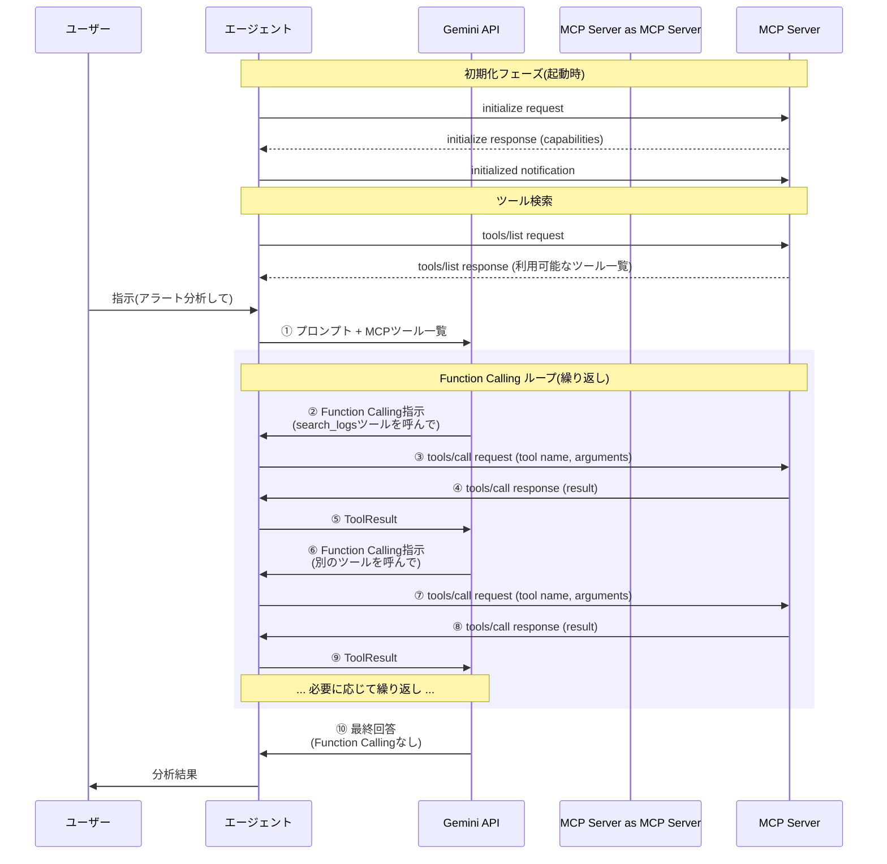

本章ではModel Context Protocol (MCP)を使ってツール呼び出し機能を別プロセスや別サービスへ移譲する方法について解説します。

これまで実装してきたツールは全てエージェントのプロセス内で動作していました。しかし実運用では、ツールを別プロセスとして分離したい場合があります。例えば、特定のツールだけPythonで実装したい場合や、複数のエージェントで同じツールを共有したい場合などです。MCPはこのような要件を標準プロトコルで実現します。

本章ではMCPクライアントとしてエージェントに組み込む機能を実装しますが、理解を深めるためにMCPサーバーの実装例も紹介します。

本章のコードは https://github.com/m-mizutani/leveret の [day10-mcp](https://github.com/m-mizutani/leveret/tree/day10-mcp) ブランチに格納されていますので適宜参照してください。

# Model Context Protocol (MCP) とは

Model Context Protocol (MCP)は、Anthropicが考案したAIアプリケーション間のインターフェースとなるプロトコルです[^mcp-official]。公式では「open-source standard for connecting AI applications to external systems」と説明されています。

[^mcp-official]: Model Context Protocol - https://modelcontextprotocol.io

簡単に言えば、前回までに扱ってきたツール呼び出し(Function Calling)をプロセス外にまで拡張できるようにしたRemote Procedure Call (RPC)の一種です。部分的にLLM特有の機能(プロンプトやリソースの概念など)はありますが、本質的にはシンプルなRPCプロトコルであり、AI固有の要素は多くありません。

## プロトコルの概要

MCPの詳細な仕様については公式ページを参照してください。仕様は活発に更新されているため、最新の情報は公式ドキュメントで確認することをおすすめします。ここでは本章で必要となる基本的な概念のみを説明します。

MCPの基本構造は、ツールを提供するServerと、それに接続してツールを呼び出すClientという関係です。Serverという名称からリモートホストで動作するサービスをイメージするかもしれませんが、MCPではtransport層（接続方法）として2種類の方式があります。1つ目は**Streamable HTTP**です。これはHTTPベースの通信方式で、ネットワーク越しにリモートのMCPサーバーと接続できます。2つ目は**stdio**（標準入出力）です。これはローカルでプロセスを起動し、標準入出力を通じてやり取りする方式で、ローカル環境に限定されます。

MCPはもともとLanguage Server Protocol (LSP)に着想を得た仕組みです。そのため当初はローカルプロセスとしての起動が前提でしたが、仕様のバージョンアップに伴い、リモート接続の機能が段階的に強化されてきました。

以降の説明では、これまで扱ってきたFunction Callingのフローを拡張する形で図解します。これにより、MCPがFunction Callingをどのように拡張しているかが理解しやすくなります。

MCPを利用する場合、まずエージェント起動時にMCPサーバーへ接続します。stdioトランスポートの場合はプロセスの起動、Streamable HTTPの場合はセッションの確立が行われます。



## なぜMCPが必要か

MCPによる標準化には複数のメリットがあります。ここではツール実装の観点から主要な利点を説明します。

### ツール実装の分離と再利用性

これまでの実装では、ツールはエージェント本体のコードに組み込まれていました。第8章で実装したアラート検索ツールも、第9章で実装した脅威インテリジェンスツールも、すべてエージェントのプロセス内で動作していました。MCPを使うことで、ツールの実装を別プロセスや別リポジトリに分離できます。これにより同じツールを複数のエージェントから利用できるようになります。例えば、脅威インテリジェンス検索ツールをMCPサーバーとして実装すれば、アラート分析エージェントだけでなく、インシデント対応エージェントやログ分析エージェントなど、複数のエージェントから同一のツールを利用できます。また、同様の機能を提供するツールであれば、共通化されたインターフェースで再配布・再利用が可能になります。これにより開発者はツールの実装に集中でき、各エージェント開発者は必要なツールを選択して組み込むだけで済みます。

### エコシステムの活用

MCPが標準プロトコルとして普及することで、コミュニティが開発した既存のMCPサーバーをそのまま利用できます。例えばファイルシステムへのアクセス、データベース検索、外部API連携など、汎用的な機能は既存のMCPサーバーを活用できます。

逆に、自分で開発したツールも他のMCP対応アプリケーションから使えるようになります。Claude DesktopやCursorなどのMCP対応アプリケーションは増加しており、一度MCPサーバーとして実装すれば、複数のアプリケーションで活用できます。

### 開発・保守の効率化

MCPによる分離は開発効率の向上にも寄与します。エージェント本体とツールを独立して開発・更新できるため、それぞれのリリースサイクルを分離できます。ツールに脆弱性が見つかった場合や機能追加が必要な場合も、エージェント本体への影響を最小限に抑えられます。

また、ツールの実装言語やフレームワークを自由に選択できます。エージェント本体はGoで実装していても、特定のツールはPythonの既存ライブラリを活用したい場合、そのツールだけをPythonで実装したMCPサーバーとして提供できます。TypeScriptで実装されたNode.js向けのライブラリも、MCPサーバーとしてラップすればGoのエージェントから利用できます。既存のCLIツールやライブラリをMCPサーバーとしてラップするだけで、エージェントから利用できるようになる点も開発効率の向上につながります。

## MCP利用における課題

MCPには多くの利点がある一方で、いくつかの課題も存在します。特に認証認可とセキュリティ面では注意が必要です。

### 認証認可

MCPでは、OAuth 2.0をベースとした認証認可の仕組みが仕様として定義されています[^mcp-auth]。例えばGitHubのリソースにアクセスするMCPサーバーの場合、GitHub側で認証を行った後にトークンをMCPサーバーに引き渡すことで、認証したユーザーの権限の範囲内でのみアクセスを許可できます。仕様ではDynamic Client Registration (DCR)[^oauth-dcr]やaudienceパラメータの指定も定義されています。むしろaudienceの指定はMUSTとされており、セキュリティ面での配慮が仕様に組み込まれています。

しかし実際には、これらの認証認可機能の実装がまだ十分に普及していないという指摘もあります。また、現在の認証モデルは「MCPクライアントがユーザーのローカル環境で動作し、MCPサーバーは3rd partyが提供する」というアーキテクチャを想定しています。そのため、例えば共有サービスとしてクラウド上で動作するAIエージェントの場合、このモデルがうまく機能しないケースもあります。マルチテナント環境でのユーザー認証や権限分離などは、今後の課題として残されています。

認証認可周りは今後もアップデートが続くと考えられるため、最新の仕様動向を注視する必要があります。

[^mcp-auth]: Authorization - Model Context Protocol - https://modelcontextprotocol.io/specification/2025-03-26/basic/authorization
[^oauth-dcr]: RFC 7591 - OAuth 2.0 Dynamic Client Registration Protocol - https://datatracker.ietf.org/doc/html/rfc7591

### 3rd party MCPサーバー利用の安全性

コミュニティが提供する3rd party MCPサーバーの利用には、当然ながらセキュリティリスクが伴います。MCPサーバーには必要な権限を与えますが、その権限の範囲内であれば何でも実行できてしまいます。例えば、ファイルシステムへのアクセス権限を与えたMCPサーバーは、その権限で読み書きできる全てのファイルを操作できます。

また、MCPサーバーからエージェントに返される応答の中に、悪意のあるプロンプトを混入させるプロンプトインジェクション攻撃のリスクもあります。エージェントがMCPサーバーからの応答を盲目的に信頼すると、意図しない動作を引き起こす可能性があります。

そのため、MCPのエコシステムを活用する際は慎重な判断が必要です。信頼できる提供元のMCPサーバーのみを利用する、必要最小限の権限のみを与える、応答内容を適切に検証するなど、セキュリティ対策を講じる必要があります。

# MCPクライアントの実装

ここからは実際にMCPクライアントをエージェントに組み込んでいきます。MCPクライアントの実装には、公式のGo SDK (`github.com/modelcontextprotocol/go-sdk/mcp`) を使用します。ただし、公式SDKはMCPサーバーとの接続やプロトコルレベルの通信処理を提供するだけで、利用するMCPサーバーの管理や設定、ツールとしてのインターフェース提供などはアプリケーション側で実装する必要があります。そのため、今回はSDKをラップする形で、エージェントから使いやすいインターフェースを構築します。

## 設定ファイル

MCPサーバーは複数利用することが一般的です。ファイルシステムアクセス、データベース検索、外部API連携など、用途別のMCPサーバーを組み合わせて使用します。そのため、CLIのフラグで個別に設定値を指定するのは煩雑になります。そこで設定ファイルを用意し、MCPサーバーの接続情報をまとめて管理します。形式はYAMLを採用しました。将来的にMCPサーバー以外の設定も扱う可能性を考慮し、`servers` というセクション内にMCPサーバーの定義を記載します。各サーバー定義には以下の項目を指定します。`name` はサーバーの識別子、`transport` は通信方法を決定します。stdioトランスポートの場合は `command` で起動コマンドを配列形式で指定し、必要に応じて `env` で環境変数を設定します。以下は設定ファイルの例です。この例では、npmパッケージとして提供されているファイルシステムMCPサーバーを `/tmp` ディレクトリをルートとして起動する設定になっています。

```yaml
servers:
  # Filesystem MCP server - allows reading and searching files
  # Install: npm install -g @modelcontextprotocol/server-filesystem
  - name: filesystem
    transport: stdio
    command:
      - npx
      - -y
      - "@modelcontextprotocol/server-filesystem"
      - /tmp
    env:
      NODE_ENV: production
```

この設定ファイルはエージェント起動時に読み込まれ、定義されたMCPサーバーとの接続が確立されます。

## MCPサービス

MCP関連の機能は `pkg/service/mcp` パッケージ内にまとめて実装します。ツールの呼び出し方法自体はFunction Callingと同じであるため、MCPサーバーとの通信とFunction Callingのインターフェースを仲介する機能が必要になります。それが `pkg/service/mcp` パッケージの役割です。このパッケージでは、MCPサーバーとの接続管理、ツール一覧の取得、ツール呼び出しの中継などを担当します。初期化処理として `LoadAndConnect` 関数を用意しました。この関数は設定ファイルの読み込み、MCPサーバーとの接続、ツールとしての登録を一括で処理します。MCPサーバーとは接続を維持し続ける必要があるため、起動時にまとめて接続処理を行います。また、`Provider` という構造体がMCPサーバーとエージェントの間を取り持ちます。Providerはエージェントに対してはツールの提供者として振る舞い、内部的にはMCPサーバーへのリクエストを中継する仲介役を担います。

```go:pkg/service/mcp/client.go
// LoadAndConnect loads MCP configuration from file and connects to all servers
// Returns a tool.Tool provider if successful, nil if no config or connection fails
func LoadAndConnect(ctx context.Context, configPath string) (*Provider, error) {
	if configPath == "" {
		return nil, nil // MCP config not specified
	}

	// Get absolute path of config file
	absConfigPath, err := getAbsPath(configPath)
	if err != nil {
		return nil, goerr.Wrap(err, "failed to resolve config path",
			goerr.V("path", configPath))
	}

	// Load config file
	data, err := os.ReadFile(absConfigPath)
	if err != nil {
		return nil, goerr.Wrap(err, "failed to read MCP config file",
			goerr.V("path", absConfigPath))
	}

	var cfg Config
	if err := yaml.Unmarshal(data, &cfg); err != nil {
		return nil, goerr.Wrap(err, "failed to parse MCP config file",
			goerr.V("path", absConfigPath))
	}

	if len(cfg.Servers) == 0 {
		fmt.Println("No MCP servers configured")
		return nil, nil // No servers configured
	}

	// Create client and connect to all servers
	client := newClient()
	var connectedServers []string
	var failedServers []string

	for _, serverCfg := range cfg.Servers {
		if err := client.Connect(ctx, serverCfg); err != nil {
			fmt.Printf("Warning: failed to connect to MCP server '%s': %v\n", serverCfg.Name, err)
			failedServers = append(failedServers, serverCfg.Name)
			continue
		}
		fmt.Printf("Connected to MCP server: %s\n", serverCfg.Name)
		connectedServers = append(connectedServers, serverCfg.Name)
	}

	// Return provider if any server connected, otherwise just warn
	if len(connectedServers) == 0 {
		fmt.Printf("Warning: no MCP servers connected (%d failed)\n", len(failedServers))
		return nil, nil // Don't fail, just skip MCP
	}

	return NewProvider(client), nil
}
```

`LoadAndConnect` 関数の実装を見ていきます。まず設定ファイルのパスを受け取り、絶対パスに変換してからファイルを読み込みます。YAMLをパースして `Config` 構造体に格納します。設定されたMCPサーバーがない場合は `nil` を返してMCP機能を無効化します。次に、各MCPサーバーへの接続を試みます。接続に失敗したサーバーは警告を表示しますが、処理は継続します。少なくとも1つのサーバーに接続できた場合は `Provider` を生成して返します。全てのサーバーへの接続が失敗した場合も、エラーではなく `nil` を返します。これにより、MCPサーバーが利用できない環境でもエージェント自体は動作を続けられます。CLI側では、設定ファイルのパスのみを受け取るシンプルな設計にしました。

```go:pkg/cli/config.go
// mcpConfig holds MCP-specific configuration
type mcpConfig struct {
	configPath string
}

// mcpFlags returns flags for MCP-related configuration with destination config
func mcpFlags(cfg *mcpConfig) []cli.Flag {
	return []cli.Flag{
		&cli.StringFlag{
			Name:        "mcp-config",
			Usage:       "Path to MCP configuration file",
			Sources:     cli.EnvVars("LEVERET_MCP_CONFIG"),
			Destination: &cfg.configPath,
		},
	}
}

// newMCP creates MCP tool provider if configured
func (cfg *mcpConfig) newMCP(ctx context.Context) (tool.Tool, error) {
	return mcp.LoadAndConnect(ctx, cfg.configPath)
}
```

`mcpConfig` 構造体は設定ファイルのパスを保持し、`mcpFlags` 関数でCLIフラグを定義します。フラグ名は `--mcp-config` で、環境変数 `LEVERET_MCP_CONFIG` からも設定できるようにしています。`newMCP` メソッドは `LoadAndConnect` を呼び出してMCP Providerを生成します。

このProviderをツールレジストリに登録する必要がありますが、初期化順序の関係で課題があります。ツールレジストリを生成するタイミングではまだMCPクライアントが初期化されていないため、レジストリ生成後にツールを追加する必要があります。そこで `registry.AddTool()` メソッドを追加し、後からツールを追加できるようにしました。

```go:pkg/cli/chat.go
// Load and initialize MCP if configured
mcpProvider, err := mcpCfg.newMCP(ctx)
if err != nil {
  return goerr.Wrap(err, "failed to initialize MCP")
}

// Add MCP provider to registry if available
if mcpProvider != nil {
  registry.AddTool(mcpProvider)
}
```

Chat コマンドでMCP Providerを生成し、エラーがなくProviderが生成された場合はレジストリに追加します。これによりMCPサーバーが提供するツールがFunction Callingで利用可能になります。

次にProviderの初期化処理を見ていきます。Providerは `Init` メソッド実行時にMCPサーバーから利用可能なツール一覧を取得します。MCPのツール定義とGemini APIのFunction Declaration形式はやや異なるため、`convertToFunctionDeclaration` 関数で変換処理を実装しています。取得したツールは内部の `tools` スライスに登録しておき、後のツール呼び出し時に使用します。

```go:pkg/service/mcp/provider.go
// Init initializes the MCP provider and registers tools
func (p *Provider) Init(ctx context.Context, client *tool.Client) (bool, error) {
	if p.client == nil {
		return false, nil // MCP client not configured
	}

	// Get all connected servers
	serverNames := p.client.GetAllServers()
	if len(serverNames) == 0 {
		return false, nil // No servers connected
	}

	// Register tools from each server
	for _, serverName := range serverNames {
		tools, err := p.client.GetTools(serverName)
		if err != nil {
			return false, goerr.Wrap(err, "failed to get tools from server",
				goerr.V("server", serverName))
		}

		for _, t := range tools {
			// Convert MCP tool to Gemini function declaration
			funcDecl, err := p.convertToFunctionDeclaration(t)
			if err != nil {
				return false, goerr.Wrap(err, "failed to convert tool",
					goerr.V("server", serverName),
					goerr.V("tool", t.Name))
			}

			p.tools = append(p.tools, &mcpTool{
				serverName: serverName,
				mcpTool:    t,
				funcDecl:   funcDecl,
			})
		}
	}

	return len(p.tools) > 0, nil
}
```

`Init` メソッドの実装を見ていきます。まず接続済みのMCPサーバー一覧を取得し、各サーバーから提供されるツール一覧を取得します。各ツールに対して `convertToFunctionDeclaration` 関数でGemini API形式に変換し、内部の `tools` スライスに登録します。この変換により、MCPサーバーが提供するツールをFunction Callingのインターフェースで利用できるようになります。

最後にツール実行処理を見ていきます。Function Callingでツールが呼び出された場合、Providerはまず呼び出されたツール名から対象のMCPツールを特定します。次に該当するMCPサーバーにリクエストを送信し、結果を受け取ります。受け取った結果は他のツールと同様に規定の形式(`FunctionResponse`)に変換します。MCPサーバーからの返り値は必ずしも `map[string]any` 形式とは限らないため、JSON文字列にエンコードすることで統一的に扱えるようにしています。また、メタデータなども含めて全て結果として返しています。この実装は簡易的なものですが、実用上は問題なく動作します。

```go
// Execute executes an MCP tool
func (p *Provider) Execute(ctx context.Context, fc genai.FunctionCall) (*genai.FunctionResponse, error) {
	// Find the tool
	var targetTool *mcpTool
	for _, t := range p.tools {
		if t.funcDecl.Name == fc.Name {
			targetTool = t
			break
		}
	}

	if targetTool == nil {
		return nil, goerr.New("tool not found", goerr.V("name", fc.Name))
	}

	// Call MCP tool
	result, err := p.client.CallTool(ctx, targetTool.serverName, targetTool.mcpTool.Name, fc.Args)
	if err != nil {
		return nil, goerr.Wrap(err, "failed to call MCP tool")
	}

	// Convert result to JSON string
	resultJSON, err := json.MarshalIndent(result, "", "  ")
	if err != nil {
		return nil, goerr.Wrap(err, "failed to marshal result")
	}

	return &genai.FunctionResponse{
		Name:     fc.Name,
		Response: map[string]any{"result": string(resultJSON)},
	}, nil
}
```

# MCPサーバーの実装：ログ検索サーバー例

MCPクライアントの実装が完了したので、次は実際にMCPサーバーを実装してみます。今回は実験用として、ログファイルを検索するシンプルなMCPサーバーを作成します。実装コードは `examples/mcp-server` ディレクトリに配置しています。機能としては、指定されたディレクトリ内のログファイル(`.log`拡張子)からキーワードを検索するだけのシンプルなものです。

MCPサーバーの定義は非常に簡潔です。特にstdioトランスポートの場合、公式SDKが多くの処理を抽象化してくれるため、最小限のコードで実装できます。注目すべき点は引数の定義方法です。コード上では引数の詳細な定義を明示的に記述していないように見えますが、実際には `searchLogsParams` 構造体の `json` タグと `jsonschema` タグを読み取って、MCPサーバーが自動的に引数スキーマを生成してくれます。これにより、構造体定義だけでツールのインターフェースを宣言的に定義できます。実際の検索処理(`searchLogs` 関数の中身)は、単純にファイルをgrepしているだけなので、ここでは詳細を割愛します。重要なのはMCPサーバーとしてのインターフェース定義部分です。

```go:examples/mcp-server/main.go
type searchLogsParams struct {
	Keyword string `json:"keyword" jsonschema:"The keyword to search for in log files (case-insensitive)"`
}

func main() {
	server := mcp.NewServer(&mcp.Implementation{
		Name:    "log-search-server",
		Version: "1.0.0",
	}, nil)

	mcp.AddTool(server, &mcp.Tool{
		Name:        "search_logs",
		Description: "Search for keyword in log files (*.log) in the current directory",
	}, searchLogs)

	if err := server.Run(context.Background(), &mcp.StdioTransport{}); err != nil {
		fmt.Fprintf(os.Stderr, "Server error: %v\n", err)
		os.Exit(1)
	}
}

func searchLogs(ctx context.Context, req *mcp.CallToolRequest, params *searchLogsParams) (*mcp.CallToolResult, any, error) {
```

# 利用例

実際にMCPを組み込んだエージェントを動かしてみます。ログ検索MCPサーバーの設定ファイルを指定してチャットセッションを開始します。

```bash
go run . chat -i baa7823c-7ea2-4352-a06b-bda92a53103a --mcp-config examples/mcp-server/config.yaml
Connected to MCP server: log-search
Enabled tools: [search_alerts query_otx search_logs]

Chat session started. Type 'exit' to quit.

> このアラートに関連するログがないか探してみて

⠙ examining...
🔧 Calling tool: search_logs
   Args:
{
     "keyword": "3322.org"
   }
✅ Tool result:
{
  "content": [
    {
      "type": "text",
      "text": "Found 6 matches:\napp.log:5: 2023-04-16 06:11:22 WARN DNS query to suspicious domain 3322.org from instance i-11111111\napp.log:6: 2023-04-1...

アラートに関連するログが見つかりました。以下はその要約です。

**`app.log` からの関連ログ:**
*   `2023-04-16 06:11:22` に、インスタンス `i-11111111` から疑わしいドメイン `3322.org` へのDNSクエリが確認されました。
*   `2023-04-16 06:11:45` に、`3322.org` へのアウトバウンド接続がセキュリティグループによってブロックされたというエラーが記録されています。
*   `2023-04-16 06:30:00` に、追加の疑わしいDNSクエリが `3322.org` に対して発見されたという警告があります。

**`security.log` からの関連ログ:**
*   `2023-04-16 06:11:00` に、GuardDutyのアラートとして、悪意のあるドメイン `3322.org` へのDNSクエリが記録されています。
*   `2023-04-16 06:11:45` に、`198.51.100.0` から `3322.org` へのマルウェア通信の試行があったというエラーが記録されています。
*   `2023-04-16 06:15:00` に、脅威インテリジェンスと一致し、`3322.org` が既知のドロップポイントドメインであるという警告があります。

これらのログは、GuardDutyのアラートで報告された `3322.org` への悪意のある通信の試みを裏付けています。特に、セキュリティグループによって接続がブロックされたことと、マルウェア通信の試行があったという点は重要です。
```

起動時に「Connected to MCP server: log-search」と表示され、MCPサーバーへの接続が成功したことが確認できます。また「Enabled tools」には `search_logs` が含まれており、MCPサーバーが提供するツールが正しく登録されています。

ユーザーが「このアラートに関連するログがないか探してみて」と指示すると、エージェントは `search_logs` ツールを呼び出し、アラートに含まれるドメイン名 `3322.org` をキーワードとしてログファイルを検索します。

検索結果として、`app.log` と `security.log` から関連するログエントリが見つかりました。エージェントはこれらのログを分析し、GuardDutyアラートを裏付ける情報として要約して提示しています。このように、MCPを使うことで既存のツール(アラート検索や脅威インテリジェンス)に加えて、外部プロセスとして実装されたログ検索機能をシームレスに組み込めることが確認できます。

# まとめ

本章ではModel Context Protocol (MCP)を使ってツール呼び出しを別プロセスに分離する方法を実装しました。MCPの本質は、Function Callingをプロセス境界を越えて拡張するRPCプロトコルです。この標準化により、ツールの実装言語やデプロイ方法の選択肢が広がり、エージェント開発の柔軟性が大きく向上します。

ここで重要なのは、MCPは単なる技術的な仕組みではなく、AIエージェントのエコシステムを形成するための基盤だという点です。Claude DesktopやCursorなど、MCP対応アプリケーションは既に増加しています。つまり、MCPサーバーとして実装したツールは、自分のエージェントだけでなく、他の開発者のエージェントやアプリケーションからも利用される可能性があります。逆に、コミュニティが開発したツールを自分のエージェントに組み込むこともできます。

この相互運用性は、セキュリティ運用の観点からも示唆に富んでいます。例えば、脅威インテリジェンス検索、SIEM連携、チケット管理システムとの統合など、セキュリティ運用で必要となる汎用的なツールをMCPサーバーとして整備すれば、アラート分析、インシデント対応、脆弱性管理など、異なる目的のエージェント間で共有できます。このように組織内でツールライブラリを構築することで、各チームが独自のエージェントを開発する際の初期投資を削減できます。

一方で、MCPの課題も認識しておく必要があります。特に認証認可の仕組みはまだ発展途上であり、マルチテナント環境での利用には制約があります。また、3rd partyのMCPサーバーを利用する際は、プロンプトインジェクション攻撃や権限の過剰付与などのセキュリティリスクを十分に評価する必要があります。信頼できるツールのみを利用する、最小権限の原則を適用する、応答内容を検証するなど、セキュリティ対策を講じた上で活用することが重要です。

本章で実装したMCPクライアントは、stdioトランスポートでローカルプロセスとして起動する形式でしたが、Streamable HTTPを使えばリモートのMCPサーバーとも連携できます。これにより、組織内で共通のツールサーバーを運用し、複数のエージェントから利用するといった構成も可能になります。MCPをどのように活用するかは、組織のセキュリティポリシーや運用体制に応じて検討してください。
